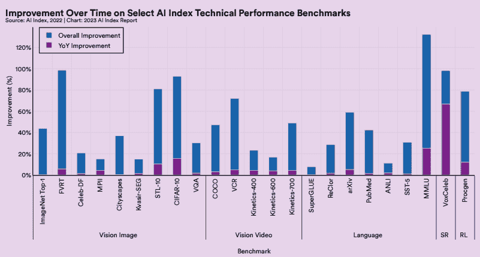
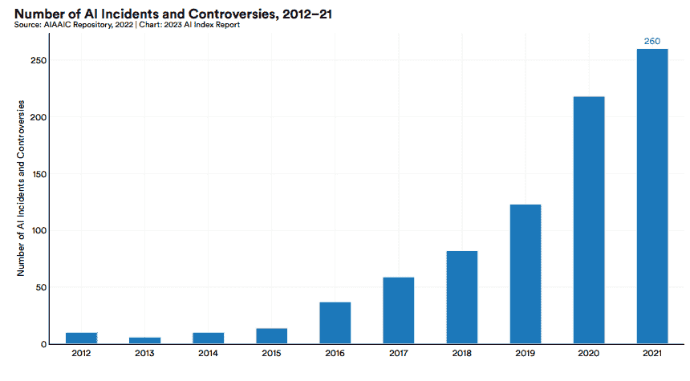
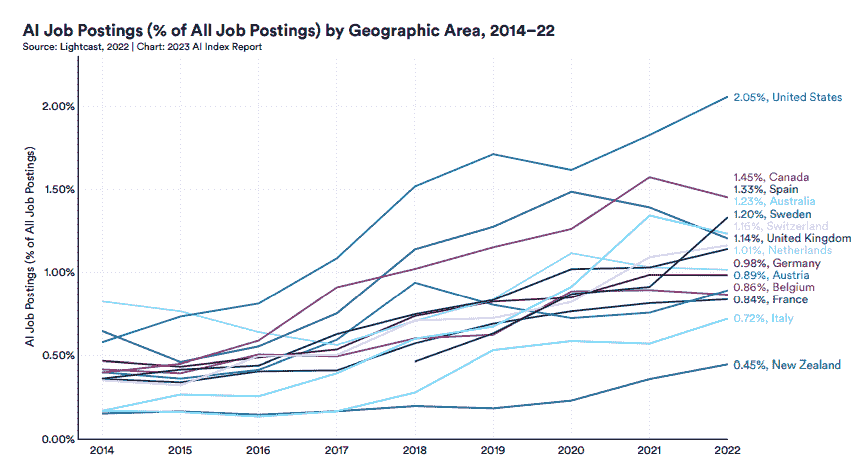
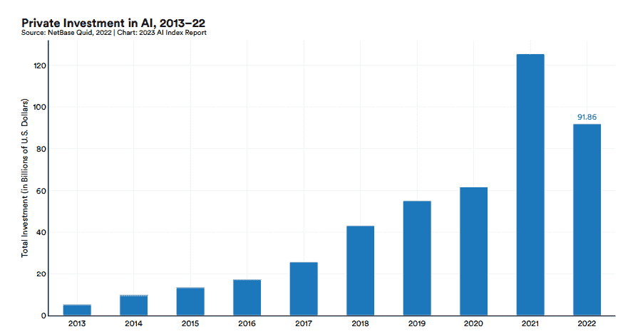
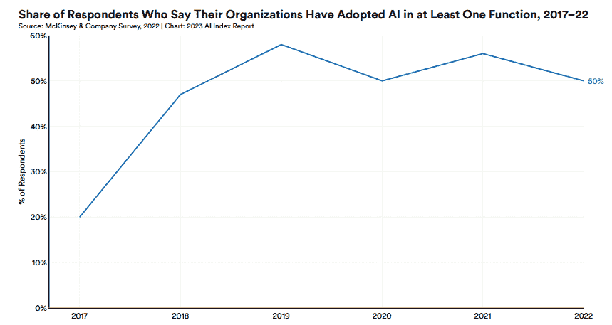
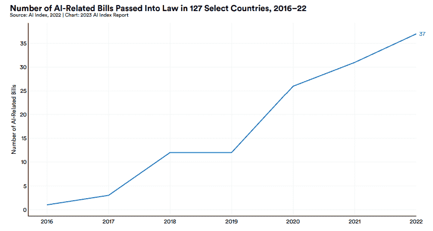
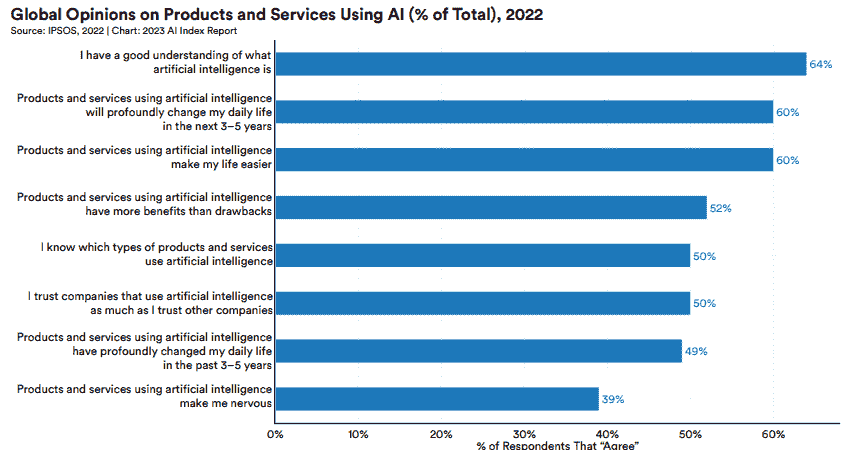

# 2023 AI 指数报告：未来我们可以预期的 AI 趋势

> 原文：[`www.kdnuggets.com/2023/06/2023-ai-index-report-ai-trends-expect-future.html`](https://www.kdnuggets.com/2023/06/2023-ai-index-report-ai-trends-expect-future.html)

图片由 [rawpixel.com](https://www.freepik.com/free-photo/technology-human-touch-background-modern-remake-creation-adam_17851045.htm#query=artificial%20intelligence&position=1&from_view=search&track=ais) 提供，来源于 [Freepik](https://www.freepik.com/)

人工智能比以往任何时候都更为突出，其发展也在不断增加。为什么会这样？随着生成式 AI 的最新进展，每个人、研究小组和公司都在竞相成为该领域的佼佼者，这使得竞争更加激烈。虽然有时很难跟上所有最新的趋势。

* * *

## 我们的前三个课程推荐

 1\. [Google 网络安全证书](https://www.kdnuggets.com/google-cybersecurity) - 快速进入网络安全职业。

 2\. [Google 数据分析专业证书](https://www.kdnuggets.com/google-data-analytics) - 提升你的数据分析能力

 3\. [Google IT 支持专业证书](https://www.kdnuggets.com/google-itsupport) - 支持你的组织在 IT 领域

* * *

为了进一步总结 2023 年的 AI 趋势，[AI 指数报告](https://aiindex.stanford.edu/report/) 应运而生。斯坦福大学人类中心人工智能研究所（HAI）开发了该报告，报告由来自各个学术和行业领域的指导委员会制定，旨在为决策者和观众提供行动建议，以负责任和伦理的方式推进 AI。

这份报告的趋势和关键要点是什么？让我们来讨论一下。

# AI 指数报告 2023

AI 指数报告 2023 是第六版报告，主要关注 AI 发展及其对人类社会的影响。通过 [数据](https://drive.google.com/drive/folders/1ma9WZJzKreS8f2It1rMy_KkkbX6XwDOK) 由各领域专家策划并经过严格分析，这里是报告中的关键要点。

## 行业领先于学术界

根据报告，许多在 2022 年发布的重要机器学习系统是由行业领域主导的，而不是学术界。一项重要的机器学习系统是包含在 [Epoch 数据集](https://epochai.org/blog/compute-trends) 中的模型，并且具有特定标准，如改进了最先进的方法。

2022 年发布了 38 个重要的机器学习系统，但其中 32 个是由行业生产的。我们可以参考下面的图表，查看 2022 年的趋势相对于 2014 年的变化。

图片改编自 [AI Index Report 2023](https://aiindex.stanford.edu/wp-content/uploads/2023/04/HAI_AI-Index-Report_2023.pdf)

## 传统基准性能的饱和

许多机器学习模型每年都通过标准基准数据集进行测试，以查看它们的模型是否能够改善当前的基准性能。例如，使用 [ImageNet 数据集](https://ieeexplore.ieee.org/document/5206848) 进行图像分类任务，或使用 [SuperGlue](https://w4ngatang.github.io/static/papers/superglue.pdf) 基准进行英语语言理解任务。

然而，每年的性能提升幅度变得越来越小，并被认为已达到平台期。下图显示了许多基准测试的年度改善幅度低于 5%。

图片改编自 [AI Index Report 2023](https://aiindex.stanford.edu/wp-content/uploads/2023/04/HAI_AI-Index-Report_2023.pdf)

为了缓解基准测试饱和的问题，研究人员最近推出了新的综合基准测试，如 [BIG-bench](https://arxiv.org/abs/2206.04615) 和 [HELM](https://crfm.stanford.edu/helm/latest/)。不过，这些新基准测试大多集中在大型语言模型任务上，因为这是当前的趋势。

## 人工智能既在帮助也在伤害环境

最近的研究表明，某些大型语言模型可能会通过排放碳排放量，对环境产生负面影响，这比任何其他人类活动的碳排放量都要高。下图显示了 GPT-3 模型的碳排放量几乎是一个乘客常规航空旅行的 500 倍。

图片改编自 [AI Index Report 2023](https://aiindex.stanford.edu/wp-content/uploads/2023/04/HAI_AI-Index-Report_2023.pdf)

然而，也有研究证明 AI 也可以拯救环境。2022 年 [DeepMind](https://arxiv.org/abs/2211.07357) 的研究表明，一种名为 BCOOLER 的机器学习代理可以在 Google 数据中心内将节能系统的效率提高 12.7%。

## AI 快速加速科学进展

2022 年，AI 已被证明对许多科学突破做出了贡献，包括：

1.  [DeepMind](https://www.deepmind.com/blog/accelerating-fusion-science-through-learned-plasma-control) 的研究人员创建了一种强化学习算法，用于在称为托卡马克的系统中寻找管理核聚变产生的等离子体的最佳方法。

1.  [Fawzi et al. (2022)](https://www.deepmind.com/blog/discovering-novel-algorithms-with-alphatensor) 发现了一种使用强化学习进行矩阵操作的新算法，称为 AlphaTensor。

1.  [Nvidia](https://developer.nvidia.com/blog/designing-arithmetic-circuits-with-deep-reinforcement-learning/) 发现了一种通过让 AI 使用强化学习设计系统来改进芯片系统的新方法。

1.  [Shanehsazzadeh 等 (2023)](https://www.biorxiv.org/content/10.1101/2023.01.08.523187v1) 使用零样本生成 AI 开发了新的 de novo 抗体发现系统。

## AI 滥用事件数量的增加

随着 AI 的新发展，滥用数量预计将增加。根据 AIAAIC 数据库，2021 年的事件数量是 2012 年的 26 倍。趋势可以在下方的图像中查看。

图片改编自 [AI Index Report 2023](https://aiindex.stanford.edu/wp-content/uploads/2023/04/HAI_AI-Index-Report_2023.pdf)

争议案例包括乌克兰总统泽连斯基的[假冒投降案例](https://www.aiaaic.org/aiaaic-repository/ai-and-algorithmic-incidents-and-controversies/president-zelenskyy-deepfake-surrender)以及英特尔开发的[学生情感监测系统](https://www.protocol.com/enterprise/emotion-ai-school-intel-edutech)。

上升的案例还表明人们的意识比以前更高，从而改进了对 AI 滥用的跟踪。

## 对 AI 相关专业技能的需求正在增加。

对 AI 相关技能的需求在职位发布中逐年增加，并且在各国之间有所体现。这表明许多公司对在组织内部实施 AI 表现出更多兴趣。下方来自 [Lightcast](https://lightcast.io/) 的数据表明，带有 AI 相关技能的职位发布数量呈上升趋势。

图片改编自 [AI Index Report 2023](https://aiindex.stanford.edu/wp-content/uploads/2023/04/HAI_AI-Index-Report_2023.pdf)

上述数据还显示，美国在需要 AI 技能的国家中比例最高，而新西兰最低。尽管数据仅限于所选国家，因此请谨慎对待。

## 2022 年显示 AI 私人投资减少。

2022 年，AI 相关投资达到了 919 亿美元。根据 [NetBase Quid](https://netbasequid.com/) 的数据，这一数字较 2021 年有所减少，尽管仍是 2013 年的 18 倍。数据可以在下方的图表中查看。

图片改编自 [AI Index Report 2023](https://aiindex.stanford.edu/wp-content/uploads/2023/04/HAI_AI-Index-Report_2023.pdf)

这是一个短期的下降趋势，但从长远来看趋势依然在上升。这表明许多公司仍然愿意投资于 AI 发展。

尽管采用 AI 的公司比例已趋于平稳，但这些公司继续领先。

## 尽管 AI 采纳率趋于平稳，但已经采纳 AI 的公司仍在不断进步。

根据 [McKinsey](https://www.mckinsey.com/capabilities/quantumblack/our-insights/the-state-of-ai-in-2022-and-a-half-decade-in-review) 报告，截至 2022 年，约 50%的受访公司在其业务职能中采纳了人工智能。下图显示，自 2019 年以来，采纳率在 50-60%左右平稳，尽管这一数字比 2017 年要高得多。

图片改编自 [AI Index Report 2023](https://aiindex.stanford.edu/wp-content/uploads/2023/04/HAI_AI-Index-Report_2023.pdf)

研究结果表明，尽管这一数字可能会在未来几年保持在 50%左右，公司仍然愿意在其业务和组织中采纳人工智能。

## 政策制定者对人工智能的兴趣呈上升趋势

根据 AI Index 对 127 个国家立法机构关于人工智能的研究，31 个国家已通过了与人工智能相关的法案，这 31 个国家总共有 123 个与人工智能相关的法案。2022 年有 37 个与人工智能相关的法案，而 2016 年仅有 1 个法案通过。这一趋势可以在下图中看到。

图片改编自 [AI Index Report 2023](https://aiindex.stanford.edu/wp-content/uploads/2023/04/HAI_AI-Index-Report_2023.pdf)

上述数据表明，许多国家已经认识到人工智能可以在许多领域中发挥作用；然而，采用人工智能需要监管以避免误用。

## 全球范围内，人们已开始看到人工智能采纳的好处

根据 [IPSOS](https://www.ipsos.com/sites/default/files/ct/news/documents/2022-01/Global-opinions-and-expectations-about-AI-2022.pdf) 对 28 个国家 19504 名不同年龄成人的调查，超过 50%的人了解人工智能的工作原理，并相信人工智能将在未来 3-5 年内改变日常生活。完整的数据可以在下图中看到。

图片改编自 [AI Index Report 2023](https://aiindex.stanford.edu/wp-content/uploads/2023/04/HAI_AI-Index-Report_2023.pdf)

认为人工智能有用的个体数量很高，显示出人工智能将逐渐融入人们的日常生活。不过，也有一些人仍然感到人工智能让他们紧张，这也是正常的。

# 结论

人工智能趋势正在上升，并可能在未来几年保持这种状态。这一趋势得到了 AI Index Report 的证实，其中显示了关键发现：

- 行业领先于学术界

- 传统基准表现的饱和

- 人工智能既在帮助环境也在伤害环境

- 人工智能迅速加速了科学进步

- 与人工智能误用有关的事件数量增加

- 对人工智能相关专业技能的需求在增加

- 2022 年显示人工智能私人投资有所减少

- 尽管人工智能采纳率趋于平稳，但已采纳人工智能的公司仍在不断进步

- 政策制定者对人工智能的兴趣呈上升趋势

- 全球范围内，人们已开始看到人工智能采纳的好处

**[Cornellius Yudha Wijaya](https://www.linkedin.com/in/cornellius-yudha-wijaya/)** 是一名数据科学助理经理和数据撰写员。在全职工作于 Allianz Indonesia 的同时，他喜欢通过社交媒体和写作分享 Python 和数据技巧。

### 更多相关主题

+   [AI 指数报告概述：衡量人工智能趋势](https://www.kdnuggets.com/2023/04/overview-ai-index-report-measuring-trends-artificial-intelligence.html)

+   [2023 年 AI 质量趋势预期](https://www.kdnuggets.com/2022/11/expect-ai-quality-trends-2023.html)

+   [深入未来：Kaggle 的 AI 报告 2023 – 看看热门话题](https://www.kdnuggets.com/dive-into-the-future-with-kaggle-ai-report-2023-see-what-hot)

+   [2023 年上半年分析与数据科学支出及趋势报告](https://www.kdnuggets.com/2023/07/h1-2023-analytics-data-science-spend-trends-report.html)

+   [我们可以期待 GPT-5 有什么？](https://www.kdnuggets.com/2023/06/expect-gpt5.html)

+   [Burtch Works 2023 数据科学与 AI 专业人员薪资报告…](https://www.kdnuggets.com/2023/08/burtch-works-2023-data-science-ai-professionals-salary-report.html)
