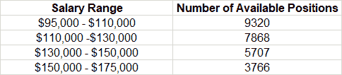
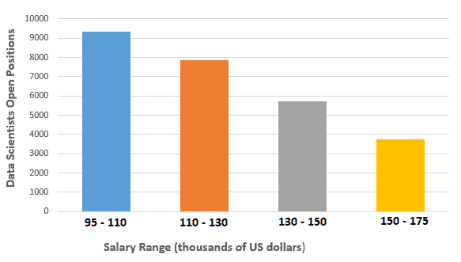
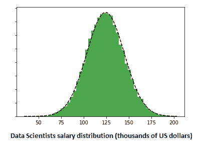

# 2023 年数据科学家薪资

> 原文：[`www.kdnuggets.com/2023/07/2023-data-scientists-salaries.html`](https://www.kdnuggets.com/2023/07/2023-data-scientists-salaries.html)

图片由[freepik.com](https://www.freepik.com/free-photo/high-angle-payroll-concept_18493857.htm#query=salary&position=4&from_view=search&track=sph)提供

数据科学家现在被认为是最受欢迎的 STEM（科学、技术、工程和数学）职业之一。随着信息技术和人工智能在我们生活中的重要性增加，数据科学领域将继续增长。[美国劳工统计局](https://www.bls.gov/ooh/math/data-scientists.htm)预测，2021 年至 2031 年间对数据科学家的需求将增长 36%。数据科学家的需求将继续增长。对于有意从事数据科学领域的 aspirants 来说，一个重要的问题是：数据科学家的薪资是多少？

* * *

## 我们的三大课程推荐

 1\. [谷歌网络安全证书](https://www.kdnuggets.com/google-cybersecurity) - 快速进入网络安全职业生涯。

 2\. [谷歌数据分析专业证书](https://www.kdnuggets.com/google-data-analytics) - 提升你的数据分析技能

 3\. [谷歌 IT 支持专业证书](https://www.kdnuggets.com/google-itsupport) - 支持你的组织 IT

* * *

数据科学家的薪资因多个因素而异，如地理位置、经验、教育背景、行业、职位等。

在本文中，我们进行初步的统计分析，以估算 2023 年美国数据科学家的年平均薪资。

# 数据收集

为了估算美国数据科学家的年平均薪资，我们从[indeed.com](https://www.indeed.com/)收集了数据。通过关键词搜索框和关键词“数据科学家职位”，我们发现截至 2023 年 3 月 8 日，美国有 26,661 个开放的数据科学家职位。这些职位从初级到高级不等。表格下方展示了这些职位的薪资范围。

数据来源：[Indeed.com](https://www.indeed.com/)

美国的数据科学家年薪范围及职位数量。数据来源于指定网址，使用“数据科学职位”搜索条件获取，日期为 2023 年 3 月 8 日。图片由作者提供。

下图展示了开放数据科学家职位的薪资范围条形图。

数据科学家职位及年薪范围。图片由作者提供。

# 数据科学家的平均薪资

使用从 indeed.com 获得的数据，我们进行了基础统计计算以确定年均薪资和标准差。根据从 indeed.com 检索到的信息，数据科学家的平均薪资估计为每年$124,000。标准差估计为$21,000。薪资数据的 95%置信区间为每年[$83,000 - $166,000]。

工资范围的分布可以使用正态分布来估算，如下图所示。

数据科学家的年薪分布 | 图片来源：作者。

# 与美国劳工统计局的数据比较

根据[美国劳工统计局](https://www.bls.gov/ooh/math/data-scientists.htm)的数据，2021 年数据科学家的中位薪资为每年$100,000。这个数值略低于我们估算的每年$124,000 的平均薪资。这一差异可能是由于 2023 年数据科学家薪资的上涨，以抵消高通胀率和与劳动力短缺相关的数据科学家需求增加。

# 结论

总结来说，我们使用从 indeed.com 获取的开放数据科学家职位的薪资数据，进行了基础统计来估算美国数据科学家的平均薪资。我们的分析显示，美国数据科学家的全国平均薪资估计为每年$124,000，95%置信区间为[$83,000 - $166,000]每年。数据科学家应该预期在 2023 年年薪在$83,000 到$166,000 之间。任何特定职位的实际薪资取决于地理位置、经验、教育、行业、职位等因素。

**[本杰明·O·塔约](https://www.linkedin.com/in/benjamin-o-tayo-ph-d-a2717511/)** 是一名物理学家、数据科学教育者和作家，同时也是 DataScienceHub 的创始人。此前，本杰明曾在中俄克拉荷马大学、大峡谷大学和匹兹堡州立大学教授工程学和物理学。

### 更多相关话题

+   [2022 年数据科学领域的顶级职位和薪资](https://www.kdnuggets.com/2022/05/top-jobs-salaries-data-science-2022.html)

+   [数据科学家职位薪资分析](https://www.kdnuggets.com/2023/04/data-scientist-job-salaries-analysis.html)

+   [为你的数据游戏做好未来准备：每个数据科学家在 2023 年需要的顶级技能](https://www.kdnuggets.com/futureproof-your-data-game-top-skills-every-data-scientist-needs-in-2023)

+   [2023 年需要了解的顶级数据 Python 包](https://www.kdnuggets.com/2023/01/top-data-python-packages-know-2023.html)

+   [2023 年 Google 数据分析认证评估](https://www.kdnuggets.com/2023/01/google-data-analytics-certification-review-2023.html)

+   [2023 年你必须阅读的 5 本免费数据科学书籍](https://www.kdnuggets.com/2023/01/5-free-data-science-books-must-read-2023.html)
