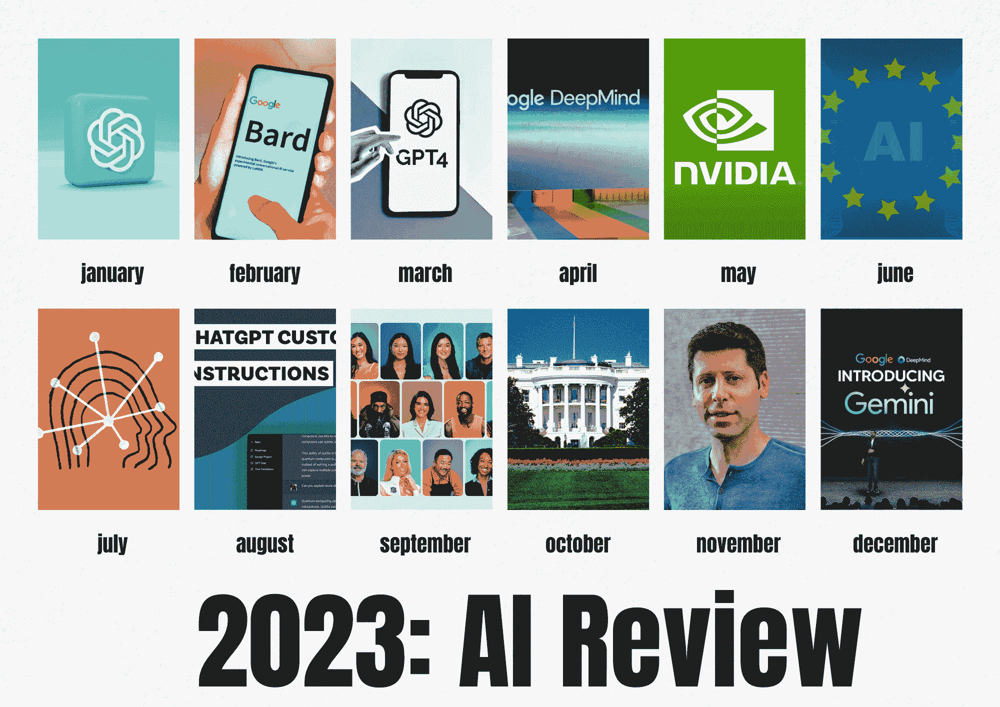

# 2023: 疯狂的人工智能之年

> 原文：[`www.kdnuggets.com/2023-the-crazy-ai-year`](https://www.kdnuggets.com/2023-the-crazy-ai-year)

图片由作者提供

真是精彩的一年，不是吗？

* * *

## 我们的前三大课程推荐

 1\. [Google 网络安全证书](https://www.kdnuggets.com/google-cybersecurity) - 快速进入网络安全职业轨道。

 2\. [Google 数据分析专业证书](https://www.kdnuggets.com/google-data-analytics) - 提升你的数据分析技能

 3\. [Google IT 支持专业证书](https://www.kdnuggets.com/google-itsupport) - 支持你的组织的 IT 需求

* * *

在 2023 年初，人们在跟上科技世界的步伐方面遇到了困难。有一天发布了某个新产品，第二天竞争对手又推出了别的东西，然后你又听说了其他新的事物。实在是太多了。

但这种势头持续了一整年，许多公司创造了历史！

2023 年无疑是人工智能的年！

那么，让我们回顾一下这些月份，回顾一下发生了什么。

# 一月

随着 ChatGPT 在 2022 年 11 月进入市场，相关讨论在 2023 年初继续进行。凭借持续的成功，微软迅速宣布向 OpenAI 投资 100 亿美元。

# 二月

随着围绕 OpenAI 的 ChatGPT 的炒作，大家都在想他们的竞争对手是否会现身并进入市场。谷歌正是这样做的，推出了他们的首个 BARD。

几天后，微软也通过其[Bing](https://www.microsoft.com/en-us/edge/features/bing-chat?form=MA13FJ)聊天机器人震撼了市场，微软和 OpenAI 的首席执行官都深入探讨了两者之间的合作关系。

# 三月

过了两个月，似乎已经发生了很多事情。为了启动 Google GenAI 的旅程，Bard 的访问权限被授予了一小部分人。这样一来，Adobe 推出了 Firefly，Canva 推出了他们的虚拟设计助手，掀起了一系列连锁反应。

OpenAI 还推出了 ChatGPT 的 API，以及名为 Whisper 的文本转语音模型。在三月十四日，OpenAI 发布了其最先进的模型 GPT-4。

# 四月

新的一月，谷歌也带来了更多消息，宣布了 Google DeepMind——这是 Google Research 和 DeepMind 的结合。

我们还看到俄罗斯的 Sberbank 发布了 ChatGPT 竞争对手[GigaChat](https://www.reuters.com/technology/russias-sberbank-releases-chatgpt-rival-gigachat-2023-04-24/#:~:text=April%2024%20(Reuters)%20%2D%20Russian,the%20artificial%20intelligence%20chatbot%20race.)，以及 HuggingFace 进入市场，发布了一个与 ChatGPT 竞争的 AI 聊天机器人 HuggingChat。

# 五月

Google 希望保持竞争力，感受到压力，宣布向公众推出了 Bard 聊天机器人。但似乎他们在微软揭晓其 Windows 11 的首款 AI 助手时，火上加油了。

看到这些情况，你只能想象 NVIDIA 的表现如何。是的，他们的市值首次突破了[$1 万亿](https://www.reuters.com/technology/nvidia-sets-eye-1-trillion-market-value-2023-05-30/)，稳固了其 AI 芯片领导者的地位。

说到芯片，在同一个月，我们还体验了埃隆·马斯克的新脑植入创业公司 Neuralink，该公司旨在创建并植入 AI 驱动的芯片到人脑中。这已获得 FDA 批准进行人类试验。

# 六月

Apple 的 Vision Pro，这款由 AI 驱动的增强现实头戴设备，旨在将沉浸式体验提升到一个新的高度。

6 月 14 日，欧洲议会对欧盟 AI 法案进行了谈判，以 499 票赞成、28 票反对和 93 票弃权的结果通过了该法案。

2023 年上半年发生的一切让 AI 世界显得前景光明。麦肯锡预测，生成性 AI 有潜力为全球经济增加高达[$4.4 万亿](https://www.mckinsey.com/capabilities/mckinsey-digital/our-insights/the-economic-potential-of-generative-ai-the-next-productivity-frontier#:~:text=Across%20the%2063%20use%20cases%20we%20analyzed%2C%20generative%20AI%20has,industry's%20revenue%20(Exhibit%204).)的价值。

# 七月

七月保持了势头。Meta 推出了大模型 Llama 2，这是一个开源的大型语言模型（LLM），经过了公开数据的训练，旨在驱动 OpenAI 的 ChatGPT、Bing Chat 以及其他现代聊天机器人。

Anthropic 还发布了 Claude 2，它取代了 ChatGPT，令其感到颤抖。

关于 AI 的安全性正成为热门话题，因为大型语言模型（LLMs）频繁出现，成为我们日常生活的一部分。

微软宣布将向客户收取每月$30 的费用来使用 Microsoft 365 Copilot，这引发了其他组织的思考。

# 八月

谷歌紧随其后表示，他们也将对用户在 Duet AI for Workspace 中使用其 GenAI 工具收取每月 $30 的费用。看来 [金钱](https://2023/08/make-money-generative-ai-gold-rush.html) 的确有不少。

OpenAI 推出了 [自定义指令](https://2023/08/tailor-chatgpt-fit-needs-custom-instructions.html)，以最大限度地发挥 ChatGPT 的作用。我们还介绍了 [Poe](https://2023/08/forget-chatgpt-new-ai-assistant-leagues-ahead-change-way-work-forever.html)，一个聊天机器人服务，允许你使用最先进的模型，如 Claude +、GPT-3.5-Turbo 和 GPT-4。

# 九月

一年的三分之一已经过去，AI 已经变得疯狂起来！

各公司计划尽可能获取所有资源，并在 GenAI 中保持竞争力。亚马逊宣布了一项 [40 亿美元投资于 OpenAI 竞争对手 Anthropic](https://www.aboutamazon.com/news/company-news/amazon-aws-anthropic-ai)。我们还看到了一些酷但奇怪的事物，例如 Meta 应用中出现的 AI 人物，如汤姆·布雷迪和肯达尔·詹娜。

目前专注于内容创作，OpenAI 继续致力于通过 [Canva 插件为 ChatGPT](https://automate-graphic-design-activity-with-chatgpt-canva-plugin) 可视化内容。

# 十月

我们经历了 [关于人工智能安全、保障和可信发展与使用的行政命令](https://www.whitehouse.gov/briefing-room/presidential-actions/2023/10/30/executive-order-on-the-safe-secure-and-trustworthy-development-and-use-of-artificial-intelligence/)。这也让 AI 世界发生了震动，CEO、领导和其他人对 AI 系统融入社会的实施有着相互矛盾的看法。

# 十一月

从聊天机器人开始。埃隆·马斯克的 AI 初创公司 xAI 发布了 AI [聊天机器人](https://make-your-own-gpts-with-chatgpts-gpts) “Grok”，AWS 发布了 Amazon Q，以及来自 StabilityAI 的 Pika 1.0。

OpenAI 还在 11 月举办了第一次开发者活动，深入探讨了 GPT-4 Turbo 和 GPT Store。

但之后情况有些疯狂，OpenAI 的首席执行官萨姆·奥特曼被董事会突然解雇。微软立即向他提供了一个职位，OpenAI 的员工威胁要辞职，要求萨姆·奥特曼回归并重新担任首席执行官。现在他回来了，带来了新的董事会成员以及微软的新“观察员”角色。

# 十二月

在过去的 11 个月里发生了很多疯狂的事，对吧？我们终于接近 2023 年的结束。

就在年底前，谷歌再度震撼市场，推出了其大语言模型的三种变体，并且 ChatGPT 的新对手 [Gemini](https://chatgpts-new-rival-googles-gemini)。

我们已经知道 OpenAI 正在研究 GPT 5、6 和 7。让我们看看 2024 年 1 月会带来什么。

# 年终总结

哇 - 真是精彩的一年！

2023 年在人工智能领域代表了一个重大飞跃，这超越了编码和算法能力。我们正在见证 AI 系统如聊天机器人和内容创作如何改善我们日常生活中的营销任务。

话虽如此，我们都应该期待 2024 年科技与人类融合所带来的变化。

****[Nisha Arya](https://www.linkedin.com/in/nisha-arya-ahmed/)****是一名数据科学家、自由技术写作人，以及 KDnuggets 的编辑和社区经理。她特别关注提供数据科学职业建议或教程及理论知识。Nisha 涵盖广泛话题，希望探索人工智能如何促进人类生命的长寿。作为一名热衷学习者，Nisha 致力于拓宽自己的技术知识和写作技能，同时帮助他人。

### 更多相关话题

+   [今年最值得学习的 5 种高薪编程语言](https://www.kdnuggets.com/2023/07/5-highestpaid-languages-learn-year.html)

+   [5 个适合数据科学最终年学生的项目作品](https://www.kdnuggets.com/5-portfolio-projects-for-final-year-data-science-students)

+   [最佳数据科学资源、训练营和课程……](https://www.kdnuggets.com/2023/12/springboard-best-data-science-resources-bootcamp-courses-learn-data-science-new-year)

+   [免费报名 4 年计算机科学学位课程](https://www.kdnuggets.com/enroll-in-a-4-year-computer-science-degree-program-for-free)

+   [一年掌握数据科学：*终极指南*，经济实惠的自学方案](https://www.kdnuggets.com/master-data-science-in-a-year-the-ultimate-guide-to-affordable-self-paced-learning)

+   [2023 年人工智能如何影响 STEM 教育的 5 种方式](https://www.kdnuggets.com/2023/04/5-ways-ai-impacting-stem-education-2023.html)
