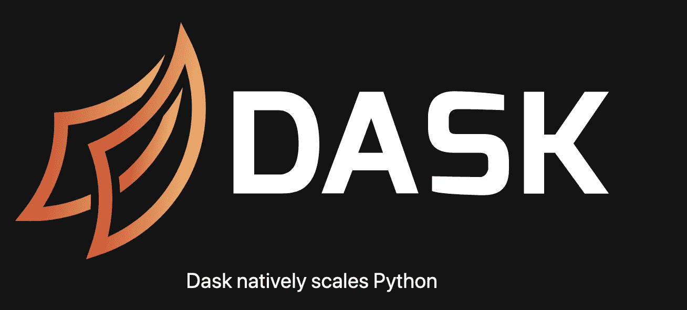
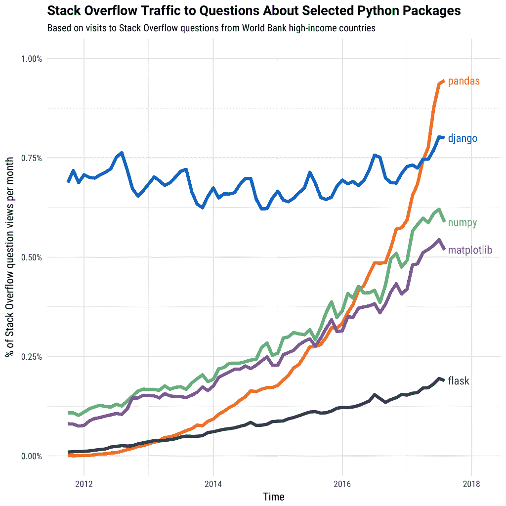
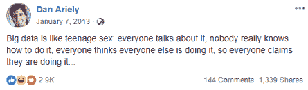
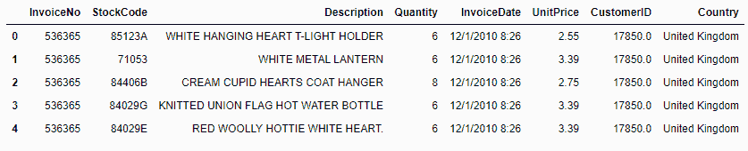
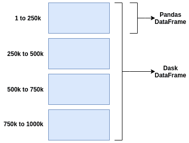
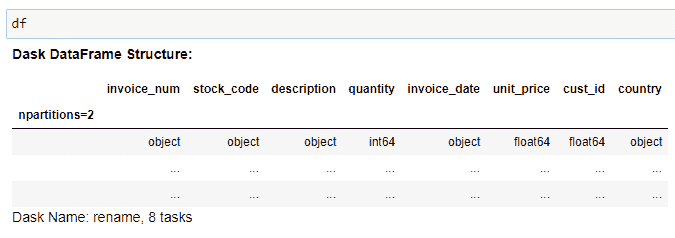

# 为什么以及如何使用 Dask 处理大数据

> 原文：[`www.kdnuggets.com/2020/04/dask-big-data.html`](https://www.kdnuggets.com/2020/04/dask-big-data.html)

评论

**由[Admond Lee](https://twitter.com/admond1994)，数据科学家，MicronTech 提供。**



* * *

## 我们的前三名课程推荐

 1\. [谷歌网络安全证书](https://www.kdnuggets.com/google-cybersecurity) - 快速进入网络安全职业生涯。

 2\. [谷歌数据分析专业证书](https://www.kdnuggets.com/google-data-analytics) - 提升你的数据分析能力

 3\. [谷歌 IT 支持专业证书](https://www.kdnuggets.com/google-itsupport) - 支持你的组织的 IT

* * *

*[Dask](https://dask.org/)*

作为数据科学家，[Pandas](https://pandas.pydata.org/)是 Python 中用于数据清理和分析的最佳工具之一。

在数据清理、转换、操作和分析方面，它*确实是*一个游戏规则改变者。

毫无疑问。

实际上，我甚至使用 Pandas 创建了自己的[数据清理工具箱](https://towardsdatascience.com/the-simple-yet-practical-data-cleaning-codes-ad27c4ce0a38)。这个工具箱不过是处理凌乱数据的常用技巧的汇编。

### 我与 Pandas 的爱恨关系

别误解我的意思。

Pandas 很棒。它很强大。



*[Stack Overflow 对选择的 Python 包的流量](https://www.kdnuggets.com/2019/11/speed-up-pandas-4x.html)*

它仍然是最受欢迎的数据科学工具之一，用于数据清理和分析。

然而，随着在数据科学领域的时间增长，我处理的数据量从 10MB、10GB、100GB，增加到 500GB，有时甚至更多。

我的 PC 由于局部内存对大于 100GB 数据的低效使用，遭遇了**低性能或长时间运行**的问题。

那时我意识到 Pandas 最初并不是为大规模数据设计的。

那时我意识到**大数据和巨大数据之间的明显差异**。

Prof. Dan Ariely 的一个著名笑话：



*[(来源)](https://www.facebook.com/dan.ariely/posts/904383595868)*

“大”和“巨大”这两个词本身就是“相对的”，在我看来，大数据是少于 100GB 的数据集。

现在，Pandas 在处理小数据（通常是 100MB 到 1GB 之间）时非常高效，性能很少成为问题。

但当你的数据量远大于本地 [RAM](https://en.wikipedia.org/wiki/Random-access_memory)（例如 100GB）时，你可以选择使用 [Pandas 处理数据的一些技巧](https://towardsdatascience.com/why-and-how-to-use-pandas-with-large-data-9594dda2ea4c) 在一定程度上处理，或者选择更好的工具——在这种情况下是 Dask。

这次，我选择了后者。

### 为什么 Dask 如同魔法般有效

对于我们中的一些人来说，[Dask](https://dask.org/) 可能是你已经熟悉的东西。

但对大多数有志的数据科学家或刚刚入门的数据科学领域的人来说，Dask 可能听起来有点陌生。

这完全没问题。

实际上，直到我遇到 Pandas 的真正局限性，我才了解 Dask。

> *请记住，如果你的数据量足够小且可以容纳在你计算机的内存空间中，那么 Dask 就****不是必需的****。*

所以现在的问题是……

*什么是 Dask，为什么 Dask 比 Pandas 更适合处理大数据？*

**Dask 被广泛称为一个 Python 并行计算库**

通过其并行计算功能，[Dask](https://docs.dask.org/en/latest/why.html) 允许快速高效地扩展计算。

它提供了一种简单的方法来 **处理大规模数据**，只需在常规 Pandas 工作流之外付出最小的额外努力。

换句话说，Dask 允许我们轻松地 **扩展到集群** 以处理大数据，或 **缩减到单台计算机** 以处理大数据，通过充分利用 CPU/GPU 的全部力量，所有这些都与 Python 代码完美集成。

很酷，不是吗？

把 Dask 看作是 Pandas 在 **性能和可扩展性** 方面的扩展。

更酷的是，你可以在 Dask 数据框和 Pandas 数据框之间切换，根据需要进行数据转换和操作。

### 如何在大数据中使用 Dask？

好了，理论够多了。

现在是动手实践的时候了。

你可以 [安装 Dask](https://docs.dask.org/en/latest/install.html) 并在你的本地 PC 上尝试使用你的 CPU/GPU。

*但我们在这里讨论的是 **大数据**，所以让我们做一些 **不同的** 事情。*

*让我们做 **大** 的事。*

与其通过缩减到单台计算机来驯服“巨兽”，不如通过 **扩展到集群** 来发现“巨兽”的全部力量，且 **免费**。

是的，我是认真的。

了解设置集群（例如 AWS）并将 Jupyter notebook 连接到云端可能对一些数据科学家，尤其是云计算初学者来说是一件麻烦事，我们可以使用 [Saturn Cloud](https://www.saturncloud.io/s/)。

这是我最近尝试的新平台。

Saturn Cloud 是一个托管的数据科学和机器学习平台，它自动化了 DevOps 和 ML 基础设施工程。

令我惊讶的是，它使用 **Jupyter** 和 **Dask** 来 **扩展 Python 以处理大数据**，利用我们所熟知和喜爱的库（Numpy、Pandas、Scikit-Learn 等）。它还利用了 [Docker](https://www.docker.com/) 和 [Kubernetes](https://kubernetes.io/)，以确保你的数据科学工作是可重复的、可共享的，并且准备好投入生产。

Dask 用户界面主要有三种类型，即 Array、Bag 和 Dataframe。我们将主要关注 **Dask Dataframe**，因为在下面的代码片段中，这就是我们作为数据科学家主要用于数据清理和分析的工具。

**1. 将 CSV 文件读取到 Dask 数据框架**

```py
import dask.dataframe as dd
df = dd.read_csv('https://e-commerce-data.s3.amazonaws.com/E-commerce+Data+(1).csv', encoding = 'ISO-8859-1', blocksize=32e6)

```

Dask 数据框架在读取常规文件和数据转换方面与 Pandas 数据框架没有不同，这使得它对数据科学家非常有吸引力，正如你稍后将看到的那样。

在这里，我们只是读取了一个存储在[S3](https://aws.amazon.com/s3/)中的单个 CSV 文件。由于我们只想测试 Dask 数据框架，文件大小相当小，共有 541909 行。



*读取 CSV 文件后的 Dask 数据框架。*

**注意：** 我们也可以在一行代码中 [读取多个文件](http://docs.saturncloud.io/en/articles/3760116-read-public-data-from-s3-in-saturn) 到 Dask 数据框架中，无论文件大小。

当我们从 CSV 中加载数据时，Dask 会创建一个 [按行分区](https://docs.dask.org/en/latest/dataframe.html#design) 的数据框架，即按索引值对行进行分组。Dask 就是通过这种方式按需将数据加载到内存中并超快处理——**它按分区处理。**



*[Dask 进行的分区](https://www.saturncloud.io/s/practical-guide-to-dask/)。*

在我们的例子中，我们看到 Dask 数据框架有 2 个分区（这是因为读取 CSV 时指定了 *blocksize*），有 8 个任务。

**“分区”** 这里简单地指在 Dask 数据框架中拆分的 Pandas 数据框架的数量。

分区越多，每次计算所需的任务就越多。



*Dask 数据框架结构。*

**2. 使用 *compute()* 执行操作**

现在我们已经将 CSV 文件读取到 Dask 数据框架中。

重要的是要记住，虽然 Dask 数据框架与 Pandas 数据框架非常相似，但确实存在一些差异。

我注意到的主要区别是 Dask 数据框架中的 *compute* 方法。

```py
df.UnitPrice.mean().compute()

```

大多数 Dask 用户界面是 ***惰性*** 的，这意味着 **它们不会进行计算，直到你明确要求结果** 使用 *compute* 方法。

这是我们通过在 *mean* 方法后添加 *compute* 方法来计算 *UnitPrice* 平均值的方式。

**3. 检查每列的缺失值数量**

```py
df.isnull().sum().compute()

```

同样，如果我们想检查每列的缺失值数量，我们需要添加 *compute* 方法。

**4. 根据条件筛选行**

```py
df[df.quantity < 10].compute()

```

在数据清理或探索性数据分析（EDA）过程中，我们常常需要根据某些条件过滤行，以理解数据背后的“故事”。

我们只需添加 *compute* 方法，就能进行与 Pandas 完全相同的操作。

然后 BOOM！我们得到结果了！

### 创建 Dask 集群并在大规模运行 Jupyter 的 DEMO

现在我们已经了解了如何一般使用 Dask，接下来是如何 [在 Saturn Cloud 上创建 Dask 集群](http://docs.saturncloud.io/en/articles/3652101-spin-up-dask-on-saturn) 并在 Jupyter 中大规模运行 Python 代码。

我录制了一个简短的视频，展示如何在几分钟内设置 Dask 集群并运行 Python 代码。

*如何在 Saturn Cloud 上创建 Dask 集群并运行 Jupyter Notebook*

### 最后的思考

感谢阅读。

在功能方面，Pandas 依然胜出。

在性能和可扩展性方面，Dask 优于 Pandas。

在我看来，如果你的数据超过了几 GB（与 RAM 相当），为了性能和可扩展性，建议使用 Dask。

如果你想在几分钟内创建 Dask 集群并大规模运行你的 Python 代码，我强烈推荐你 [在这里免费获取 Saturn Cloud 的社区版](http://bit.ly/saturn-cloud-community-edition)。

[原文](https://towardsdatascience.com/why-and-how-to-use-dask-with-big-data-746e34dac7c3)。已获许可转载。

**简介：** [Admond Lee](https://www.admondlee.com/) 目前致力于让数据科学对每个人都变得可及。他帮助公司和数字营销机构通过创新的数据驱动方法实现营销投资回报。他在高级社会分析和机器学习方面的专长旨在弥合数字营销和数据科学之间的差距。

**相关：**

+   [使用 Dask 的 K-means 聚类：猫咪图片的图像滤镜](https://www.kdnuggets.com/2019/06/k-means-clustering-dask-image-filters.html)

+   [五个有趣的数据工程项目](https://www.kdnuggets.com/2020/03/data-engineering-projects.html)

+   [数据科学难题 — 2020 年版](https://www.kdnuggets.com/2020/02/data-science-puzzle-2020-edition.html)

### 更多相关话题

+   [数据科学家为何应该使用 LightGBM 的 3 个理由](https://www.kdnuggets.com/2022/01/data-scientists-reasons-lightgbm.html)

+   [为何你应该使用线性回归模型而不是…的 3 个理由](https://www.kdnuggets.com/2021/08/3-reasons-linear-regression-instead-neural-networks.html)

+   [你不应该使用机器学习的 4 个理由](https://www.kdnuggets.com/2021/12/4-reasons-shouldnt-machine-learning.html)

+   [为何使用 k-fold 交叉验证？](https://www.kdnuggets.com/2022/07/kfold-cross-validation.html)

+   [为何最新的 LLM 使用 MoE（专家混合）架构](https://www.kdnuggets.com/why-the-newest-llms-use-a-moe-mixture-of-experts-architecture)

+   [大数据分析：为何它对商业智能如此关键？](https://www.kdnuggets.com/2023/06/big-data-analytics-crucial-business-intelligence.html)
