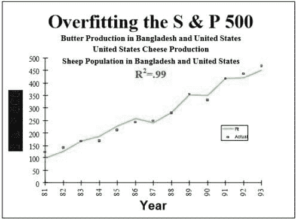
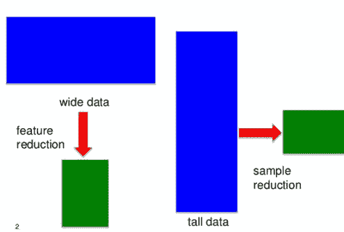

# 21 个必须了解的数据科学面试问题及答案，第二部分

> 原文：[`www.kdnuggets.com/2016/02/21-data-science-interview-questions-answers-part2.html`](https://www.kdnuggets.com/2016/02/21-data-science-interview-questions-answers-part2.html)

 评论 KDnuggets 上的帖子 20 个检测虚假数据科学家的问题 非常受欢迎，是本月最受关注的帖子。

然而，这些问题缺乏答案，因此 KDnuggets 编辑们聚在一起编写了 答案。这是第二部分的答案，从一个“额外”问题开始。

* * *

### 额外问题：解释什么是过度拟合以及如何控制它

这个问题不是原始的 20 个问题之一，但可能是区分真正的数据科学家与虚假的最重要的问题。

**回答者 Gregory Piatetsky.**

过度拟合是发现由于偶然性产生的虚假结果，并且后续研究无法重复这些结果。

我们经常看到关于研究推翻以前发现的新闻报道，例如鸡蛋不再对健康有害，或 [饱和脂肪与心脏病无关](http://well.blogs.nytimes.com/2014/03/17/study-questions-fat-and-heart-disease-link/)。在我们看来，问题在于许多研究人员，特别是在社会科学或医学领域，过于频繁地犯了数据挖掘的根本罪过——**过度拟合数据。**

研究人员测试了太多假设而没有适当的统计控制，直到他们偶然找到有趣的结果并报告它。不出所料，下次该效果（至少部分是）由于偶然因素，可能会小得多或根本不存在。

这些研究实践中的缺陷由 John P. A. Ioannidis 在其具有里程碑意义的论文 [*为何大多数已发表的研究结果是错误的*](http://www.plosmedicine.org/article/info%3Adoi%2F10.1371%2Fjournal.pmed.0020124)（PLoS Medicine，2005）中指出并报告。Ioannidis 发现，研究结果往往被夸大，或者发现无法重复。在他的论文中，他提供了统计证据，证明确实大多数声称的研究结果都是错误的。

Ioannidis 指出，为了使研究结果可靠，它应该具备：

+   大样本量和大效应

+   更多的测试关系和更少的选择

+   设计、定义、结果和分析模式的更大灵活性

+   最小化由于财务和其他因素（包括该科学领域的受欢迎程度）造成的偏差

不幸的是，这些规则常常被违反，产生了不可重复的结果。例如，S&P 500 指数被发现与孟加拉国黄油生产（19891 年至 1993 年）有强相关性（[这是 PDF](http://nerdsonwallstreet.typepad.com/my_weblog/files/dataminejune_2000.pdf)）

查看更多有趣（且完全虚假的）发现，你可以使用[Google correlate](https://www.google.com/trends/correlate/)或[Spurious correlations](http://www.tylervigen.com/discover) by Tyler Vigen 自己发现。

有几种方法可以用来避免“过拟合”数据

+   尝试找到可能的最简单假设

+   [正则化](https://en.wikipedia.org/wiki/Regularization_(mathematics))（对复杂性添加惩罚）

+   随机化测试（随机化类别变量，尝试在这些数据上使用你的方法——如果找到相同的强结果，则表示出现了问题）

+   嵌套交叉验证（在一个层级上进行特征选择，然后在外层级上运行整个方法的交叉验证）

+   调整[虚假发现率](https://en.wikipedia.org/wiki/False_discovery_rate)

+   使用可重复的保留集方法——一种在 2015 年提出的突破性方法

良好的数据科学站在科学理解的前沿，数据科学家有责任避免过拟合数据，并教育公众和媒体关于糟糕数据分析的危险。

另见

+   数据挖掘和数据科学的根本错误：过拟合

+   避免过拟合的关键理念：可重复的保留集以保持自适应数据分析中的有效性

+   通过可重复的保留集克服过拟合：在自适应数据分析中保持有效性

+   11 种聪明的过拟合方法及如何避免它们

+   标签：过拟合

* * *

### Q12。举例说明你如何使用实验设计来回答关于用户行为的问题。

答案由**Bhavya Geethika**提供。

**步骤 1：制定研究问题：**

页面加载时间对用户满意度评分的影响是什么？

**步骤 2：识别变量：**

我们识别原因和结果。独立变量——页面加载时间，依赖变量——用户满意度评分

**步骤 3：生成假设：**

降低页面下载时间将对网页的用户满意度评分产生更多影响。这里我们分析的因素是页面加载时间。

图 12: 你的实验设计存在缺陷（漫画来自[这里](https://sites.psu.edu/academy/2014/10/29/a-lesson-on-experimental-design/)）

**步骤 4: 确定实验设计。**

我们考虑实验复杂性，即一次变化一个因素或一次变化多个因素，在这种情况下我们使用因子设计（2^k 设计）。设计也基于目标类型（比较、筛选、响应面）和因素数量进行选择。

这里我们还识别了被试内设计、被试间设计和混合模型。例如：有两个版本的页面，一个版本的购买按钮（行动呼吁）在左侧，另一个版本的按钮在右侧。

在被试内设计 - 两个用户组都会看到两个版本。

在被试间设计 - 一组用户看到版本 A，另一组用户看到版本 B。

**步骤 5: 开发实验任务和程序：**

需要详细描述实验中涉及的步骤、用于测量用户行为的工具、目标和成功指标。收集有关用户参与的定性数据，以进行统计分析。

**步骤 6: 确定操控与测量**

操控：一个因素将被控制，另一个因素将被操控。我们还识别行为测量：

1.  延迟 - 提示与行为发生之间的时间（用户在看到产品后点击购买所需的时间）。

1.  频率 - 行为发生的次数（用户在指定时间内点击页面的次数）

1.  持续时间 - 特定行为持续的时间（添加所有产品所需的时间）

1.  强度 - 行为发生的力度（用户购买产品的速度）

**步骤 7: 分析结果**

识别用户行为数据并根据观察支持或反驳假设，例如，比较大多数用户的满意度评分与页面加载时间。

* * *

### Q13\. “长”（“高”）和“宽”格式数据的区别是什么？

**由 Gregory Piatetsky 回答。**

在大多数数据挖掘/数据科学应用中，记录（行）的数量通常远多于特征（列）的数量，这类数据有时被称为“长”（或“高”）数据。

在一些应用中，如基因组学或生物信息学，你可能只有少量记录（患者），例如 100 个，但每个患者可能有 20,000 个观察值。适用于“长”数据的标准方法将导致过拟合，因此需要特殊的方法。

**图 13\. 高数据和宽数据的不同方法**，来自演示文稿[稀疏筛选以实现精确数据减少](http://www.slideshare.net/BigDataMining/screening-ye14)，作者 Jieping Ye。

问题不仅仅是重塑数据（这里有[有用的 R 包](https://psychwire.wordpress.com/2011/05/16/reshape-package-in-r-long-data-format-to-wide-back-to-long-again/)），还要通过减少特征数量来避免假阳性，以找到最相关的特征。

像 Lasso 这样的特征减少方法在[《具有稀疏性的统计学习：Lasso 及其推广》](http://web.stanford.edu/~hastie/StatLearnSparsity/)中得到了很好的介绍，作者为 Hastie、Tibshirani 和 Wainwright。（你可以下载这本书的免费 PDF）

### 更多相关主题

+   [20 个问题（带答案）识别假数据科学家：ChatGPT…](https://www.kdnuggets.com/2023/01/20-questions-detect-fake-data-scientists-chatgpt-1.html)

+   [20 个问题（带答案）识别假数据科学家：ChatGPT…](https://www.kdnuggets.com/2023/02/20-questions-detect-fake-data-scientists-chatgpt-2.html)

+   [7 个数据分析面试问题与答案](https://www.kdnuggets.com/2022/09/7-data-analytics-interview-questions-answers.html)

+   [5 个 Python 面试问题与答案](https://www.kdnuggets.com/2022/09/5-python-interview-questions-answers.html)

+   [数据科学面试指南 - 第二部分：面试资源](https://www.kdnuggets.com/2022/04/data-science-interview-guide-part-2-interview-resources.html)

+   [KDnuggets 新闻，5 月 4 日：9 门免费哈佛课程学习数据…](https://www.kdnuggets.com/2022/n18.html)
