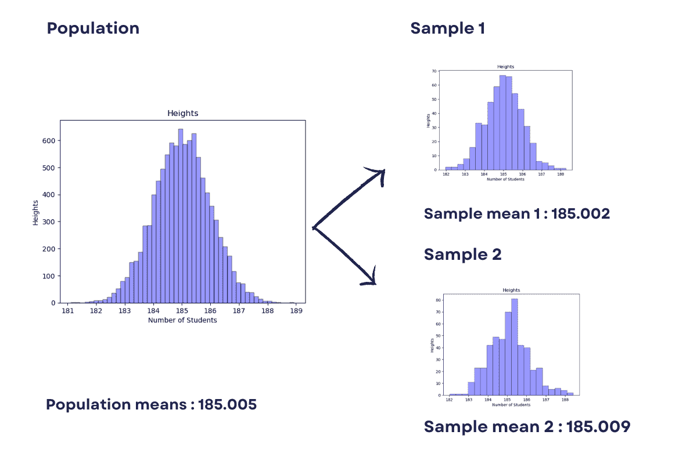
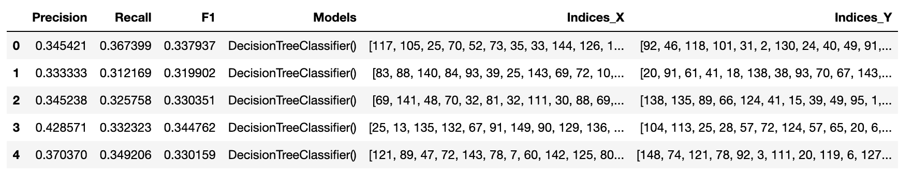
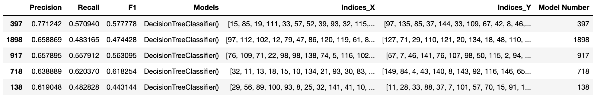
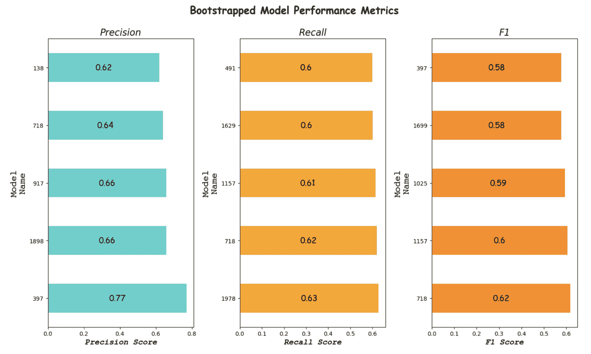
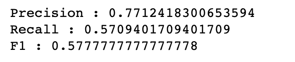

# 机器学习：什么是自助法？

> 原文：[`www.kdnuggets.com/2023/03/bootstrapping.html`](https://www.kdnuggets.com/2023/03/bootstrapping.html)


图片来源：作者

机器学习是一个不断发展的领域，它正在改变我们处理和分析数据的方式。

* * *

## 我们的前三大课程推荐

 1\. [Google 网络安全证书](https://www.kdnuggets.com/google-cybersecurity) - 快速进入网络安全职业。

 2\. [Google 数据分析专业证书](https://www.kdnuggets.com/google-data-analytics) - 提升你的数据分析技能

 3\. [Google IT 支持专业证书](https://www.kdnuggets.com/google-itsupport) - 支持你的组织进行 IT 工作

* * *

自助法是机器学习领域中的一种重要技术，对构建稳健且准确的模型至关重要。

在本文中，我们将深入探讨自助法是什么以及它如何在机器学习中使用。

此外，我们还将探讨决策树分类器和鸢尾花数据集。这将用于展示自助法在现实世界中的应用实例。

通过这篇文章，我们旨在提供对自助法的全面理解。

此外，我们还将介绍它在机器学习中的应用。这将使你掌握将其应用于自己的[机器学习项目](https://www.stratascratch.com/blog/30-project-ideas-to-showcase-your-machine-learning-skills/?utm_source=blog&utm_medium=click&utm_campaign=kdn+bootstrapping)的知识。

但首先，自助法是什么？

# 什么是自助法？

自助法是一种重采样技术，有助于估计统计模型的不确定性。

这包括对原始数据集进行带替换的抽样，并生成多个与原始数据集大小相同的新数据集。

每个新数据集都用于计算所需的统计量，例如均值或标准差。

这个过程会重复多次，所得的值用于构建所需统计量的概率分布。

这种技术在机器学习中经常用于估计模型的准确性、验证其性能，并识别需要改进的领域。

例如，我们可以使用自助抽样来计算总体均值。结果如下所示。



图片来源：作者

我们将在本文稍后部分进一步讨论这个示例。

# 如何在机器学习中使用自助法？

自助法可以通过多种方式在机器学习中使用，包括模型性能估计、模型选择以及识别数据集中最重要的特征。

引导法在机器学习中的一个流行用例是估计分类器的准确性，我们将在本文中进行这一操作。

让我们从一个简单的 Python 引导示例开始作为热身。

# 引导法中的均值计算

我们将展示如何使用引导法来估计一个有 10,000 名学生的学校的平均身高。

一般的方法是通过将所有身高相加，然后将总和除以 10,000 来计算均值。

首先，使用 NumPy 库生成一个由 10,000 个随机生成的数字（身高）组成的样本。

```py
import numpy as np
import pandas as pd
x = np.random.normal(loc= 185.0, scale=1.0, size=10000)
np.mean(x) 
```

这是均值的输出结果。


现在，我们如何仅从 200 名学生中计算这些学生的身高呢？

在引导抽样中，我们通过从总体中随机选择元素并进行替换来创建多个样本。

在我们的例子中，样本大小将是 5。这意味着在 200 名学生的总体中将有 40 个样本。

使用下面的代码，我们将从学生中抽取 40 个样本，每个样本大小为 5。(`x`)

这包括从原始样本中进行带替换的随机抽样，以创建 40 个新样本。

替换是什么意思？

我的意思是首先从 10,000 个中选择一个，忘记我选择了谁，然后再次从 10,000 个中选择一个。

你可以选择同一个学生，但这种情况的概率很小。替换听起来不那么聪明了，对吧？

每个新的样本大小为 5，比原始样本要小。每个新样本的均值被计算并存储在 sample_mean 列表中。

最后，计算所有 40 个样本均值的均值，并代表总体均值的估计。

这是代码。

```py
import random

sample_mean = []

# Bootstrap Sampling
for i in range(40):
    y = random.sample(x.tolist(), 5)
    avg = np.mean(y)

    sample_mean.append(avg)
np.mean(sample_mean)
```

这里是输出结果。


这很接近，对吧？

# 使用决策树的分类任务中的引导法

在这里，我们将看到使用决策树的引导法在分类中的应用，使用的是 Iris 数据集。但首先，让我们了解一下什么是决策树。

## 什么是决策树？

[决策树](https://www.stratascratch.com/blog/decision-tree-and-random-forest-algorithm-explained/?utm_source=blog&utm_medium=click&utm_campaign=kdn+bootstrapping)是一个流行的[机器学习算法](https://www.stratascratch.com/blog/machine-learning-algorithms-you-should-know-for-data-science/?utm_source=blog&utm_medium=click&utm_campaign=kdn+bootstrapping)，广泛用于分类和回归问题。它是一种基于树的模型，通过从根节点分支出来并根据某些条件做出决策来进行预测。

决策树分类器是这种算法的一种具体实现，用于执行二分类任务。

决策树分类器的主要目标是确定最重要的特征，这些特征有助于预测目标变量。该算法使用贪婪方法，通过选择信息增益最高的特征来最小化树的杂质。树会继续分裂，直到数据完全纯净或达到停止准则。

## 什么是 Iris 数据集？

Iris 数据集是用于评估分类任务的流行数据集之一。

该数据集包含 150 个鸢尾花观察样本，每个样本包含如花萼长度、花萼宽度、花瓣长度和花瓣宽度等特征。

目标变量是鸢尾植物的种类。

Iris 数据集广泛用于机器学习算法中，以评估不同模型的性能，并作为示例来演示决策树分类器的概念。

现在，让我们看看如何在分类中使用自助抽样和决策树。

## 自助抽样的编码

该代码实现了一种机器学习模型的自助抽样技术，使用了来自 sci-kit-learn 库的 DecisionTreeClassifier。

前几行加载 Iris 数据集，并从中提取特征数据（X）和目标数据（y）。

自助抽样函数接受特征数据（X）、目标数据（y）和用于自助抽样的样本数量（n_samples）。

该函数返回一个经过训练的模型列表以及一个包含精度、召回率、F1 分数和用于自助抽样的索引的 pandas 数据框。

自助抽样过程在**for loop**中完成。

对于每次迭代，函数使用**np.random.choice**方法随机选择特征数据（X）和目标数据（y）的样本。

然后，使用**train_test_split**方法将样本数据分为训练集和测试集。DecisionTreeClassifier 在训练数据上进行训练，然后用于对测试数据进行预测。

精度、召回率和 F1 分数使用来自 sci-kit-learn 库的**metrics.precision_score**、**metrics.recall_score**和**metrics.f1_score**方法进行计算。这些分数然后在每次迭代中添加到一个列表中。

最后，结果保存到一个 pandas 数据框中，包含精度、召回率、F1 分数、训练模型和用于自助抽样的索引列。然后由函数返回数据框。

现在，让我们看看代码。

```py
from sklearn import metrics
import pandas as pd
from sklearn.model_selection import train_test_split
from sklearn.datasets import load_iris
from sklearn.tree import DecisionTreeClassifier

# Load the iris dataset
iris = load_iris()
X, y = iris.data, iris.target

def bootstrap(X, y, n_samples=2000):
    models = []
    precision = []
    recall = []
    f1 = []
    indices_x = []
    indices_y = []

    for i in range(n_samples):
        index_x = np.random.choice(X.shape[0], size=X.shape[0], replace=True)
        indices_x.append(index_x)
        X_sample = X[index_x, :]

        index_y = np.random.choice(y.shape[0], size=y.shape[0], replace=True)
        indices_y.append(index_y)
        y_sample = y[index_y]

        X_train, X_test, y_train, y_test = train_test_split(
            X_sample, y_sample, test_size=0.2, random_state=42
        )

        model = DecisionTreeClassifier().fit(X_train, y_train)
        models.append(model)

        y_pred = model.predict(X_test)
        precision.append(
            metrics.precision_score(y_test, y_pred, average="macro")
        )
        recall.append(metrics.recall_score(y_test, y_pred, average="macro"))
        f1.append(metrics.f1_score(y_test, y_pred, average="macro"))
    # Save the results to a Pandas dataframe
    pred_df = pd.DataFrame(
        {
            "Precision": precision,
            "Recall": recall,
            "F1": f1,
            "Models": models,
            "Indices_X": indices_x,
            "Indices_Y": indices_y,
        }
    ) 
```

现在调用函数。

```py
models, pred_df = bootstrap(X, y)
```

显示函数创建的数据框的结果。

```py
pred_df.head()
```



现在，将索引列添加为模型编号，

```py
pred_df['Model Number'] = pred_df.index,
```

并按精度对值进行排序。

```py
pred_df.sort_values(by= "Precision", ascending = False).head(5)
```

为了更好地查看结果，我们将进行一些数据可视化。



## 自助抽样可视化

下面的代码创建了 3 个条形图，以显示自助抽样模型的性能。

模型的性能通过精确度、召回率和 F1 分数来衡量。因此，我们将创建一个名为 pred_df 的数据框。该数据框存储模型的分数。

这段代码创建了一个包含 3 个子图的图形。

第一个子图（ax2）是一个条形图，显示了前 5 个模型的精确度分数。

x 轴显示精确度分数，y 轴显示模型的索引。每个条形图的中心显示了这些 3 个数值。该图的标题为“精确度”。

第二个子图（ax3）是一个条形图，显示了前 5 个模型的召回率分数。x 轴显示召回率分数，y 轴显示模型的索引。该图的标题为“召回率”。

第三个子图（ax4）是一个条形图，显示了前 5 个模型的 F1 分数。x 轴显示 F1 分数，y 轴显示模型的索引。该图的标题为“F1”。

整个图形的标题为“自助法模型性能指标”。我们将使用 plt.show()来显示这些图像。

这是代码。

```py
import matplotlib.pyplot as plt

# Create a figure and subplots
fig, (ax2, ax3, ax4) = plt.subplots(1, 3, figsize=(14, 8))

best_of = pred_df.sort_values(by="Precision", ascending=False).head(5)

# Create the first graph
best_of.plot(
    kind="barh",
    x="Model Number",
    y="Precision",
    color="mediumturquoise",
    ax=ax2,
    legend=False,
)
ax2.set_xlabel(
    "Precision Score",
    fontstyle="italic",
    fontsize=14,
    font="Courier New",
    fontweight="bold",
    y=1.1,
)
ylabel = "Model\nName"
ax2.set_ylabel(ylabel, fontsize=16, font="Courier")
ax2.set_title("Precision", fontsize=16, fontstyle="italic")

for index, value in enumerate(best_of["Precision"]):
    ax2.text(
        value / 2,
        index,
        str(round(value, 2)),
        ha="center",
        va="center",
        fontsize=14,
        font="Comic Sans MS",
    )
best_of = pred_df.sort_values(by="Recall", ascending=False).head(5)

# Create the second graph
best_of.plot(
    kind="barh",
    x="Model Number",
    y="Recall",
    color="orange",
    ax=ax3,
    legend=False,
)
ax3.set_xlabel(
    "Recall Score",
    fontstyle="italic",
    fontsize=14,
    font="Courier New",
    fontweight="bold",
)
ax3.set_ylabel(ylabel, fontsize=16, font="Courier")
ax3.set_title("Recall", fontsize=16, fontstyle="italic")

for index, value in enumerate(best_of["Recall"]):
    ax3.text(
        value / 2,
        index,
        str(round(value, 2)),
        ha="center",
        va="center",
        fontsize=14,
        font="Comic Sans MS",
    )
# Create the third graph
best_of = pred_df.sort_values(by="F1", ascending=False).head(5)
best_of.plot(
    kind="barh",
    x="Model Number",
    y="F1",
    color="darkorange",
    ax=ax4,
    legend=False,
)
ax4.set_xlabel(
    "F1 Score",
    fontstyle="italic",
    fontsize=14,
    font="Courier New",
    fontweight="bold",
)
ax4.set_ylabel(ylabel, fontsize=16, font="Courier")
ax4.set_title("F1", fontsize=16, fontstyle="italic")

for index, value in enumerate(best_of["F1"]):
    ax4.text(
        value / 2,
        index,
        str(round(value, 2)),
        ha="center",
        va="center",
        fontsize=14,
        font="Comic Sans MS",
    )
# Fit the figure
plt.tight_layout()

plt.suptitle(
    "Bootstrapped Model Performance Metrics",
    fontsize=18,
    y=1.05,
    fontweight="bold",
    fontname="Comic Sans MS",
)

# Show the figure
plt.show() 
```

这是输出结果。



图片由作者提供

根据精确度和 F1 分数来看，模型 397 是我们表现最好的模型。

当然，如果召回率对你的项目更为重要，你可以选择模型 718 或其他模型。

## 复制最佳结果

现在，我们已经保存了这些索引以创建可复制的结果。我们将选择第 397 个模型，并查看结果是否可重复。

以下代码首先使用 pred_df 数据框第 397 行中存储的索引选择数据（X 和 y）的一个样本。

然后，使用**train_test_split**方法将样本数据分割为训练集和测试集，测试集的大小为 0.2，随机状态为 42。

接下来，使用训练数据训练一个决策树分类器模型，并将其存储在模型列表中。然后，使用**predict()**方法对测试数据进行预测。

最后，使用**precision_score**、**recall_score**和**f1_score**函数从 metrics 模块计算模型的精确度、召回率和 F1 分数，并打印到控制台。

这些分数通过测量模型正确分类数据的能力以及模型生成的假阳性和假阴性的水平来评估模型的性能。

这是代码。

```py
X_sample = X[pred_df.iloc[397]["Indices_X"], :]
y_sample = y[pred_df.iloc[397]["Indices_Y"]]

X_train, X_test, y_train, y_test = train_test_split(
    X_sample, y_sample, test_size=0.2, random_state=42
)

model = DecisionTreeClassifier().fit(X_train, y_train)
models.append(model)

y_pred = model.predict(X_test)
precision_397 = metrics.precision_score(y_test, y_pred, average="macro")
recall_397 = metrics.recall_score(y_test, y_pred, average="macro")
f1_397 = metrics.f1_score(y_test, y_pred, average="macro")
print("Precision : {}".format(precision_397))
print("Recall : {}".format(recall_397))
print("F1 : {}".format(f1_397)) 
```

这是输出结果。



# 结论

总结来说，自助法是机器学习中一个强大的工具，可以用来提高算法的性能。通过创建数据的多个子集，自助法有助于降低过拟合的风险，并提高结果的准确性。

我们展示了如何使用自助法对分类算法进行决策树分类器的应用。

通过结合自助法和决策树分类器，我们可以创建一个强大的机器学习模型，提供准确和可靠的结果，这些结果可能适用于其他[分类算法](https://www.stratascratch.com/blog/overview-of-machine-learning-algorithms-classification/?utm_source=blog&utm_medium=click&utm_campaign=kdn+bootstrapping)。

理解所有这些概念对于数据科学家和机器学习专业人士来说至关重要。我会说这是**必须的**！这些概念可以帮助你做出明智的决策，选择合适的工具和技术来解决实际问题。

**[内特·罗西迪](https://www.stratascratch.com)** 是一位数据科学家及产品战略专家。他还担任兼职教授教授分析学，并且是[StrataScratch](https://www.stratascratch.com/)的创始人，该平台帮助数据科学家为面试准备来自顶级公司的真实面试问题。可以在[Twitter: StrataScratch](https://twitter.com/StrataScratch)或[LinkedIn](https://www.linkedin.com/in/nathanrosidi/)上与他联系。

### 更多相关话题

+   [KDnuggets 新闻，12 月 14 日：3 门免费的机器学习课程…](https://www.kdnuggets.com/2022/n48.html)

+   [每位机器学习工程师应具备的 5 项机器学习技能…](https://www.kdnuggets.com/2023/03/5-machine-learning-skills-every-machine-learning-engineer-know-2023.html)

+   [学习数据科学、机器学习和深度学习的坚实计划](https://www.kdnuggets.com/2023/01/mwiti-solid-plan-learning-data-science-machine-learning-deep-learning.html)

+   [人工智能、分析学、机器学习、数据科学、深度学习…](https://www.kdnuggets.com/2021/12/developments-predictions-ai-machine-learning-data-science-research.html)

+   [打破数据障碍：零样本、单样本和少样本学习如何…](https://www.kdnuggets.com/2023/08/breaking-data-barrier-zeroshot-oneshot-fewshot-learning-transforming-machine-learning.html)

+   [联邦学习：协作机器学习及教程…](https://www.kdnuggets.com/2021/12/federated-learning-collaborative-machine-learning-tutorial-get-started.html)
