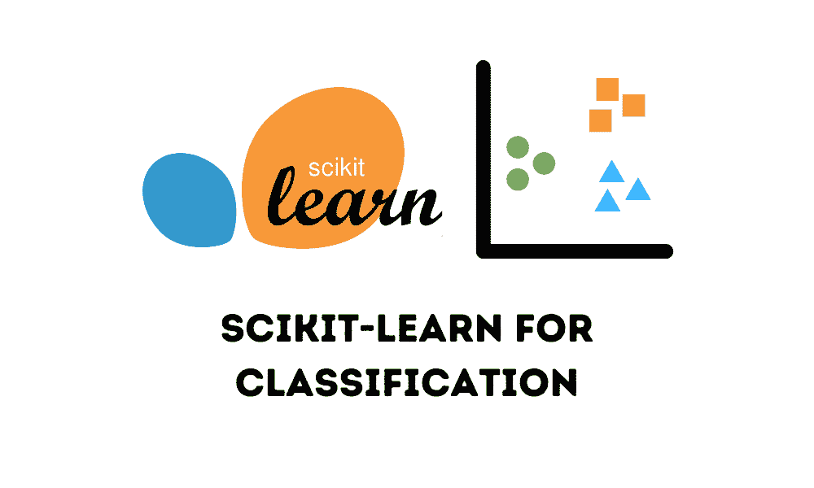

# 使用 Scikit-learn 进行机器学习分类入门

> [`www.kdnuggets.com/getting-started-with-scikit-learn-for-classification-in-machine-learning`](https://www.kdnuggets.com/getting-started-with-scikit-learn-for-classification-in-machine-learning)



图片来源：编辑

Scikit-learn 是最常用的 Python 机器学习库之一。它的受欢迎程度可以归因于其简单一致的代码结构，适合初学者开发者使用。此外，它还提供了高水平的支持，并且可以灵活集成第三方功能，使得该库强大且适用于生产。该库包含多个用于分类、回归和聚类的机器学习模型。在本教程中，我们将通过各种算法探索多类别分类问题。让我们深入了解并构建我们的 scikit-learn 模型。

* * *

## 我们的前 3 个课程推荐

 1\. [谷歌网络安全证书](https://www.kdnuggets.com/google-cybersecurity) - 快速开启网络安全职业生涯。

 2\. [谷歌数据分析专业证书](https://www.kdnuggets.com/google-data-analytics) - 提升你的数据分析技能

 3\. [谷歌 IT 支持专业证书](https://www.kdnuggets.com/google-itsupport) - 支持你的组织 IT

* * *

# 安装最新版本

```py
pip install scikit-learn
```

# 加载数据集

我们将使用 scikit-learn 数据集模块中的“Wine”数据集。该数据集包含 178 个样本和 3 个类别。数据集已预处理并转换为特征向量，因此我们可以直接用来训练我们的模型。

```py
from sklearn.datasets import load_wine 
 X, y = load_wine(return_X_y=True)
```

# 创建训练和测试数据

我们将保留 67%的数据用于训练，其余 33%用于测试。

```py
from sklearn.model_selection import train_test_split

X_train, X_test, y_train, y_test = train_test_split(
    X, y, test_size=0.33, random_state=42
)
```

现在，我们将尝试 5 种不同复杂度的模型，并评估它们在数据集上的结果。

# 逻辑回归

```py
model_lr = LogisticRegression()
model_lr.fit(X_train, y_train)
y_pred_lr = model_lr.predict(X_test)

print("Accuracy Score: ", accuracy_score(y_pred_lr, y_test))
print(classification_report(y_pred_lr, y_test))
```

**输出**

```py
Accuracy Score:  0.9830508474576272

              precision    recall  f1-score   support

           0       1.00      0.95      0.98        21
           1       0.96      1.00      0.98        23
           2       1.00      1.00      1.00        15

    accuracy                           0.98        59
   macro avg       0.99      0.98      0.98        59
weighted avg       0.98      0.98      0.98        59
```

# K-最近邻

```py
model_knn = KNeighborsClassifier(n_neighbors=1)
model_knn.fit(X_train, y_train)
y_pred_knn = model_knn.predict(X_test)

print("Accuracy Score:", accuracy_score(y_pred_knn, y_test))
print(classification_report(y_pred_knn, y_test))
```

**输出**

```py
Accuracy Score: 0.7796610169491526

              precision    recall  f1-score   support

           0       0.90      0.78      0.84        23
           1       0.75      0.82      0.78        22
           2       0.67      0.71      0.69        14

    accuracy                           0.78        59
   macro avg       0.77      0.77      0.77        59
weighted avg       0.79      0.78      0.78        59
```

当更改参数‘n_neighbors=2’时，我们观察到准确率下降。因此，这表明数据简单，使用单个邻居会有更好的学习效果。

**输出**

```py
Accuracy Score: 0.6949152542372882

              precision    recall  f1-score   support

           0       0.90      0.72      0.80        25
           1       0.75      0.69      0.72        26
           2       0.33      0.62      0.43         8

    accuracy                           0.69        59
   macro avg       0.66      0.68      0.65        59
weighted avg       0.76      0.69      0.72        59
```

# 朴素贝叶斯

```py
from sklearn.naive_bayes import GaussianNB

model_nb = GaussianNB()
model_nb.fit(X_train, y_train)
y_pred_nb = model_nb.predict(X_test)

print("Accuracy Score:", accuracy_score(y_pred_nb, y_test))
print(classification_report(y_pred_nb, y_test))
```

**输出**

```py
Accuracy Score: 1.0

              precision    recall  f1-score   support

           0       1.00      1.00      1.00        20
           1       1.00      1.00      1.00        24
           2       1.00      1.00      1.00        15

    accuracy                           1.00        59
   macro avg       1.00      1.00      1.00        59
weighted avg       1.00      1.00      1.00        59
```

# 决策树分类器

```py
from sklearn.tree import DecisionTreeClassifier

model_dtclassifier = DecisionTreeClassifier()
model_dtclassifier.fit(X_train, y_train)
y_pred_dtclassifier = model_dtclassifier.predict(X_test)

print("Accuracy Score:", accuracy_score(y_pred_dtclassifier, y_test))
print(classification_report(y_pred_dtclassifier, y_test))
```

**输出**

```py
Accuracy Score: 0.9661016949152542

              precision    recall  f1-score   support

           0       0.95      0.95      0.95        20
           1       1.00      0.96      0.98        25
           2       0.93      1.00      0.97        14

    accuracy                           0.97        59
   macro avg       0.96      0.97      0.97        59
weighted avg       0.97      0.97      0.97        59 
```

# 随机森林分类器

```py
from sklearn.ensemble import RandomForestClassifier
from sklearn.model_selection import RandomizedSearchCV

def get_best_parameters():

    params = {
        "n_estimators": [10, 50, 100],
        "max_features": ["auto", "sqrt", "log2"],
        "max_depth": [5, 10, 20, 50],
        "min_samples_split": [2, 4, 6],
        "min_samples_leaf": [2, 4, 6],
        "bootstrap": [True, False],
    }

    model_rfclassifier = RandomForestClassifier(random_state=42)

    rf_randomsearch = RandomizedSearchCV(
        estimator=model_rfclassifier,
        param_distributions=params,
        n_iter=5,
        cv=3,
        verbose=2,
        random_state=42,
    )

    rf_randomsearch.fit(X_train, y_train)

    best_parameters = rf_randomsearch.best_params_

    print("Best Parameters:", best_parameters)

    return best_parameters

parameters_rfclassifier = get_best_parameters()

model_rfclassifier = RandomForestClassifier(
    **parameters_rfclassifier, random_state=42
)

model_rfclassifier.fit(X_train, y_train)

y_pred_rfclassifier = model_rfclassifier.predict(X_test)

print("Accuracy Score:", accuracy_score(y_pred_rfclassifier, y_test))
print(classification_report(y_pred_rfclassifier, y_test))
```

**输出**

```py
 Best Parameters: {'n_estimators': 100, 'min_samples_split': 6, 'min_samples_leaf': 4, 'max_features': 'log2', 'max_depth': 5, 'bootstrap': True}
Accuracy Score: 0.9830508474576272

              precision    recall  f1-score   support

           0       1.00      0.95      0.98        21
           1       0.96      1.00      0.98        23
           2       1.00      1.00      1.00        15

    accuracy                           0.98        59
   macro avg       0.99      0.98      0.98        59
weighted avg       0.98      0.98      0.98        59
```

在这个算法中，我们进行了超参数调整以获得最佳准确率。我们定义了一个包含多个值的参数网格供每个参数选择。此外，我们使用随机搜索 CV 算法来搜索模型的最佳参数空间。最后，我们将获得的参数提供给分类器并训练模型。

# 模型比较

| **模型** | **准确率** | **观察** |
| --- | --- | --- |
| 逻辑回归 | 98.30% | 达到了很高的准确率。模型能够在测试数据集上很好地泛化。 |
| K-最近邻 | 77.96% | 算法无法很好地学习数据表示。 |
| 朴素贝叶斯 | 100% | 模型复杂度较低，因此它将数据过拟合以获得绝对准确性。 |
| 决策树分类器 | 96.61% | 达到了不错的准确率。 |
| 随机森林分类器 | 98.30% | 作为一种集成方法，它的表现优于决策树。通过超参数调优，它的准确率与逻辑回归相似。 |

# 结论

在本教程中，我们学习了如何开始构建和训练 scikit-learn 中的机器学习模型。我们实现并评估了一些算法，以了解它们的基本性能。我们可以始终采用更高级的策略进行特征工程、超参数调优或训练，以提高性能。要了解 scikit-learn 提供的更多功能，请访问官方文档 - [使用 scikit-learn 进行机器学习简介](https://scikit-learn.org/stable/tutorial/basic/tutorial.html)，[使用 scikit-learn 进行 Python 机器学习](https://scikit-learn.org/stable/)。

**[Yesha Shastri](https://www.linkedin.com/in/yeshashastri/)** 是一位充满热情的 AI 开发者和作家，目前在蒙特利尔大学攻读机器学习硕士学位。Yesha 对探索负责任的 AI 技术以解决对社会有益的挑战感兴趣，并与社区分享她的学习经验。

### 更多相关主题

+   [用于分类的机器学习算法](https://www.kdnuggets.com/2022/03/machine-learning-algorithms-classification.html)

+   [自动文本摘要入门](https://www.kdnuggets.com/2019/11/getting-started-automated-text-summarization.html)

+   [数据清洗入门](https://www.kdnuggets.com/2022/01/getting-started-cleaning-data.html)

+   [SQL 速查表入门](https://www.kdnuggets.com/2022/08/getting-started-sql-cheatsheet.html)

+   [使用 spaCy 进行 NLP 入门](https://www.kdnuggets.com/2022/11/getting-started-spacy-nlp.html)

+   [PyCaret 入门](https://www.kdnuggets.com/2022/11/getting-started-pycaret.html)
