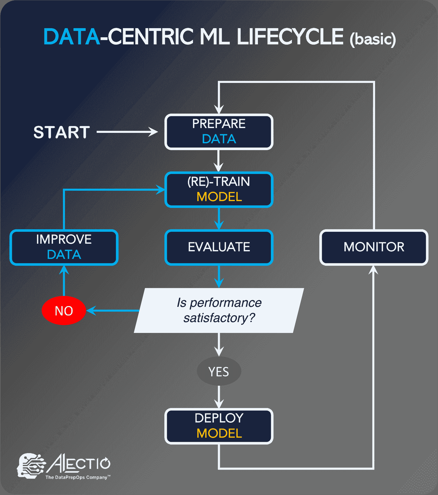
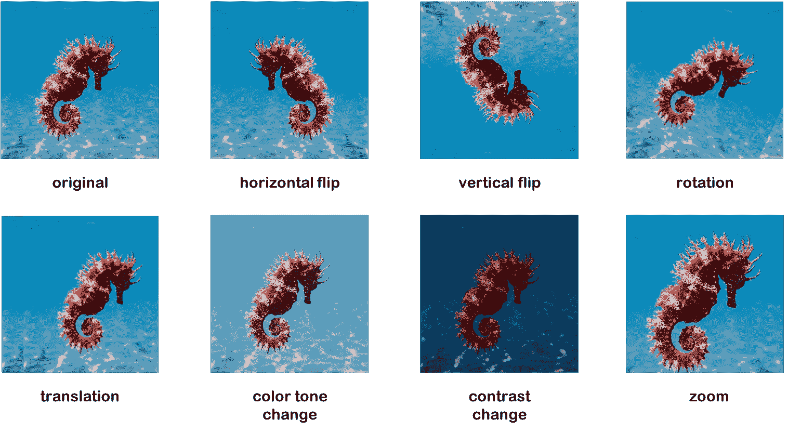

# 如何通过数据中心的人工智能使自己与其他申请者区分开来

> [`www.kdnuggets.com/2022/12/set-apart-applicants-datacentric-ai.html`](https://www.kdnuggets.com/2022/12/set-apart-applicants-datacentric-ai.html)

在 2012 年，数据科学家被评为[21 世纪最性感的职业](https://hbr.org/2012/10/data-scientist-the-sexiest-job-of-the-21st-century)，《哈佛商业评论》如此称赞。虽然这一领域自那时以来已经显著成熟，并且现在有许多“数据科学”职位的“变种”，但情况并没有改变太多：成为数据科学家仍然是新毕业生非常渴望的职业，并且也吸引了来自不同领域的许多人。

随着机器学习在整个行业的快速应用和人工智能研究的巨大进展，好消息是对数据科学家的需求不会在短期内消失。每年实际上有[成千上万的新数据科学职位开放](https://data-flair.training/blogs/data-science-job-trends/)。事实上，雇主通常面临劳动力短缺的问题。因此，有这么多机会在市场上，新人要找到理想的工作应该不会太难，对吧？不幸的是，事情从来不会那么简单，现实是即使有这么多空缺职位，初级申请者仍然面临巨大挑战进入这一领域。

# 信誉困境

为了理解为什么雇主似乎无法找到合适的数据科学和机器学习职位人选，了解数据科学工作如何在科技行业变得普及是有用的。

尽管这一术语在 2001 年被创造出来，但数据科学并不是一个新领域。其实践方式随着时间的推移发生了剧烈变化。也就是说，直到 2000 年代末和 2010 年代初，随着 GPU 机器的普及和大数据的突然炒作，收集和处理数据变得更加容易，才使得公司建立专门的团队来分析和利用数据成为主流。问题是？他们聘用的人通常是杰出的计算机科学家和统计学家，但他们很少能够将技能转化为实际的商业价值，这通常是因为这些公司并不知道该收集什么数据以及如何管理数据。这些公司很快意识到他们在亏钱（他们如何解决这个问题是另一个故事），最终痛苦地认识到，技术专长不足以成为一个出色的数据科学家。

这就是为什么尽管对数据科学和机器学习专家的需求快速增长，公司往往招聘缓慢，并且往往有不适当的招聘流程。

# 展示你能做什么，而不是你知道什么！

如果你正在寻找第一份数据科学家的工作，你已经知道，拥有丰富的学术资历的简历可能不会让你走得很远。招聘经理需要看到的是你利用这些技能帮助他们的业务增长的能力。你漫长的学术发表列表不会让他们相信你是合适的人选。事实上，招聘人员对充满学校项目的简历特别怀疑，因为他们看到很多这样的简历来自那些最终未能胜任的候选人。

这是因为数据科学可能是最需要跨领域能力和最尖锐沟通技巧的技术领域。这不仅仅是一份你可以独自完成的工作。这份工作将要求你扩展技能，以弥合工程、产品和业务团队之间的差距，而你将依赖这些团队的支持来实现成功。简而言之，你需要在保持数据专家身份的同时，成为一个万事通。因此，能够吸引他们注意的简历是那些展现出不同之处的简历。那些从新毕业生中不容易看到的东西。而且这些简历能够证明候选人准备好处理现实中的问题。

这就是为什么新兴的数据科学家们非常热衷于参加 Kaggle 竞赛，因为这些竞赛是证明他们能在真实规模、行业数据集上工作的一个简单方式。有一段时间，在 Kaggle 竞赛中排名靠前是一个区分因素，它能让人们相对容易地获得面试机会。但如今，参加 Kaggle 竞赛已经成为一种新常态。候选人很难因为这一点而脱颖而出；实际上，这几乎是现在的预期。

那么如何在 2023 年作为候选人脱颖而出呢？别担心，我们很快就会谈到这一点。

# 现实数据

Kaggle 取得了一些绝对惊人的成就：它让一代数据爱好者磨练了他们的机器学习技能——而且在此过程中还很有趣。然而，有一件事情 Kaggle 始终无法实现：缓解学术数据科学教育中最严重的缺陷：对数据准备主题的缺乏意识。因为 Kaggle 提供了完全准备好的数据集供训练使用，竞争者只有一件事要做：构建、调整和训练模型，而无需担心数据质量。因此，即使有多个高质量的 Kaggle 提交可以在简历上炫耀，候选人在让招聘经理相信他们能够处理现实数据而不仅仅是将数据输入模型时，仍然存在不足。

这仍然是公司寻找数据人才的一大挑战。幸运的是，对某些人来说是问题的事情，对其他人来说可能是巨大的机会。数据科学候选人仍然大部分时间花在证明他们的模型构建技能上，尽管通过展示出色的数据准备技能很容易区分自己。而如何做到这一点正是下一节的主题。

由[Denys Nevozhai](https://unsplash.com/@dnevozhai?utm_source=unsplash&utm_medium=referral&utm_content=creditCopyText)拍摄，[Unsplash](https://unsplash.com/s/photos/mountain-top?utm_source=unsplash&utm_medium=referral&utm_content=creditCopyText)

# 凭借数据中心人工智能的炒作脱颖而出

但在进入实际建议部分之前，让我澄清一下[什么是数据中心人工智能](https://www.alectio.com/2022/01/30/what-is-data-centric-ai/)。就像在数据科学中一样，数据中心人工智能是一个用来指代旧思想的新术语：它是通过对训练数据进行优化来提升机器学习模型性能的概念，而不是对模型本身进行优化。

数据中心人工智能工作流

传统上，在构建和训练机器学习模型时，数据科学家将训练数据视为一个静态对象，将其输入到一个他们会修改、调整和完善的模型中，直到对结果感到满意。一旦他们对验证性能满意，他们会认为模型“准备好”了，然后继续进行测试，最后将模型部署。这被称为**模型中心人工智能**，这也是你在学校里学到的。

但在工作中，你将体验到广泛不同的情况：你的数据可能会很混乱，缺少字段或被破坏；更糟糕的是，可能根本没有数据，你将被期望去收集和组织数据。你将不得不花费比建立模型更多的时间来准备数据，尤其是因为使用预训练模型和机器学习库变得越来越主流。业界简单地称（并且一直称）为数据中心的方法来应对人工智能。

# 如何展示你的数据中心人工智能技能——并获得工作

那么，展示你卓越的数据中心人工智能技能，岂不是最好的方式来推销自己作为一名出色的数据科学家？通过这样做，你将解决获得数据科学家职位的两个最大挑战：

1.  通过展示不同类型的专业知识，你将能够区分自己与其他候选人，并吸引招聘人员的注意。这也将展示你紧跟技术新趋势的能力，因此，体现你的持续学习能力。

1.  你将真正证明你在数据准备方面拥有独特的技能，并能够处理实际数据的挑战。这将使你与其他有类似培训但没有数据清理实际经验的人区别开来，从而缓解大多数招聘人员的担忧。

这里有一个非常好的消息：实际上做到这一点并不困难，因为目前使用这种策略的人还不多，而且有大量机会可以利用。而且虽然大多数人认为数据准备主要是数据标注，事实是数据中心人工智能实际上是一系列技术和过程，旨在调整训练数据以在训练时获得更好的结果。这意味着你可以开始在许多领域建立专业知识。

## 5 个展示你数据中心人工智能技能的技巧

1.  尽可能多地了解数据标注，并利用这些知识在面试中脱颖而出。在你的新工作中，数据很可能是原始的，所以展示你知道如何使其适合机器学习。了解标注数据通常使用的工具和技术（从使用第三方标注公司手动注释数据到更先进的技术如弱监督）。不要忘记了解数据标注的操作和商业方面（如成本，数据隐私法律如 GDPR 如何影响与第三方的数据共享等）。

1.  建立一个小型的端到端数据标注工具作为作品集项目。你可以轻松使用像 Streamlit 这样的开源工具来创建用户界面。

1.  了解数据中心训练范式，如主动学习和人机协作机器学习。你可以通过为开源主动学习库做贡献来迅速做到这一点。注意，主动学习本身是一个非常丰富的话题，因此不要仅停留在最低置信度的主动学习上，还要了解转移主动学习、BALD 等。

1.  撰写关于数据标注、数据增强、合成数据生成和数据中心人工智能的介绍性和技术性内容。这将使你能够磨练自己的数据准备技能，同时展示你对该主题的理解。

1.  通过强调你在数据准备方面所做的工作来回收你现有的项目。例如，如果你需要为学校项目手动注释自己的数据，请在简历中清楚地说明你是如何做到这一点的，以及它如何影响结果的质量。许多人已经在进行数据中心人工智能，只是没有意识到而已。

使用数据增强来展示数据中心人工智能技能是一种简单的方法

随着以数据为中心的人工智能（Data-Centric AI）越来越受到关注和流行，数据中心人工智能技能无疑将成为任何数据科学家被聘用的必备条件。大学很可能会将其纳入课程作为关键主题。然而，目前任何有关数据中心人工智能的知识都将使你脱颖而出，使你成为一个对实际机器学习问题有真正兴趣的独特候选人。所以，不要错过这个闪耀的机会，赢得你的理想工作。

**[詹妮弗·普伦基博士](https://www.linkedin.com/in/jennifer-prendki/)** 是 [Alectio](https://www.alectio.com/) 的创始人兼首席执行官，这是一家首个专注于 DataPrepOps 概念的人工智能初创公司。DataPrepOps 是她创造的一个合成词，指的是一个新兴领域，专注于自动化训练数据集的优化。她的使命是帮助机器学习团队使用更少的数据构建模型（从而降低机器学习操作成本和二氧化碳排放），并开发了动态选择和调整数据集的技术，以促进特定机器学习模型的训练过程。

* * *

## 我们的前三个课程推荐

 1\. [谷歌网络安全证书](https://www.kdnuggets.com/google-cybersecurity) - 快速进入网络安全职业生涯。

 2\. [谷歌数据分析专业证书](https://www.kdnuggets.com/google-data-analytics) - 提升你的数据分析技能

 3\. [谷歌 IT 支持专业证书](https://www.kdnuggets.com/google-itsupport) - 支持你的组织 IT 需求

* * *

### 更多相关主题

+   [数据科学家与其他职业的五大区别](https://www.kdnuggets.com/2021/11/5-things-set-data-scientist-apart-other-professions.html)

+   [7 种独特技能使数据科学家与其他职业区分开来](https://www.kdnuggets.com/2022/05/7-unique-skills-set-data-scientists-apart-professions.html)

+   [谦逊如何提升你的数据科学技能](https://www.kdnuggets.com/2022/01/humbling-improve-data-science-skills.html)

+   [如何在预算内设置你的数据科学堆栈](https://www.kdnuggets.com/2022/01/data-science-stack-budget.html)

+   [如何在 Python 中查找集合差异](https://www.kdnuggets.com/2023/03/find-set-difference-python.html)

+   [机器学习不像你的大脑第六部分：…精确突触权重的重要性](https://www.kdnuggets.com/2022/08/machine-learning-like-brain-part-6-importance-precise-synapse-weights-ability-set-quickly.html)
