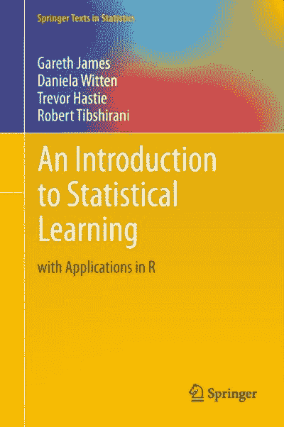
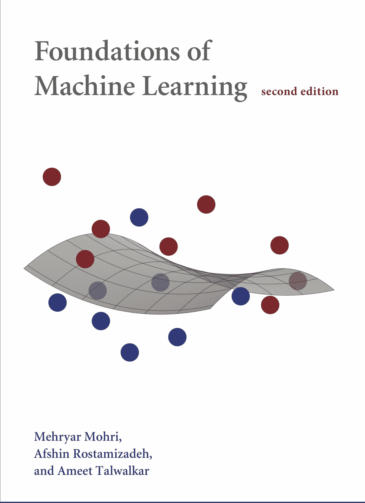
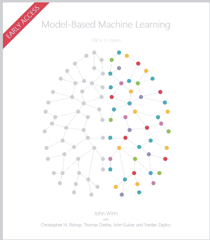

# 24 本最佳（且免费的）理解机器学习的书籍

> 原文：[`www.kdnuggets.com/2020/03/24-best-free-books-understand-machine-learning.html`](https://www.kdnuggets.com/2020/03/24-best-free-books-understand-machine-learning.html)

图片由编辑提供

> * * *
> 
> ## 我们的前三名课程推荐
> ## 
>  1. [谷歌网络安全证书](https://www.kdnuggets.com/google-cybersecurity) - 快速进入网络安全职业的快车道。
> 
>  2. [谷歌数据分析专业证书](https://www.kdnuggets.com/google-data-analytics) - 提升你的数据分析技能
> 
>  3. [谷歌 IT 支持专业证书](https://www.kdnuggets.com/google-itsupport) - 支持你的组织 IT
> 
> * * *
> 
> “*我们想要的是一台能够从经验中学习的机器*“
> 
> 艾伦·图灵

毋庸置疑，机器学习已经成为当今最受欢迎的话题之一。根据一项[研究](http://blog.indeed.com/2019/03/14/best-jobs-2019/)，机器学习工程师被评选为 2019 年美国最佳职业之一。

看着这个趋势，我们编制了一份最佳（且免费的）机器学习书籍的列表，这些书籍对每一个希望在这个领域建立职业的人都会有帮助。

享受吧！

# 1. ISLR

**书籍链接**: [ISLR](http://faculty.marshall.usc.edu/gareth-james/ISL/)

最佳的机器学习理论入门书籍。即使是付费书籍也很少有比这本更好的。这本书对数学有很好的介绍，同时还有 R 语言的练习材料。对这本书赞不绝口。

# 2. 神经网络与深度学习

**书籍链接**: [神经网络与深度学习](http://neuralnetworksanddeeplearning.com/)

这本免费的在线书籍是对深度学习的最佳和最快的入门之一。阅读它只需几天时间，就能让你掌握深度学习的所有基础知识。

# 3. 模式识别与机器学习

**书籍链接**: [模式识别与机器学习](https://www.microsoft.com/en-us/research/publication/pattern-recognition-machine-learning/)

这是一本最著名的理论机器学习书籍之一，因此你不需要写太多的介绍。

# 4. 深度学习书籍

**书籍链接**: [深度学习书籍](https://www.deeplearningbook.org/)

深度学习的圣经，这本书是对深度学习算法和方法的介绍，既适合初学者，也适合从业者。

# 5. 理解机器学习：从理论到算法

**书籍链接**: [理解机器学习：从理论到算法](https://www.cse.huji.ac.il/~shais/UnderstandingMachineLearning/understanding-machine-learning-theory-algorithms.pdf)

这是一本关于机器学习理论的非常好的著作。

# 6. 成功的七个步骤：机器学习实践

**书籍链接**: [成功的七个步骤：机器学习实践](https://daoudclarke.github.io/guide.pdf)

非技术性的产品经理和非机器学习软件工程师进入该领域时不应错过这个教程。写得非常好（略显陈旧，不涵盖深度学习，但适用于所有实际目的）。

# 7. 机器学习规则：机器学习工程最佳实践

**书籍链接**: [机器学习规则：机器学习工程最佳实践](http://martin.zinkevich.org/rules_of_ml/rules_of_ml.pdf)

想知道谷歌如何看待其机器学习产品吗？这是一个很好的机器学习产品管理教程。

# 8. 工程师的机器学习简要介绍

**书籍链接**: [工程师的机器学习简要介绍](https://arxiv.org/abs/1709.02840)

这是一篇几乎涵盖所有机器学习技术的独白。数学更容易理解（对于害怕复杂数学符号的人来说）。

# 9. 无深度学习的机器学习简要介绍

**书籍链接**: [无深度学习的机器学习简要介绍](https://docs.google.com/document/d/1Rp6sf129T0j1isIQByyUeby4fwKgwTyiVleNwX7JGmg/edit)

这是一篇几乎涵盖所有机器学习技术的独白。数学更容易理解（对于害怕复杂数学符号的人来说）。

# 10. 机器学习入门笔记

**书籍链接**: [机器学习入门笔记](http://lcsl.mit.edu/courses/ml/1718/MLNotes.pdf)

绝对初学者的机器学习指南。

# 11. 机器学习基础

**书籍链接**: [机器学习基础](https://cs.nyu.edu/~mohri/mlbook/)

这是一本详细论述机器学习数学概念的著作。

# 12. [变量和特征选择简介](https://dl.acm.org/doi/10.5555/944919.944968)

**书籍链接**: [变量和特征选择简介](https://dl.acm.org/doi/10.5555/944919.944968)

特征工程和变量选择可能是传统机器学习算法中最重要的人为输入。（在深度学习方法中不那么重要，但并非所有问题都能通过深度学习解决）。本教程介绍了不同的特征工程方法。

# 13. AutoML 书籍 – Frank Hutter, Lars Kotthoff, Joaquin Vanschoren

**书籍链接**: [AutoML 书籍 – Frank Hutter, Lars Kotthoff, Joaquin Vanschoren](https://www.automl.org/book/)

近年来，传统机器学习几乎已经简化为在完成特征工程后运行 AutoML 模型（例如 h2o、auto sklearn 或 tpot，我们在 ParallelDots 的最爱）。实际上，还有一些方法可以进行自动化的非领域特定特征工程。这本书涵盖了 AutoML 中使用的方法。

# 14. 深度学习与 Pytorch

**书籍链接**: [Deep Learning with Pytorch](https://pytorch.org/deep-learning-with-pytorch)

一本免费的书，帮助你使用 PyTorch 学习深度学习。PyTorch 是我们在 ParallelDots 最喜欢的深度学习库，我们推荐给所有从事应用研究/开发深度学习的人。

# 15. 深入深度学习

**书籍链接**: [Dive Into Deep Learning](http://d2l.ai/)

另一本详细介绍深度学习的书籍，使用亚马逊的 MXNet 库来教授深度学习。

# 16. Keras Github 笔记

**书籍链接**: [Keras Github 笔记](https://github.com/fchollet/deep-learning-with-python-notebooks)

François Chollet 是 Keras 库的负责人。他的书《Python 中的深度学习》旨在教授 Keras 中的深度学习，评价非常高。虽然书籍本身不能免费获得，但所有代码以笔记本形式在 Github 上提供（形成了一个包含深度学习示例的书），是一个很好的资源。我在几年前学习 Keras 时读过这本书，非常好的资源。

# 17. 基于模型的机器学习

**书籍链接**: [Model-based Machine Learning](http://mbmlbook.com/)

在贝叶斯机器学习领域的一个优秀资源。使用微软的 Infer.Net 库进行教学，因此你可能需要安装 IronPython 来阅读/实现书中的示例。

# 18. 机器学习的贝叶斯模型

**书籍链接**: [Bayesian Models for Machine Learning](http://www.columbia.edu/~jwp2128/Teaching/E6720/BayesianModelsMachineLearning2016.pdf)

另一本详细介绍各种贝叶斯方法在机器学习中的书籍。

# 19. 艾森斯坦 NLP 笔记

**书籍链接**: [艾森斯坦 NLP 笔记](https://github.com/jacobeisenstein/gt-nlp-class/blob/master/notes/eisenstein-nlp-notes.pdf)

自然语言处理是机器学习中最受欢迎的应用。这些来自 GATech 课程的笔记提供了机器学习如何用来解释人类语言的很好的概述。

# 20. 强化学习 – Sutton 和 Barto

**书籍链接**: [Reinforcement Learning – Sutton and Barto](http://www.incompleteideas.net/book/the-book-2nd.html)

强化学习的圣经。这是任何进入强化学习领域的人必读的书籍。

# 21. 高斯过程用于机器学习

**书籍链接**: [Gaussian Processes for Machine Learning](http://www.gaussianprocess.org/gpml/)

使用贝叶斯优化和高斯过程进行机器学习的教学。利用像 Edward/GpyTorch/BOTorch 等基于变分推断的库，这种方法正在复兴。

# 22. 机器学习面试 机器学习系统设计 Chip Huyen

**书籍链接**: [Machine Learning Interviews Machine Learning Systems Design Chip Huyen](https://github.com/chiphuyen/machine-learning-systems-design)

参加机器学习工作的面试？这些问题可能有助于你在回答机器学习系统问题时确定策略。

# 23. 机器学习的算法方面

**书籍链接**： [机器学习的算法方面](https://people.csail.mit.edu/moitra/docs/bookex.pdf)

这本书涉及机器学习中的计算算法和数值方法，例如因式分解模型、字典学习和高斯模型。

# 24. 机器学习中的因果关系

**书籍链接**： [机器学习中的因果关系](https://arxiv.org/abs/1911.10500)

随着因果关系在数据科学领域的逐步渗透，机器学习也不例外。虽然目前没有详细的相关材料，这里有一个简短的教程试图解释因果关系在机器学习中的关键概念。

觉得博客有用吗？阅读我们的其他[博客](https://blog.paralleldots.com/data-science/50-must-read-free-books-for-every-data-science-enthusiast/)，了解所有帮助你在数据科学领域取得成功的最佳书籍。

[原始链接](https://blog.paralleldots.com/data-science/24-best-and-free-books-to-understand-machine-learning/)。经许可转载。

### 更多相关内容

+   [挑选示例以理解机器学习模型](https://www.kdnuggets.com/2022/11/picking-examples-understand-machine-learning-model.html)

+   [15 本免费机器学习和深度学习书籍](https://www.kdnuggets.com/2022/10/15-free-machine-learning-deep-learning-books.html)

+   [KDnuggets 新闻，11 月 2 日：数据科学的现状…](https://www.kdnuggets.com/2022/n43.html)

+   [15 本免费机器学习和深度学习书籍](https://www.kdnuggets.com/2022/11/15-free-machine-learning-deep-learning-books.html)

+   [图形：理解数据的自然方式](https://www.kdnuggets.com/2022/10/manning-graphs-natural-way-understand-data.html)

+   [使用 SQL 理解数据科学职业趋势](https://www.kdnuggets.com/using-sql-to-understand-data-science-career-trends)
