# 你可能会在下次面试中遇到的 24 道 SQL 问题

> 原文：[`www.kdnuggets.com/2022/06/24-sql-questions-might-see-next-interview.html`](https://www.kdnuggets.com/2022/06/24-sql-questions-might-see-next-interview.html)


当谈到最常出现在工作面试中的 [SQL 面试题](https://www.stratascratch.com/blog/sql-interview-questions-you-must-prepare-the-ultimate-guide/?utm_source=blog&utm_medium=click&utm_campaign=kdnuggets)时，我并不是说给你具体的问题。这将是一个不可能完成的任务，因为问题的数量成千上万。

* * *

## 我们的前三大课程推荐

 1\. [Google 网络安全证书](https://www.kdnuggets.com/google-cybersecurity) - 快速进入网络安全职业生涯。

 2\. [Google 数据分析专业证书](https://www.kdnuggets.com/google-data-analytics) - 提升你的数据分析技能

 3\. [Google IT 支持专业证书](https://www.kdnuggets.com/google-itsupport) - 支持你的组织的 IT

* * *

幸运的是，这些问题测试的 SQL 概念并不多。这并不意味着你只需要解决我即将展示的面试题或仅了解选定的主题。

如果你专注于最常见的主题，你将有可能覆盖面试中测试的大部分概念。当然，问题的难度可能有所不同，这将需要对某一特定主题有更多或更少的了解。不过，这些概念通常是相同的。

尽管这些主题可以被视为宏伟的（特别是如果你是 SQL 爱好者的话！），我更愿意称它们为“不可避免的七个”：

1.  汇总、分组和排序

1.  过滤

1.  JOINs 和集合运算符

1.  子查询与 CTEs

1.  CASE 语句

1.  窗口函数

1.  文本与日期操作

这些主题通常在编码 SQL 问题中测试，但也可能出现在非编码类型的问题中。

# 编写 SQL 面试题

编程题正如其名：它们测试你使用 SQL 概念编写代码的能力。

# 1\. 汇总、分组和排序

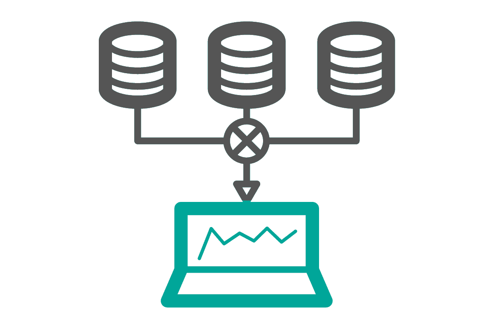

## 理论

[SQL 聚合函数](https://www.stratascratch.com/blog/the-ultimate-guide-to-sql-aggregate-functions/?utm_source=blog&utm_medium=click&utm_campaign=kdnuggets)是对多行进行计算并返回一个值的函数。最常用的聚合函数包括：

| **聚合函数** | **描述** |
| --- | --- |
| COUNT() | 计算行数。 |
| SUM() | 返回行的总和。 |
| AVG() | 计算行值的平均值。 |
| MIN() | 返回最小值。 |
| MAX() | 返回最高值。 |

单独使用时，这些函数只会返回一个值。诚然，这并不十分复杂。

当与 GROUP BY 和 ORDER BY 子句一起使用时，汇总函数对数据科学家来说更有价值。

GROUP BY 用于根据行的值将来自一个或多个列的数据分组。每个不同的值（或按多个列分组的值组合）将形成一个单独的数据组。这样就可以显示正在汇总的数据的附加信息。

ORDER BY 用于对查询的输出进行排序。数据可以按升序或降序排序。此外，你可以按一个或多个列进行排序。

与这两个子句一起使用时，汇总函数成为创建报告、计算指标和整理数据的垫脚石。它们允许你对数据进行数学运算，并以清晰和可展示的方式展示你的发现。

## SQL 问题

### SQL 面试题 #1：查找更新的记录

> *“我们有一个包含员工及其工资的表格，但其中一些记录是旧的，包含过时的工资信息。找出每位员工的当前工资，假设工资每年都在增长。输出他们的 ID、名字、姓氏、部门 ID 和当前工资。按员工 ID 升序排序你的列表。”*

问题链接：[`platform.stratascratch.com/coding/10299-finding-updated-records?code_type=1`](https://platform.stratascratch.com/coding/10299-finding-updated-records?code_type=1&utm_source=blog&utm_medium=click&utm_campaign=kdnuggets)

**数据**

这个问题给你一个表：ms_employee_salary

| id | int |
| --- | --- |
| first_name | varchar |
| last_name | varchar |
| salary | varchar |
| department_id | int |

下方给出了表格的数据样本。

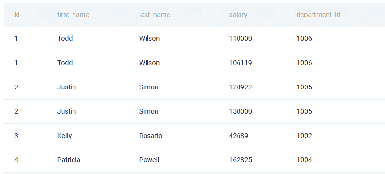

**解决方案方法**

如果工资每年都在增长，那么最新的工资也是最高工资。要获取它，请使用 MAX() 汇总函数。按员工和部门分组数据。你还应按员工 ID 以升序排序输出；为此使用 ORDER BY 子句。

```py
SELECT id,

      first_name,

      last_name,

      department_id,

      max(salary)

FROM ms_employee_salary

GROUP BY id,

        first_name,

        last_name,

        department_id

ORDER BY id ASC;
```

**输出**

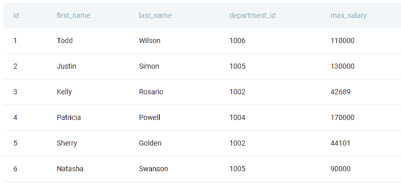

### SQL 面试题 #2：按国家首次参加奥运会的年份排序

> *“找出每小时的平均行驶距离。”*
> 
> *输出小时及相应的平均行驶距离。*
> 
> *按小时升序排列记录。*

问题链接：[`platform.stratascratch.com/coding/10006-find-the-average-distance-traveled-in-each-hour?code_type=1`](https://platform.stratascratch.com/coding/10006-find-the-average-distance-traveled-in-each-hour?code_type=1&utm_source=blog&utm_medium=click&utm_campaign=kdnuggets)

要查找平均距离，请使用 AVG() 函数，然后按小时列对输出进行分组和排序。

如果你写出正确的解决方案，你将会得到这个结果。

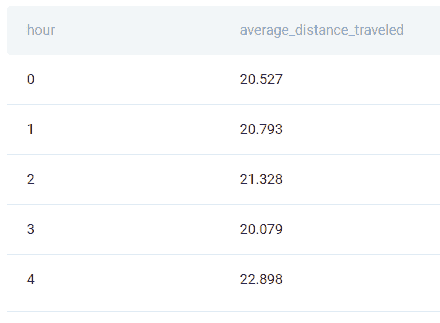

### SQL 面试问题 #3：按各国首次参加奥运会的年份排序

> *“按各国首次参加奥运会的年份排序。”*
> 
> *输出国家奥林匹克委员会（NOC）名称以及所需年份。*
> 
> *按年份和 NOC 升序排序记录。*

问题链接：[`platform.stratascratch.com/coding/10184-order-all-countries-by-the-year-they-first-participated-in-the-olympics?code_type=1`](https://platform.stratascratch.com/coding/10184-order-all-countries-by-the-year-they-first-participated-in-the-olympics?code_type=1&utm_source=blog&utm_medium=click&utm_campaign=kdnuggets)

代码需要按列 noc 对数据进行分组，并使用 MIN() 聚合函数找到首次参与的年份。为了适当地排序输出，使用 ORDER BY。

如果你得到这个结果，那么你做对了一切。

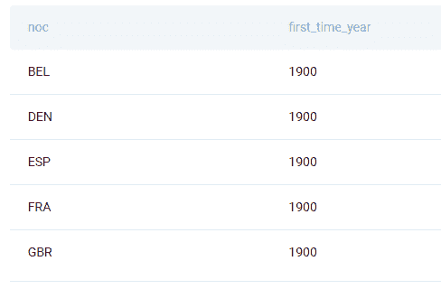

# 2\. 筛选


## 理论

如果将数据筛选定义为选择数据的一个子集，那么数据筛选有许多种方式。即使是那些人们通常不会认为是筛选的方式，例如 SELECT 语句和 JOINs，但它们也是筛选的一部分；它们仅选择数据的一部分。

在考虑数据筛选时，通常会想到两个关键字（或者在使用 PostgreSQL 时是三个）：

+   WHERE

+   HAVING

+   (LIMIT)

WHERE 子句的目的是在数据汇总之前进行筛选。语法上，这意味着它必须在 GROUP BY 子句之前书写。

在使用 WHERE 子句进行数据筛选时，有许多运算符可以使用。

| **运算符** | **描述** |
| --- | --- |
| = | 等于 |
| < | 小于 |
| > | 大于 |
| <= | 小于或等于 |
| >= | 大于或等于 |
| <> | 不等于 |
| BETWEEN | 在指定范围之间 |
| LIKE | 寻找模式 |
| IN | 等于括号中列出的值 |

HAVING 子句与 WHERE 子句做的事情相同，只是它在聚合之后筛选数据。自然地，它只能在 SQL 查询中的 GROUP BY 子句之后使用。

WHERE 子句中的所有运算符在 HAVING 子句中也允许使用。

两个子句都允许通过使用 AND/OR 逻辑运算符在一个或多个条件上进行筛选。

使用这两个子句为你的计算增加了另一个维度。基本用法使你能够只显示你感兴趣的数据，而不是大部分数据。这意味着你不仅可以选择你想要的列，还可以选择你想要的行，基于它们的值。与聚合函数一起使用，你可以通过过滤输入数据，甚至是其输出，来对更详细的数据子集进行计算。这增加了你计算的复杂性。

以下是 [WHERE](https://towardsdatascience.com/data-science-lesson-3-filtering-data-using-sql-45d90986487f) 和 [HAVING](https://www.sqlservertutorial.net/sql-server-basics/sql-server-having/) 工作的示例。

[LIMIT 子句](https://www.geeksforgeeks.org/sql-limit-clause/#:~:text=The%20LIMIT%20clause%20is%20used,be%20a%20non-negative%20integer.) 简单地指定了你希望看到的输出行数。子句中的整数值等于作为结果显示的行数。这在你想要对数据进行排名时特别有用，例如，显示前 N 名销售、员工、薪资等。

## SQL 问题

### SQL 面试题 #4：找出 Uber 通过名人获得超过 2000 名客户的年份

> *“找出 Uber 通过名人广告获得超过 2000 名客户的年份。”*

问题链接：[`platform.stratascratch.com/coding/10000-find-the-year-that-uber-acquired-more-than-2000-customers-through-celebrities?code_type=1`](https://platform.stratascratch.com/coding/10000-find-the-year-that-uber-acquired-more-than-2000-customers-through-celebrities?code_type=1&utm_source=blog&utm_medium=click&utm_campaign=kdnuggets)

**数据**

表格 uber_advertising 有四列。

| year | int |
| --- | --- |
| advertising_channel | varchar |
| money_spent | int |
| customers_acquired | int |

这是表格预览。

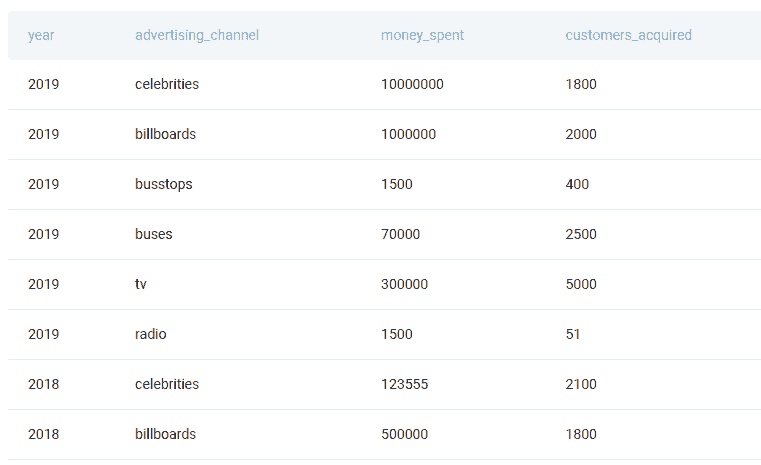

**解决方案方法**

解决方案是一个简单的 SELECT 语句，包含一个列。然而，你不需要所有的年份。问题要求你只输出那些广告渠道是通过名人，并且获得了超过 2000 名客户的年份。为此，将这两个条件放入 WHERE 子句中。

```py
SELECT year

FROM uber_advertising

WHERE advertising_channel = 'celebrities' AND

customers_acquired > 2000;
```

**输出**


运行代码，它将只输出一个满足条件的年份：2018。

### SQL 面试题 #5：找出所有最低和最高检查评分不同的企业

> *“找出所有最低和最高检查评分不同的企业。”*
> 
> *输出每个企业的对应企业名称和最低及最高评分。*
> 
> *按企业名称升序排列结果。”*

问题链接：[`platform.stratascratch.com/coding/9731-find-all-businesses-whose-lowest-and-highest-inspection-scores-are-different?code_type=1`](https://platform.stratascratch.com/coding/9731-find-all-businesses-whose-lowest-and-highest-inspection-scores-are-different?code_type=1&utm_source=blog&utm_medium=click&utm_campaign=kdnuggets)

要回答这个问题，使用 MIN()和 MAX()函数来找出最高和最低的检查分数，并按企业分组数据。然后使用 HAVING 子句仅显示最高分数和最低分数不相等的企业。最后，按企业名称字母顺序对结果进行排序。

你的输出应该是这样的。

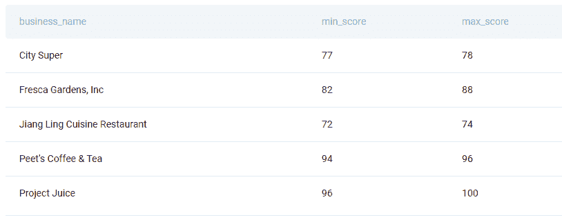

### SQL 面试问题#6：找到最高加班工资率的前三份工作

> “找到加班工资率最高的前三份工作。
> 
> 输出所选记录的职位名称。
> 
> 按加班工资降序排列记录。”

问题链接：[`platform.stratascratch.com/coding/9988-find-the-top-3-jobs-with-the-highest-overtime-pay-rate?code_type=1`](https://platform.stratascratch.com/coding/9988-find-the-top-3-jobs-with-the-highest-overtime-pay-rate?code_type=1&utm_source=blog&utm_medium=click&utm_campaign=kdnuggets)

这个问题要求你同时使用 WHERE 和 LIMIT 子句。使用 WHERE 来查找加班工资不是 NULL 且不为 0 的职位。按加班工资从高到低排序数据。然后，只需将输出限制为前三行，这样就得到了：加班工资率最高的前三份工作。

从结果中可以看出，只有三份这样的工作。

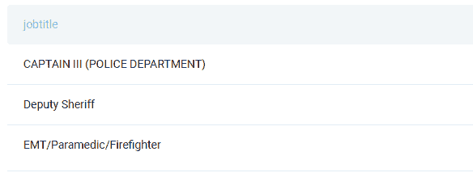

# 3\. JOINs & 集合运算符


## 理论

到目前为止，你被限制只使用一个表。不幸的是，没有一个值得尊敬的数据库只由一个表组成。为了充分利用可用数据，你需要知道如何结合两个或更多表的数据。

JOIN 是你寻找的 SQL 功能：它使得在公共列上连接表成为可能。

SQL 中有五种不同的 JOIN 类型。

| **JOIN 类型** | **描述** |
| --- | --- |
| (INNER) JOIN | 仅返回两个表中的匹配行。 |
| LEFT (OUTER) JOIN | 返回左表中的所有数据和右表中的匹配行。 |
| RIGHT (OUTER) JOIN | 返回右表中的所有数据和左表中的匹配行。 |
| FULL OUTER JOIN | 返回两个表中的所有行。 |
| CROSS JOIN | 将一个表中的所有行与第二个表中的每一行组合。 |

当我提到匹配行时，我指的是两个表中相同的行或值。

[前四种连接](https://learnsql.com/blog/sql-joins-types-explained/) 最常使用，但 [CROSS JOIN](https://www.sqlshack.com/sql-cross-join-with-examples/) 有时也可以使用。

另一种连接表格的方法是自连接。这不是一种独特的连接类型：任何 JOIN 类型都可以用于自连接，这意味着你将表格与自身连接。

[集合运算符](https://towardsdatascience.com/how-to-use-set-operations-in-sql-53d57c4f7b77) 用于合并两个或多个查询的输出。

| **集合运算符** | **描述** |
| --- | --- |
| UNION | 合并查询结果中的唯一行。 |
| UNION ALL | 合并查询结果中的所有行，包括重复的行。 |
| INTERSECT | 仅返回两个查询输出中都出现的行。 |
| EXCEPT | 返回一个查询中的唯一行，以及仅出现在第二个查询输出中的行。 |

## SQL 问题

### SQL 面试题 #7：昂贵的项目

> *“给定一个列出项目及每个项目关联的员工的列表，根据每位员工分配的项目预算进行计算。输出应包括项目标题和每位员工的项目预算（四舍五入到最接近的整数）。按每位员工预算最高的项目排序。”*

问题链接：[`platform.stratascratch.com/coding/10301-expensive-projects?code_type=1`](https://platform.stratascratch.com/coding/10301-expensive-projects?code_type=1&utm_source=blog&utm_medium=click&utm_campaign=kdnuggets)

**数据**

题目给出了两个表。

表格：ms_projects

| id | int |
| --- | --- |
| title | varchar |
| budget | int |

这是表格预览。

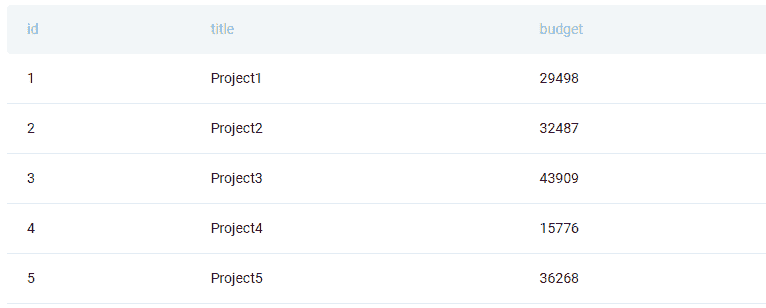

表格：ms_emp_projects

| emp_id | int |
| --- | --- |
| project_id | int |

数据示例如下。

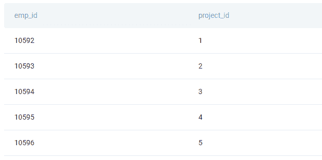

**解决方案方法**

首先需要按员工计算项目预算。这看起来比实际更复杂：只需将列预算除以员工数量，员工数量使用 COUNT()函数获取。然后，将结果转换为浮点数据类型以获得小数位数。这个计算是在 ROUND()函数内完成的，用于四舍五入数字。在这种情况下，除法结果被转换为数值数据类型，并四舍五入为没有小数位数。

SELECT 语句使用了两个表中的列。这是可能的，因为表在 FROM 子句中使用 INNER JOIN 连接。它们在列 id 等于列 project_id 的地方连接。

最终结果按项目和其预算分组，同时输出按比例降序排序。

```py
SELECT title AS project,

      ROUND((budget/COUNT(emp_id)::float)::numeric, 0) budget_emp_ratio

FROM ms_projects a

INNER JOIN ms_emp_projects b ON a.id = b.project_id

GROUP BY title,

        budget

ORDER BY budget_emp_ratio DESC;
```

**输出**

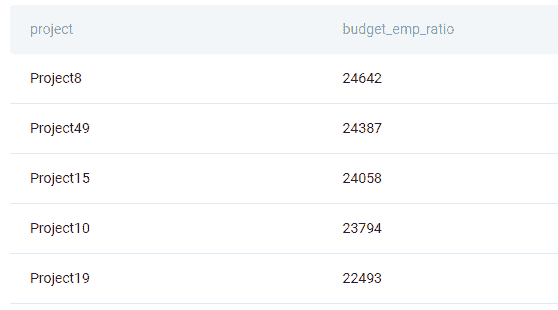

代码输出应如下所示，部分显示如下。

### SQL 面试题 #8：按国家找出讲西班牙语的人登录次数

> *“找出西班牙语用户按国家的登录次数。”*
> 
> *输出国家及其相应的登录次数。*
> 
> *按登录次数降序排列记录。*

问题链接: [`platform.stratascratch.com/coding/9889-find-how-many-logins-spanish-speakers-made-by-country?code_type=1`](https://platform.stratascratch.com/coding/9889-find-how-many-logins-spanish-speakers-made-by-country?code_type=1&utm_source=blog&utm_medium=click&utm_campaign=kdnuggets)

在解决方案中，使用 COUNT()函数计算登录次数。由于所需数据在两个表中，因此需要将它们联接。为此使用 INNER JOIN。根据列 user_id 和事件为‘login’，而用户语言为‘spanish’来联接表格。按位置对数据进行分组，并按登录次数从高到低排序。

正确的代码将返回三个国家的登录次数如下。

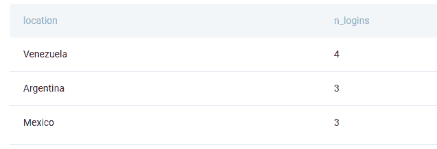

### SQL 面试问题 #9: 数字之和

> *“找出索引小于 5 的数字之和，以及索引大于 5 的数字之和。将每个结果单独输出一行。”*

问题链接: [`platform.stratascratch.com/coding/10008-sum-of-numbers?code_type=1`](https://platform.stratascratch.com/coding/10008-sum-of-numbers?code_type=1&utm_source=blog&utm_medium=click&utm_campaign=kdnuggets)

你需要编写的代码包括两个 SELECT 语句。一个将找出索引小于 5 的数字之和，另一个将对索引大于 5 的数字做同样的处理。

你所要做的就是在这两个语句之间放置 UNION ALL 来获得输出。

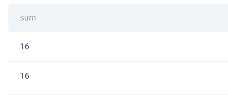

# 4\. 子查询与 CTE


## 理论

子查询和 CTE 为您的代码提供了灵活性。它们都用于更复杂的多步骤计算，其结果用于主要计算。

有特定的关键字可以使用[子查询](https://www.w3resource.com/sql/subqueries/understanding-sql-subqueries.php)。

+   SELECT

+   FROM

+   WHERE

+   HAVING

+   INSERT

+   UPDATE

+   DELETE

它们通常用于 WHERE 或 HAVING 子句中的数据过滤，但也可作为 FROM 子句中的表格，当查询结果作为表格时。一般而言，它们允许在一个查询中执行复杂计算。

对于 CTE（公共表表达式），它们的目的相同。不同之处在于，它们更接近人类逻辑的计算步骤，因此使代码更加整洁。通常，CTE 所需的代码更少，且比相同计算的子查询更具可读性。

CTE 的主要部分有两个：一个 CTE 和一个引用 CTE 的查询。

一般的 CTE 语法是：

```py
WITH cte_name AS (

SELECT…cte_definition..

) 
SELECT …

FROM cte_name;
```

CTE 是通过 WITH 关键字调用的。在给出 CTE 名称后，接着是 AS，然后是括号中的 CTE 定义。这个定义是一个 SELECT 语句，用于给 CTE 提供指令。

主查询再次是一个 SELECT 语句，但这次引用了 CTE。

他们在名称中包含单词表的原因是：CTE 是一个临时结果，只能在运行 CTE 时访问，所以它类似于一个临时表。这就是为什么你可以像使用其他表一样在 FROM 子句中使用它。

## SQL 问题

### SQL 面试问题 #10：按职称和性别计算收入

> *“根据员工职称和性别计算平均总薪酬。总薪酬通过将每个员工的薪水和奖金相加来计算。然而，并不是所有员工都会收到奖金，所以在计算时忽略没有奖金的员工。一个员工可以获得多个奖金。”*
> 
> *“输出员工职称、性别（即，sex），以及平均总薪酬。”*

链接到问题：[`platform.stratascratch.com/coding/10077-income-by-title-and-gender?code_type=1`](https://platform.stratascratch.com/coding/10077-income-by-title-and-gender?code_type=1&utm_source=blog&utm_medium=click&utm_campaign=kdnuggets)

**数据**

问题中使用的第一个表是 sf_employee。

表：sf_employee

| id | int |
| --- | --- |
| first_name | varchar |
| last_name | varchar |
| age | int |
| sex | varchar |
| employee_title | varchar |
| department | varchar |
| salary | int |
| target | int |
| email | varchar |
| city | varchar |
| address | varchar |
| manager_id | int |

表中的数据如下所示。

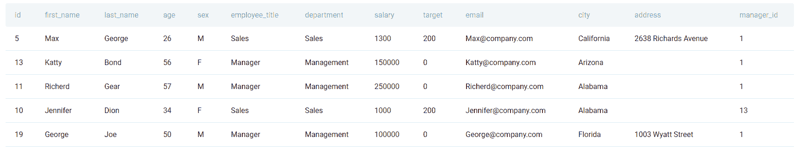

表：sf_bonus

| worker_ref_id | int |
| --- | --- |
| bonus | int |
| bonus_date | datetime |

这是数据。

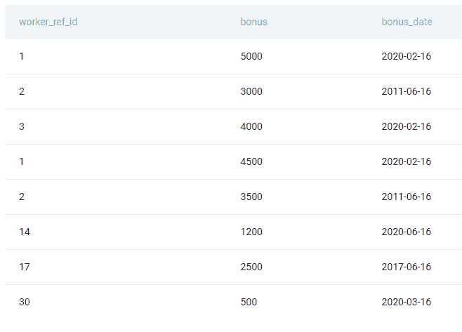

**解决方案方法**

此代码中的主 SELECT 语句使用表 sf_employee 和子查询数据。子查询通过 SUM() 函数计算员工的总奖金；这就是它还按员工 ID 分组数据的原因。子查询像其他表一样与表 sf_employee 连接。在这种情况下，使用的是 INNER JOIN。

主查询将使用子查询的数据来计算平均总薪酬，包括薪水和获得的总奖金。

最终，结果按员工和性别分组。

```py
SELECT e.employee_title,

      e.sex,

      AVG(e.salary + b.ttl_bonus) AS avg_compensation

FROM sf_employee e

INNER JOIN

 (SELECT worker_ref_id,

         SUM(bonus) AS ttl_bonus

  FROM sf_bonus

  GROUP BY worker_ref_id) b ON e.id = b.worker_ref_id

GROUP BY employee_title,

        Sex;
```

**输出**

解决方案将返回四行结果。

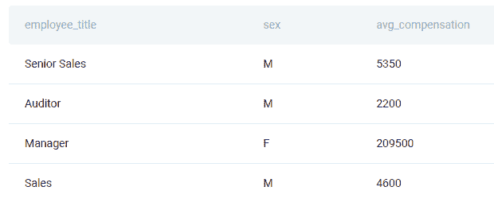

### SQL 面试问题 #11：提供真实床和互联网的最便宜的邻里

> *“寻找在别墅中能睡在真正的床上且提供互联网的最低价格的邻里。”*

问题链接: [`platform.stratascratch.com/coding/9636-cheapest-neighborhoods-with-real-beds-and-internet?code_type=1`](https://platform.stratascratch.com/coding/9636-cheapest-neighborhoods-with-real-beds-and-internet?code_type=1&utm_source=blog&utm_medium=click&utm_campaign=kdnuggets)

为了解决这个问题，使用 WHERE 子句中的子查询来获取满足特定标准的价格。使用 MIN() 函数找出具有互联网的别墅中真实床的最低价格。对两个条件使用等号，对条件两侧使用 ILIKE 和通配符字符（%）。

然后在主查询中使用相同的标准（真实床、别墅、互联网）。

有一个邻里符合这些标准。

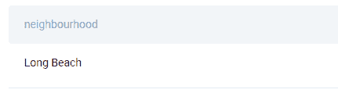

### SQL 面试题 #12: 广告渠道效果

> *“找出 2017 年至 2018 年（含）每个广告渠道的平均效果。效果计算为总花费与获得的总客户数之比。”*
> 
> *“输出广告渠道及其对应的平均效果。按平均效果升序排序记录。”*

问题链接: [`platform.stratascratch.com/coding/10012-advertising-channel-effectiveness?code_type=1`](https://platform.stratascratch.com/coding/10012-advertising-channel-effectiveness?code_type=1&utm_source=blog&utm_medium=click&utm_campaign=kdnuggets)

每个 CTE 都以关键字 WITH 开始，之后是 CTE 的名称。接着是 AS，在括号中定义 CTE 的主体，即 SELECT 语句，你将在外部查询中调用它。

你应该在这个示例中使用 CTE 来汇总花费和获得的客户数。你为 2017 年和 2018 年执行这些操作，通过在 WHERE 子句中设置这个条件。

在外部查询中，选择广告渠道，然后将总花费除以获得的总客户数，这将给出平均效果。

按效果升序排序输出结果。

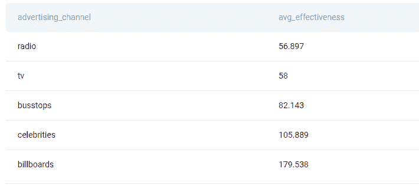

# 5. CASE 语句


## 理论

这是一个条件语句，是 SQL 版本的 IF-THEN-ELSE 逻辑。它指示代码通过一组条件来确定应返回的结果，具体取决于数据是否满足条件。

CASE 语句的语法是：

```py
CASE

 WHEN condition

THEN result

 ELSE result

END AS case_stetement_alias;
```

它还允许设置多个条件，而不仅仅是一个。

[CASE 语句](https://mode.com/sql-tutorial/sql-case/) 最常用于标记数据或与聚合函数一起使用，当计算是基于特定标准进行时。

## SQL 问题

### SQL 面试题 #13: 预订与非预订

> *“显示用户进行搜索的平均次数，其中导致成功预订和未导致预订的平均次数。输出应具有名为 action 的列，值为 'does not book' 和 'books'，以及名为 average_searches 的第二列，表示每个动作的平均搜索次数。考虑到如果预订日期为空则认为没有发生预订。请注意，搜索仅在入住日期匹配时与预订相关。”*

问题链接：[`platform.stratascratch.com/coding/10124-bookings-vs-non-bookings?code_type=1`](https://platform.stratascratch.com/coding/10124-bookings-vs-non-bookings?code_type=1&utm_source=blog&utm_medium=click&utm_campaign=kdnuggets)

**数据**

你需要使用问题提供的两个表。

表：airbnb_contacts

| id_guest | varchar |
| --- | --- |
| id_host | varchar |
| id_listing | varchar |
| ts_contact_at | datetime |
| ts_reply_at | datetime |
| ts_accepted_at | datetime |
| ts_booking_at | datetime |
| ds_checkin | datetime |
| ds_checkout | datetime |
| n_guests | int |
| n_messages | int |

这是数据预览。

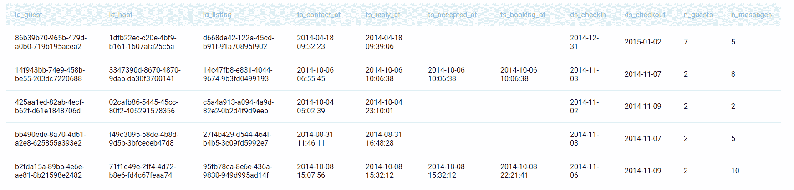

表：airbnb_searches

| ds | datetime |
| --- | --- |
| id_user | varchar |
| ds_checkin | datetime |
| ds_checkout | datetime |
| n_searches | int |
| n_nights | float |
| n_guests_min | int |
| n_guests_max | int |
| origin_country | varchar |
| filter_price_min | float |
| filter_price_max | float |
| filter_room_types | varchar |
| filter_neighborhoods | datetime |

表中的前几行如下所示。

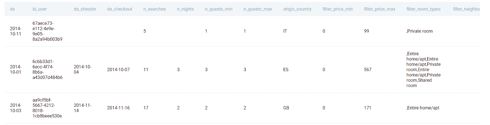

**解决方案方法**

解决方案在 SELECT 语句中使用 CASE 语句为数据标记。当列 ts_booking_at 中有非空值时，它将标记为“books”。如果为 NULL，则标记为“does not book”。这个 CASE 语句将其结果显示在新列 action 中。

此外，SELECT 语句中还有一个 AVG() 函数用于查找搜索的平均次数。

数据从两个表中使用 LEFT JOIN 提取。最终，输出按数据标签分组。

```py
SELECT CASE

          WHEN c.ts_booking_at IS NOT NULL THEN 'books'

          ELSE 'does not book'

      END AS action,

      AVG(n_searches) AS average_searches

FROM airbnb_searches s

LEFT JOIN airbnb_contacts c ON s.id_user = c.id_guest

AND s.ds_checkin = c.ds_checkin

GROUP BY 1;
```

**输出**

上述查询返回所需的输出。

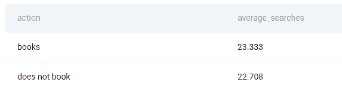

### SQL 面试问题 #14：Lyft 驾驶员的流失率

> *“找出所有年份 Lyft 驾驶员的全球流失率。将比率作为结果输出。”*

问题链接：[`platform.stratascratch.com/coding/10016-churn-rate-of-lyft-drivers?code_type=1`](https://platform.stratascratch.com/coding/10016-churn-rate-of-lyft-drivers?code_type=1&utm_source=blog&utm_medium=click&utm_campaign=kdnuggets)

这个问题要求你在聚合函数中使用 CASE 语句，具体来说是 COUNT()。用它来计算离开的司机，那些结束日期不为 NULL 的。将结果除以总司机数量，并将其转换为小数。

如果一切正确，你应该得到流失率。

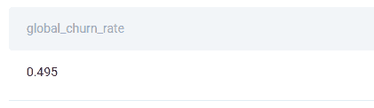

### SQL 面试问题 #15：找出获得奖金和未获得奖金的员工数量

> *“找出获得奖金和未获得奖金的员工数量。”*
> 
> *输出是否获得奖金的指示及相应的员工数量。*
> 
> *    例如：获得奖金为 1，未获得为 0。”*

问题链接：[`platform.stratascratch.com/coding/10081-find-the-number-of-employees-who-received-the-bonus-and-who-didnt?code_type=1`](https://platform.stratascratch.com/coding/10081-find-the-number-of-employees-who-received-the-bonus-and-who-didnt?code_type=1&utm_source=blog&utm_medium=click&utm_campaign=kdnuggets)

这个解决方案中有一个子查询。子查询使用 CASE 语句来确定获得奖金和未获得奖金的员工。依据奖金日期和是否值为 NULL 来完成。为此，你需要使用 LEFT JOIN 连接两个表。

主要查询将使用此结果来统计获得和未获得奖金的员工数量。

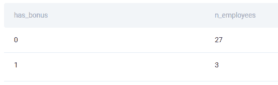

# 6\. 窗口函数

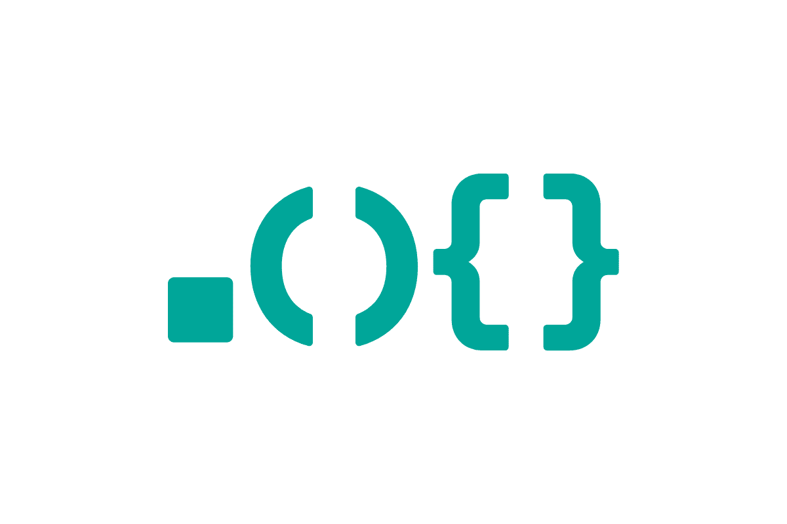

## 理论

[SQL 窗口函数](https://www.stratascratch.com/blog/the-ultimate-guide-to-sql-window-functions/) 类似于聚合函数。区别在于窗口函数以一种方式聚合数据，使得可以同时显示单独的行和聚合值。

通常，有三种不同类型的窗口函数：

+   聚合窗口函数

+   排名窗口函数

+   值窗口函数

| **聚合窗口函数** | **描述** |
| --- | --- |
| COUNT() | 计算行数。 |
| SUM() | 求和。 |
| AVG() | 返回平均值。 |
| MIN() | 返回最小值。 |
| MAX() | 返回最大值。 |
| **排名窗口函数** | **描述** |
| ROW_NUMBER() | 依次对行进行排名，不跳过行号，并对相同值的行赋予相同的排名。 |
| RANK() | 用于排名，相同的值会得到相同的排名，下一个排名会被跳过。 |
| DENSE_RANK() | 用于排名，相同的值会得到相同的排名，且下一个排名不会被跳过。 |
| PERCENT_RANK() | 以百分比值对值进行排名。 |
| NTILE() | 将行划分为若干个相等大小的组。 |
| **值窗口函数** | **描述** |
| LAG() | 允许访问定义数量的前置行数据。 |
| LEAD() | 允许访问从定义的行数之后的数据。 |
| FIRST_VALUE() | 返回数据中的第一个值。 |
| LAST_VALUE() | 返回数据中的最后一个值。 |
| NTH_VALUE() | 返回定义的（第 n）行的值。 |

窗口函数之所以叫做窗口函数，是有原因的。它们对与当前行相关的行进行计算。当前行和所有相关行称为窗口框架。

使用窗口函数时，有五个重要的子句。

+   OVER

+   PARTITION BY

+   ORDER BY

+   ROWS

+   RANGE

OVER 子句是强制的，其目的是调用窗口函数。没有它，就没有窗口函数。

PARTITION BY 用于对数据进行分区。通过指定其中的列，你在指示窗口函数应在哪个数据子集上执行计算。当省略 PARTITION BY 时，窗口函数将整个表作为数据集。

ORDER BY 子句也是一个可选子句。它指定了每个数据集内的逻辑顺序。换句话说，它不是用来排序输出的，而是用来设置窗口函数将如何工作的方向。数据可以按升序或降序排列。

在分区内，你还可以进一步限制将包含在窗口函数计算中的行。这被称为定义窗口框架。

ROWS 子句定义了当前行之前和之后的固定行数。

RANGE 做的是相同的事情，只不过不是基于行数，而是根据其与当前行的值进行比较。

窗口函数扩展了 SQL 的分析可能性。通过使用它们，你可以将聚合数据和非聚合数据并排显示，进行多级聚合，对数据进行排名，并进行其他仅用聚合函数无法完成的操作。

## SQL 问题

### SQL 面试题 #16：平均工资

> *“将每个员工的工资与相应部门的平均工资进行比较。”*
> 
> *输出部门、名字和员工的工资，并附上该部门的平均工资。*

链接到问题：[`platform.stratascratch.com/coding/9917-average-salaries?code_type=1`](https://platform.stratascratch.com/coding/9917-average-salaries?code_type=1&utm_source=blog&utm_medium=click&utm_campaign=kdnuggets)

**数据**

有一个名为 employee 的表。

| id | int |
| --- | --- |
| first_name | varchar |
| last_name | varchar |
| age | int |
| sex | varchar |
| employee_title | varchar |
| department | varchar |
| salary | int |
| target | int |
| bonus | int |
| email | varchar |
| city | varchar |
| address | varchar |
| manager_id | int |

这是员工数据。


**解决方案方法**

查询选择了部门、员工的名字和他们的薪资。第四列将计算 AVG()薪资。由于这是一个窗口函数，它必须使用 OVER()子句来调用。通过使用部门作为数据分区，查询将返回按部门划分的平均薪资，而不是整体薪资。

```py
SELECT department,

      first_name,

      salary,

      AVG(salary) OVER (PARTITION BY department)

FROM employee;
```

**输出**

这些只是完整输出的前五行。

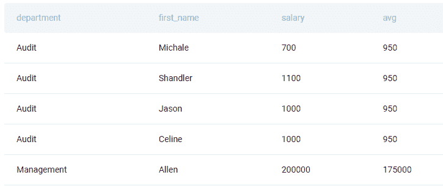

### SQL 面试题 #17：排名最活跃的宾客

> *“根据宾客与主持人交换消息的数量对宾客进行排名。与其他宾客消息数量相同的宾客应具有相同的排名。如果前面的排名相同，请不要跳过排名。*
> 
> *输出排名、宾客 ID 和他们发送的总消息数。按总消息数从高到低排序。”*

问题链接：[`platform.stratascratch.com/coding/10159-ranking-most-active-guests?code_type=1`](https://platform.stratascratch.com/coding/10159-ranking-most-active-guests?code_type=1&utm_source=blog&utm_medium=click&utm_campaign=kdnuggets)

在这里，你需要使用排名窗口函数，即 DENSE_RANK()函数。数据不会进行分区，但使用 ORDER BY 对消息总和进行排名，从高到低。此外，选择宾客 ID，并在窗口函数之外计算消息总和。

按宾客 ID 分组数据，并按消息数量从高到低排序。

你的输出应类似于此。

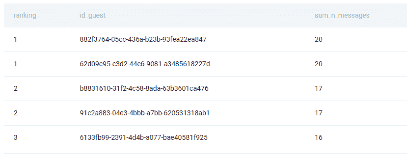

### SQL 面试题 #18：累计能耗

> *“计算 Meta/Facebook 数据中心在所有三个大洲的累计能耗（即累计总和）按日期。输出日期、累计能耗以及四舍五入到最接近的整数的累计百分比。”*

问题链接：[`platform.stratascratch.com/coding/10084-cum-sum-energy-consumption?code_type=1`](https://platform.stratascratch.com/coding/10084-cum-sum-energy-consumption?code_type=1&utm_source=blog&utm_medium=click&utm_campaign=kdnuggets)

这是一个难题，涵盖了我讨论的大部分主题。首先，你需要编写一个 CTE。使用它来编写三个 SELECT 语句，从每个表中选择所有数据，并使用 UNION ALL 将结果合并。

第二个 CTE 将使用第一个 CTE 中的数据，通过 SUM()聚合函数按日期获取总能耗。

外部查询使用第二个 CTE 中的数据如下所示。SUM()窗口函数通过将数据按日期从最旧到最新排序来计算累计总和。

然后将这个相同的窗口函数除以总能量消耗——你可以通过按日期汇总能量消耗来获得——并乘以 100 得到百分比。使用 ROUND() 函数将结果四舍五入到最接近的整数，即没有小数位。

就是它，能够让你从面试官那里获得分数的输出。

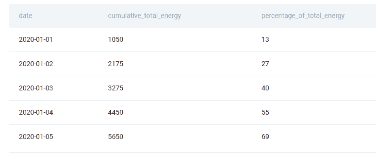

# 7\. 文本和日期处理


## 理论

数据科学家常常需要处理数据库中的文本和日期/时间，而不仅仅是数值。这通常意味着从多个字符串中创建一个字符串，或仅使用日期的某一部分（如日、月、年）或一个字符串。

最常用的 [文本处理函数](https://www.tutorialspoint.com/sql/sql-string-functions.htm)包括：

| **文本函数** | **描述** |
| --- | --- |
| &#124;&#124; 或 CONCAT() | 将多个字符串值连接成一个。  |
| CHAR_LENGTH() | 返回字符串中的字符数。 |
| LOWER() | 将字符串转换为全小写。  |
| UPPER() | 将字符串转换为全大写。 |
| SUBSTRING() | 返回字符串的部分。  |
| TRIM() | 删除字符串开头和结尾的空格或其他字符。  |
| LTRIM() | 删除字符串开头的空格或其他字符。  |
| RTRIM() | 删除字符串结尾的空格或其他字符。  |
| LEFT() | 从字符串开头返回定义的字符数。  |
| RIGHT() | 从字符串结尾返回定义的字符数。 |

两个最常用的 [日期/时间函数](https://www.postgresql.org/docs/8.1/functions-datetime.html)是：

| **日期/时间函数** | **描述** |
| --- | --- |
| EXTRACT() | 返回日期或时间的部分；SQL 标准。  |
| DATE_PART() | 返回日期或时间的部分；特定于 PostgreSQL。  |

文本和日期/时间函数在数据科学家清理数据时非常实用。当然，他们也可以使用日期/时间函数进行计算，例如添加或减去时间段，并用于数据过滤、聚合等。

## SQL 问题

### SQL 面试问题 #19: 待处理的索赔

> *“统计 2021 年 12 月提交的索赔中仍在待处理的数量。待处理的索赔是指没有接受或拒绝日期的索赔。”*

问题链接：[`platform.stratascratch.com/coding/2083-pending-claims?code_type=1`](https://platform.stratascratch.com/coding/2083-pending-claims?code_type=1&utm_source=blog&utm_medium=click&utm_campaign=kdnuggets)

**数据**

问题给出了表 cvs_claims。

| claim_id | int |
| --- | --- |
| account_id | varchar |
| date_submitted | datetime |
| date_accepted | datetime |
| date_rejected | datetime |

让自己熟悉数据。

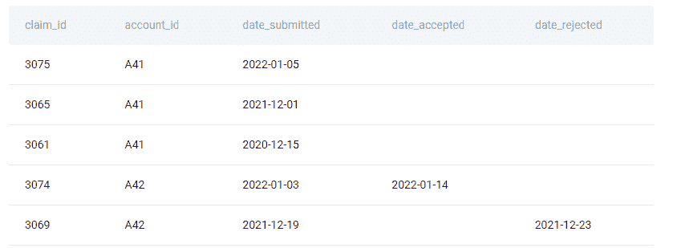

**解决方案方法**

COUNT() 函数用于获取索赔数量。你需要计数仅满足特定条件的索赔。通过 EXTRACT() 函数设置了两个条件。第一个用于从索赔提交日期中提取月份。另一个 EXTRACT() 函数将从同一列中获取年份。这样，你将获得 2021 年 12 月提交的索赔。

WHERE 子句中的接下来的两个条件将仅显示尚未接受或拒绝的索赔，即它们处于待处理状态。

```py
SELECT COUNT(*) AS n_claims

FROM cvs_claims

WHERE EXTRACT(MONTH

             FROM date_submitted) = 12

 AND EXTRACT(YEAR

             FROM date_submitted) = 2021

 AND date_accepted IS NULL

 AND date_rejected IS NULL;
```

**输出**

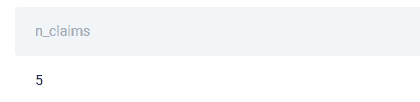

这个解决方案显示了 2021 年 12 月提交的五个待处理索赔。

### SQL 面试题 #20：高峰时段电话

> *“Redfin 帮助客户找到代理。每个客户将有一个唯一的 request_id，每个 request_id 有多个电话。对于每个 request_id，第一次电话是“初始电话”，所有后续电话都是“更新电话”。有多少客户在下午 3 点到 6 点之间（初始和更新电话合并）拨打了 3 次或更多次？”*

问题链接：[`platform.stratascratch.com/coding/2023-rush-hour-calls?code_type=1`](https://platform.stratascratch.com/coding/2023-rush-hour-calls?code_type=1&utm_source=blog&utm_medium=click&utm_campaign=kdnuggets)

这个解决方案使用了 DATE_PART() 函数，而不是 EXTRACT()。它在 FROM 子句中的子查询中进行。子查询显示客户，但不是所有客户。首先，数据通过 WHERE 子句和 DATE_PART() 进行过滤并转换为时间戳，以便子查询仅返回在 15 点到 17 点之间拨打电话的客户。

数据在分组后通过 HAVING 子句进行额外过滤。条件显示了在上述时间段内拨打三次或更多次的客户。

这个结果仅用于主查询中计算客户数量。

仅有一名客户在 15:00 到 17:00 之间拨打了三次或更多次。

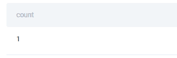

### SQL 面试题 #21：确定等级的规则

> *“找出用于确定每个等级的规则。以“Score > X AND Score <= Y => Grade = A”的格式在单独的列中显示规则，其中 X 和 Y 是等级的下限和上限。输出相应的等级及其最高和最低分数以及规则。根据等级按升序排列结果。”*

问题链接：[`platform.stratascratch.com/coding/9700-rules-to-determine-grades?code_type=1`](https://platform.stratascratch.com/coding/9700-rules-to-determine-grades?code_type=1&utm_source=blog&utm_medium=click&utm_campaign=kdnuggets)

SELECT 语句返回每个等级的最低和最高分数。最后一列用于通过连接函数标记规则。使用 MIN() 和 MAX() 函数来获取以下规则：

+   A 级：分数 > 89 且 <= 100

+   B 级：分数 > 79 且 <= 88

+   C 等级：得分 > 69 且 <= 79

当然，标签必须按要求格式化。

输出按等级分组和排序。

这里是规则。

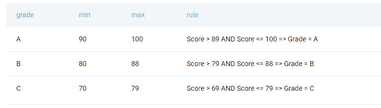

# SQL 理论面试问题

这些问题也测试 SQL 知识，与编码问题类似。不同之处在于它们不需要编写代码，但你必须解释 SQL 概念或它们之间的区别。

这里是一些这样的例子，所有问题都测试了我在编码问题部分提到的主题。

## SQL 面试问题#22：WHERE 和 HAVING

> *“WHERE 子句和 HAVING 子句在 SQL 中的主要区别是什么？”*

问题链接：[`platform.stratascratch.com/technical/2374-where-and-having`](https://platform.stratascratch.com/technical/2374-where-and-having?utm_source=blog&utm_medium=click&utm_campaign=kdnuggets)

WHERE 和 HAVING 都用于过滤数据。主要区别在于，WHERE 子句用于在聚合和 GROUP BY 之前过滤数据，而 HAVING 子句则在 GROUP BY 子句之后用于过滤已经聚合的数据。

## SQL 面试问题#23：左连接和右连接

> *“在 SQL 中，左连接和右连接有什么区别？”*

问题链接：[`platform.stratascratch.com/technical/2242-left-join-and-right-join`](https://platform.stratascratch.com/technical/2242-left-join-and-right-join?utm_source=blog&utm_medium=click&utm_campaign=kdnuggets)

你可以先解释这两种外连接的相似之处。然后你可以谈论它们的区别。提示：线索在于‘left’和‘right’。

## SQL 面试问题#24：公共表表达式

> *“在 SQL 中，什么是公共表表达式？举例说明你会在什么情况下使用它。”*

问题链接：[`platform.stratascratch.com/technical/2354-common-table-expression`](https://platform.stratascratch.com/technical/2354-common-table-expression?utm_source=blog&utm_medium=click&utm_campaign=kdnuggets)

你已经看到 CTE 的工作原理。你可以谈谈它们与子查询的比较，然后给出一个 CTE 的使用示例。编码问题中已经涵盖了这些内容。

# 总结

SQL 面试问题通常有两种形式：编码和非编码。两种问题类型最常测试“不可避免的七个”。你不能在面试时忽视这七个关键的 SQL 概念。

专注于这些问题，以涵盖面试中可能出现的大多数 SQL 问题。问题的难度也是一个变量，因此解决简单和困难问题所需的知识可能有很大差异。

**[Nate Rosidi](https://www.stratascratch.com)** 是一位数据科学家和产品策略专家。他还是一位兼职教授，教授分析学，并且是 [StrataScratch](https://www.stratascratch.com/) 的创始人，该平台帮助数据科学家准备面试，提供来自顶级公司的真实面试问题。可以在 [Twitter: StrataScratch](https://twitter.com/StrataScratch) 或 [LinkedIn](https://www.linkedin.com/in/nathanrosidi/) 上与他联系。

### 了解更多相关主题

+   [你可能不知道的 5 个 Pandas 绘图函数](https://www.kdnuggets.com/2023/02/5-pandas-plotting-functions-might-know.html)

+   [你必须知道的前 10 大高级数据科学 SQL 面试问题…](https://www.kdnuggets.com/2023/01/top-10-advanced-data-science-sql-interview-questions-must-know-answer.html)

+   [针对有经验专业人士的 SQL 面试问题](https://www.kdnuggets.com/2022/01/sql-interview-questions-experienced-professionals.html)

+   [数据科学家的 25 个高级 SQL 面试问题](https://www.kdnuggets.com/2022/10/25-advanced-sql-interview-questions-data-scientists.html)

+   [数据科学的 3 个 SQL 聚合函数面试问题](https://www.kdnuggets.com/2023/01/3-sql-aggregate-function-interview-questions-data-science.html)

+   [数据分析师的 SQL 和 Python 面试问题](https://www.kdnuggets.com/2023/02/sql-python-interview-questions-data-analysts.html)
