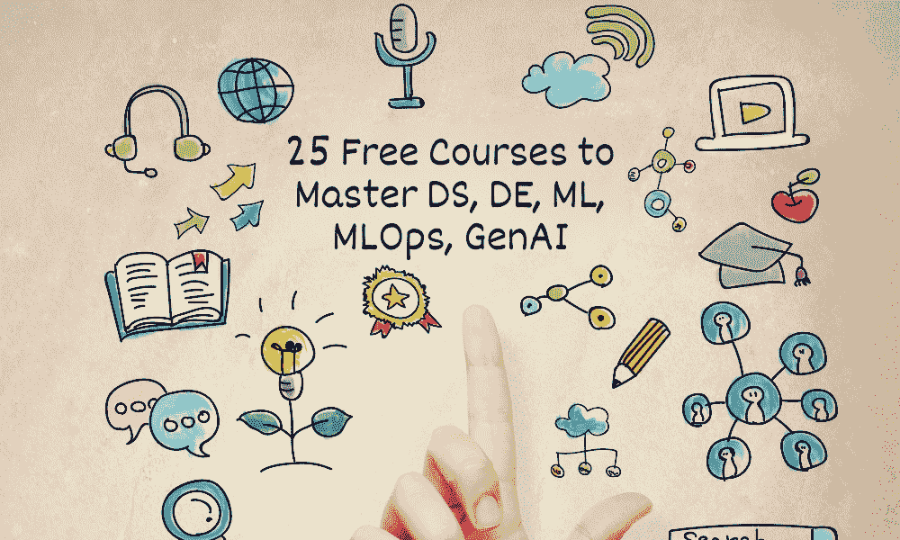

# 25 门免费课程，掌握数据科学、数据工程、机器学习、MLOps 和生成式 AI

> 原文：[`www.kdnuggets.com/25-free-courses-to-master-data-science-data-engineering-machine-learning-mlops-and-generative-ai`](https://www.kdnuggets.com/25-free-courses-to-master-data-science-data-engineering-machine-learning-mlops-and-generative-ai)

作者提供的图片

在当今快速发展的技术环境中，掌握数据科学、机器学习和 AI 技能至关重要。无论你是寻求开始新的职业生涯还是提升现有的专业知识，都有大量的在线资源可供利用，其中许多都是免费的！我们从 KDnuggets 收集了最受欢迎的免费课程帖子，并将它们汇总在一起，为你提供一系列优秀的课程。将此页面收藏以备后用，你可能会多次回到这里来学习新技能或尝试新课程。

* * *

## 我们的前三大课程推荐

 1\. [Google 网络安全证书](https://www.kdnuggets.com/google-cybersecurity) - 快速进入网络安全职业的捷径。

 2\. [Google 数据分析专业证书](https://www.kdnuggets.com/google-data-analytics) - 提升你的数据分析能力

 3\. [Google IT 支持专业证书](https://www.kdnuggets.com/google-itsupport) - 支持你的组织在 IT 领域

* * *

# 数据科学

1.  [**面向所有人的 Python**](https://www.youtube.com/watch?v=8DvywoWv6fI) **由查尔斯·塞弗伦斯教授提供：** 对 Python 编程的全面介绍，适合初学者。

1.  [**使用 Python 进行数据分析**](https://youtu.be/GPVsHOlRBBI?feature=shared) **由 Jovian 提供：** 探索使用 Python 进行数据分析的技巧。

1.  [**数据库和 SQL**](https://www.youtube.com/watch?v=HXV3zeQKqGY) **由 freeCodeCamp 提供：** 学习如何使用 SQL 管理数据库。

1.  [**推断统计入门**](https://www.udacity.com/course/intro-to-inferential-statistics--ud201) **来自 Udacity：** 通过统计学习获得关于预测的见解。

1.  [**机器学习 Zoomcamp**](https://github.com/DataTalksClub/machine-learning-zoomcamp) **由 DataTalks.Club 提供：** 一种实践性的（基于项目的）机器学习学习方法。

通过阅读 5 门免费课程，掌握数据科学 了解更多关于单个课程的信息

# 数据工程

1.  [**数据工程**](https://www.edx.org/learn/data-engineering/ibm-data-engineering-basics-for-everyone) **由 IBM 在 edX 提供：** 理解数据工程的基础知识。

1.  [**数据工程师学习路径**](https://www.cloudskillsboost.google/paths/16) **由 Google 提供：** 为有志于成为数据工程师的人提供的指导路径。

1.  [**数据库工程师专业证书**](https://www.coursera.org/professional-certificates/meta-database-engineer?irclickid=yyZXy9zMQxyPUgGUafXlUyeCUkH0F63zX1mXwc0&irgwc=1&utm_medium=partners&utm_source=impact&utm_campaign=27795&utm_content=b2c) **by Meta:** 获得数据库工程认证。

1.  [**大数据专业化**](https://www.coursera.org/specializations/big-data) **by UC San Diego:** 学习大数据技术和应用。

1.  [**数据工程 Zoomcamp**](https://github.com/DataTalksClub/data-engineering-zoomcamp) **by DataTalks.Club:** 一个基于项目的动手数据工程课程。

通过阅读 5 免费课程掌握数据工程 了解更多关于各个课程的信息。

# 机器学习

1.  [**机器学习入门**](https://www.kaggle.com/learn/intro-to-machine-learning) **by Kaggle:** 一个面向初学者的机器学习介绍。

1.  [**人人可学的机器学习**](https://www.youtube.com/watch?v=i_LwzRVP7bg) **by Kylie Ying:** 一种易于理解的机器学习概念介绍。

1.  [**使用 Scikit-Learn 的 Python 机器学习**](https://www.fun-mooc.fr/en/courses/machine-learning-python-scikit-learn/) **by FUN MOOC:** 专注于使用 Python 和 Scikit-Learn 进行机器学习。

1.  [**机器学习速成课程**](https://developers.google.com/machine-learning/crash-course/) **by Google:** 快速而全面的机器学习入门课程。

1.  [**CS229: 机器学习**](https://cs229.stanford.edu/) **by Stanford University:** 一个更高级的课程，适合那些希望深入了解的学习者。

通过阅读 5 免费课程掌握机器学习 了解更多关于各个课程的信息。

# MLOps

1.  [**MLOps 的 Python 基础**](https://www.coursera.org/learn/python-mlops-duke) **by Duke University:** MLOps 爱好者必备的基础课程。

1.  [**MLOps 入门**](https://www.udemy.com/course/mlops-for-beginners/) **by Udemy:** MLOps 初学者的绝佳起点。

1.  [**生产环境中的机器学习工程（MLOps）专业化**](https://www.coursera.org/specializations/machine-learning-engineering-for-production-mlops) **by DeepLearning.AI:** 深入探索 MLOps 的世界。这是一个课程合集。

1.  [**机器学习操作专业化**](https://www.coursera.org/specializations/mlops-machine-learning-duke) **by Duke University:** 关注机器学习的操作方面。

1.  [**使用 ML 制作**](https://madewithml.com/) **by Goku Mohandas:** 一门将机器学习与实际应用相结合的独特课程。在 GitHub 上非常受欢迎。

通过阅读 5 免费课程掌握 MLOps 了解更多关于各个课程的信息。

# 生成式 AI

1.  [**生成式 AI 入门**](https://github.com/microsoft/generative-ai-for-beginners) **by Microsoft:** 12 节课程帮助构建生成式 AI 应用。

1.  [**生成性 AI 基础**](https://www.databricks.com/resources/learn/training/generative-ai-fundamentals) **由 DataBricks 提供：** 探索生成性 AI 的基础知识。

1.  [**生成性 AI 学习路径简介**](https://www.cloudskillsboost.google/paths/118) **由 Google 提供：** 从学习大型语言模型的基础知识到理解负责任的 AI 原则。

1.  [**使用大型语言模型的生成性 AI**](https://www.coursera.org/learn/generative-ai-with-llms) **由 AWS 和 DeepLearning.AI 提供：** 与 AWS 专家一起获得 AI 的实际经验，他们在商业用例中构建和部署 AI。

1.  [**人人适用的生成性 AI**](https://www.coursera.org/learn/generative-ai-for-everyone) **由 DeepLearning.AI 提供：** 介绍生成性 AI 的概念、工作原理、常见用例和局限性。

通过阅读 掌握生成性 AI 的 5 门免费课程 了解更多有关单独课程的信息

# 结论

在这篇博客中，我们介绍了 25 门可以帮助你建立数据科学及其相关子领域坚实基础的免费在线课程。通过学习更多高级课程，如机器学习、MLOps 和生成性 AI，提升你的技能。无论你在数据科学学习旅程中的哪一阶段，这些免费课程都使优质教育变得对每个人都可及。它们提供灵活的学习方式，即使在最繁忙的日程中也能适应。祝学习愉快！

****[Abid Ali Awan](https://www.polywork.com/kingabzpro)**** ([@1abidaliawan](https://www.linkedin.com/in/1abidaliawan)) 是一名认证的数据科学专业人士，热爱构建机器学习模型。目前，他专注于内容创作和撰写关于机器学习和数据科学技术的技术博客。Abid 拥有技术管理硕士学位和电信工程学士学位。他的愿景是利用图神经网络构建一个 AI 产品，帮助那些在心理健康方面挣扎的学生。

### 相关主题

+   [学习数据科学、数据工程等的免费课程集合](https://www.kdnuggets.com/collection-of-free-courses-to-learn-data-science-data-engineering-machine-learning-mlops-and-llmops)

+   [掌握 MLOps 的 5 门免费课程](https://www.kdnuggets.com/5-free-courses-to-master-mlops)

+   [掌握生成性 AI 的 5 门免费课程](https://www.kdnuggets.com/5-free-courses-to-master-generative-ai)

+   [掌握数据工程的 5 门免费课程](https://www.kdnuggets.com/5-free-courses-to-master-data-engineering)

+   [掌握生成性 AI 与提示工程：免费电子书](https://www.kdnuggets.com/2023/04/free-ebook-mastering-generative-ai-prompt-engineering.html)

+   [掌握 MLOps 的 10 个 GitHub 仓库](https://www.kdnuggets.com/10-github-repositories-to-master-mlops)
