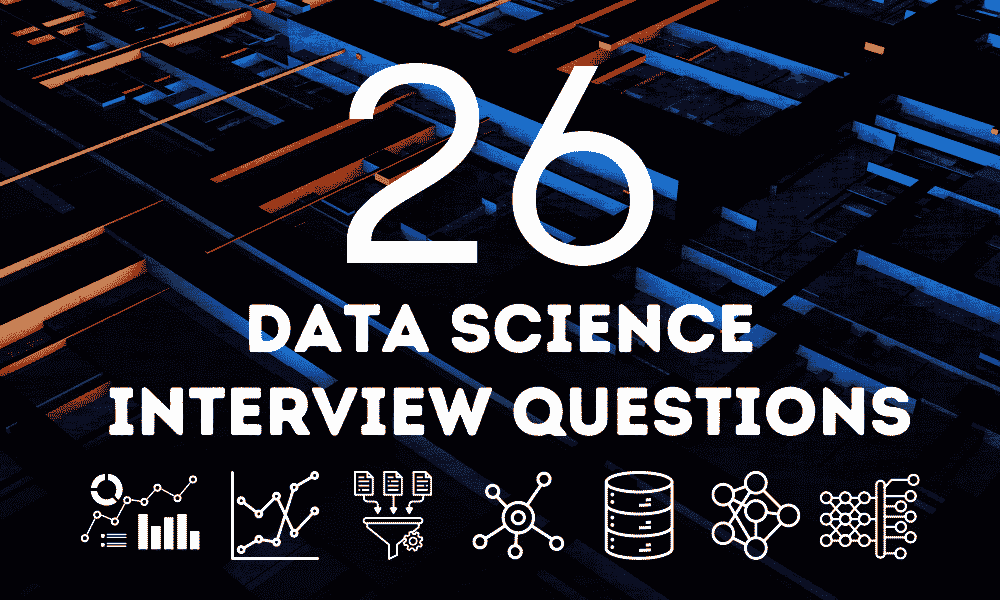

# 你应该知道的 26 个数据科学面试问题

> 原文：[`www.kdnuggets.com/26-data-science-interview-questions-you-should-know`](https://www.kdnuggets.com/26-data-science-interview-questions-you-should-know)

作者图片

数据科学面试测试了硬技术技能和软技能。对常见的数据科学面试问题做好充分准备，是脱颖而出的关键。

* * *

## 我们的前三个课程推荐

 1\. [谷歌网络安全证书](https://www.kdnuggets.com/google-cybersecurity) - 快速开启网络安全职业生涯

 2\. [谷歌数据分析专业证书](https://www.kdnuggets.com/google-data-analytics) - 提升你的数据分析能力

 3\. [谷歌 IT 支持专业证书](https://www.kdnuggets.com/google-itsupport) - 支持你的组织 IT 需求

* * *

在这篇博客文章中，我们将学习 26 个数据科学面试问题，你应该预期会遇到这些问题。这些问题涵盖统计学、Python、SQL、机器学习、数据分析、项目等。无论你是学生、职业转型者还是经验丰富的数据科学家，回顾这些问题可以指导你的准备，并帮助你在面试中更加自信，准备充分，给人留下深刻印象。

# 非技术问题

## 1\. 解释复杂数据概念

问：描述一次你向非技术人员解释复杂数据概念的经历。你是如何帮助他们理解的？

## 2\. 从错误中学习

问：你有没有在分析中犯过重大错误？你能解释一下你是如何处理这种情况的吗？你从中获得了什么见解？

## 3\. 适应变化的需求

问：你能分享一个在项目中面对不明确或不断变化的需求的经验吗？你是如何适应这种情况的？

# Python 问题

## 4\. 字符串变位词检查

问：写一个函数检查两个字符串是否是变位词。

## 5\. 找出缺失的数字

问：给定一个包含 n 个从 0 到 n 的不同数字的数组，找到缺失的那个数字。

## 6\. 欧几里得距离计算

问：写一个函数来计算 Python 中的欧几里得距离？

# SQL 问题

## 7\. 比较 JOIN

问：LEFT JOIN 和 FULL OUTER JOIN 能产生相同的结果吗？为什么或为什么不？

## 8\. 时间差查询

问：请写出 SQL 查询，以帮助我找到两个事件之间的时间差。

## 9\. SQL 中的 NULL 处理

问：你能提供一些关于如何处理查询数据集时 NULL 值的建议吗？

## 10\. GROUP BY 逻辑

问：当你对一个不在 SELECT 语句中的列使用 GROUP BY 时会发生什么？

# 统计学、概率论和数学问题

## 11\. 相同花色的概率

Q: 从同一副牌中抽取两张牌，它们具有相同花色的概率是多少？

## 12\. 电梯概率问题

Q: 在一个四层楼的建筑中，四个人每人下到不同楼层的概率是多少？

## 13\. 解释 p 值

Q: 你会如何向工程师解释如何解读 p 值？

## 14\. 样本量和误差边际

Q: 对于样本量 n，误差边际为 3。我们还需要多少样本才能将误差边际降到 0.3？

## 15\. 评估 A/B 测试的随机性

Q: 在 A/B 测试中，你如何检查分配到各个组的过程是否真正随机？

# 数据分析问题

## 16\. 数据分析项目方法

Q: 在进行数据分析项目时，你会遵循什么流程？

## 17\. 异常值处理

Q: 你如何处理数据集中的异常值？

## 18\. 理解数据可视化

Q: 你能解释一下数据可视化吗？此外，存在多少种可视化类型？

## 19\. 数据验证

Q: 什么是数据验证？可以使用哪些不同的方法来验证数据？

# 机器学习问题

## 20\. 评估聚类性能

Q: 如果在聚类项目中已知标签，你会如何评估模型的性能？

## 21\. 特征选择方法

Q: 你使用哪些特征选择方法来确定模型中最相关的变量？

## 22\. 神经网络基础

Q: 使用一个简单的例子解释组成神经网络的核心组件。

## 23\. 管理不平衡数据集

Q: 你如何管理不平衡的数据集？

## 24\. 避免过拟合

Q: 你如何避免模型的过拟合？

# 案例研究

## 25\. 调查用户参与度下降

在这个案例研究中，你的责任是找出 Xfinite 项目用户参与度下降的原因。首先需要对项目进行概述，然后分析四个特定表中的数据。

## 26\. 验证 A/B 测试结果

探索 A/B 测试中对照组和处理组之间显著差异的结果，通过详细分析来验证或驳斥这些结果。

# 结论

数据科学面试测试了广泛的技能，从技术到人际交往。这 26 个问题提供了一个全面的概述，涵盖了有志于成为数据科学家的候选人在面试中可能遇到的关键主题。充分准备这些问题不仅会帮助你在面试中表现出色，还将使你全面了解数据科学的实际和理论方面。

****[Abid Ali Awan](https://www.polywork.com/kingabzpro)**** ([@1abidaliawan](https://www.linkedin.com/in/1abidaliawan)) 是一位认证的数据科学专业人士，他热衷于构建机器学习模型。目前，他专注于内容创作，并撰写有关机器学习和数据科学技术的技术博客。Abid 拥有技术管理硕士学位和电信工程学士学位。他的愿景是利用图神经网络开发一款 AI 产品，帮助那些面临心理健康问题的学生。

### 更多相关主题

+   [KDnuggets 新闻，5 月 4 日：9 门免费的哈佛数据学习课程…](https://www.kdnuggets.com/2022/n18.html)

+   [你必须知道的 15 个数据科学 Python 编程面试问题](https://www.kdnuggets.com/2022/04/15-python-coding-interview-questions-must-know-data-science.html)

+   [你必须知道的十大高级数据科学 SQL 面试问题…](https://www.kdnuggets.com/2023/01/top-10-advanced-data-science-sql-interview-questions-must-know-answer.html)

+   [KDnuggets 新闻，4 月 13 日：数据科学家应该了解的 Python 库…](https://www.kdnuggets.com/2022/n15.html)

+   [你可能在下次面试中遇到的 24 个 SQL 问题](https://www.kdnuggets.com/2022/06/24-sql-questions-might-see-next-interview.html)

+   [如何回答数据科学编程面试问题](https://www.kdnuggets.com/2022/01/answer-data-science-coding-interview-questions.html)
