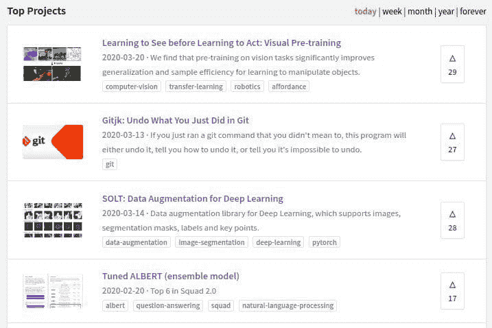
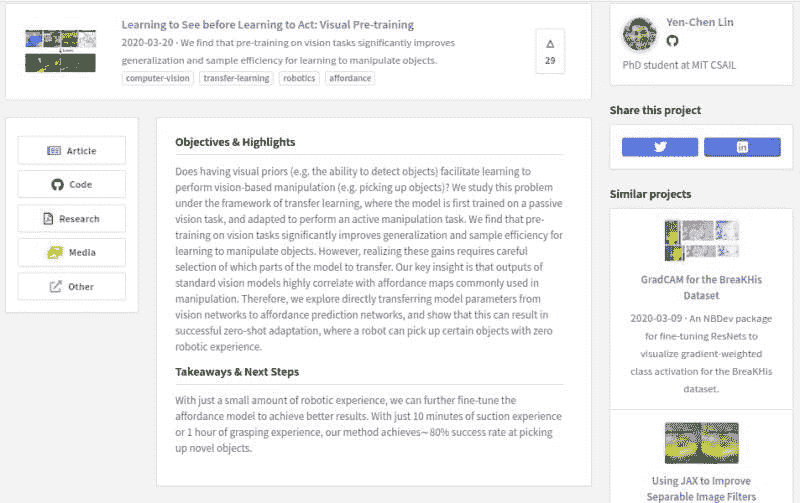

# Made With ML: 发现、构建和展示机器学习项目

> 原文：[`www.kdnuggets.com/2020/03/made-with-ml.html`](https://www.kdnuggets.com/2020/03/made-with-ml.html)

评论

当你想发现现有的机器学习项目，获取构建自己项目的灵感，然后在项目完成后分享这些项目时，你会去哪里？

对于这一发现/构建/展示流程的某些部分，你可能已经有所了解，例如 Papers with Code 项目，它的自我描述为：

> 带有代码的论文。按星级排序。每周更新。

这无疑是一个有用的资源，但如果你寻找的是更平衡地分享自己项目和社区感的资源，并结合 Papers with Code 的发现功能，你应该查看 **[Made With ML](https://madewithml.com/)**。

Made With ML 扮演了一个社区的角色，将那些寻求创意的人与那些希望构建和分享项目作品集的人汇聚在一起，无论是为他人提供创意还是展示他们所学到和构建的东西。

Made With ML 的主页面列出了可搜索的项目，如下所示：

每个项目页面提供了额外的信息，如下所示，包括描述、代码、博客文章、视频等，视具体项目相关情况而定：

Made With ML 的介绍博客文章用其创始人、杰出的研究员、作者和创始人 **[Goku Mohandas](https://www.linkedin.com/in/goku/)** 的话描述了这个项目。

> 因此，我们与这些招聘经理合作创建了一个理想的档案，以完成两个关键任务：
> 
> +   ???? 提供一个作品集，展示能够体现技术能力和产品意识的项目。
> +   
> +   ⏰ 在大约 2 分钟内完成上述所有内容（招聘经理在简历上的平均花费时间）。
> +   
> 所以我们创建了 Made With ML。它是一个分享和发现机器学习项目的平台。你可以通过发现和搜索来学习其他人的项目：

[阅读博客文章](https://medium.com/@madewithml/standing-out-when-applying-for-ml-jobs-7f509ecf2d57) 获取关于该项目的更多信息，以及一些分享和展示项目的建议（提示：不要只是把一堆算法扔到一个通用数据集上；重点应该是创建完整的项目，这些项目执行特定的、有用的任务，并能引起他人的注意）。

Made With ML 似乎可以在 GitHub 和 Kaggle 之间填补某种角色，我鼓励读者查看一下，看看是否对他们有帮助。

**相关**：

+   Papers with Code: 机器学习的绝佳 GitHub 资源

+   AI 与机器学习的最前沿 – 论文与代码的亮点

+   如何通过机器学习在 GitHub 上自动化任务以获取乐趣和利润

### 更多相关话题

+   [探索计算机视觉的世界：介绍 MLM 的最新…](https://www.kdnuggets.com/2024/01/mlm-discover-the-world-of-computer-vision-ebook)

+   [通过 BigQuery ML 使数据分析变得简单](https://www.kdnuggets.com/machine-learning-made-simple-for-data-analysts-with-bigquery-ml)

+   [提升技能的顶级数据科学项目](https://www.kdnuggets.com/2022/04/top-data-science-projects-build-skills.html)

+   [数据湖与 SQL：数据天堂中的完美匹配](https://www.kdnuggets.com/2023/01/data-lakes-sql-match-made-data-heaven.html)

+   [TensorFlow 用于计算机视觉 - 转移学习变得简单](https://www.kdnuggets.com/2022/01/tensorflow-computer-vision-transfer-learning-made-easy.html)

+   [每个数据科学家至少都犯过的错误](https://www.kdnuggets.com/2022/09/mistake-every-data-scientist-made-least.html)
