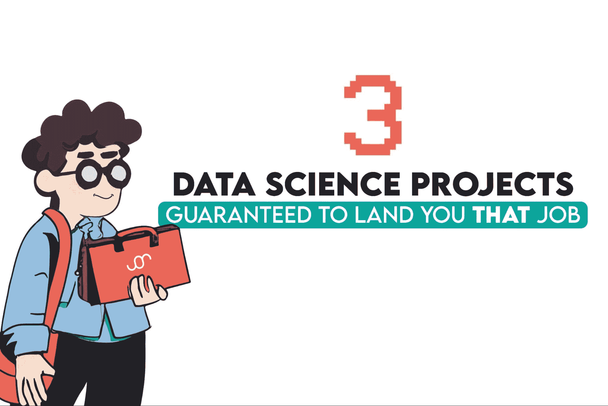
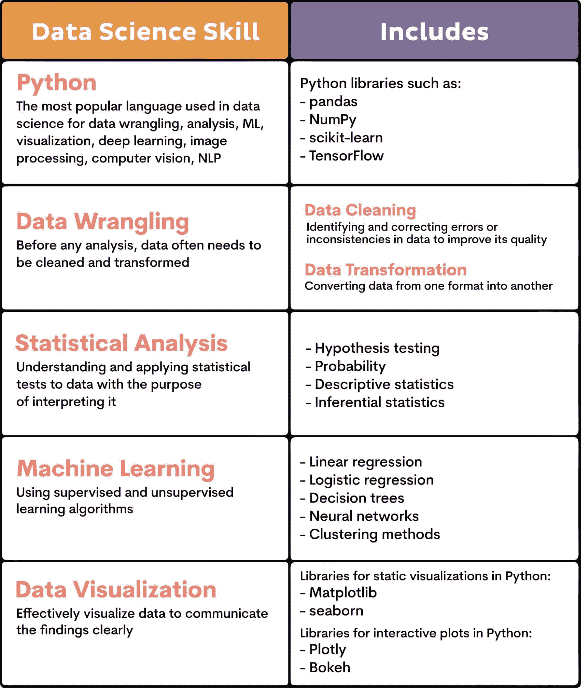

# 3 个保证能让你找到工作的数据科学项目

> 原文：[`www.kdnuggets.com/3-data-science-projects-guaranteed-to-land-you-that-job`](https://www.kdnuggets.com/3-data-science-projects-guaranteed-to-land-you-that-job)

图片由作者提供

这是一个非常大胆的声明！声明我可以保证你找到工作。

* * *

## 我们的前三个课程推荐

 1\. [谷歌网络安全证书](https://www.kdnuggets.com/google-cybersecurity) - 快速进入网络安全职业生涯。

 2\. [谷歌数据分析专业证书](https://www.kdnuggets.com/google-data-analytics) - 提升您的数据分析技能

 3\. [谷歌 IT 支持专业证书](https://www.kdnuggets.com/google-itsupport) - 支持您组织的 IT 工作

* * *

好吧，事实是，生活中没有什么是保证的，尤其是找工作。数据科学领域也不例外。但让你非常接近保证的办法是拥有数据项目在你的作品集中。

我为什么认为项目如此决定性？因为如果选择得当，它们可以最有效地展示你在数据科学中的技术技能范围和深度。项目的质量才是关键，而不是数量。它们应该尽可能多地覆盖数据科学技能。

那么，哪些项目能在最少数量的项目中保证你呢？如果只能选择三个项目，我会选择这些。

1.  [城市供应和需求数据的洞察](https://platform.stratascratch.com/data-projects/insights-city-supply-and-demand-data?utm_source=blog&utm_medium=click&utm_campaign=kdn+ds+projects+for+job)

1.  [客户流失预测](https://platform.stratascratch.com/data-projects/customer-churn-prediction?utm_source=blog&utm_medium=click&utm_campaign=kdn+ds+projects+for+job)

1.  [预测性警务](https://towardsdatascience.com/the-perils-of-predictive-policing-11928a9f1d60)

但不要太字面化。这里的意思并不是说你必须严格遵守这三个项目。我选择它们是因为它们涵盖了数据科学所需的大部分技术技能。如果你想做其他数据科学项目，可以随意选择。但如果你的时间/项目数量有限，明智地选择那些能够测试最广泛数据科学技能的项目。

说到这一点，让我们明确一下它们是什么。

# 数据科学项目中要寻找的技术技能

数据科学有五种基本技能。

+   Python

+   数据处理

+   统计分析

+   机器学习

+   数据可视化

这是一个在尝试从所选择的数据科学项目中获得最大收益时应考虑的检查清单。

这是这些技能涵盖内容的概述。

当然，数据科学技能远不止这些。它们还包括掌握 SQL 和 R、大数据技术、深度学习、自然语言处理以及云计算。

然而，对这些技能的需求很大程度上取决于工作描述。但我提到的五项基本技能是你无法忽视的。

现在让我们看看我选择的三个数据科学项目如何挑战这些技能。

# 3 个数据科学项目以练习基本数据科学技能

其中一些项目可能对某些人来说有些过于高级。在这种情况下，可以尝试这些[19 个数据科学初学者项目](https://www.stratascratch.com/blog/19-data-science-project-ideas-for-beginners/?utm_source=blog&utm_medium=click&utm_campaign=kdn+ds+projects+for+job)。

## 1\. 理解城市供应与需求：商业分析

**来源：** [城市供应与需求数据洞察](https://platform.stratascratch.com/data-projects/insights-city-supply-and-demand-data?utm_source=blog&utm_medium=click&utm_campaign=kdn+ds+projects+for+job)

**主题：** 商业分析

**简要概述：** 城市是 Uber 需求和供应互动的中心。分析这些可以提供对公司业务和规划的洞察。Uber 提供了一个包含行程详细信息的数据集。你需要回答十一道问题，以便对行程、时间、司机需求等提供商业洞察。

**项目执行：** 你将得到十一道需要按显示顺序回答的问题。回答这些问题将涉及如下任务：

+   填补缺失值，

+   聚合数据，

+   找出最大值，

+   解析时间间隔，

+   计算百分比，

+   计算加权平均数，

+   找出差异，

+   数据可视化等等。

**展示的技能：** 探索性数据分析（EDA），用于选择所需的列和填补缺失值，推导关于已完成行程的可操作性洞察（不同时间段、每个司机的加权平均行程比率、找出最繁忙的时间来帮助制定司机排班、供应与需求之间的关系等）、可视化供应与需求之间的关系。

## 2\. 客户流失预测：分类任务

**来源：** [客户流失预测](https://platform.stratascratch.com/data-projects/customer-churn-prediction?utm_source=blog&utm_medium=click&utm_campaign=kdn+ds+projects+for+job)

**主题：** 监督学习（分类）

**简要概述：** 在这个数据科学项目中，Sony Research 提供了一个电信公司客户的数据集。他们期望你进行探索性分析并提取洞察。然后，你需要建立一个流失预测模型，评估它并讨论将模型部署到生产中的问题。

**项目执行：** 项目应按这些主要阶段进行。

***   **探索性分析与洞察提取**

1.  +   检查数据基础（空值、唯一性）

    +   选择所需的数据并形成数据集

    +   通过可视化数据检查值的分布

    +   形成相关矩阵

    +   检查特征重要性

***   **训练/测试拆分**

1.  +   使用**sklearn**按 80%-20%的比例将数据集拆分为训练集和测试集

***   **预测模型**

1.  +   应用分类器并根据性能选择一个用于生产

***   **指标**

1.  +   在比较不同算法的性能时使用准确性和 F1 分数

***   **模型结果**

1.  +   使用经典的机器学习模型

    +   可视化决策树并查看基于树的算法表现如何

***   **深度学习模型**

1.  +   在这个问题上尝试人工神经网络（ANN）

***   **部署问题**

1.  +   监控模型性能以避免数据漂移和概念漂移

**展示的技能：** 探索性数据分析（EDA）和数据整理，以检查空值、数据唯一性、获取数据分布的见解，以及正负相关性；在直方图和相关矩阵中进行数据可视化；使用 sklearn 库应用机器学习分类器，测量算法准确性和 F1 分数，比较算法，直观展示决策树；使用人工神经网络查看深度学习的表现；模型部署中需注意数据漂移和概念漂移问题，这些都在 MLOps 周期内。

## 3\. 预测警务：检查影响

**来源：** [预测警务的风险](https://towardsdatascience.com/the-perils-of-predictive-policing-11928a9f1d60)

**主题：** 监督学习（回归）

**简要概述：** 这一预测警务利用算法和数据分析预测犯罪可能发生的地点。你选择的方法可能具有深远的伦理和社会影响。它使用 2016 年旧金山城市犯罪数据，这些数据来自其[开放数据计划](https://datasf.org/opendata/)。该项目将尝试预测在特定邮政编码、某一周的某一天及时间段内的犯罪事件数量。

**项目执行：** 这里是项目作者所采取的主要步骤。

+   **选择变量并计算每年每个邮政编码每小时的犯罪总数**

+   **按时间顺序划分训练/测试数据**

*****   **尝试五种回归算法：**

1.  +   线性回归

    +   随机森林

    +   K-最近邻

    +   XGBoost

    +   多层感知机

**展示的技能：** 探索性数据分析（EDA）和数据整理，最终得到关于犯罪、时间、星期几和邮政编码的数据；机器学习（监督学习/回归），尝试线性回归、随机森林回归器、K-最近邻、XGBoost 的表现；深度学习，使用多层感知机解释你得到的结果；获取犯罪预测的见解及其可能被滥用的可能性；将模型部署到交互式地图中。

如果你想用类似的技能做更多项目，[这里有 30+个机器学习项目创意](https://www.stratascratch.com/blog/30-project-ideas-to-showcase-your-machine-learning-skills/?utm_source=blog&utm_medium=click&utm_campaign=kdn+ds+projects+for+job)。

# 结论

通过完成这些数据科学项目，你将测试并获得必要的数据科学技能，如数据清理、数据可视化、统计分析、构建和部署机器学习模型。

说到机器学习，我在这里重点关注了监督学习，因为它在数据科学中使用得更为广泛。我几乎可以保证，这些数据科学项目将足以让你获得理想的工作。

但你应仔细阅读职位描述。如果你发现需要监督学习、自然语言处理或其他我未涵盖的内容，请在你的作品集中加入一两个这样的项目。

无论如何，你不会仅限于三个项目。这些项目在这里指导你如何选择*你的*项目，从而确保*你*能够获得工作。要注意项目的复杂性，因为它们应该广泛覆盖基本的数据科学技能。

现在，去争取那份工作吧！

**[内特·罗西迪](https://www.stratascratch.com)** 是一位数据科学家，专注于产品策略。他还是一名兼职教授，教授分析学，并且是[StrataScratch](https://www.stratascratch.com/)，一个帮助数据科学家通过真实面试问题为面试做准备的平台的创始人。在[Twitter: StrataScratch](https://twitter.com/StrataScratch) 或 [LinkedIn](https://www.linkedin.com/in/nathanrosidi/)上与他联系。

### 更多相关内容

+   [2022 年数据科学项目，让你获得工作的秘诀](https://www.kdnuggets.com/2022/05/data-science-projects-land-job-2022.html)

+   [KDnuggets 新闻，6 月 1 日：数据科学的完整合集…](https://www.kdnuggets.com/2022/n22.html)

+   [2024 年 5 个数据分析师项目，助你获得工作](https://www.kdnuggets.com/5-data-analyst-projects-to-land-a-job-in-2024)

+   [2022 年数据科学作品集，让你获得工作的秘诀](https://www.kdnuggets.com/2022/10/data-science-portfolio-land-job-2022.html)

+   [你为何难以获得数据科学工作的 7 个原因](https://www.kdnuggets.com/7-reasons-why-youre-struggling-to-land-a-data-science-job)

+   [无法获得数据科学工作？原因在这里](https://www.kdnuggets.com/2022/01/unable-land-data-science-job.html)******************
