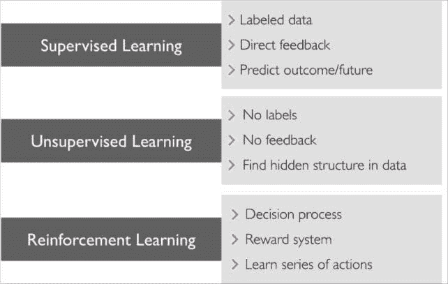
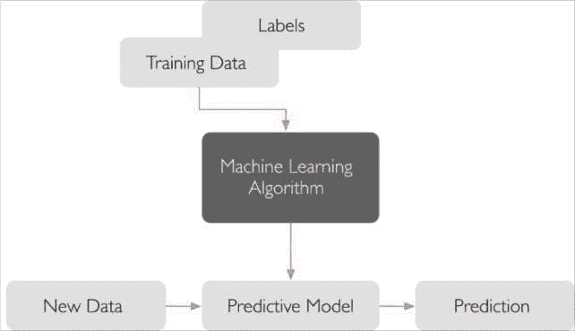
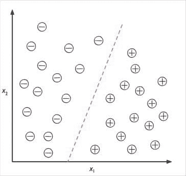

# 3 种不同类型的机器学习

> 原文：[`www.kdnuggets.com/2017/11/3-different-types-machine-learning.html`](https://www.kdnuggets.com/2017/11/3-different-types-machine-learning.html)

如果你是机器学习的新手，值得从三种核心类型开始：**监督学习**、**无监督学习**和**强化学习**。在本教程中，摘自全新版本的[Python 机器学习](https://www.packtpub.com/big-data-and-business-intelligence/python-machine-learning-second-edition?utm_source=kdnuggets&utm_medium=referral&utm_campaign=pml2e)，我们将更详细地了解它们是什么以及每种类型能够解决的最佳问题。

> 了解更多关于机器学习算法的内容——以及如何在[Python 机器学习第二版](https://www.packtpub.com/big-data-and-business-intelligence/python-machine-learning-second-edition?utm_source=kdnuggets&utm_medium=referral&utm_campaign=pml2e)中构建这些算法。本概述摘自本书。
> 
> **使用代码 PML250KDN 可节省 50% 的书籍费用。**

### **使用监督学习对未来进行预测**

监督学习的主要目标是从标记过的训练数据中学习一个模型，使我们能够对未见过或未来的数据进行预测。在这里，**监督**一词指的是一组样本，其中期望的输出信号（标签）已经是已知的。

以电子邮件垃圾邮件过滤为例，我们可以使用监督机器学习算法在一个标记过的电子邮件语料库上训练模型，这些电子邮件被正确标记为垃圾邮件或非垃圾邮件，以预测一封新的电子邮件是否属于这两类中的任何一类。带有离散类别标签的监督学习任务，如前面的电子邮件垃圾邮件过滤示例，也称为**分类任务**。监督学习的另一个子类别是**回归**，其中结果信号是一个连续值：

#### 分类用于预测类别标签

分类是监督学习的一个子类别，其目标是根据过去的观察预测新实例的分类标签。这些分类标签是离散的、无序的值，可以理解为实例的组成员。前面提到的电子邮件垃圾邮件检测示例代表了一个典型的二分类任务，其中机器学习算法学习一组规则，以区分两种可能的类别：垃圾邮件和非垃圾邮件。

然而，类别标签的集合不一定是二元的。通过监督学习算法学习的预测模型可以将训练数据集中呈现的任何类别标签分配给新的、未标记的实例。一个典型的**多类别分类**任务的例子是手写字符识别。在这里，我们可以收集一个训练数据集，其中包含字母表中每个字母的多个手写示例。现在，如果用户通过输入设备提供一个新的手写字符，我们的预测模型将能够以一定的准确性预测字母表中的正确字母。然而，如果数字零到九不在我们的训练数据集中，我们的机器学习系统将无法正确识别这些数字。

下图展示了给定 30 个训练样本的二分类任务的概念；15 个训练样本标记为负类（减号），15 个训练样本标记为正类（加号）。在这种情况下，我们的数据集是二维的，这意味着每个样本有两个值：X[1] 和 X[2]

现在，我们可以使用监督机器学习算法来学习一个规则——用虚线表示的决策边界——它可以将这两个类别分开，并根据其 X1 和 X2 值将新数据分类到这两个类别中的每一个：

### 用于预测连续结果的回归

分类允许我们将类别的、无序的标签分配给实例。监督学习的第二种类型是预测连续结果，这也称为回归分析。在回归分析中，我们提供了若干个预测（解释）变量和一个连续响应变量（结果或目标），并尝试找出这些变量之间的关系，以便我们可以预测结果。

例如，假设我们有兴趣预测学生的数学 SAT 成绩。如果学习时间与最终成绩之间存在关系，我们可以将其作为训练数据来学习一个模型，该模型利用学习时间来预测计划参加该测试的未来学生的成绩。

下图展示了线性回归的概念。给定一个预测变量 x 和一个响应变量 y，我们将拟合一条直线，使其最小化样本点与拟合线之间的距离——通常是平均平方距离。我们现在可以使用从这些数据中学到的截距和斜率来预测新数据的结果变量：

* * *

## 我们的前三大课程推荐

 1\. [谷歌网络安全证书](https://www.kdnuggets.com/google-cybersecurity) - 快速通道进入网络安全职业。

 2\. [谷歌数据分析专业证书](https://www.kdnuggets.com/google-data-analytics) - 提升你的数据分析水平

 3\. [谷歌 IT 支持专业证书](https://www.kdnuggets.com/google-itsupport) - 支持你的组织在 IT 领域

* * *

### 更多相关话题

+   [数据挖掘与机器学习的区别是什么？](https://www.kdnuggets.com/2022/06/data-mining-different-machine-learning.html)

+   [Python 中的自动化机器学习：不同方法的比较](https://www.kdnuggets.com/2023/03/automated-machine-learning-python-comparison-different-approaches.html)

+   [在 Python 中加载数据的 5 种不同方式](https://www.kdnuggets.com/2020/08/5-different-ways-load-data-python.html)

+   [终极指南：NLP 中不同的词嵌入技术](https://www.kdnuggets.com/2021/11/guide-word-embedding-techniques-nlp.html)

+   [AI 生成的体育亮点：不同的方法](https://www.kdnuggets.com/2022/03/aigenerated-sports-highlights-different-approaches.html)

+   [NLP 应用于现实世界的范围：不同的解决方案](https://www.kdnuggets.com/2022/03/different-solution-problem-range-nlp-applications-real-world.html)
