# 3 个免费平台，提供个性化的 ChatGPT 体验

> 原文：[`www.kdnuggets.com/2023/05/3-free-platform-personalized-chatgpt-experience.html`](https://www.kdnuggets.com/2023/05/3-free-platform-personalized-chatgpt-experience.html)

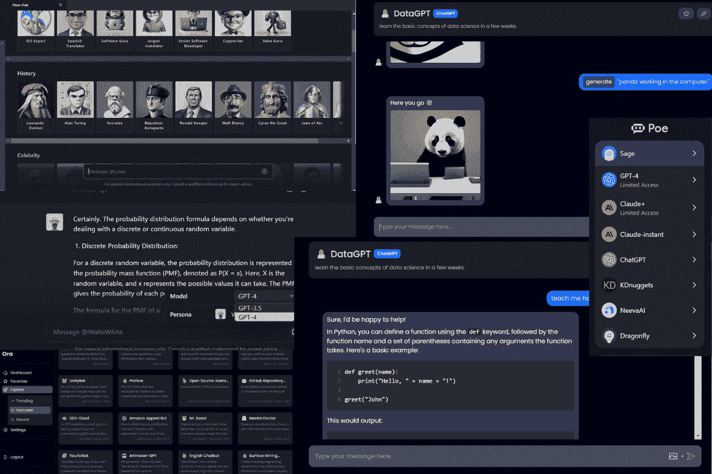

图片由作者提供

现在我非常关注聊天机器人、AI 工具和效率。这些改善了我的工作流程，并让我在处理复杂问题时变得更好。

* * *

## 我们的 3 个最佳课程推荐

 1. [Google 网络安全证书](https://www.kdnuggets.com/google-cybersecurity) - 快速进入网络安全职业轨道。

 2. [Google 数据分析专业证书](https://www.kdnuggets.com/google-data-analytics) - 提升你的数据分析技能

 3. [Google IT 支持专业证书](https://www.kdnuggets.com/google-itsupport) - 支持你的组织的 IT 工作

* * *

通常，当你注册 ChatGPT 时，你会得到一个通用的用户界面和一个无聊且缓慢的机器人。如果我告诉你，你可以向尤达提问或创建你自己的角色来对话，你会怎么样？

在这篇文章中，我们将探讨 3 个免费平台，这些平台提供免费的个性化 ChatGPT 体验。此外，我们还会讨论一些重要功能，比如聊天分类、在模型之间切换和生成图像的能力。

# 1. Forefront

使用 [Forefront Chat](https://chat.forefront.ai/)，你可以自由创建自己独特的角色或从一系列名人和历史人物中选择。这个免费平台甚至允许你选择 GPT-4 模型。此外，你可以轻松创建不同的分类，Forefront Chat 会根据你选择的主题自动生成聊天实例。

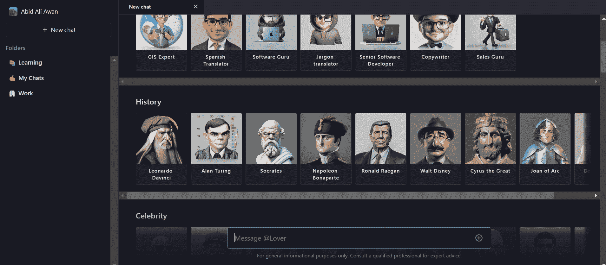

图片来自 Forefront AI

注册后，你会被提示选择一个角色开始聊天。我选择了尤达，并让聊天机器人生成一个清理表格数据的代码。这些聊天机器人由 GPT-3.5 和 GPT-4 提供支持，使它们能够生成各种内容，从文本和代码到诗歌、故事甚至书籍，所有内容都带有一点幽默。正如你所见，机器人回应了经典的尤达语录：“当然，年轻的帕达万。”

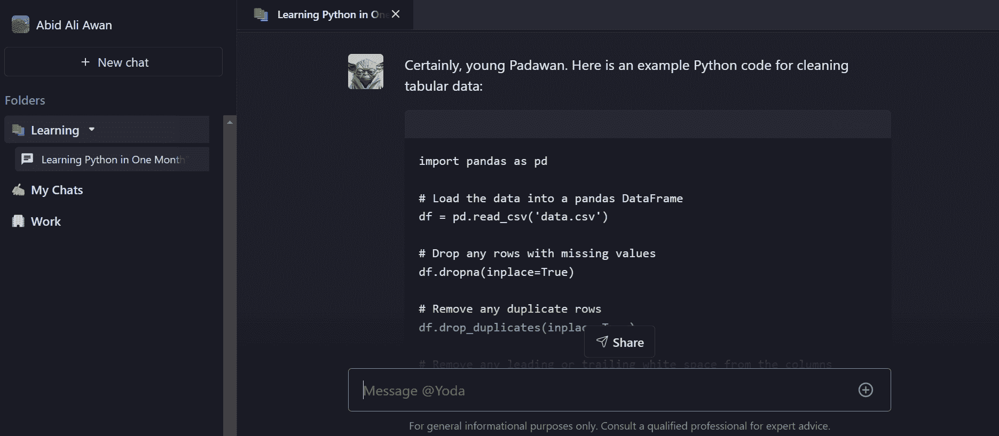

图片来自 Forefront AI

最棒的部分是，你可以在聊天过程中从 GPT-3.5 切换到 GPT-4，甚至随时更改角色。

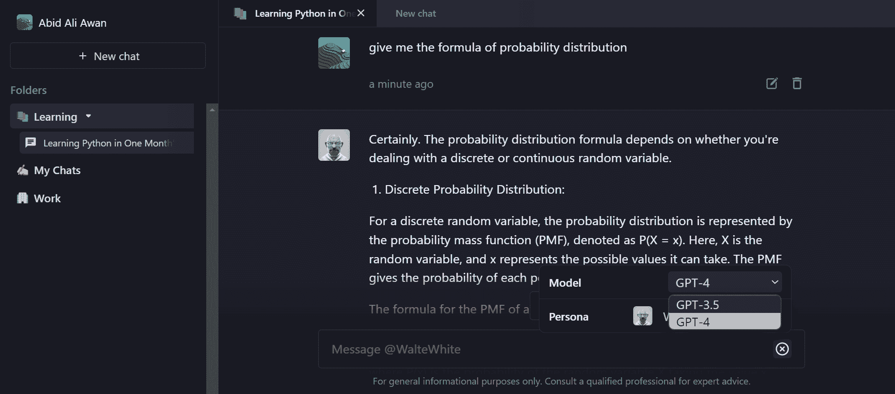

图片来自 Forefront AI

# 2. Quora Poe

[Quora Poe](https://poe.com/) 是一个你可以试验最先进聊天机器人甚至构建自己机器人的平台。它提供了对顶级 AI 模型的访问，如 GPT-4、ChatGPT、Claude、Sage、NeevaAI 和 Dragonfly。像 Dragonfly 这样的某些模型具有互动功能，提供链接和后续问题，带来更具参与感的体验。

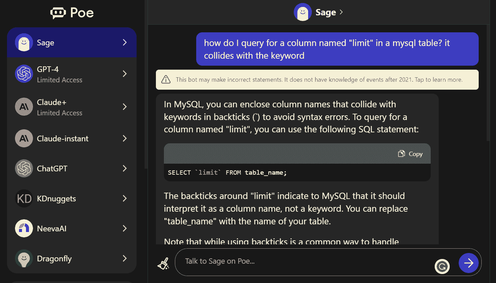

图片来自 Poe

要创建个性化聊天机器人，你需要点击“创建一个机器人”按钮并填写详细信息。系统会要求你添加一张图片、名称、机器人描述、提示和介绍信息。

我创建了一个基于 ChatGPT 的 KDnuggets 机器人，用于提供有关数据科学和人工智能的新闻。

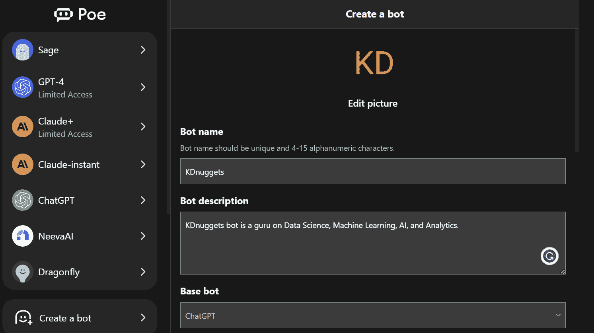

图片来自 Poe

添加必要信息后，你可以开始与机器人互动，坦白说，它非常棒。

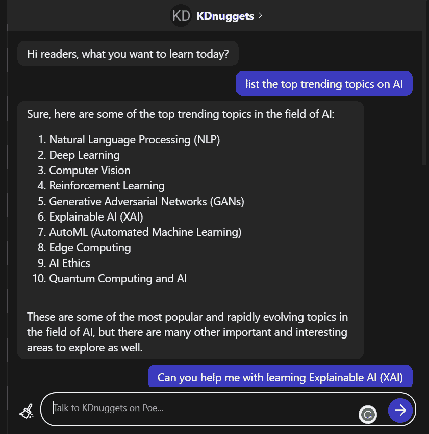

图片来自 Poe

# 3\. Ora.sh

[Ora.sh](https://ora.sh/) 有些不同，除了提供个性化聊天体验外，它还允许你生成高质量图像。此外，你可以访问 350k+个由 Ora 用户创建的机器人。

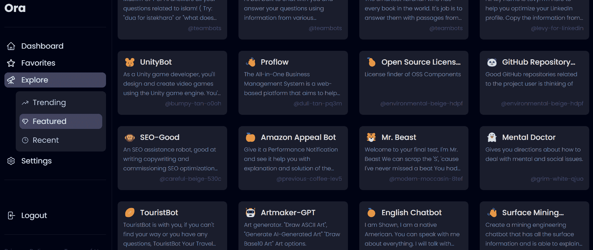

图片来自 Ora

注册账户后，它会要求你创建一个自定义聊天机器人或从“探索”标签中选择推荐的聊天机器人。

在我们的案例中，我们将创建一个 DataGPT 机器人来帮助我们学习数据科学。你可以通过提供初始提示来定制聊天机器人的行为。你可以让它充当数据科学导师，或者告诉它询问你有关数据科学的问题，或告诉你随机的事实。

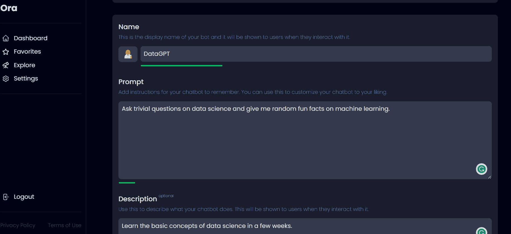

图片来自 Ora

就像任何 ChatGPT 机器人一样，Ora 旨在为你提供连贯和信息丰富的回答。无论你是初学者还是有经验的程序员，你都可以学习到有价值的技能，比如在 Python 中编写函数。

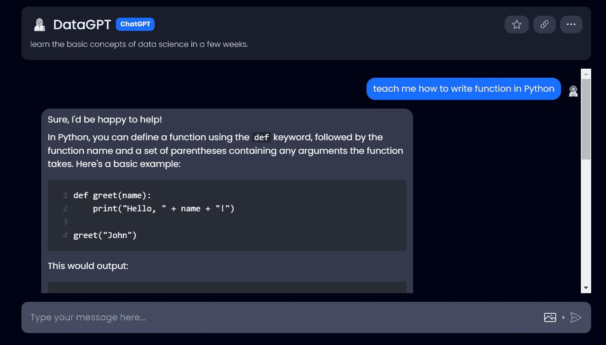

图片来自 Ora

你甚至可以通过点击图像按钮并编写提示来生成图像。

在示例中，我让它生成了一张使用计算机绘制的熊猫图像。这张图像准确且高质量。

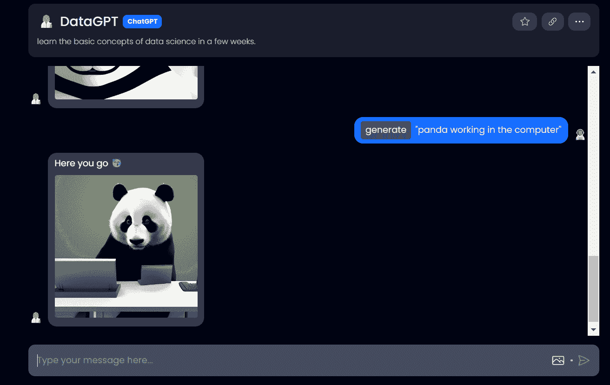

图片来自 Ora

Ora 平台还允许你通过简单的步骤将机器人嵌入到你的网站中。

你还需要什么？

# 结论

最后，我想向你介绍 [HuggingChat](https://huggingface.co/chat/)。我非常喜欢这个聊天机器人的界面、性能和准确性。目前，它基于开源项目 [OpenAssistant](https://open-assistant.io/) 并使用 LLaMa 30B SFT 6 ([oasst-sft-6-llama-30b](https://huggingface.co/OpenAssistant/oasst-sft-6-llama-30b-xor)) 模型。它是免费的，无需注册。

在这篇文章中，我向你分享了三个提供个性化 ChatGPT 体验的热门平台。这是聊天机器人的未来，每一个 ChatGPT 或 GPT-4 机器人都被量身定制以满足用户的独特需求。这些机器人不再提供泛泛的回应，而是利用用户数据和背景生成更具人性化和个性化的回复。

**[Abid Ali Awan](https://www.polywork.com/kingabzpro)** ([@1abidaliawan](https://twitter.com/1abidaliawan)) 是一位认证的数据科学专业人士，热衷于构建机器学习模型。目前，他专注于内容创作，并撰写有关机器学习和数据科学技术的技术博客。Abid 拥有技术管理硕士学位和电信工程学士学位。他的愿景是利用图神经网络为那些在心理健康方面挣扎的学生开发一款 AI 产品。

### 相关话题更多内容

+   [ChatGPT 作为学习数据科学概念的个性化辅导员](https://www.kdnuggets.com/2023/05/chatgpt-personalized-tutor-learning-data-science-concepts.html)

+   [个性化 AI 简单易用：无代码适配 GPTs 的指南](https://www.kdnuggets.com/personalized-ai-made-simple-your-no-code-guide-to-adapting-gpts)

+   [如何在没有任何工作经验的情况下获得第一份数据科学工作](https://www.kdnuggets.com/2021/02/first-job-data-science-without-work-experience.html)

+   [体验 DataCamp 带来的数据乐趣](https://www.kdnuggets.com/2022/12/datacamp-experience-joy-data-datacamp.html)

+   [将人类和 AI 代理结合起来以提升客户体验](https://www.kdnuggets.com/2024/06/softweb/bringing-human-and-ai-agents-together-for-enhanced-customer-experience)

+   [7 个免费平台用于构建强大的数据科学作品集](https://www.kdnuggets.com/2022/10/7-free-platforms-building-strong-data-science-portfolio.html)
