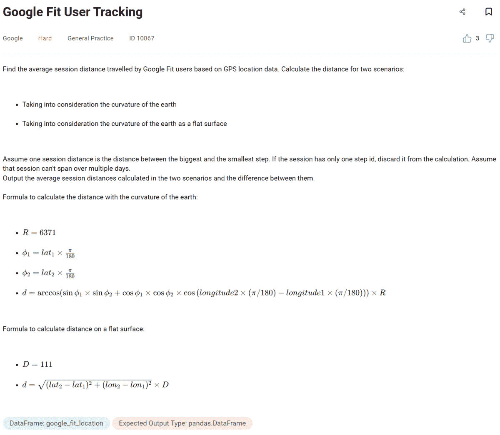
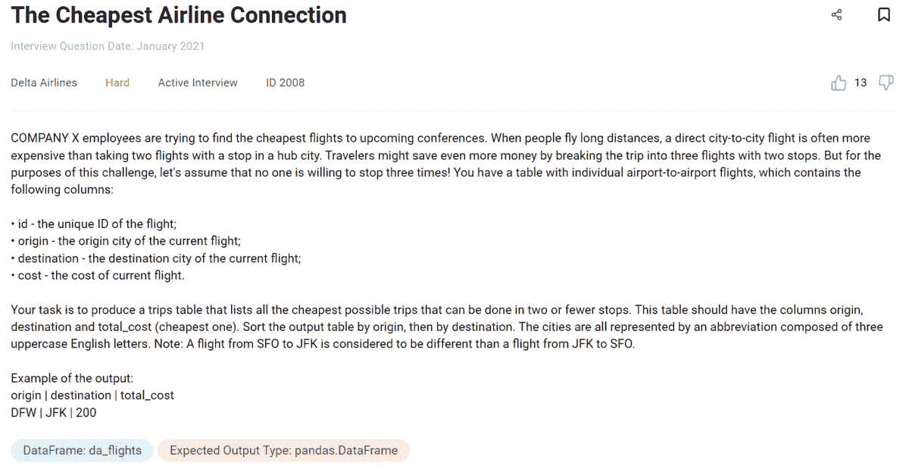
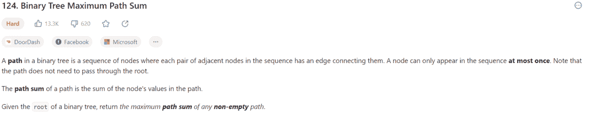
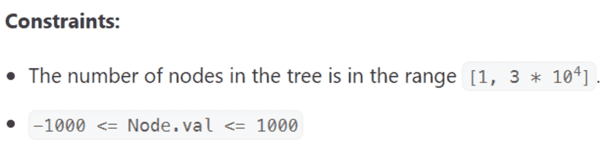
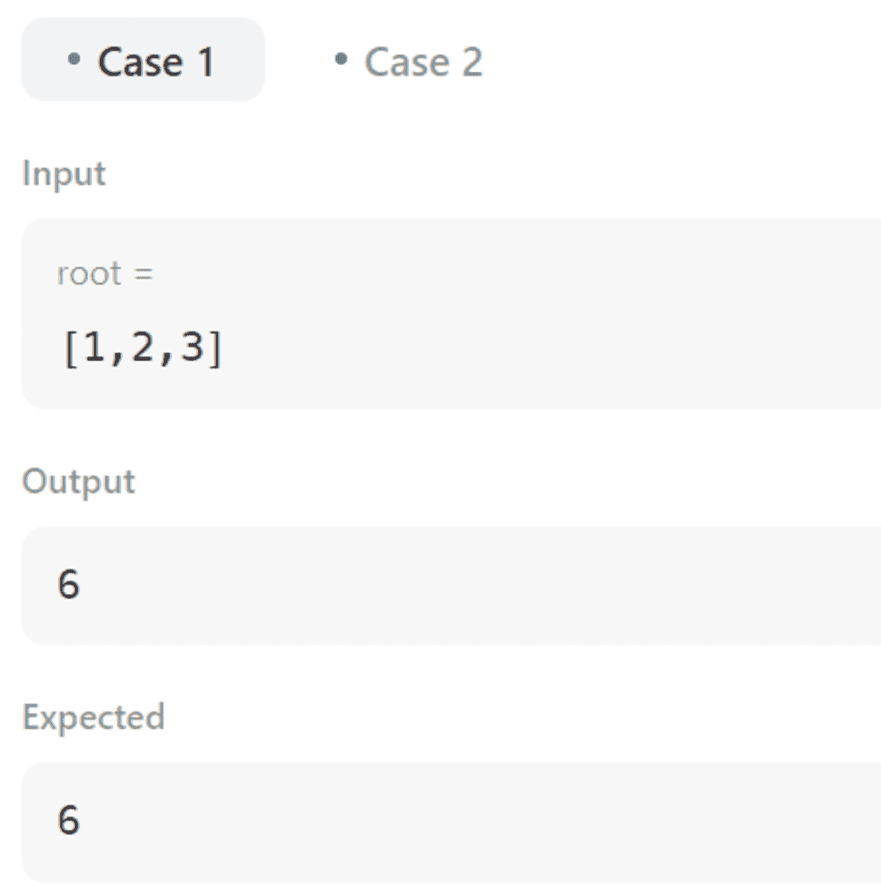
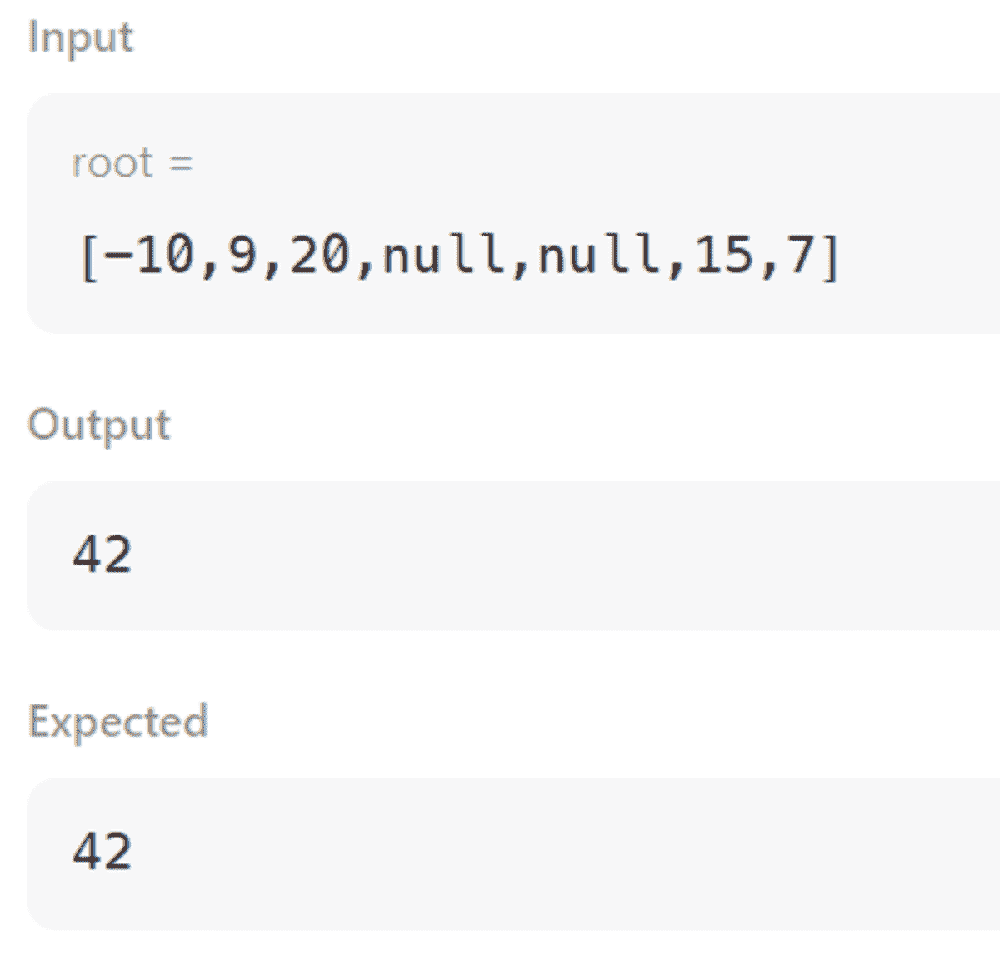

# 3 个数据科学领域的难度较高的 Python 编程面试问题

> 原文：[`www.kdnuggets.com/2023/03/3-hard-python-coding-interview-questions-data-science.html`](https://www.kdnuggets.com/2023/03/3-hard-python-coding-interview-questions-data-science.html)


图片来源：作者

在今天的文章中，我将专注于数据科学的 Python 技能。没有 Python 的数据科学家就像没有笔的作家。或者说打字机。或者笔记本电脑。好吧，换句话说：没有 Python 的数据科学家就像我没有尝试幽默感。

* * *

## 我们的三大课程推荐

 1\. [Google 网络安全证书](https://www.kdnuggets.com/google-cybersecurity) - 快速进入网络安全职业生涯。

 2\. [Google Data Analytics Professional Certificate](https://www.kdnuggets.com/google-data-analytics) - 提升你的数据分析技能

 3\. [Google IT Support Professional Certificate](https://www.kdnuggets.com/google-itsupport) - 支持你组织的 IT

* * *

你可以了解 Python，但不一定是数据科学家。不过，反过来呢？如果你知道有谁在没有 Python 的情况下进入了数据科学领域，请告诉我。在过去 20 年里，应该没有。

为帮助你练习 Python 和面试技巧，我挑选了三个 Python 编程面试题。其中两个来自于 [StrataScratch](https://www.stratascratch.com?utm_source=blog&utm_medium=click&utm_campaign=kdn+3+hard+python+questions)，这类问题需要使用 Python 解决特定的业务问题。第三个问题来自于 [LeetCode](https://leetcode.com)，测试你在 Python 算法方面的能力。

# Python 编程面试题 #1：Python 中的数学


图片来源：作者

看看 Google 提出的这个问题。



问题链接：[`platform.stratascratch.com/coding/10067-google-fit-user-tracking`](https://platform.stratascratch.com/coding/10067-google-fit-user-tracking?utm_source=blog&utm_medium=click&utm_campaign=kdn+3+hard+python+questions)

你的任务是基于 GPS 数据计算平均距离，使用两种方法。一种考虑地球的曲率，另一种则不考虑。

这些问题为两种方法提供了公式。如你所见，这个 Python 编程面试问题数学成分较重。你不仅需要理解这种水平的数学，还需要知道如何将其转化为 Python 代码。

这可不简单，对吧？

你首先应该认识到有一个数学 Python 模块，它提供了数学函数的访问权限。你将在这个问题中频繁使用这个模块。

让我们开始导入必要的库和正弦、余弦、反余弦和弧度函数。下一步是将可用的 DataFrame 与其自身在用户 ID、会话 ID 和会话日期上合并。同时，添加后缀以区分它们。

```py
import numpy as np
import pandas as pd
from math import cos, sin, acos, radians

df = pd.merge(
    google_fit_location,
    google_fit_location,
    how="left",
    on=["user_id", "session_id", "day"],
    suffixes=["_1", "_2"],
)
```

然后找出两个步骤 ID 之间的差异。

```py
df['step_var'] = df['step_id_2'] - df['step_id_1']
```

之前的步骤是必要的，以便在下一步中排除所有只有一个步骤 ID 的会话。这正是问题告诉我们要做的。下面是具体做法。

```py
df = df.loc[
    df[df["step_var"] > 0]
    .groupby(["user_id", "session_id", "day"])["step_var"]
    .idxmax()
]
```

使用 pandas `idxmax()`函数来访问步骤之间差异最大的会话。

在准备好数据集后，现在进入数学部分。创建一个 pandas Series，然后使用 for 循环。使用`iterrows()`方法计算每一行，即会话的距离。这是考虑了地球曲率的距离，代码反映了问题中给出的公式。

```py
df["distance_curvature"] = pd.Series()
for i, r in df.iterrows():
    df.loc[i, "distance_curvature"] = (
        acos(
            sin(radians(r["latitude_1"])) * sin(radians(r["latitude_2"]))
            + cos(radians(r["latitude_1"]))
            * cos(radians(r["latitude_2"]))
            * cos(radians(r["longitude_1"] - r["longitude_2"]))
        )
        * 6371
    )
```

现在，做同样的事情，但假设地球是平的。这是唯一一个成为平地球者有益的情况。

```py
df["distance_flat"] = pd.Series()
for i, r in df.iterrows():
    df.loc[i, "distance_flat"] = (
        np.sqrt(
            (r["latitude_2"] - r["latitude_1"]) ** 2
            + (r["longitude_2"] - r["longitude_1"]) ** 2
        )
        * 111
    )
```

将结果转化为 DataFrame 并开始计算输出指标。第一个是考虑地球曲率的平均距离。然后是没有曲率的相同计算。最终指标是两者之间的差异。

```py
result = pd.DataFrame()
result["avg_distance_curvature"] = pd.Series(df["distance_curvature"].mean())
result["avg_distance_flat"] = pd.Series(df["distance_flat"].mean())
result["distance_diff"] = result["avg_distance_curvature"] - result["avg_distance_flat"]
result
```

完整代码及其结果如下所示。

```py
import numpy as np
import pandas as pd
from math import cos, sin, acos, radians

df = pd.merge(
    google_fit_location,
    google_fit_location,
    how="left",
    on=["user_id", "session_id", "day"],
    suffixes=["_1", "_2"],
)
df["step_var"] = df["step_id_2"] - df["step_id_1"]
df = df.loc[
    df[df["step_var"] > 0]
    .groupby(["user_id", "session_id", "day"])["step_var"]
    .idxmax()
]

df["distance_curvature"] = pd.Series()
for i, r in df.iterrows():
    df.loc[i, "distance_curvature"] = (
        acos(
            sin(radians(r["latitude_1"])) * sin(radians(r["latitude_2"]))
            + cos(radians(r["latitude_1"]))
            * cos(radians(r["latitude_2"]))
            * cos(radians(r["longitude_1"] - r["longitude_2"]))
        )
        * 6371
    )
df["distance_flat"] = pd.Series()
for i, r in df.iterrows():
    df.loc[i, "distance_flat"] = (
        np.sqrt(
            (r["latitude_2"] - r["latitude_1"]) ** 2
            + (r["longitude_2"] - r["longitude_1"]) ** 2
        )
        * 111
    )
result = pd.DataFrame()
result["avg_distance_curvature"] = pd.Series(df["distance_curvature"].mean())
result["avg_distance_flat"] = pd.Series(df["distance_flat"].mean())
result["distance_diff"] = result["avg_distance_curvature"] - result["avg_distance_flat"]
result 
```

| **avg_distance_curvature** | **avg_distance_flat** | **distance_diff** |
| --- | --- | --- |
| 0.077 | 0.088 | -0.01 |

# Python 编程面试问题#2：Python 中的图论


图片来源：作者

这是 StrataScratch 中非常有趣的 Python 编程面试问题之一。它将你置于一个非常常见但复杂的现实数据科学家情况中。

这是 Delta Airlines 提出的问题。让我们来看看它。



问题链接：[`platform.stratascratch.com/coding/2008-the-cheapest-airline-connection`](https://platform.stratascratch.com/coding/2008-the-cheapest-airline-connection?utm_source=blog&utm_medium=click&utm_campaign=kdn+3+hard+python+questions)

这个问题要求你找到最多有两个停靠点的最便宜的航空公司连接。这听起来非常熟悉，对吧？是的，这是一种稍作修改的[最短路径问题](https://en.wikipedia.org/wiki/Shortest_path_problem)：不是路径，而是成本。

我将展示的解决方案广泛使用了`merge()` pandas 函数。我还会使用`itertools`进行循环。在导入所有必要的库和模块后，第一步是生成所有可能的原始和目的地组合。

```py
import pandas as pd
import itertools

df = pd.DataFrame(
    list(
        itertools.product(
            da_flights["origin"].unique(), da_flights["destination"].unique()
        )
    ),
    columns=["origin", "destination"],
)
```

现在，只显示起点与目的地不同的组合。

```py
df = df[df['origin'] != df['destination']]
```

现在我们将 da_flights 与它自己合并。我将使用 merge() 函数，表格将按目的地和起点从左侧连接。这样，你会得到所有到达第一个目的地的直飞航班，然后是起点与第一个航班的目的地相同的连接航班。

```py
connections_1 = pd.merge(
    da_flights,
    da_flights,
    how="left",
    left_on="destination",
    right_on="origin",
    suffixes=["_0", "_1"],
)
```

然后我们将这个结果与 da_flights 合并。这样，我们将获得第三个航班。这等于两个停留，这也是问题所允许的最大值。

```py
connections_2 = pd.merge(
    connections_1,
    da_flights[["origin", "destination", "cost"]],
    how="left",
    left_on="destination_1",
    right_on="origin",
    suffixes=["", "_2"],
).fillna(0)
```

现在，让我们通过分配逻辑列名来整理合并结果，并计算一停和两停航班的费用。（我们已经有了直飞航班的费用！）这很简单！一停航班的总费用是第一个航班加上第二个航班。对于两停航班，总费用是所有三个航班费用的总和。

```py
connections_2.columns = [
    "id_0",
    "origin_0",
    "destination_0",
    "cost_0",
    "id_1",
    "origin_1",
    "destination_1",
    "cost_1",
    "origin_2",
    "destination_2",
    "cost_2",
]
connections_2["cost_v1"] = connections_2["cost_0"] + connections_2["cost_1"]
connections_2["cost_v2"] = (
    connections_2["cost_0"] + connections_2["cost_1"] + connections_2["cost_2"]
)
```

我现在将创建的 DataFrame 与给定的 DataFrame 合并。这样，我将为每个直飞航班分配费用。

```py
result = pd.merge(
    df,
    da_flights[["origin", "destination", "cost"]],
    how="left",
    on=["origin", "destination"],
)
```

接下来，将上述结果与 connections_2 合并，以获取到达需要一个停留的目的地的航班费用。

```py
result = pd.merge(
    result,
    connections_2[["origin_0", "destination_1", "cost_v1"]],
    how="left",
    left_on=["origin", "destination"],
    right_on=["origin_0", "destination_1"],
)
```

对于两个停留的航班，做同样的操作。

```py
result = pd.merge(
    result,
    connections_2[["origin_0", "destination_2", "cost_v2"]],
    how="left",
    left_on=["origin", "destination"],
    right_on=["origin_0", "destination_2"],
)
```

结果是一个表格，提供了从一个起点到目的地的直飞、一停和两停航班的费用。现在你只需要使用 min() 方法找到最低费用，去除 NA 值并显示输出。

```py
result["min_price"] = result[["cost", "cost_v1", "cost_v2"]].min(axis=1)
result[~result["min_price"].isna()][["origin", "destination", "min_price"]]
```

通过这些最终的代码行，完整的解决方案如下。

```py
import pandas as pd
import itertools

df = pd.DataFrame(
    list(
        itertools.product(
            da_flights["origin"].unique(), da_flights["destination"].unique()
        )
    ),
    columns=["origin", "destination"],
)
df = df[df["origin"] != df["destination"]]

connections_1 = pd.merge(
    da_flights,
    da_flights,
    how="left",
    left_on="destination",
    right_on="origin",
    suffixes=["_0", "_1"],
)
connections_2 = pd.merge(
    connections_1,
    da_flights[["origin", "destination", "cost"]],
    how="left",
    left_on="destination_1",
    right_on="origin",
    suffixes=["", "_2"],
).fillna(0)
connections_2.columns = [
    "id_0",
    "origin_0",
    "destination_0",
    "cost_0",
    "id_1",
    "origin_1",
    "destination_1",
    "cost_1",
    "origin_2",
    "destination_2",
    "cost_2",
]
connections_2["cost_v1"] = connections_2["cost_0"] + connections_2["cost_1"]
connections_2["cost_v2"] = (
    connections_2["cost_0"] + connections_2["cost_1"] + connections_2["cost_2"]
)

result = pd.merge(
    df,
    da_flights[["origin", "destination", "cost"]],
    how="left",
    on=["origin", "destination"],
)

result = pd.merge(
    result,
    connections_2[["origin_0", "destination_1", "cost_v1"]],
    how="left",
    left_on=["origin", "destination"],
    right_on=["origin_0", "destination_1"],
)

result = pd.merge(
    result,
    connections_2[["origin_0", "destination_2", "cost_v2"]],
    how="left",
    left_on=["origin", "destination"],
    right_on=["origin_0", "destination_2"],
)
result["min_price"] = result[["cost", "cost_v1", "cost_v2"]].min(axis=1)
result[~result["min_price"].isna()][["origin", "destination", "min_price"]] 
```

这是代码输出。

| **origin** | **destination** | **min_price** |
| --- | --- | --- |
| SFO | JFK | 400 |
| SFO | DFW | 200 |
| SFO | MCO | 300 |
| SFO | LHR | 1400 |
| DFW | JFK | 200 |
| DFW | MCO | 100 |
| DFW | LHR | 1200 |
| JFK | LHR | 1000 |

# Python 编码面试问题 #3：Python 中的二叉树


作者提供的图像

除了图表，你还将作为数据科学家处理二叉树。因此，如果你知道如何解决由 DoorDash、Facebook、Microsoft、Amazon、Bloomberg、Apple 和 TikTok 等公司提出的这个 Python 编码面试问题，那将会很有用。



问题链接：[`leetcode.com/problems/binary-tree-maximum-path-sum/description/`](https://leetcode.com/problems/binary-tree-maximum-path-sum/description/)

约束条件是：



```py
class Solution:
    def maxPathSum(self, root: Optional[TreeNode]) -> int:
        max_path = -float("inf")

        def gain_from_subtree(node: Optional[TreeNode]) -> int:
            nonlocal max_path

            if not node:
                return 0
            gain_from_left = max(gain_from_subtree(node.left), 0)
            gain_from_right = max(gain_from_subtree(node.right), 0)
            max_path = max(max_path, gain_from_left + gain_from_right + node.val)

            return max(gain_from_left + node.val, gain_from_right + node.val)

        gain_from_subtree(root)
        return max_path
```

解决方案的第一步是定义一个 maxPathSum 函数。为了确定是否存在从根节点向下的左侧或右侧节点的路径，请编写递归函数 gain_from_subtree。

第一个实例是子树的根节点。如果路径等于一个根节点（没有子节点），则子树的增益为 0。然后在左节点和右节点中进行递归。如果路径和为负，问题要求不予考虑；我们通过将其设置为 0 来实现这一点。

然后将子树的增益和当前最大路径进行比较，如果必要则进行更新。

最后，返回子树的路径和，该值为根节点加上左节点和根节点加上右节点的最大值。

这些是案例 1 和 2 的输出。





## 总结

这次，我想给你一些不同的内容。作为数据科学家，你应该了解许多 Python 概念。这次我决定涵盖三个不常见的主题：数学、图数据结构和二叉树。

我展示的这三个问题似乎很适合展示如何将这些概念转化为 Python 代码。查看 “[Python 编码面试问题](https://www.stratascratch.com/blog/python-coding-interview-questions/?utm_source=blog&utm_medium=click&utm_campaign=kdn+3+hard+python+questions)” 来练习更多 Python 概念。

**[Nate Rosidi](https://www.stratascratch.com)** 是一名数据科学家和产品策略专家。他还是一名兼职教授，教授分析学，并且是 [StrataScratch](https://www.stratascratch.com/) 的创始人，这是一个帮助数据科学家准备面试的平台，提供来自顶级公司的真实面试问题。可以在 [Twitter: StrataScratch](https://twitter.com/StrataScratch) 或 [LinkedIn](https://www.linkedin.com/in/nathanrosidi/) 上与他联系。

### 相关主题

+   [KDnuggets 新闻，5 月 4 日：学习数据的 9 门哈佛免费课程…](https://www.kdnuggets.com/2022/n18.html)

+   [停止在数据科学项目中硬编码 - 使用配置文件代替](https://www.kdnuggets.com/2023/06/stop-hard-coding-data-science-project-config-files-instead.html)

+   [15 个你必须了解的 Python 编码面试问题](https://www.kdnuggets.com/2022/04/15-python-coding-interview-questions-must-know-data-science.html)

+   [如何回答数据科学编码面试问题](https://www.kdnuggets.com/2022/01/answer-data-science-coding-interview-questions.html)

+   [想成为数据科学家？第一部分：你需要的 10 项硬技能](https://www.kdnuggets.com/want-to-become-a-data-scientist-part-1-10-hard-skills-you-need)

+   [进入 FAANG 公司有多难](https://www.kdnuggets.com/2023/05/hard-get-faang-companies.html)
