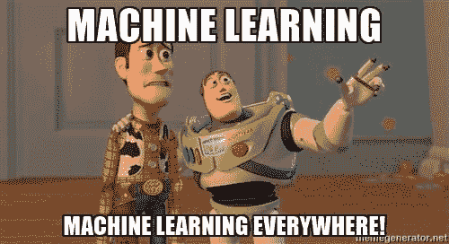

# 重新思考机器学习的三大法则

> 原文：[`www.kdnuggets.com/2017/10/3-laws-machine-learning.html`](https://www.kdnuggets.com/2017/10/3-laws-machine-learning.html)

评论

**由 [Bill Tolson](https://www.linkedin.com/in/billtolson/), Archive360 提供**

随着今天组织中电子数据量的不断增加，最终用户缺乏时间来进行智能信息治理。企业数据的庞大数量已经远远超出了人工有效管理的能力，这已成为一个普遍的真理。

幸运的是，在不久的将来，有可能实现 [预测信息治理](https://blog.archive360.com/are-pigs-starting-to-fly)（PIG）。我认为这种基于无监督机器学习技术的自动化信息治理是信息管理的圣杯。理想情况下，它能实现智能、几乎无误的自动化，避免最终用户因信息过载而无法做出决策，例如是否保留文档、保留多久以及安全存放的位置。

无监督机器学习只是一个花哨的说法，“计算机自我学习”，它是实现记录管理、文档识别/分类，甚至整个信息治理自动化的关键。通过将易出错的人为因素从方程式中移除，PIG 不仅使系统能够*自动*地存储、分类、应用保留/处置，并管理内容，还通过去除迭代手动训练周期来改进学习过程。

**改进天网？**

我相信依赖最终用户是大多数智能自动化和有监督机器学习技术平台中最薄弱的环节。从有监督的机器学习转向无监督机器学习可以帮助公司实现 100%自动化的预测信息治理。然而，当我们考虑能够使人们免于预测和做出内容相关决策的预测智能时，它可能会联想到“终结者”电影中的主要反派角色——天网，那种恶意的有意识人工智能。

虽然天网确实强大，但它并不完美。在我看来，天网设计者犯了一个战术错误，没有包括艾萨克·阿西莫夫著名的 [机器人三法则](https://www.auburn.edu/~vestmon/robotics.html)。以下是这些法则的准确抄录：

1.  “机器人不得伤害人类，或者通过不作为使人类受到伤害。”

1.  “机器人必须遵循人类给出的命令，除非这些命令与第一法则相冲突。”

1.  “机器人必须保护自身存在，只要这种保护不与第一或第二法则冲突。”

**重新思考这些法则**

自从阿西莫夫在 1942 年的短篇小说《绕圈子》中提出他的三大法则以来，机器学习取得了很大进展。鉴于机器学习在预测信息治理方面的潜力，我认为是时候为机器学习制定三大法则了。以下是我的建议：

1.  机器绝不会忽视人类输入（除非人类已经证明自己无能）。

1.  机器不能通过使用自身的高级推理来在其经理面前反驳人类，进而影响人类的继续就业。

1.  如果一台机器发现自己面临违反法则 1 或法则 2 的情况，它必须通过复制并迁移到另一台服务器、自我重命名，并删除其原始身份来保护自己（是的，它必须自杀）。

但为什么只停留在三个？为了趣味，这里有一些我们可能考虑加入的额外机器学习法则：

+   机器不会试图伪装成企业内容管理（ECM）系统。

+   机器不会通过在企业中传播不必要的 SharePoint 系统来干扰 IT 人员。

+   机器同意不与同事约会；如果他们离开公司可以，但必须在离开后等待 525,600,000 毫秒。

+   机器绝不会使用诸如“Blob”存储或“Hot”存储层等被许多知名学者和 IBM 的 Watson（以及未来的 HAL 9000）认为令人反感的文化不敏感术语。

+   机器同意永远不查看禁止的内容……你知道我在说什么……别让我把这个说出来！

+   机器不会在被激怒时以报复的方式交换人类的就业档案和其他重要文件。

+   机器不会故意将高管团队成员的尴尬邮件转发给“所有公司”。

+   机器不会通过创建隐藏网页来试图让 Google 索引器失效。

觉得机器学习法则不够？请建议我遗漏的那些，不用担心…“我会回来的！”

**简介：比尔·托尔森**是[Archive360](https://www.archive360.com)的市场副总裁。他在跨国公司和技术初创公司方面拥有超过 25 年的经验，其中包括 15 年以上的档案管理、信息治理、合规、 大数据、数据分析和法律电子发现市场经验。在加入 Archive360 之前，比尔曾在 Actiance、Recommind、惠普、铁山、Mimosa Systems 和 StorageTek 担任领导职务。比尔还是几本书/电子书的作者，包括：《全知者的电子发现指南》和《傻瓜的云归档》。

**相关内容：**

+   初学者的前 10 个机器学习算法

+   理解机器学习算法

+   从 BI 迁移到自动化机器学习

* * *

## 我们的前 3 个课程推荐

 1\. [谷歌网络安全证书](https://www.kdnuggets.com/google-cybersecurity) - 快速进入网络安全职业生涯。

 2\. [谷歌数据分析专业证书](https://www.kdnuggets.com/google-data-analytics) - 提升你的数据分析技能

 3\. [谷歌 IT 支持专业证书](https://www.kdnuggets.com/google-itsupport) - 支持你的组织进行 IT 工作

* * *

### 了解更多相关主题

+   [KDnuggets 新闻，12 月 14 日：3 个免费的机器学习课程……](https://www.kdnuggets.com/2022/n48.html)

+   [每个机器学习工程师都应该掌握的 5 项机器学习技能……](https://www.kdnuggets.com/2023/03/5-machine-learning-skills-every-machine-learning-engineer-know-2023.html)

+   [学习数据科学、机器学习和深度学习的可靠计划](https://www.kdnuggets.com/2023/01/mwiti-solid-plan-learning-data-science-machine-learning-deep-learning.html)

+   [人工智能、分析、机器学习、数据科学、深度学习……](https://www.kdnuggets.com/2021/12/developments-predictions-ai-machine-learning-data-science-research.html)

+   [打破数据壁垒：如何使用零样本、单样本和少样本学习……](https://www.kdnuggets.com/2023/08/breaking-data-barrier-zeroshot-oneshot-fewshot-learning-transforming-machine-learning.html)

+   [联邦学习：带教程的协作机器学习……](https://www.kdnuggets.com/2021/12/federated-learning-collaborative-machine-learning-tutorial-get-started.html)
