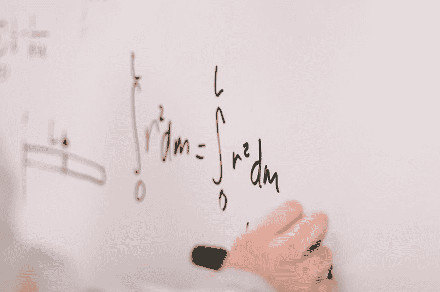
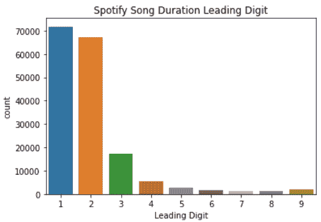
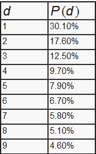
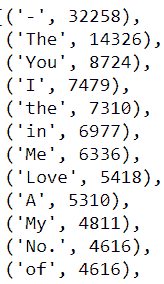

# 数据科学家需要知道的 3 个数学定律

> 原文：[`www.kdnuggets.com/2021/03/3-mathematical-laws.html`](https://www.kdnuggets.com/2021/03/3-mathematical-laws.html)

评论

**作者 [Cornellius Yudha Wijaya](https://www.linkedin.com/in/cornellius-yudha-wijaya/)，数据科学家 | 讲师 | 生物学家 | 作家 | 播客主持人**。

* * *

## 我们的前三大课程推荐

 1\. [Google 网络安全证书](https://www.kdnuggets.com/google-cybersecurity) - 快速进入网络安全职业的快车道。

 2\. [Google 数据分析专业证书](https://www.kdnuggets.com/google-data-analytics) - 提升你的数据分析能力

 3\. [Google IT 支持专业证书](https://www.kdnuggets.com/google-itsupport) - 支持组织的 IT 工作

* * *

*照片由 [Jeswin Thomas](https://unsplash.com/@jeswinthomas?utm_source=medium&utm_medium=referral) 提供，来源于 [Unsplash](https://unsplash.com/?utm_source=medium&utm_medium=referral)。*

虽然数据科学家以数据为主要工作内容，但这并不意味着数学知识不重要。数据科学家需要学习和理解机器学习背后的数学理论，以便高效地解决业务问题。

机器学习背后的数学不仅仅是随意扔在各处的符号，它包含了许多理论和思想。这些思想创造了大量的数学定律，这些定律促进了我们现在可以使用的机器学习。尽管你可以用任何方式利用数学来解决问题，但毕竟数学定律并不仅限于机器学习。

在这篇文章中，我想概述一些可能对数据科学家有帮助的有趣数学定律。让我们开始吧。

### 本福特定律

本福特定律，也称为 **纽科姆–本福特定律**、**异常数字定律** 或 **首位数字定律**，是一个关于现实世界数据集中的首位数字的数学定律。

当我们考虑数字的首位时，如果随机抽取一个数字，它应该是均匀分布的。从直观上看，首位数字为 1 的随机数字应该与首位数字为 9 的随机数字有相同的概率，即 ~11.1%。令人惊讶的是，实际情况并非如此。

**本福特定律指出，在许多自然发生的数字集合中，首位数字通常较小**。首位数字为 1 的情况发生得比 2 更频繁，首位数字为 2 的情况发生得比 3 更频繁，以此类推。

让我们尝试使用一个真实世界的数据集来看看这个定律如何适用。对于这篇文章，我使用了 [Kaggle](https://www.kaggle.com/yamaerenay/spotify-dataset-19212020-160k-tracks) 上关于 1921-2020 年 Spotify 歌曲的数据显示。我取出了歌曲时长的首位数字。

*图像由作者创建。*

从上图中，我们可以看到，首位数字 1 出现的次数最多，然后是逐渐减少的较高数字。这就是本福特定律所描述的。

如果我们谈论准确的定义，本福特定律指出，如果首位数字*d*（???? ∈ 1, …, 9）出现的概率符合以下公式，

*图像由作者创建。*

从这个公式中，我们可以得到首位数字的分布，

*图像由作者创建。*

根据这种分布，我们可以预测首位数字为 1 的出现概率比其他首位数字高 30%。

这一法则有许多应用，例如在税务申报表、选举结果、经济数据和会计数字中的欺诈检测。

### 大数法则 (LLN)

大数法则指出，随着随机过程试验次数的增加，结果的平均值会越来越接近预期值或理论值。

例如，掷骰子时，6 面骰子的可能性是 1、2、3、4、5 和 6。6 面骰子的平均值是 3.5。当我们掷骰子时，得到的数字是 1 到 6 之间的随机数，但随着我们不断掷骰子，结果的平均值会越来越接近预期值，即 3.5。这就是大数法则所描述的。

尽管它很有用，但关键在于你需要许多实验或出现次数。然而，所需的大量数据意味着它对预测长期稳定性是有益的。

大数法则与平均法则不同，后者用于表达一种信念，即随机事件的结果在小样本中会“趋于平衡”。这就是我们所称的“**赌徒谬误**”，即我们期望在小样本中出现预期值。

### Zipf 定律

Zipf 定律是为定量语言学创建的，指出在给定某些自然语言数据集语料库的情况下，任何单词的频率**与其频率表排名成反比**。因此，最常见的词出现的频率大约是第二常见词的两倍，是第三常见词的三倍。

例如，在之前的 Spotify 数据集中，我拆分了所有的单词和标点符号进行计数。下面是最常见的 12 个单词及其频率。

*图像由作者创建。*

当我对 Spotify 语料库中存在的所有单词进行统计时，总数为 759,389。我们可以通过计算它们出现的概率来检验 Zipf 定律是否适用于该数据集。出现频率最高的词或标点符号是‘-’，出现 32,258 次，概率约为 4%，其次是‘the’，其概率约为 2%。

忠于规律，在某些词汇中的概率持续下降。当然，也有小幅偏差，但概率在大多数情况下随频率排名的增加而下降。

[原文](https://medium.com/datadriveninvestor/mathematical-laws-to-know-as-a-data-scientist-9e94fc96a0f9)。经授权转载。

**相关内容：**

+   [数据科学中需要多少数学？](https://www.kdnuggets.com/2020/06/math-data-science.html)

+   [机器学习的数学：免费电子书](https://www.kdnuggets.com/2020/04/mathematics-machine-learning-book.html)

+   [数据科学的基本数学：信息论](https://www.kdnuggets.com/2021/01/essential-math-data-science-information-theory.html)

### 更多相关主题

+   [成为优秀数据科学家所需的 5 项关键技能](https://www.kdnuggets.com/2021/12/5-key-skills-needed-become-great-data-scientist.html)

+   [每个初学者数据科学家都应掌握的 6 种预测模型](https://www.kdnuggets.com/2021/12/6-predictive-models-every-beginner-data-scientist-master.html)

+   [2021 年最佳 ETL 工具](https://www.kdnuggets.com/2021/12/mozart-best-etl-tools-2021.html)

+   [每个数据科学家都应该知道的三个 R 库（即使你使用 Python）](https://www.kdnuggets.com/2021/12/three-r-libraries-every-data-scientist-know-even-python.html)

+   [停止学习数据科学以寻找目的，并寻找目的去…](https://www.kdnuggets.com/2021/12/stop-learning-data-science-find-purpose.html)

+   [建立一个稳固的数据团队](https://www.kdnuggets.com/2021/12/build-solid-data-team.html)
