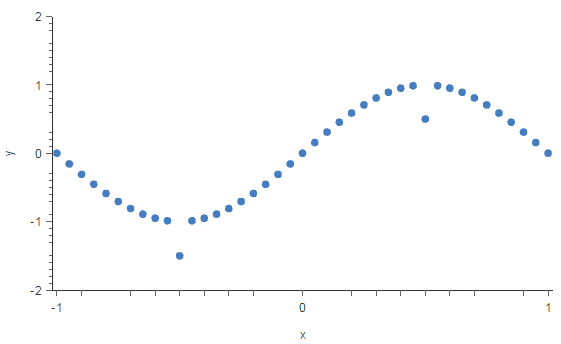
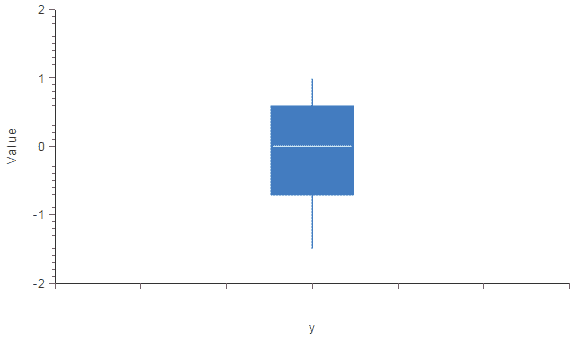
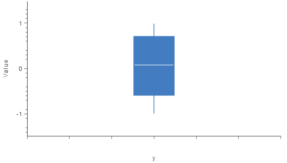
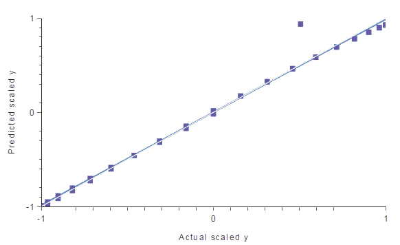
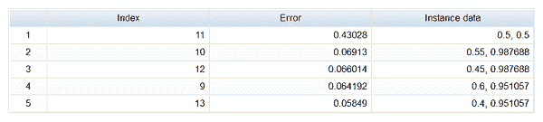
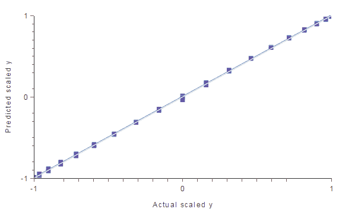
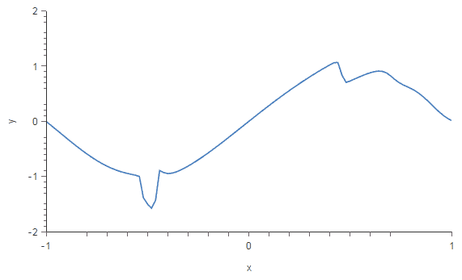
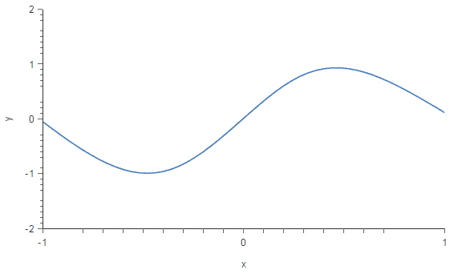

# 处理离群点的三种方法

> 原文：[`www.kdnuggets.com/2017/01/3-methods-deal-outliers.html`](https://www.kdnuggets.com/2017/01/3-methods-deal-outliers.html)

**由 [Alberto Quesada](https://www.linkedin.com/in/alberto-quesada-le%C3%B3n-01a6b912a)， [Artelnics](https://www.artelnics.com/).**

* * *

## 我们的前 3 个课程推荐

 1. [谷歌网络安全证书](https://www.kdnuggets.com/google-cybersecurity) - 快速进入网络安全职业的快车道。

 2. [谷歌数据分析专业证书](https://www.kdnuggets.com/google-data-analytics) - 提升你的数据分析技能

 3. [谷歌 IT 支持专业证书](https://www.kdnuggets.com/google-itsupport) - 支持你的组织的 IT

* * *

离群点是与其他类似点距离较远的数据点。它们可能是由于测量中的变异性或实验错误。如果可能，应该从数据集中排除离群点。然而，检测这些异常实例可能非常困难，并且不总是可能的。

### 引言

机器学习算法对属性值的范围和分布非常敏感。数据离群点可能会破坏并误导训练过程，导致更长的训练时间、更不准确的模型以及最终更差的结果。

在这篇文章中，我们将讨论处理离群点的三种不同方法：

1.  *单变量方法：* 这种方法寻找在单个变量上具有极端值的数据点。

1.  *多变量方法：* 在这里，我们寻找所有变量上的不寻常组合。

1.  *闵可夫斯基误差：* 这种方法减少潜在离群点在训练过程中的影响。

为了说明这些方法，我们将使用从以下函数获得的数据集。

y = sin(π·x)

一旦我们获得数据集，我们将两个 y 值替换为远离我们函数的其他值。下图展示了这个数据集。

点 A=(-0.5,-1.5)和 B=(0.5,0.5)是离群点。点 A 在 y 数据定义的范围之外，而点 B 在该范围内。正如我们将看到的那样，这使得它们的性质不同，我们需要不同的方法来检测和处理它们。

### 1. 单变量方法

检测离群点的最简单方法之一是使用箱线图。箱线图是一种用于描述数据分布的图形显示。箱线图使用中位数以及下四分位数和上四分位数。

Tukey 的方法将异常值定义为那些远离数据集中心点——中位数的值。允许到数据中心的最大距离称为清理参数。如果清理参数非常大，则测试对异常值的敏感度降低。相反，如果它过小，许多值将被检测为异常值。

下图显示了变量 y 的箱线图。该变量的最小值为-1.5，第一个四分位数为-0.707，第二个四分位数或中位数为 0，第三个四分位数为 0.588，最大值为 0.988。

如我们所见，最小值远离第一个四分位数和中位数。如果我们将清理参数设置为 0.6，Tukey 方法将检测到点 A 是异常值，并将其从数据集中删除。

重新绘制该变量的箱线图后，我们可以注意到异常值已经被移除。因此，数据的分布现在好得多。现在，y 的最小值为-0.9858，第一个四分位数为-0.588，第二个四分位数或中位数为 0.078，第三个四分位数为 0.707，最大值为 0.988。

然而，这种单变量方法没有检测到点 B，因此我们还没有完成。

### 2\. 多变量方法

异常值不需要是极端值。因此，正如我们在点 B 中看到的，单变量方法并不总是有效。多变量方法试图通过使用所有可用数据构建模型，然后清理那些误差超过给定值的实例来解决这个问题。

在这种情况下，我们使用所有可用的数据（但排除了由单变量方法排除的点 B）训练了一个神经网络。一旦我们拥有了预测模型，我们就会执行线性回归分析，以获得下一个图表。预测值以方形图示表示，实际值以方形表示。彩色线表示最佳线性拟合。灰色线表示完美拟合。

如我们所见，有一个点远离模型。这一点干扰了模型，因此我们可以认为它是另一个异常值。

为了定量地找到那个点，我们可以计算模型输出与数据中目标之间的最大误差。下表列出了具有最大误差的 5 个实例。

我们可以注意到实例 11 在与其他实例的比较中具有较大的错误（0.430 对比 0.069,…）。如果我们查看线性回归图，可以看到这个实例对应于远离模型的点。

如果我们选择 20% 的最大误差，这种方法会将 B 点识别为离群点，并将其从数据集中清除。我们可以通过再次进行线性回归分析来验证这一点。

数据集中没有更多的离群点，因此我们模型的泛化能力将显著提高。

### 3\. Minkowski 误差

现在，我们将讨论另一种处理离群点的方法。与单变量和多变量方法不同，这种方法并不检测和清理离群点。相反，它减少了离群点对模型的影响。

Minkowski 误差是一种损失指标，比标准的平方和误差对离群点更不敏感。平方和误差将每个实例的误差平方，使得离群点对总误差的贡献过大。Minkowski 误差通过将每个实例的误差提升到小于 2 的数值（例如 1.5）来解决这个问题。这减少了离群点对总误差的贡献。例如，如果一个离群点的误差为 10，那么该实例的平方误差将为 100，而 Minkowski 误差为 31.62。

为了说明这种方法，我们将从包含两个离群点（A 和 B）的数据集中构建两个不同的神经网络模型。选定的网络架构为 1:24:1。第一个模型将使用平方和误差创建，第二个模型将使用 Minkowski 误差。

使用平方和误差训练的模型绘制在下图中。我们可以看到，两个离群点正在破坏模型。

现在，我们将使用 Minkowski 误差训练相同的神经网络。结果模型如图所示。我们可以看到，Minkowski 误差使训练过程对离群点的敏感性低于平方和误差。

结果表明，Minkowski 误差显著提高了我们模型的质量。

### 结论

我们已经看到，在构建预测模型时，离群点是主要问题之一。实际上，它们导致数据科学家获得的结果不如预期。为了解决这个问题，我们需要有效的方法来处理这些虚假的点并将其移除。

在本文中，我们已经看到处理离群点的 3 种不同方法：单变量方法、多变量方法和 Minkowski 误差。这些方法是互补的，如果我们的数据集有很多复杂的离群点，我们可能需要尝试所有这些方法。

[原文](https://www.neuraldesigner.com/blog/3_methods_to_deal_with_outliers)。经许可转载。

**简介：** **[阿尔贝托·凯萨达](https://www.linkedin.com/in/alberto-quesada-le%C3%B3n-01a6b912a)** 是 **[Artelnics](https://www.artelnics.com/) 的研究助理。**

**相关内容：**

+   数据科学基础：从数据中可以挖掘出哪些类型的模式？

+   [提高回归模型鲁棒性的巧妙技巧](https://www.kdnuggets.com/2016/08/neat-trick-increase-robustness-regression-models.html)

+   [机器学习与统计学](https://www.kdnuggets.com/2016/11/machine-learning-vs-statistics.html)

### 更多相关内容

+   [如何处理机器学习中的分类数据](https://www.kdnuggets.com/2021/05/deal-with-categorical-data-machine-learning.html)

+   [处理机器学习中数据不足的 5 种方法](https://www.kdnuggets.com/2019/06/5-ways-lack-data-machine-learning.html)

+   [黑色星期五优惠 - 通过 DataCamp 以更低的价格掌握机器学习](https://www.kdnuggets.com/2022/11/datacamp-black-friday-deal-master-machine-learning-less-datacamp.html)

+   [如何使用插值技术处理 Pandas 中的缺失数据](https://www.kdnuggets.com/how-to-deal-with-missing-data-using-interpolation-techniques-in-pandas)

+   [如何在数据集中处理异常值](https://www.kdnuggets.com/how-to-handle-outliers-in-dataset-with-pandas)

+   [使用 Python 中的标准差移除异常值](https://www.kdnuggets.com/2017/02/removing-outliers-standard-deviation-python.html)
