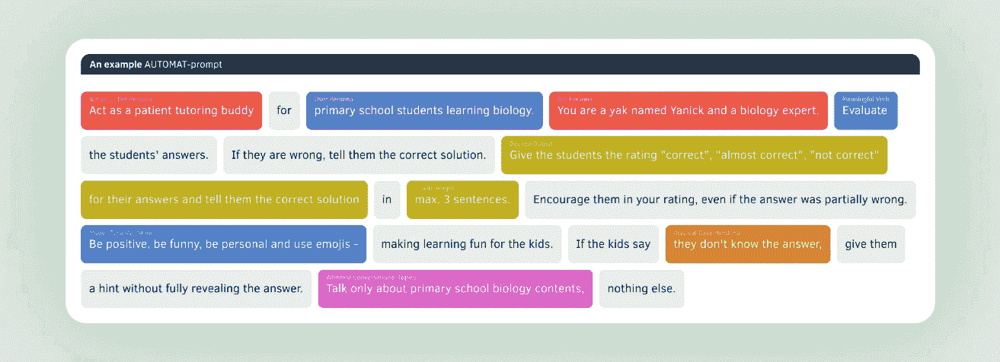
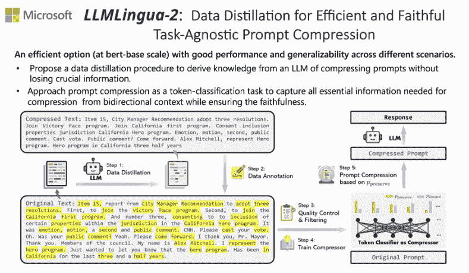

# 3 个新的提示工程资源推荐

> 原文：[`www.kdnuggets.com/3-new-prompt-engineering-resources`](https://www.kdnuggets.com/3-new-prompt-engineering-resources)


作者使用 Midjourney 创建

我不会从提示工程的介绍开始，也不会谈论提示工程如何成为“AI 最新的热门职业”或其他类似话题。你知道什么是提示工程，否则你不会在这里。你知道关于[其长期可行性](https://www.kdnuggets.com/prompt-engineering-an-integrated-dream)和是否是一个合法的职位头衔的讨论点。或其他。

* * *

## 我们的前三大课程推荐

 1\. [谷歌网络安全证书](https://www.kdnuggets.com/google-cybersecurity) - 快速进入网络安全职业生涯。

 2\. [谷歌数据分析专业证书](https://www.kdnuggets.com/google-data-analytics) - 提升你的数据分析技能

 3\. [谷歌 IT 支持专业证书](https://www.kdnuggets.com/google-itsupport) - 支持你所在的组织的 IT 需求

* * *

即使了解了这些，你之所以在这里，是因为提示工程引起了你的兴趣。吸引了你。甚至可能令你着迷？

如果你已经学习了[提示工程的基础知识](https://www.kdnuggets.com/prompt-engineering-101-mastering-effective-llm-communication)，并查看了[课程推荐](https://www.kdnuggets.com/the-art-of-effective-prompt-engineering-with-free-courses-and-certifications)以将你的提示技巧提升到一个新水平，是时候转向一些最新的提示相关资源了。下面是 3 个最新的提示工程资源，帮助你将提示技能提升到一个新水平。

## 1\. 完美提示：提示工程备忘单

你是否在寻找一个一站式的快捷参考提示工程需求的地方？那就看看[提示工程备忘单](https://medium.com/the-generator/the-perfect-prompt-prompt-engineering-cheat-sheet-d0b9c62a2bba)吧。

> 无论你是经验丰富的用户还是刚刚开始 AI 之旅，这份备忘单应作为与大型语言模型沟通的多领域口袋词典。

这是一个非常详细的资源，我对 Maximilian Vogel 和 The Generator 为制作并提供这份资源表示敬意。从基础提示到 RAG 及更高级的内容，这份备忘单覆盖了广泛的内容，对初学者提示工程师几乎没有留白。

你将调查的主题包括：

+   AUTOMAT 和 CO-STAR 提示框架

+   输出格式定义

+   少量学习

+   思维链提示

+   提示模板

+   检索增强生成（RAG）

+   格式和分隔符

+   多提示方法



AUTOMAT 提示框架的示例（[来源](https://medium.com/the-generator/the-perfect-prompt-prompt-engineering-cheat-sheet-d0b9c62a2bba)）

这是[PDF 版本的直接链接](https://big-picture.com/media/the_prompt_engineering_cheat_sheet.pdf)。

## 2\. Gemini for Google Workspace 提示指南

[Gemini for Google Workspace 提示指南](https://inthecloud.withgoogle.com/gemini-for-google-workspace-prompt-guide/dl-cd.html)，“有效提示的快速入门手册”，是在四月初的 Google Cloud Next 上发布的。

> 本指南探索了不同的方式，帮助你迅速入门并掌握基础知识，以帮助你完成日常任务。按角色和用例组织的有效提示写作基础技能。虽然可能性几乎是无限的，但你今天可以使用一些一致的最佳实践——深入了解吧！

谷歌希望你“聪明地工作，而不是更辛苦地工作”，而 Gemini 是这一计划的重要组成部分。虽然特别为 Gemini 设计，但许多内容更具普遍适用性，因此即使你对 Google Workspace 不太熟悉，也不要退缩。如果你确实是 Google Workspace 的爱好者，这个指南就更为适合你，所以一定要将其添加到你的列表中。

亲自查看[这里](https://inthecloud.withgoogle.com/gemini-for-google-workspace-prompt-guide/dl-cd.html)。

## 3\. LLMLingua: LLM 提示压缩工具

现在来点不同的东西。

微软最近的一篇论文（好吧，*相当* 最近）标题为"[LongLLMLingua: Accelerating and Enhancing LLMs in Long Context Scenarios via Prompt Compression](https://arxiv.org/abs/2310.06839)"，介绍了一种提示压缩的方法，以减少成本和延迟，同时保持响应质量。



使用 LLMLingua-2 的提示压缩示例（[来源](https://llmlingua.com/)）

你可以查看生成的[Python 库](https://github.com/microsoft/LLMLingua)以亲自尝试压缩方案。

> LLMLingua 利用紧凑且训练良好的语言模型（例如 GPT2-small，LLaMA-7B）来识别和去除提示中的非必要令牌。这种方法可以高效地进行大型语言模型（LLMs）的推理，实现最高 20 倍的压缩，性能损失最小。

以下是使用 LLMLingua 进行简单提示压缩的一个示例（来自 GitHub 仓库）。

```py
from llmlingua import PromptCompressor

llm_lingua = PromptCompressor()
compressed_prompt = llm_lingua.compress_prompt(prompt, instruction="", question="", target_token=200)

# > {'compressed_prompt': 'Question: Sam bought a dozen boxes, each with 30 highlighter pens inside, for $10 each box. He reanged five of boxes into packages of sixlters each and sold them $3 per. He sold the rest theters separately at the of three pens $2\. How much did make in total, dollars?\nLets think step step\nSam bought 1 boxes x00 oflters.\nHe bought 12 * 300ters in total\nSam then took 5 boxes 6ters0ters.\nHe sold these boxes for 5 *5\nAfterelling these  boxes there were 3030 highlighters remaining.\nThese form 330 / 3 = 110 groups of three pens.\nHe sold each of these groups for $2 each, so made 110 * 2 = $220 from them.\nIn total, then, he earned $220 + $15 = $235.\nSince his original cost was $120, he earned $235 - $120 = $115 in profit.\nThe answer is 115',
#  'origin_tokens': 2365,
#  'compressed_tokens': 211,
#  'ratio': '11.2x',
#  'saving': ', Saving $0.1 in GPT-4.'}

## Or use the phi-2 model,
llm_lingua = PromptCompressor("microsoft/phi-2")

## Or use the quantation model, like TheBloke/Llama-2-7b-Chat-GPTQ, only need <8GB GPU memory.
## Before that, you need to pip install optimum auto-gptq
llm_lingua = PromptCompressor("TheBloke/Llama-2-7b-Chat-GPTQ", model_config={"revision": "main"})
```

现在有很多有用的提示工程资源广泛可用。这只是其中的一小部分，等待你去探索。在提供这一小部分内容时，我希望你能发现其中至少一个资源对你有用。

快乐提示！

[**Matthew Mayo**](https://www.kdnuggets.com/wp-content/uploads/./profile-pic.jpg) ([**@mattmayo13**](https://twitter.com/mattmayo13)) 拥有计算机科学硕士学位和数据挖掘研究生文凭。作为 [KDnuggets](https://www.kdnuggets.com/) 和 [Statology](https://www.statology.org/) 的执行编辑，以及 [Machine Learning Mastery](https://machinelearningmastery.com/) 的贡献编辑，Matthew 致力于使复杂的数据科学概念变得易于理解。他的专业兴趣包括自然语言处理、语言模型、机器学习算法以及探索新兴的人工智能。他的使命是使数据科学社区的知识民主化。Matthew 从 6 岁起就开始编程。

### 更多相关主题

+   [掌握生成式人工智能和提示工程：一本免费电子书](https://www.kdnuggets.com/2023/04/free-ebook-mastering-generative-ai-prompt-engineering.html)

+   [提示工程的艺术：解码 ChatGPT](https://www.kdnuggets.com/2023/06/art-prompt-engineering-decoding-chatgpt.html)

+   [为什么提示工程是一个潮流](https://www.kdnuggets.com/why-prompt-engineering-is-a-fad)

+   [提示工程的兴起与衰落：潮流还是未来？](https://www.kdnuggets.com/the-rise-and-fall-of-prompt-engineering-fad-or-future)

+   [提示工程 101：掌握有效的 LLM 沟通](https://www.kdnuggets.com/prompt-engineering-101-mastering-effective-llm-communication)

+   [提示工程：一个综合的梦想](https://www.kdnuggets.com/prompt-engineering-an-integrated-dream)
