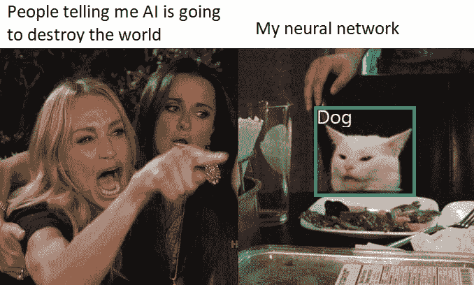
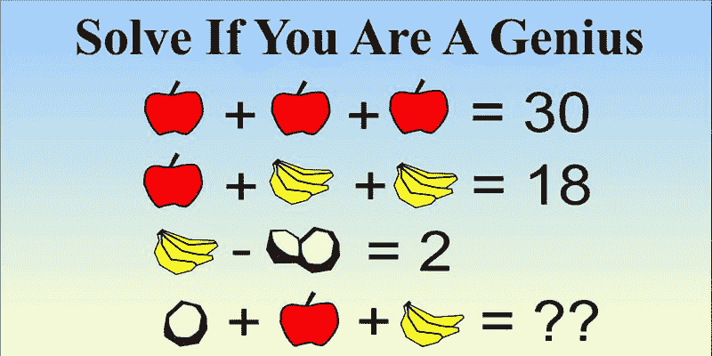
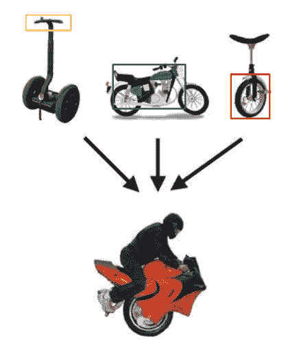
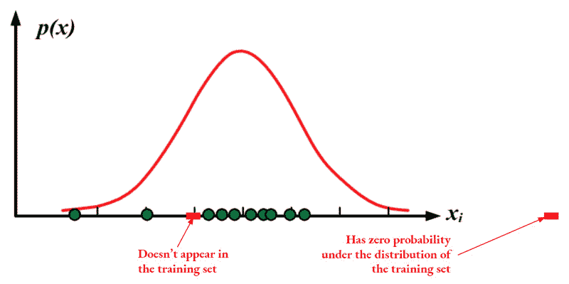
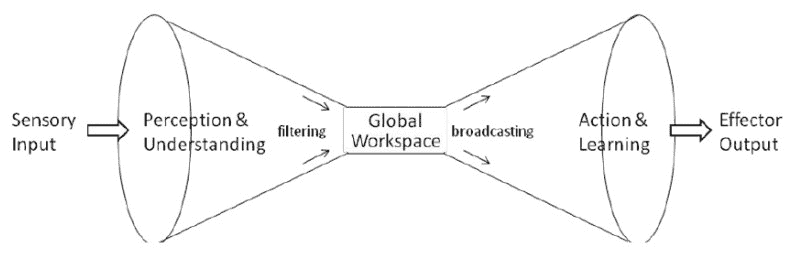

# 我们距离实现通用人工智能的 3 个原因

> 原文：[`www.kdnuggets.com/2020/04/3-reasons-far-from-artificial-general-intelligence.html`](https://www.kdnuggets.com/2020/04/3-reasons-far-from-artificial-general-intelligence.html)

评论

**[Etienne Bennequin](https://www.linkedin.com/in/etienne-bennequin-55931a101)，数据科学家 @ Sicara**

这又发生了。上周，当我向某人解释我的工作时，他们打断我说：“所以你是在建设天网。”我觉得我必须给他们展示这个表情包，我认为它很准确地描述了我当前的状况。

<picture></picture>

### 通用人工智能与实用思维

不用说，超人类人工智能还远未实现。不过，我认为公众对超智能计算机统治世界的想法非常着迷。这种着迷有一个名字： [奇点](https://www.researchgate.net/publication/265489594_Singularity_hypotheses_A_scientific_and_philosophical_assessment)神话。

奇点是指人工智能进入指数改进过程的时间点。一个如此智能的软件，可以越来越快地自我改进。在这一点上，技术进步将成为人工智能的专属行为，对人类物种的命运产生不可预见的影响。

奇点与通用人工智能的概念相关联。 [通用人工智能](https://www.zdnet.com/article/what-is-artificial-general-intelligence/) 可以定义为能够执行任何人类能够执行的任务的人工智能。我发现这个概念比奇点的概念更有趣，因为它的定义至少有一点具体。

因此，你可以决定一个算法是否为通用人工智能。我，一个人类，可以设计切实可行且创新的解决方案来增加你的数据的价值。目前的人工智能软件无法做到这一点。因此，它们还未达到通用人工智能的水平。

更有用的是：如果我们能够识别出人类智能的特征，那么我们可以知道我们的算法缺少了什么。然后我们可以加以改进。

让我们来做这件事。

### 我们如何描述人类智能？

我们将通用人工智能（AGI）定义为至少能够匹配人类智能能力的人工智能。如果我们想进一步探讨，了解什么构成了人类智能将是有益的。

我们有两个选择：要么我们关注人类智能的本质，要么我们关注其特征。本质是它的来源。特征是我们如何识别它。

有[成千上万的理论](https://www.britannica.com/science/human-intelligence-psychology/Cognitive-theories)旨在定义人类智力的性质，涵盖心理学、生物学、遗传学、社会学、认知科学、数学、神学等领域……我对这些领域几乎一无所知。好消息是：我们只需专注于人类智力的特征描述。

如果我们想更接近人工通用智能，我们最好的办法不是试图复制人脑。AGI 的定义是功能性的：一个能够做任何人类可以做的事情的 AI。那么，人类智能能做什么呢？

当然，我们不能在这里列出一个详尽的清单。但我们可以想到很多特征：

+   抽象推理，

+   从过去的经验中学习，

+   元素的组合，

+   适应新环境，

+   创造力，

+   同理心，

+   感知，

+   问题解决，

+   沟通，

+   如果你愿意，可以继续在评论中讨论。

我答应给你三条我们离实现人工通用智能还很远的理由。因此，我将随意选择三个人类智能的特征，这些特征是我们目前的算法所不具备的：

+   超出分布的泛化

+   组合性

+   有意识的推理

公平地说，这并不是那么随意。我们将专注于这三个人类智能的特征，因为我们有实现这些特征的想法。这不是很令人兴奋吗？

### 人工通用智能，逐项特征

### 超出分布的泛化

根据[结构性认知可塑性](https://www.thinkingconnections.org/theory/SCM.shtml)理论，智力被定义为“人类独特的倾向，即改变或修改其认知功能的结构以适应生活情况的变化需求”。不可否认的是，我们人类非常擅长适应重大变化。在最年轻的年龄阶段，我们的身体和环境变化非常快，但婴儿能够适应这些变化并继续学习。

但在当前的机器学习状态下，没有办法让 AI 适应如此剧烈的变化。我认为我有一个完美的例子来展示我们目前的状况。

### ObjectNet 的例子

几个月前，MIT 的学生发布了[ObjectNet](http://news.mit.edu/2019/object-recognition-dataset-stumped-worlds-best-computer-vision-models-1210)。这是一个用于物体识别算法测试的数据集。它完全由来自奇怪角度或不寻常环境的物体图片组成。

床上的烤箱手套或手上的锤子只是 ObjectNet 中幻想的两个例子

人类从来不会在识别这些物体时遇到任何问题。因此，人工通用智能也不会。然而，当在这个数据集上进行测试时，最先进算法的准确率相比于它们在 ImageNet 常规测试集上的表现下降了 40-45%。即使这些算法已经训练过成千上万的锤子或烤箱手套，当它们在之前未见过的环境中出现时，它们也无法识别。

其原因在于，最先进的机器学习算法在超出它们所训练的分布范围时，泛化能力较差。它们擅长的是在这个分布内部进行外推。这意味着，如果你展示给它们一张与它们已经经历过的图像相似的图像，只要这张图像在它们从已经展示给它们的图像中建立的世界观中具有很高的概率存在，它们就能很好地处理这张图像。但目前，人工智能的想象能力非常有限。这使得它们的世界观过于受限于已展示的例子。

### 元学习与组成性

但为什么我们人类在这个泛化问题上做得很好？最先进的算法缺乏什么以达到人工通用智能？我对此有两个回答。当然，这并不是详尽无遗，但对我来说，它们提供了令人满意的改进方向。

第一个原因是 [元学习](https://www.sicara.ai/blog/2019-07-30-image-classification-few-shot-meta-learning)。元学习可以定义为 [学习如何学习](https://www.springer.com/gp/book/9780792380474)。我们说一个智能体（人类或人工智能）在学习，是指它在特定任务上的表现随着对该任务的经验而提高。相比之下，当一个智能体在新任务上的表现随着经验和任务数量的增加而提高时，我们说它在学习如何学习。

因此，元学习的目标是开发能够快速而高效地适应新任务的算法。因此，元学习算法通常在训练分布之外的泛化能力更强，因为它们没有被训练成专注于某一任务。它们被训练成适应新的、以前不太可能的数据。人类是元学习的冠军，因为

1.  他们一生中接受了各种各样任务的训练；

1.  他们受益于祖先的经验。自然选择是进化的训练策略。我们和所有其他物种一样，继承了从所有前代祖先那里学习到的基因，这些祖先生活在不可想象的多样的情况和环境中。这是我能想到的最令人印象深刻的元学习例子。

我可以提供的第二个解释，为什么人类在将知识泛化到未见过的情况时比机器学习算法要好，是组成性。我为此准备了整整一章内容。

### 组成性

组成性的意义可能乍看不清楚。Chrome 甚至坚持说这不是一个词。所以我们从定义开始。组成性是从有限的组合集中学习关于更大组合集的知识。让我们看看这个典型社交网络垃圾的例子。

<picture></picture>

### 你是天才吗？

这是一个非常好的组成性例子。从有限的三个元素（这里是苹果、香蕉和椰子）的组合状态，你应该能够推断出这些元素的新组合的价值。

组成性与语言哲学等方面密切相关。组成性原理指出，一个表达的意义由组成该表达的元素及其组合方式决定。 “People love apples”有特定的意义，而“Apples love people”则有另一种意义。相同的元素，但组合方式不同。

更普遍地说，我们总是在组合元素。为了发明新概念、新对象，并理解它们。在 2015 年，Brenden Lake 和他的团队在他们的论文《通过概率程序归纳进行人类级别的概念学习》中选择了交通工具的例子。

这个奇怪的独轮车是由其他交通工具的元素重组而成的。

通过组成性，我们能够轻松地想象新对象。总之，我们可以利用我们对一组对象的了解来学习构成这些对象的概念，因此我们可以推断出在训练数据集的分布下概率为零的新对象。

### 数学插曲：零概率

“概率为零”不同于“没有出现过”

在训练数据集的分布下，零概率意味着什么？在上图中，训练数据集是由绿色点表示的所有示例集合。使用这组示例，大多数机器学习算法建模一个概率分布（这里是高斯模型）。

这表示算法认为最可能发生的情况。一些情况，通常因为它们接近训练集中实际发生的情况，在训练分布下有很高的概率，即使我们从未实际看到它们发生。机器学习算法在处理这些情况时非常有效。

在训练数据集分布下，其他情况的概率为零。这并不意味着它们不会发生。它只是意味着这些情况不在算法对世界的理解范围内，基于它在训练数据集中的观察。算法对这些情况处理得非常差。

然而，通过使用组合性，我们已经看到可以通过重新组合已经见过的案例的元素来生成这些案例。这是一个极大的机会，可以拓宽机器学习算法的视角。到目前为止，我相信这是我们在实现或许有一天在遥远未来实现人工通用智能的最佳改进方向之一。

### 意识

意识是一个非常大的词汇。像所有非常大的词汇一样，它有很多复杂的定义。有些人考虑意识的本质，有些人考虑其功能。每次都从不同的角度来探讨。我们不会尝试涵盖整个意识的概念。我们将专注于有意识的推理。

当我们以主动的方式思考时，我称之为有意识的推理。例如，当你思考呼吸时，当你有意识地呼吸时，你会交替关注吸气和呼气。这与你不去思考时的情况不同。

很难想象，当你不专注于呼吸（甚至当你在睡觉时），你的身体如何将呼吸处理为吸气和呼气的二元性。这一过程更可能被视为许多生物现象的组合（许多器官的收缩和放松、氧气从空气到血液的转移、二氧化碳从血液到空气的转移……）。

这就是有意识推理的特性：它能够通过非常高层次的概念来处理现实。通常，这些概念可以用词语或句子来表达。为了理解这一点，我在[Yoshua Bengio 在 NeurIPS 2019 的演讲](https://www.youtube.com/watch?v=T3sxeTgT4qc)中听到了最好的例子，这也恰好激发了这篇文章的灵感。

摄影师：[Jaromír Kavan](https://unsplash.com/@jerrykavan)

当你每天开车上下班，每天都是相同的通勤路线时，这一过程变得自动化。你沿着一条你非常熟悉的路径前行，从不去思考。然而，当你开车去一个遥远的朋友家，在一个你从未去过的城市时，你的驾驶方式完全不同。你会更加专注。你积极思考每一个转弯，阅读每一个标志。

这种操控高级概念的能力是现代最先进的机器学习算法所缺乏的另一点。幸运的是，仍然存在希望。

### 全球工作空间理论

<picture></picture>

在认知科学中，[全球工作空间理论](https://en.wikipedia.org/wiki/Global_workspace_theory)建议存在信息瓶颈。在每一时刻，只有极少量的所有感知信息通过这个瓶颈进行过滤，并在整个大脑中广播。信息的连续流动概念已受到社区的广泛质疑。然而，这里有一个有趣的启示。我们在意识推理过程中操控的高级概念是基于低级的、高维度的信息。这些感知都进入了瓶颈。

这为新兴的机器学习领域——注意力机制提供了灵感。它们在 2015 年由 Dzmitry Bahdanau 和蒙特利尔大学的研究人员[首次提出](https://arxiv.org/abs/1409.0473)。自那时以来，注意力机制在神经机器翻译和自然语言处理领域取得了巨大进展，以及其他技术改进。例如，它们提出了一种有效的解决梯度消失问题的方法，这是深度神经网络中的一个常见问题。

注意力机制背后的逻辑很简单：通过一次只关注少量输入元素来简化计算。这听起来熟悉吗？如果我们继续研究注意力机制，我们可能会更接近人类将成千上万的低级感知与少量可以意识操控的高级概念联系起来的能力。

### 好吧，但我们距离通用人工智能还有多远？

我之前提到过：非常遥远。我们必须认识到，在这三个话题中，即使我们可以希望在不久的将来取得巨大进展，我们仍然离人类表现非常遥远。我们还必须记住，这三点是最有前景的改进方向，但解决这些问题不足以实现 AGI。

通用人工智能是一个令人兴奋的流行词，因为它要么是巨大的承诺，要么是可怕的威胁。像其他流行词一样，它必须小心处理。我必须承认，在这篇文章中，我把它当作引起你对意识推理、组合性和分布外泛化的注意的借口。因为与奇点或 AGI 不同，它们代表了改进机器学习算法的实际方法，并真正提升人工智能的表现。

我希望你在阅读这篇文章时过得愉快。我也希望当你读到最后几段时，你对如何从人类智能中学习以改进我们的算法充满了渴望。如果是这样，我建议你花时间观看[这个由 Yoshua Bengio 主讲的会议](https://www.youtube.com/watch?v=T3sxeTgT4qc)，它启发了这篇文章。如果你会说法语，你还可以观看[这个视频](https://www.youtube.com/watch?v=58Dh6aoUJ_8&t=1s)，在其中我向 Sicara 团队解释了这些概念。

**简介: [Etienne Bennequin](https://www.linkedin.com/in/etienne-bennequin-55931a101)** (**[@bennequin](https://twitter.com/bennequin)**) 是 Sicara 的数据科学家。

[原文](https://www.sicara.ai/blog/artificial-general-intelligence)。经许可转载。

**相关：**

+   人工智能中的当前炒作周期

+   人工智能/机器驱动的世界是否优于人类驱动的世界？

+   AGI/深度学习的联系

* * *

## 我们的前三大课程推荐

 1\. [Google 网络安全证书](https://www.kdnuggets.com/google-cybersecurity) - 快速进入网络安全职业轨道

 2\. [Google 数据分析专业证书](https://www.kdnuggets.com/google-data-analytics) - 提升您的数据分析技能

 3\. [Google IT 支持专业证书](https://www.kdnuggets.com/google-itsupport) - 支持您组织的 IT 需求

* * *

### 了解更多相关话题

+   [人工智能/机器学习技术整合将如何帮助企业实现……](https://www.kdnuggets.com/2021/12/aiml-technology-integration-help-business-achieving-goals-2022.html)

+   [避免数据科学职业的前 5 个理由](https://www.kdnuggets.com/2022/04/top-5-reasons-avoid-data-science-career.html)

+   [通用语义层对您的数据堆栈有益的 6 个原因](https://www.kdnuggets.com/2024/01/cube-6-reasons-why-a-universal-semantic-layer-is-beneficial)

+   [为何应使用线性回归模型而非……](https://www.kdnuggets.com/2021/08/3-reasons-linear-regression-instead-neural-networks.html)

+   [不应使用机器学习的 4 个理由](https://www.kdnuggets.com/2021/12/4-reasons-shouldnt-machine-learning.html)

+   [数据科学家应使用 LightGBM 的 3 个理由](https://www.kdnuggets.com/2022/01/data-scientists-reasons-lightgbm.html)
