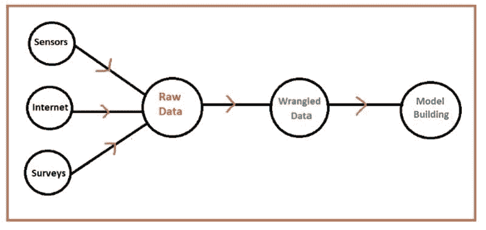
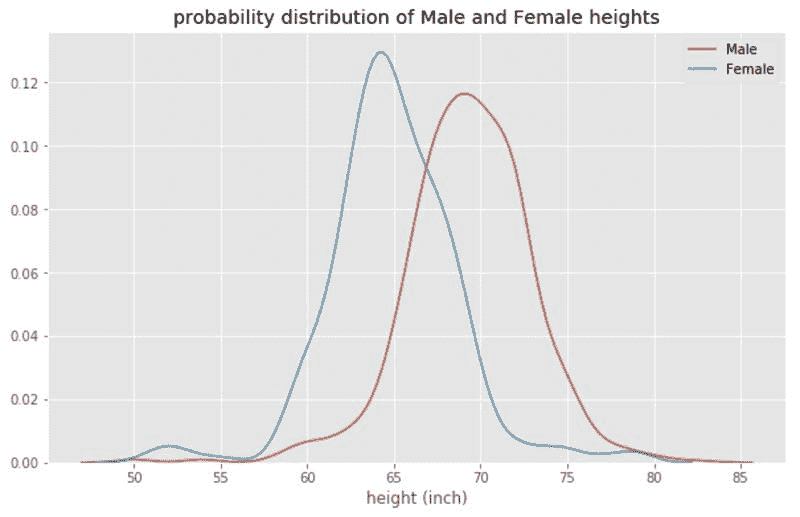
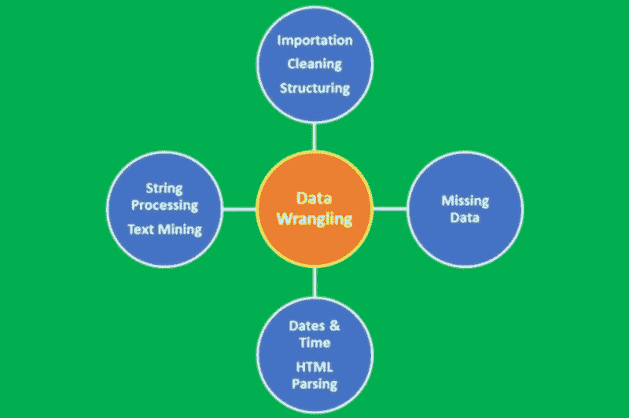

# 利用数据的力量的三步骤

> 原文：[`www.kdnuggets.com/2022/05/3-steps-harnessing-power-data.html`](https://www.kdnuggets.com/2022/05/3-steps-harnessing-power-data.html)



数据收集、清洗、转换和分析过程的示意图。图像来源：作者。

## **关键要点**

* * *

## 我们的前三大课程推荐

 1\. [谷歌网络安全证书](https://www.kdnuggets.com/google-cybersecurity) - 快速进入网络安全职业的快车道。

 2\. [谷歌数据分析专业证书](https://www.kdnuggets.com/google-data-analytics) - 提升你的数据分析技能

 3\. [谷歌 IT 支持专业证书](https://www.kdnuggets.com/google-itsupport) - 支持组织的 IT 工作

* * *

+   在今天这个信息技术驱动的世界里，数据的产生量达到了前所未有的水平。

+   为了充分提取数据的力量，必须收集、处理、转换和分析数据以发挥其作用。

数据现在被视为一种新的“黄金”。每天产生的数据量是前所未有的。虽然原始数据有用，但数据的真正力量来自于经过不同方法（如描述性、预测性和指导性分析）精炼、清洗、转换和分析后的数据，这将在本文中讨论。

# 第一步：原始数据及其来源

原始数据可以从多个来源获取，例如传感器、互联网或调查。原始数据通常包含一些影响其质量的缺陷，如下所述。

**错误数据：** 数据收集在不同层次上可能产生错误。例如，一项调查可能被设计用来收集数据。然而，参与调查的个人可能不会总是提供正确的信息。例如，参与者可能输入错误的年龄、身高、婚姻状态或收入信息。数据收集中的错误也可能发生在用于记录和收集数据的系统出现故障时。例如，温度计中的传感器故障可能导致温度计记录错误的温度数据。人为错误也可能导致数据收集错误，例如，技术人员在数据收集过程中可能错误地读取仪器。

由于调查通常是随机的，几乎不可能防止参与者提供虚假数据。通过定期对测量仪器进行质量保证检查，可以减少仪器收集数据时的误差，以确保它们在最佳状态下运行。通过让第二名技术人员或人员重新检查读数，可以减少从仪器读取结果时的人为错误。

**缺失数据**：大多数数据集包含缺失值。处理缺失数据的最简单方法是直接丢弃数据点。然而，移除样本或丢弃整个特征列并不可行，因为我们可能会丢失过多有价值的数据。在这种情况下，我们可以使用不同的插值技术来估算数据集中其他训练样本的缺失值。最常见的插值技术之一是**均值插补**，即用整个特征列的均值替代缺失值。其他插补缺失值的选项包括**中位数**或最**频繁值（众数）**，其中后者用最频繁的值替代缺失值。无论你在模型中采用哪种插补方法，都必须记住插补只是一个近似值，因此可能会在最终模型中产生误差。如果数据已经被预处理，你需要找出缺失值是如何处理的。原始数据中有多少比例被丢弃？使用了什么插补方法来估算缺失值？

**数据中的异常值**：异常值是指与数据集其他部分非常不同的数据点。异常值通常只是错误数据，例如，由于传感器故障、实验污染或记录数据时的人为错误。有时，异常值可能表示某些真实情况，比如系统故障。异常值非常常见，尤其在大数据集中更为常见。异常值会显著降低机器学习模型的预测能力。处理异常值的常见方法是简单地忽略这些数据点。然而，删除真实的数据异常值可能过于乐观，导致不切实际的模型。

**数据冗余**：具有数百或数千个特征的大型数据集通常会导致冗余，特别是当特征彼此相关时。在一个高维数据集上训练模型，特征过多有时会导致过拟合（模型同时捕捉真实和随机效应）。此外，一个过于复杂的模型具有过多特征可能难以解释。解决冗余问题的一种方法是通过特征选择和降维技术，例如 PCA（主成分分析）。

**数据不平衡**：数据不平衡发生在数据集中不同类别的数据比例不相等时。一个不平衡数据集的例子可以通过 [**高度**](https://github.com/bot13956/Bayes_theorem) 数据集来演示。

```py

import numpy as np import pandas as pd
df = pd.read_csv(“heights.csv”)
plt.figure()
sns.countplot(x=”sex”, data = df)
plt.show
```


**图 1**. 数据集分布。N=1050：812（男性）和 238（女性）身高。这显示我们有一个非常不平衡的数据集，其中 77%是男性身高，23%是女性身高。图片由作者提供。

从**图 1**中，我们可以观察到数据集在男性和女性类别之间不均匀。如果你想计算数据的平均身高，这会得到一个偏向男性平均身高的值。处理这个问题的一种方法是计算每个类别的平均身高，如**图 2**所示。



**图 2**。男女身高分布。图片来源：作者。

**数据变异性的缺乏**：当数据集包含的特征太少，不能代表整体情况时，数据集就缺乏变异性。例如，基于面积预测房价的数据集缺乏变异性。解决这个问题的最佳方法是包括更多的代表性特征，如卧室数量、浴室数量、建造年份、地块大小、HOA 费用、邮政编码等。

**动态数据**：在这种情况下，数据不是静态的，而是依赖于时间并且每次都在变化，例如股票数据。在这种情况下，应使用时间序列分析等时间依赖性分析工具来分析数据集并进行预测建模（预测）。

**数据的大小**：在这种情况下，样本数据的大小可能太小，不具代表性。这可以通过确保样本数据集足够大并代表总体来解决。一个包含大量观察值的大样本将减少方差误差（根据[**中心极限定理**](https://towardsdatascience.com/proof-of-central-limit-theorem-using-monte-carlo-simulation-34925a7bc64a)样本大小增加会减少方差误差）。较大样本的主要缺点是收集数据可能需要大量时间。此外，使用非常大数据集构建机器学习模型在计算时间（训练和测试模型所需的时间）方面可能非常昂贵。

# 第 2 步：数据整理



**图 3**：数据整理过程。图片来源：作者

数据整理是将数据从原始形式转换为准备好进行分析的整洁形式的过程。数据整理是数据预处理中的一个重要步骤，包括数据导入、数据清洗、数据结构化、字符串处理、HTML 解析、处理日期和时间、处理缺失数据以及文本挖掘等多个过程。

数据整理过程是任何数据科学家的关键步骤。在数据科学项目中，数据很少可以轻松访问以进行分析。数据更可能存在于文件、数据库中，或从网页、推文或 PDF 等文档中提取。了解如何整理和清洗数据将使你能够从数据中提取出本来隐藏的关键洞察。

# 第 3 步：数据分析

在原始数据被清理、处理和转换之后，最后也是最重要的步骤是分析数据。我们将讨论三类数据分析技术，即描述性分析、预测性分析和预测性分析。

## **(i) 描述性数据分析**

这涉及使用数据进行故事讲述或数据可视化，使用条形图、折线图、直方图、散点图、对角图、密度图、QQ 图等。用于描述性数据分析的一些常见包包括

+   Matplotlib

+   Ggplot2

+   Seaborn

## **(ii) 预测数据分析**

这涉及使用数据建立预测模型，这些模型可以用于对未见过的数据进行预测。一些用于预测分析的常见包包括

+   Sci-kit learn 包

+   Caret 包

+   Tensorflow

预测数据分析可以进一步分为以下几类：

**a) 监督学习（连续变量预测）**

+   基本回归

+   多重回归分析

**b) 监督学习（离散变量预测）**

+   逻辑回归分类器

+   支持向量机分类器

+   K-最近邻（KNN）分类器

+   决策树分类器

+   随机森林分类器

**c) 无监督学习**

+   K 均值聚类算法

## **(iii) 规范性数据分析**

这涉及使用数据建立可以根据从数据中得出的洞察来制定行动方案的模型。一些规范性数据分析技术包括

+   概率建模

+   优化方法和运筹学

+   蒙特卡洛模拟

# **总结**

尽管数据现在的产生量前所未有，但必须对数据进行收集、处理、转换和分析，以发挥其作用。我们讨论了涉及的三个主要阶段：原始数据及其来源；原始数据的处理；以及数据分析。

**[本杰明·O·塔约](https://www.linkedin.com/in/benjamin-o-tayo-ph-d-a2717511/)** 是一位物理学家、数据科学教育者和作家，同时也是 DataScienceHub 的拥有者。之前，本杰明曾在中欧大学、大峡谷大学和匹兹堡州立大学教授工程学和物理学。

### 更多相关内容

+   [揭示 CTGAN 的潜力：利用生成式 AI 实现…](https://www.kdnuggets.com/2023/04/unveiling-potential-ctgan-harnessing-generative-ai-synthetic-data.html)

+   [利用 ChatGPT 实现自动化数据清理和预处理](https://www.kdnuggets.com/2023/08/harnessing-chatgpt-automated-data-cleaning-preprocessing.html)

+   [掌握数据分析的力量：分析数据的四种方法](https://www.kdnuggets.com/2023/03/master-power-data-analytics-four-approaches-analyzing-data.html)

+   [合成数据平台：解锁生成式 AI 的力量以实现…](https://www.kdnuggets.com/2023/07/synthetic-data-platforms-unlocking-power-generative-ai-structured-data.html)

+   [为有效的 Tableau 和 Power BI 仪表板准备数据](https://www.kdnuggets.com/2022/06/prepare-data-effective-tableau-power-bi-dashboards.html)

+   [语义层的力量：数据工程师指南](https://www.kdnuggets.com/2023/10/cube-power-of-a-semantic-layer-a-data-engineers-guide)
