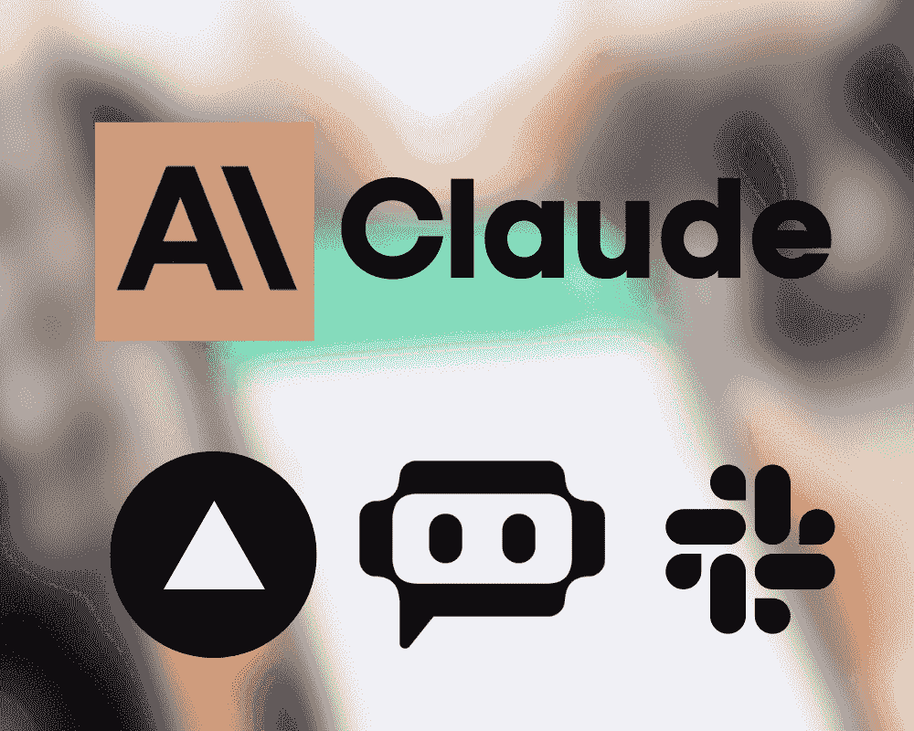
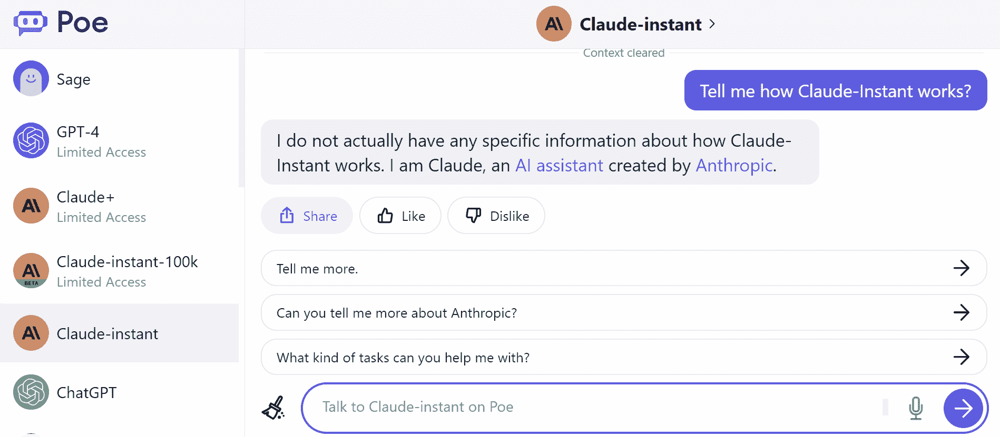
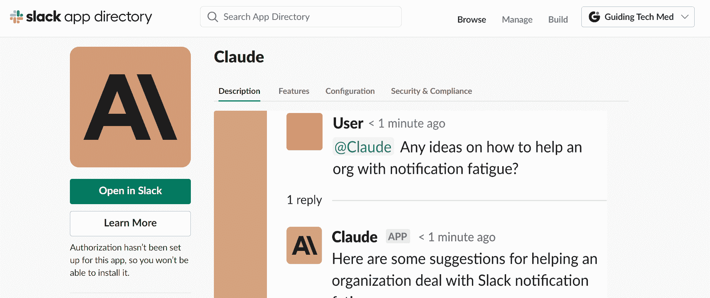
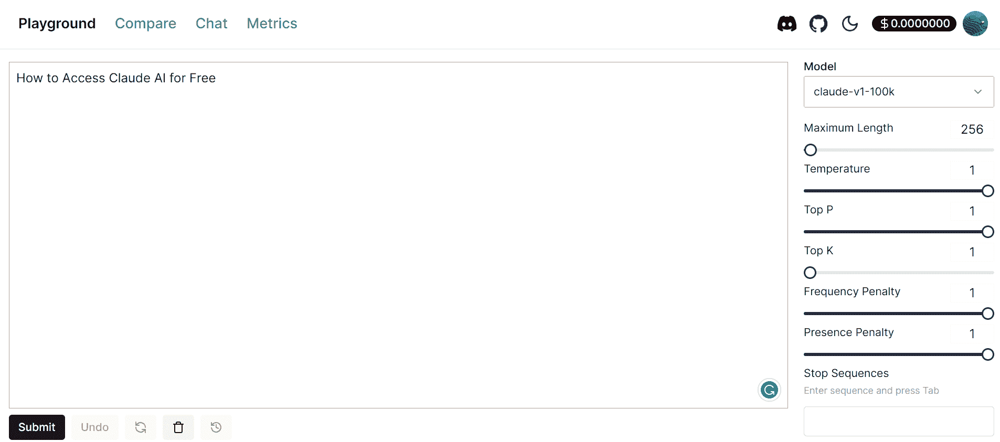

# 免费访问 Claude AI 的 3 种方式

> 原文：[`www.kdnuggets.com/2023/06/3-ways-access-claude-ai-free.html`](https://www.kdnuggets.com/2023/06/3-ways-access-claude-ai-free.html)

图片由作者提供

AI 模型[Claude](https://www.anthropic.com/product)在多个指标上超越了 GPT-3.5 Turbo，其 Claude-Instant-100k 变体的性能接近于 GPT-4。总的来说，你可以期待一次非常吸引人的 AI 对话体验。

* * *

## 我们的前 3 个课程推荐

 1\. [谷歌网络安全证书](https://www.kdnuggets.com/google-cybersecurity) - 快速进入网络安全职业生涯。

 2\. [谷歌数据分析专业证书](https://www.kdnuggets.com/google-data-analytics) - 提升你的数据分析技能

 3\. [谷歌 IT 支持专业证书](https://www.kdnuggets.com/google-itsupport) - 支持你所在组织的 IT 工作

* * *

你可以通过一些尚未广泛公开的方式免费访问和使用 Claude AI 模型。Anthropic 目前正向特定公司和个人提供访问权限，以帮助测试和改进这些模型。

**注意：** 尽管 Anthropic 通过其 API 和应用程序提供 Claude 模型的早期访问，但需求目前超过了供应。获取 Claude 的访问权限可能需要时间，因为 Anthropic 会逐步审查申请并接纳合作伙伴。不能保证所有申请者都会获得访问权限。

在这篇文章中，我们将了解 3 个平台，这些平台提供对最先进的 Claude 模型的免费访问。

# 1\. Vercel AI Playground

[Vercel AI Playground](https://play.vercel.ai/) 是一个免费的、易于使用的工具，允许你试验和比较各种 AI 模型，包括商业和开源选项。通过 AI Playground，你可以与来自 OpenAI、Hugging Face、Cohere、Replicate 和 Anthropic 等公司的对话 AI 模型进行互动。

要在 AI Playground 上试验 Anthropic 的 Claude 模型，你首先需要创建一个免费的 Vercel Hobby 账户。创建账户仅需几分钟。登录后，你可以立即访问 Claude 和 AI Playground 界面中的其他 AI 模型。

图片来自 Vercel AI Playground

# 2\. Poe

[Poe](https://poe.com/Claude-instant) AI 是由 Quora 创建的一个免费的 AI 游乐场，允许你与 AI 对话模型进行互动。创建一个免费的账户后，你可以与 ChatGPT、Claude、Sage 以及 Poe 中的其他定制 AI 选项进行对话。你甚至可以按照指南创建自己的定制模型。

**Poe AI 的一些主要优势包括：**

+   快速响应时间和高正常运行时间。

+   使用没有严格限制。

+   使用 Caude 模型定制 AI 的能力。

+   后续提示的建议。

图片来自 Poe

# 3. Slack 应用

将[Claude](https://slackbot.anthropic.com/slack/install)视为一个致力于帮助你的团队的 AI 助手。简单地与它交流，并给出清晰的逐步指示。Claude 可以协助撰写总结、生成想法、回答问题等。

**通过以下方式在你的 Slack 中安装 Claude：**

1.  点击“更多”按钮

1.  选择“应用程序”

1.  搜索“Claude”

1.  点击“添加到 Slack”

**在 Slack 中与 Claude 互动有两种方式：**

+   在频道和群组 DM 中，在消息中提到**@Claude**。Claude 将在该线程中回复所有人。接着再提到**@Claude**。

+   给 Claude 发送直接消息（私人）。Claude 将直接回复，就像给同事发消息一样。

给 Claude 具体任务，它将尽力高效地协助你的团队。

图片来自 Slack 应用

# 奖励（付费）

如果你想访问各种付费、开源和商业对话 AI 模型，[nat.dev](https://nat.dev/)值得一试。仅需 5 美元的积分，你可以在一个地方测试从 Claude 到其他模型的各种聊天机器人。

图片来自 nat.dev

**[Abid Ali Awan](https://www.polywork.com/kingabzpro)**（[@1abidaliawan](https://twitter.com/1abidaliawan)）是一位认证的数据科学专业人士，喜欢构建机器学习模型。目前，他专注于内容创作和撰写机器学习与数据科学技术的技术博客。Abid 拥有技术管理硕士学位和电信工程学士学位。他的愿景是使用图神经网络构建一个 AI 产品，帮助面临心理健康问题的学生。

### 更多相关信息

+   [免费访问 GPT-4 的 3 种方法](https://www.kdnuggets.com/2023/05/3-ways-access-gpt4-free.html)

+   [免费访问 GPT-4o 的 5 种方法](https://www.kdnuggets.com/5-ways-to-access-gpt-4o-for-free)

+   [ChatGPT 被取代：Claude 如何成为新的 AI 领导者](https://www.kdnuggets.com/2023/07/chatgpt-dethroned-claude-became-new-ai-leader.html)

+   [检测 ChatGPT、GPT-4、Bard 和 Claude 的十大工具](https://www.kdnuggets.com/2023/05/top-10-tools-detecting-chatgpt-gpt4-bard-llms.html)

+   [认识 Gorilla：UC Berkeley 和微软的 API 增强型 LLM…](https://www.kdnuggets.com/2023/06/meet-gorilla-uc-berkeley-microsoft-apiaugmented-llm-outperforms-gpt4-chatgpt-claude.html)

+   [使用 Claude 2 API 入门](https://www.kdnuggets.com/getting-started-with-claude-2-api)
