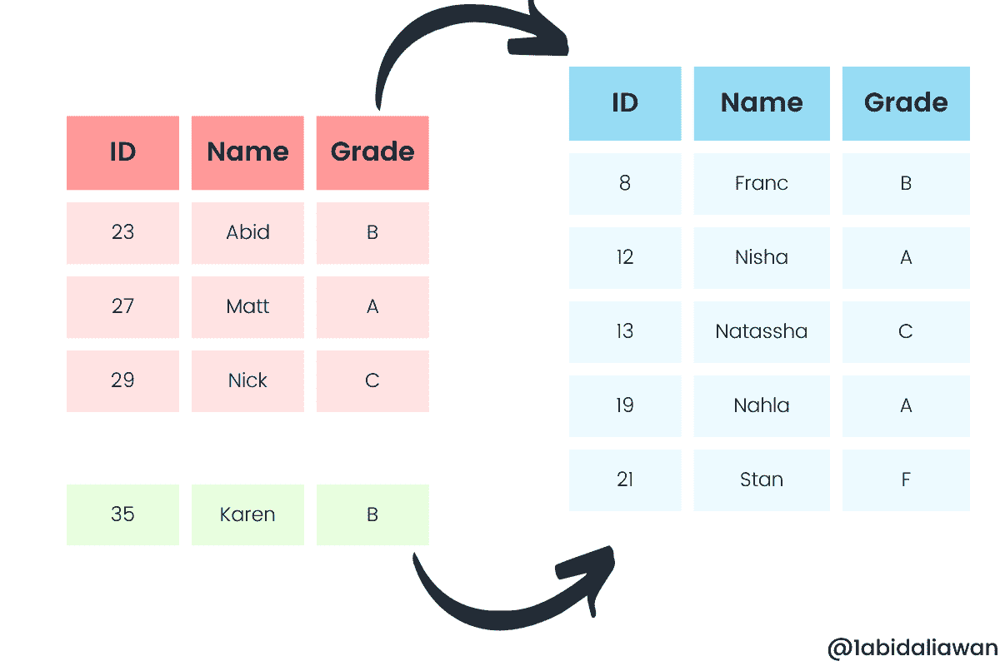
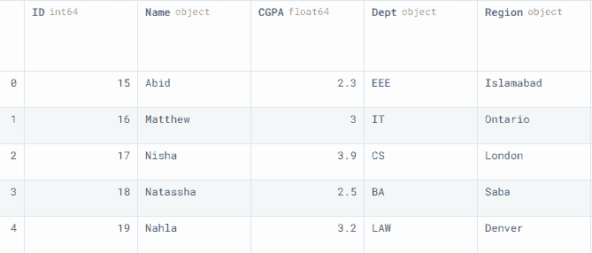
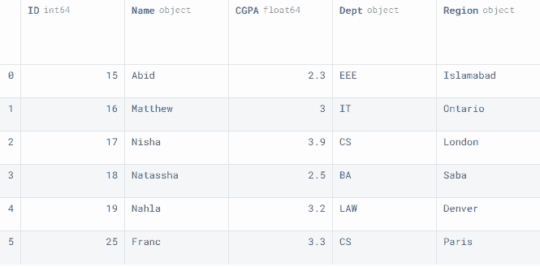
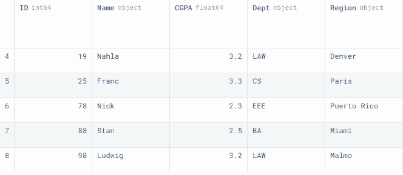
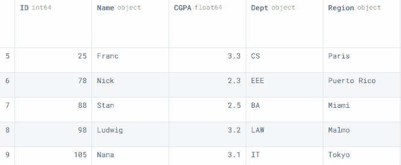
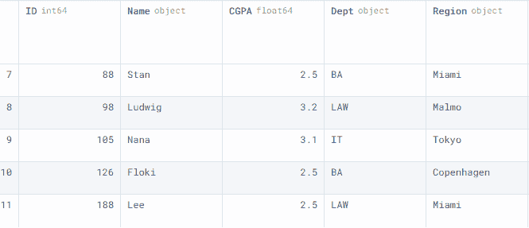

# 3 种将行附加到 Pandas 数据框的方法

> 原文：[`www.kdnuggets.com/2022/08/3-ways-append-rows-pandas-dataframes.html`](https://www.kdnuggets.com/2022/08/3-ways-append-rows-pandas-dataframes.html)



图片来源：作者

在这个迷你教程中，我们将学习三种将行附加到 pandas 数据框中的方法。我们还将学习添加多行的最有效和简单的方法。

* * *

## 我们的前三个课程推荐

 1\. [Google 网络安全证书](https://www.kdnuggets.com/google-cybersecurity) - 快速进入网络安全领域的职业生涯。

 2\. [Google 数据分析专业证书](https://www.kdnuggets.com/google-data-analytics) - 提升您的数据分析技能

 3\. [Google IT 支持专业证书](https://www.kdnuggets.com/google-itsupport) - 支持您的组织的 IT 工作

* * *

# 方法 1

我们将使用 pandas **DataFrame()** 并以字典形式输入数据来创建一个示例数据框，以供在线硕士学位的学生使用。

```py
import pandas as pd

data1 = pd.DataFrame(
    {
        "ID": [15, 16, 17, 18, 19],
        "Name": ["Abid", "Matthew", "Nisha", "Natassha", "Nahla"],
        "CGPA": [2.3, 3.0, 3.9, 2.5, 3.2],
        "Dept": ["EEE", "IT", "CS", "BA", "LAW"],
        "Region": ["Islamabad", "Ontario", "London", "Saba", "Denver"],
    }
)
data1

```

我们有五列和五行不同的行。这将是基础数据框。



我们可以以 pandas Series 的形式附加行。

要将一个 Series 添加到数据框中，我们将在数据框对象后使用**append()**函数，并在括号中添加 Series 对象。**ignore_index** 设置为**True**，以便结果索引将被标记为 0,1,....,n-1。

```py
row1 = pd.Series([25, 'Franc', 3.3, 'CS', 'Paris'], index=data1.columns)
data1 = data1.append(row1,ignore_index=True) 
data1

```

正如我们可以观察到的，我们已经成功地将一名学生的信息添加到数据框中。



类似地，我们也可以附加一个数据框。在我们的案例中，我们创建了一个**data2**数据框，并使用**.append()**函数将多行添加到**data1**中。

```py
data2 = pd.DataFrame(
    {
        "ID": [78, 88, 98],
        "Name": ["Nick", "Stan", "Ludwig"],
        "CGPA": [2.3, 2.5, 3.2],
        "Dept": ["EEE", "BA", "LAW"],
        "Region": ["Puerto Rico", "Miami", "Malmo"],
    }
)

```

要查看最后五行，我们使用了**.tail()**。



# 方法 2

第二种方法相当简单。我们可以创建并附加一个字典到数据框中，使用 append。确保字典遵循下面的格式。每条记录应包含一个列名和相应的值。

```py
row2 = {
    "ID": 105,
    "Name": "Nana",
    "CGPA": 3.1,
    "Dept": "IT",
    "Region": "Tokyo",
}
data1 = data1.append(row2, ignore_index=True)
data1.tail()

```



# 方法 3

第三种方法是将行附加到数据框中的一种有效方式。

**注意：** DataFrame.append() 或 Series.append() 从 1.4.0 版本开始已被弃用。因此，如果您想使用最新版本，您需要使用这种方法。

要连接两个数据框或 Series，我们将使用 pandas **concat()** 函数。它提供了高级功能，例如使用内连接或外连接追加列。

在我们的例子中，我们使用数组创建了一个第三个数据框**data3**。我们也可以将一个 Numpy 数组追加到数据框中，但需要先将其转换为数据框。

我们正在沿着 0 轴连接**data1**和**data3**。这意味着我们在追加行，而不是列。

```py
data3 = pd.DataFrame(
    [[126, "Floki",2.5,"BA","Copenhagen" ],
    [188, "Lee",2.5,"LAW", "Miami"]],
    columns= data1.columns
)

```

正如我们所见，我们已经成功地使用**concat**函数添加了行。



# 结论

你也可以使用 .**loc[<index_number>]** 将行添加到数据框的末尾。

例如：

```py
data1.loc[12] = [200, "Bala",2.4,"DS","Delhi"]

```

这是一种简单的方法，但并不充分，因为你需要跟踪索引编号。

在本教程中，我们学习了多种将行添加到 pandas 数据框的方法。学习如何添加数据、管理数据以及为分析任务处理数据是成为专业数据科学家的第一步。

**[Abid Ali Awan](https://www.polywork.com/kingabzpro)** ([@1abidaliawan](https://twitter.com/1abidaliawan)) 是一位认证数据科学专业人士，喜欢构建机器学习模型。目前，他专注于内容创作，并撰写有关机器学习和数据科学技术的技术博客。Abid 拥有技术管理硕士学位和电信工程学士学位。他的愿景是利用图神经网络为那些遭受心理疾病困扰的学生构建一个人工智能产品。

### 主题扩展

+   [合并 Pandas 数据框的三种方法](https://www.kdnuggets.com/2023/03/3-ways-merge-pandas-dataframes.html)

+   [如何在 Pandas 中使用 [ ], .loc, iloc, .at 选择行和列](https://www.kdnuggets.com/2019/06/select-rows-columns-pandas.html)

+   [使用 SQL 查询 Pandas 数据框](https://www.kdnuggets.com/2021/10/query-pandas-dataframes-sql.html)

+   [在 Pandas 数据框中使用 apply() 方法](https://www.kdnuggets.com/2022/07/apply-method-pandas-dataframes.html)

+   [简化 Pandas 数据框的合并](https://www.kdnuggets.com/2022/09/combining-pandas-dataframes-made-simple.html)

+   [如何合并 Pandas 数据框](https://www.kdnuggets.com/2023/01/merge-pandas-dataframes.html)
