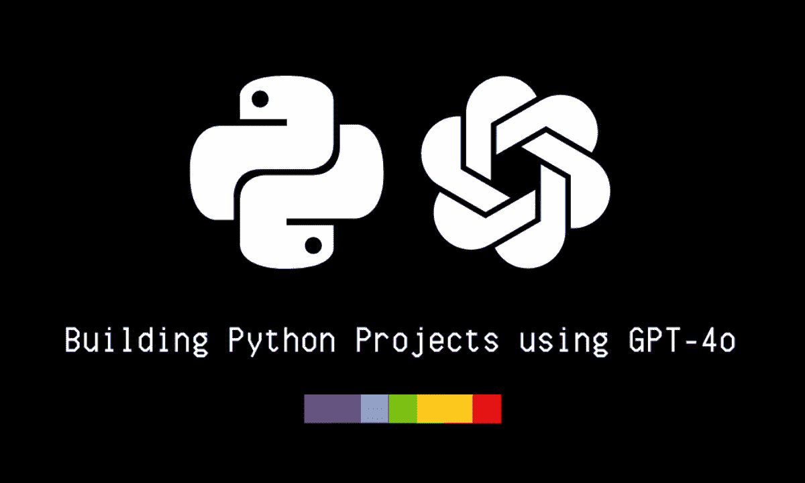
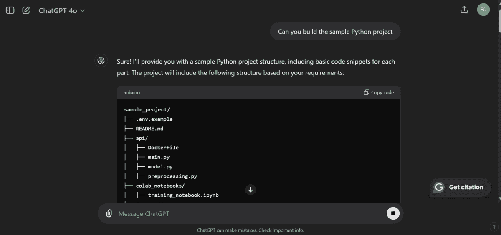
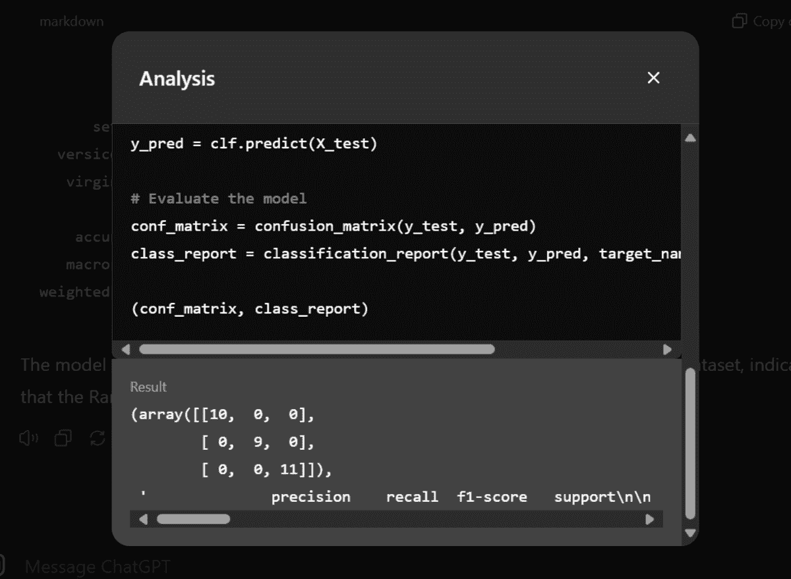
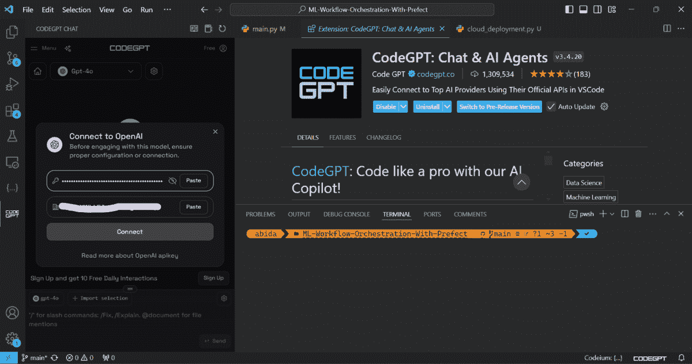
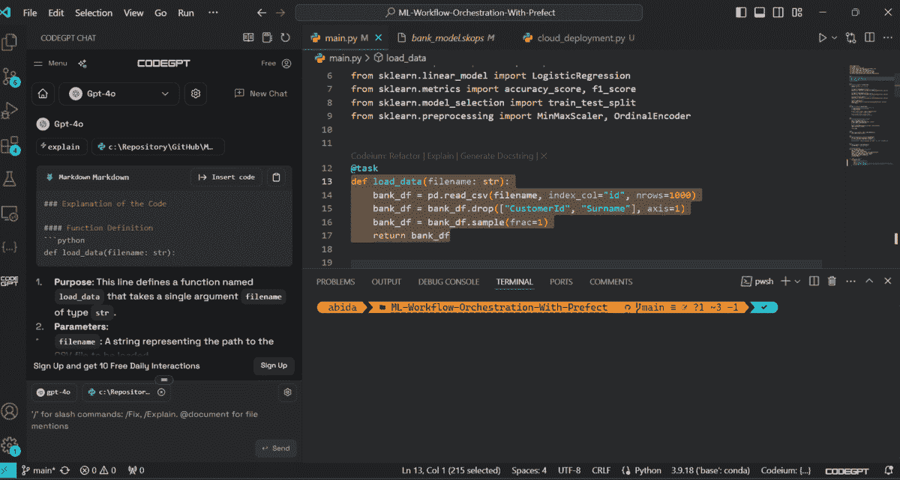
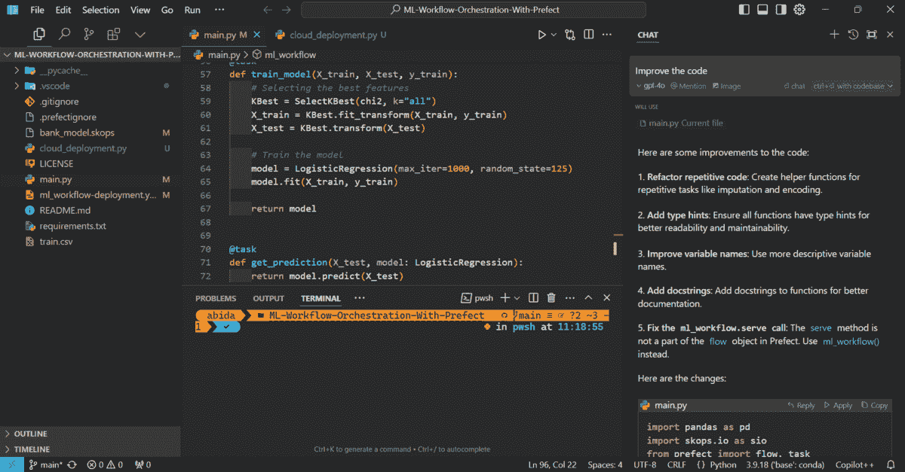
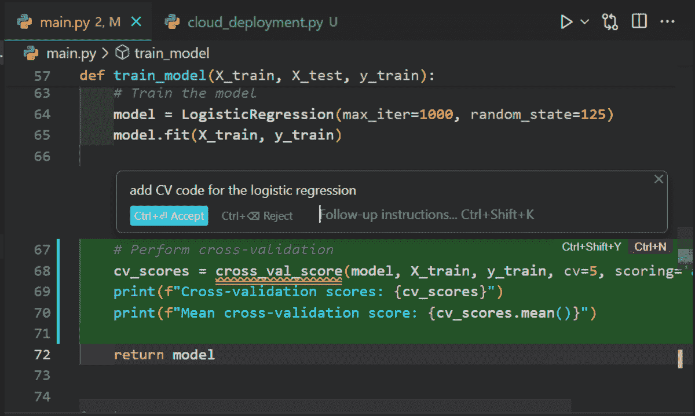

# 使用 GPT-4o 构建 Python 项目的 3 种方法

> 原文：[`www.kdnuggets.com/3-ways-of-building-python-projects-using-gpt-4o`](https://www.kdnuggets.com/3-ways-of-building-python-projects-using-gpt-4o)

图片来源：作者

如果你希望提高工作流程，加快开发速度，并最小化错误，GPT-4o 模型是你首选的 AI 工具。通过将这种先进的 AI 集成到你的 Python 项目中，你可以简化流程，更快地解决问题，专注于真正重要的事情。即使你是编程新手，也可以使用像 ChatGPT、配备 GPTCode 扩展的 VSCode 和 Cursor IDE 等工具创建 Python 项目。这些工具对于在开发环境中实现 GPT-4o 模型的全部潜力至关重要。

* * *

## 我们的前三个课程推荐

 1\. [Google 网络安全证书](https://www.kdnuggets.com/google-cybersecurity) - 快速进入网络安全职业道路。

 2\. [Google 数据分析专业证书](https://www.kdnuggets.com/google-data-analytics) - 提升你的数据分析能力

 3\. [Google IT 支持专业证书](https://www.kdnuggets.com/google-itsupport) - 支持你的组织 IT

* * *

## 1\. ChatGPT

我们都熟悉 [ChatGPT](https://chatgpt.com/) 及其生成 Python 代码的能力。在 OpenAI 的最新更新中，新的 GPT-4o 模型已免费提供给所有人使用。我使用 ChatGPT 来生成代码、解决问题和头脑风暴。它真正理解我们在应用程序中想要实现的目标。

例如，我让它构建一个示例 Python 项目。它提供了构建所需的所有代码和指令，包括项目结构中的文件和文件夹。你可以提出后续问题来修改项目，甚至请求它运行脚本以测试是否有效。

截图来自 ChatGPT

ChatGPT 配备了一个 Python 环境，这意味着它可以为你生成和运行代码，并显示结果。

截图来自 ChatGPT

简而言之，如果你是初学者，ChatGPT 是你唯一需要的编码助手。但如果你是开发人员或软件工程师，你需要一个与工作空间集成的工具。那就是 CodeGPT 的作用。

## 2\. CodeGPT

[CodeGPT](https://codegpt.co/) VSCode AI 编码助手扩展，让你更高效地编写代码。它提供 AI 聊天帮助、自动完成、代码解释、重构、文档编写、单元测试等功能。

CodeGPT 扩展还允许你尝试来自不同提供者的各种 AI 模型。你甚至可以使用 Ollama 在本地运行自己的 AI 模型，并将其与 CodeGPT 扩展一起使用。这是一个集成的解决方案，用于软件开发。

在这篇博客中，我们将学习如何设置以便与 GPT-4o 一起使用。首先，你需要通过访问 [OpenAI API](https://platform.openai.com/api-keys) 来生成一个 OpenAI API 密钥。然后，在 VSCode 扩展市场中搜索并安装 CodeGPT 扩展。接下来，点击 CodeGPT 标签，选择 OpenAI 作为提供者，选择 GPT-4o 作为模型。系统会要求你粘贴 OpenAI API 密钥以访问该模型。

来自 VSCode 的截图

当一切设置完成后，你可以开始使用 GPT-4o 来生成代码、调试、记录和改进你的代码源。

来自 VSCode 的截图

CodeGPT 有许多限制，在自动完成方面速度较慢。你可以购买订阅以访问更好的自动完成模型和 AI 代理，但在将 AI 工具集成到软件开发环境中时，它仍然不够充分。它仍然是一个依赖于代码编辑器的扩展。

## 3\. Cursor IDE

[Cursor AI IDE](https://www.cursor.com/) 是硬核程序员、高级软件工程师和数据专业人士的完美工具。它是为 AI 辅助软件开发设计的 VSCode 的一个分支。这意味着它不仅仅是一个扩展，而是一个内置功能的生态系统，帮助你编写更好的代码。

Cursor 理解你的代码源，以提供更好的代码建议，甚至帮助你从零开始编写整个 Python 项目。我已经完全将工作流程从 VSCode 切换到 Cursor，因为它易于使用，响应速度比 VSCode 扩展更快。我没有错过任何功能——它基本上就像使用 VSCode。我仍然可以安装我喜欢的 VSCode 扩展，并使用相同的环境。没有变化。

在下面的示例中，我让 GPT-4o 改进我的代码，它做得非常好。

来自 Cursor 的截图

它还配备了内联聊天、理解图像和文档的能力、选择代码进行编辑或改进的能力以及保存之前聊天记录的能力，就像 ChatGPT 一样。

来自 Cursor 的截图

我强烈推荐数据专业人士切换到 Cursor 并享受两周的免费试用，以体验其惊人的功能。无论是编写代码还是向 GPT-4o 提问，感觉都很自然。

## 结论

我认识的所有数据专业人士都在他们的工作流程中使用 AI 以提高生产力和准确性。在使用 AI 助手工具之前，他们通常需要花费数小时来构建和测试 Python 应用程序，但现在他们可以在几分钟内完成相同的任务。他们所要做的就是审查并运行代码。

在这篇博客中，我们了解了 ChatGPT 用于构建和运行 Python 代码的新功能。我们还了解了 VSCode AI 助手扩展 CodeGPT，它允许你使用各种 AI 模型生成和改进你的 Python 代码。最后，我们了解了 Cursor IDE，这是一款为 AI 辅助软件开发而构建的 VSCode 分支。这些是我在数据分析、机器学习甚至网页开发中的日常工作中使用的工具。我希望你也能从中受益。

****[Abid Ali Awan](https://www.polywork.com/kingabzpro)**** ([@1abidaliawan](https://www.linkedin.com/in/1abidaliawan)) 是一名认证的数据科学专业人士，热衷于构建机器学习模型。目前，他专注于内容创作，并撰写有关机器学习和数据科学技术的技术博客。Abid 拥有技术管理硕士学位和电信工程学士学位。他的愿景是利用图神经网络为面临心理问题的学生开发 AI 产品。

### 更多相关话题

+   [通过构建 15 个神经网络项目学习深度学习，2022 年](https://www.kdnuggets.com/2022/01/15-neural-network-projects-build-2022.html)

+   [黑客利用数据科学窃取数十亿的 4 种方式](https://www.kdnuggets.com/2022/02/4-ways-hackers-data-science-steal-billions.html)

+   [使用 ChatGPT 生成被动收入的 4 种方法](https://www.kdnuggets.com/2023/03/4-ways-generate-passive-income-chatgpt.html)

+   [使用稳定扩散生成超现实面孔的 3 种方法](https://www.kdnuggets.com/3-ways-to-generate-hyper-realistic-faces-using-stable-diffusion)

+   [为什么越来越多的开发者在他们的机器学习项目中使用 Python？](https://www.kdnuggets.com/2022/01/developers-python-machine-learning-projects.html)

+   [KDnuggets 新闻，8 月 17 日：如何执行动作检测…](https://www.kdnuggets.com/2022/n33.html)
