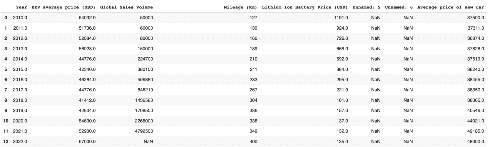
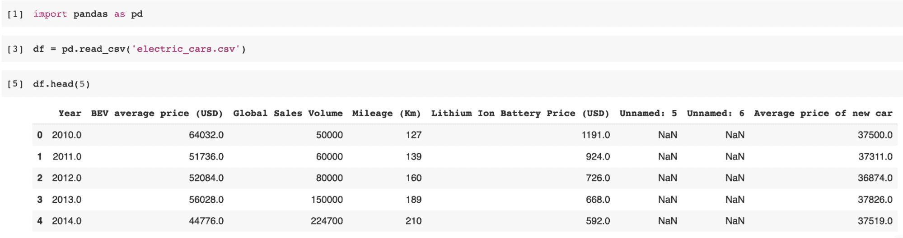
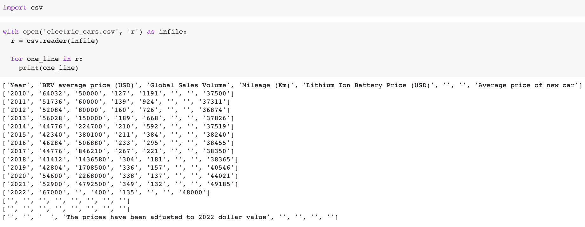

# 处理 CSV 文件的 3 种方法

> 原文：[`www.kdnuggets.com/2022/10/3-ways-process-csv-files-python.html`](https://www.kdnuggets.com/2022/10/3-ways-process-csv-files-python.html)


来源：[flaticon](https://www.flaticon.com/free-icon/csv-file_4911248)

对于那些刚开始学习 Python 编程语言、启动数据科学职业生涯，或只是需要快速回顾的人来说，本文介绍了 3 种在 Python 中处理 CSV 文件的方法。

* * *

## 我们的 3 大课程推荐

 1\. [Google 网络安全证书](https://www.kdnuggets.com/google-cybersecurity) - 快速进入网络安全职业轨道。

 2\. [Google 数据分析专业证书](https://www.kdnuggets.com/google-data-analytics) - 提升你的数据分析技能

 3\. [Google IT 支持专业证书](https://www.kdnuggets.com/google-itsupport) - 支持你的组织在 IT 领域

* * *

让我们快速了解什么是 CSV 文件。

# 什么是 CSV？

CSV 代表逗号分隔值，是一种包含数据的纯文本文件。它被认为是最简单的数据存储格式之一，数据科学家和其他工程师广泛使用。

这是一个示例结构：



我从 Kaggle 获取了这个数据集，你可以在这里找到它：[电动汽车价格](https://www.kaggle.com/datasets/iannjuguna/electric-car-prices?resource=download)

现在让我们深入了解如何在 Python 中处理 CSV 文件。

# 处理 CSV 文件

出于本文的目的，我将使用电动汽车价格数据集作为示例。

## 使用 pandas

Pandas 是一个开源 Python 包，建立在 Numpy 之上。步骤如下：

**导入库：**

```py
import pandas as pd
```

**使用 read_csv() 读取文件**

[read_csv()](https://pandas.pydata.org/pandas-docs/stable/reference/api/pandas.read_csv.html) 就是它的名字，它将你的 CSV 文件读取到 DataFrame 中，如下所示：

```py
df = pd.read_csv("electric_cars.csv")
```

```py
df.head(5)
```

示例：



## 使用 csv.reader

Python 有一个内置模块叫做 [csv](https://docs.python.org/2/library/csv.html)，可以用来读取文件。以下是一些快速简单的步骤：

**导入库：**

```py
import csv
```

**打开你的 CSV 文件：**

```py
with open('electric_cars.csv', 'r') as infile:
    r = csv.reader(infile)

for one_line in r:
    print(one_line)
```

示例：



## 分割方法

我们可以通过 .split 方法轻松加载 CSV 文件。字符串上的 .split 方法返回一个字符串列表。

```py
for one_line in open('electric_cars.csv'):
    print(one_line.split(','))
```

然而，查看下面的示例图像，如果你想用制表符作为分隔符而不是逗号，可以这样做：

```py
with open('format1.csv', 'w') as outfile:
    for one_line in open('electric_cars.csv'):
        outfile.write(('\t'.join(one_line.strip().split(',')) + '\n'))
```

示例：


# 总结

处理 CSV 文件到 Python 有多种方法。你可能有些方法未曾听说过，也可能已经知道。了解解决数据科学问题的多种方法总是有益的，你应该始终保持学习这些不同方法的开放态度！

**[Nisha Arya](https://www.linkedin.com/in/nisha-arya-ahmed/)** 是一名数据科学家和自由职业技术作家。她特别感兴趣于提供数据科学职业建议或教程以及数据科学的理论知识。她还希望探索人工智能如何/能够促进人类寿命的延续。作为一个热衷学习的人，她希望拓宽自己的技术知识和写作技能，同时帮助引导他人。

### 更多相关话题

+   [通过 ChatGPT 将 CSV 转换为完整分析报告的 5 个简单步骤](https://www.kdnuggets.com/from-csv-to-complete-analytical-report-with-chatgpt-in-5-simple-steps)

+   [使用 Python 的 Pathlib 组织、搜索和备份文件](https://www.kdnuggets.com/organize-search-and-back-up-files-with-pythons-pathlib)

+   [如何在几秒钟内处理具有数百万行的数据框](https://www.kdnuggets.com/2022/01/process-dataframe-millions-rows-seconds.html)

+   [处理机器学习过程的框架](https://www.kdnuggets.com/2018/05/general-approaches-machine-learning-process.html)

+   [在 Python 中加载数据的 5 种不同方法](https://www.kdnuggets.com/2020/08/5-different-ways-load-data-python.html)

+   [加快 Python 代码的 3 种简单方法](https://www.kdnuggets.com/2022/10/3-simple-ways-speed-python-code.html)
