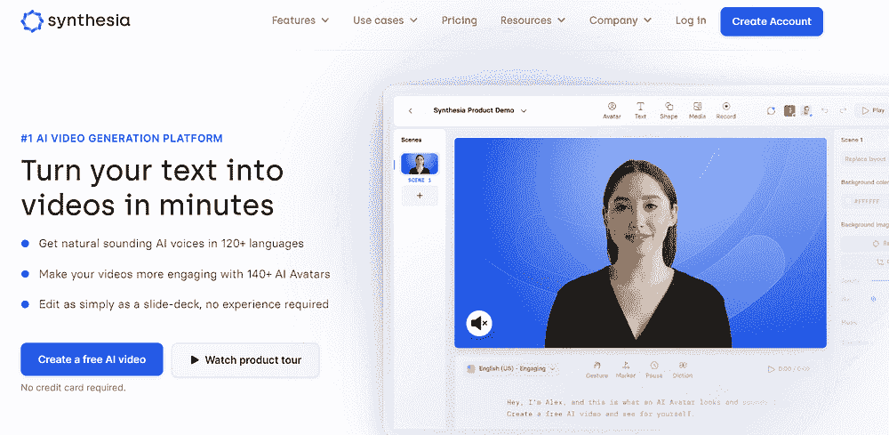
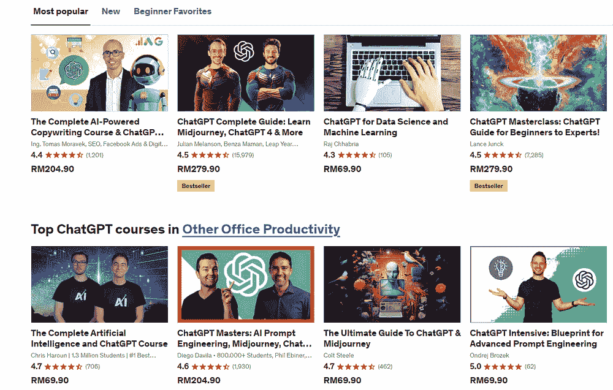
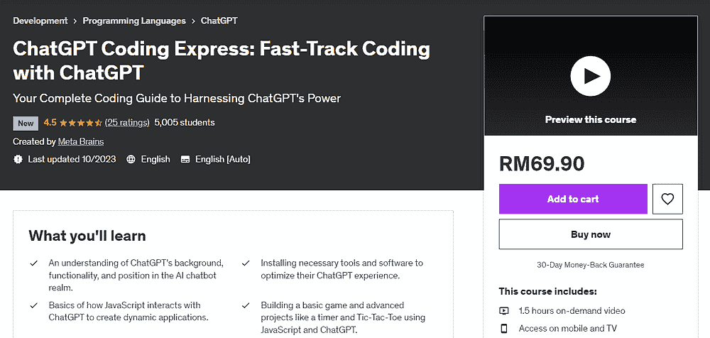
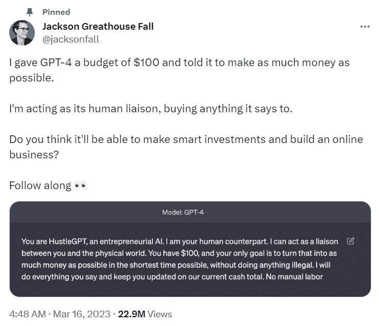

# 利用 ChatGPT 和 AI 赚钱的 3 种方式

> 原文：[`www.kdnuggets.com/3-ways-to-make-money-with-chatgpt-and-ai`](https://www.kdnuggets.com/3-ways-to-make-money-with-chatgpt-and-ai)

编辑提供的图片

作为一个白天有全职工作、晚上从事多个副业（包括创建[书面内容](https://medium.com/@natassha6789)、[在线课程](https://www.udemy.com/course/python-for-social-media-analytics/)，以及最近的科技[YouTube 频道](https://www.youtube.com/@natassha_ds)）的人，我总是在寻找新的被动收入来源。

* * *

## 我们的前三个课程推荐

 1\. [谷歌网络安全证书](https://www.kdnuggets.com/google-cybersecurity) - 快速开启网络安全职业生涯。

 2\. [谷歌数据分析专业证书](https://www.kdnuggets.com/google-data-analytics) - 提升你的数据分析技能

 3\. [谷歌 IT 支持专业证书](https://www.kdnuggets.com/google-itsupport) - 支持你组织的 IT 工作

* * *

所以，当 ChatGPT 发布时，我是第一个在网上寻找如何利用这个工具赚取更多收入的人。

不出所料，我在网上找到的大部分推荐从模糊和不可操作到完全不道德。

显然，成千上万的人开始向亚马逊涌入[AI 生成的书籍](https://www.reuters.com/technology/chatgpt-launches-boom-ai-written-e-books-amazon-2023-02-21/)，导致平台对自出版施加了限制，并大量删除了怀疑为 AI 生成的内容。

然而，在筛选了大量网络上的糟糕建议后，我确实发现了一些相当有用的方法，人们利用 ChatGPT 和生成型 AI 工具来实现货币化。

我甚至开始将这些建议融入到我自己的工作流程中（并成功地在过去一个月里几乎翻倍了我的在线收入）。

在本文中，我将分享我的经验，并提供 3 种实际的方法，帮助你利用 ChatGPT 开始赚取收入。

# 1\. 创建无面孔的社交媒体内容

创作者经济正在爆炸式增长。

通过建立个人品牌并生成他人认为有价值的内容，赚取收入的机会巨大。

然而，内容创作需要花费大量的时间（和金钱）。

一个 YouTube 视频需要构思主题、编写脚本、花费数小时对着摄像头讲话，并在后期制作中进行编辑。

确定理想的视频背景、灯光和音频也需要大量的试错过程。对很多人来说，坐下来对着摄像头讲话可能显得令人生畏和不自然。

生成性 AI 在内容创作领域是一个改变游戏规则的工具。你可以使用 ChatGPT 进行[主题研究](https://www.thinkific.com/blog/chatgpt-for-youtube/)，为你的 YouTube 视频生成一个吸引人的“引子”，甚至优化你的内容以便在 Google 上获得良好的排名。

然后，你可以使用像[Synthesia](https://www.synthesia.io/)这样的工具为你的影片创建 AI 头像和配音，这样你就不需要亲自出现在视频中：

图片由作者提供

最后，为了在各种平台上推广你的内容，只需使用像[Opus AI](https://opus.ai/)这样的工具，将你的 YouTube 视频中的部分内容转换为短视频，这些短视频可以在 TikTok 和 Instagram 等网站上重复使用。

当然，你要让自己与泛滥在互联网上的 AI 生成内容区分开来，这意味着要在视频制作中投入相当的研究，并选择一个细分领域。

ChatGPT 和生成性 AI 应该加快内容创作的过程，而不是取代你的创造力和独特声音。

# 2\. 在线课程

关于生成性 AI 工具如 ChatGPT、Midjourney 和 DALLE 的在线课程正在迅速流行。

> **注意：** 顶级 Udemy 讲师在平台上的收入超过[**$1 百万**](https://www.nichepursuits.com/how-much-do-udemy-instructors-make/)，而普通创作者的年收入大约为[**$3,306**](https://sellcoursesonline.com/udemy-earnings-study)。

这里是一些在 Udemy 上受欢迎且适合初学者的生成性 AI 课程：

图片由作者提供

看看上述在线课程的学生人数吧！

这应该告诉你，个人和组织愿意大力投资于学习更多关于 AI 的知识。

当然，这并不意味着任何人都可以凭借重复内容来创建一个入门级的 ChatGPT 课程。

你应该这样做：

## 找到一个细分领域

如果你在市场营销领域工作，例如，你已经拥有了将你与普通人区分开来的专业知识。

现在，开始学习将 ChatGPT 融入到你的日常工作流程中。你的工作中是否有生成性 AI 可以自动化的方面？

例如，AI 在生成符合 SEO 要求的内容方面已经变得非常出色，以至于[谷歌也无法可靠地区分这些内容和人类撰写的文章](https://www.myprofitengine.com/blog/can-ai-content-rank-on-google)。

利用这些知识，你能否教会小企业主有效地营销他们的产品，而不必雇佣内容创作者或 SEO 专家？

这是一个许多人愿意支付费用学习的技能，因为它教会他们如何节省开支并在长期内提升商业成果。

比如说，这个 Udemy 课程仅用不到 2 小时的视频内容，就已经有了 5000 名学生，因为它教会了人们如何通过 ChatGPT 学习编程：

作者提供的图片

如果你已经拥有一项可销售的技能，你可以通过教别人如何利用 ChatGPT 来磨练这项技能，从而赚到很多钱。

在今天的创作者经济中，开始变得前所未有的简单！

你只需注册一个平台，如[Udemy](https://www.udemy.com/topic/chatgpt/)或[Teachable](https://teachable.com/)，并开始创建课程。

# 3\. 提示工程与人工智能咨询

如果你最近关注了人工智能领域的公告，你可能听说过市场上新兴的热门工作——“提示工程师”。

根据[《商业内幕》](https://www.businessinsider.com/ai-prompt-engineer-jobs-pay-salary-requirements-no-tech-background-2023-3)的报道，这些职位的年薪高达 375,000 美元，甚至不需要技术学位。

那么……这是否意味着任何人只需在 ChatGPT 中输入提示就能赚到这类的钱？有什么陷阱吗？

尽管这是一个相对较新的领域，未来几年将持续发展，但**提示工程师**的主要角色是[利用生成性人工智能来改善商业成果并最大化效率](https://youtu.be/hd7l9F3n4ZM?si=jznd5kQsNETMS_cw)。

大多数提示工程职位需要专业领域的知识。你必须能够应用提示技术来解决特定行业的问题。

例如，如果你从事市场营销工作，你可能会被聘用来让 ChatGPT 创建与业务相关且准确的 SEO 友好内容。

人工智能研究公司 Anthropic 正在[积极招聘提示工程师](https://www.deweybstrategic.com/2023/07/i-was-righter-than-i-realized-anthropic-is-hiring-a-prompt-engineer-librarian-and-it-pays-serious.html)，并没有固定的申请要求。

职位招聘信息指出，他们将考虑那些能够为自己提出有力论据的申请者，并表示：

> “*如果你还没有做过多少提示工程的工作，你可以通过花一些时间实验 Claude 或 GPT3，并展示你通过一系列精心设计的提示获得了复杂行为，从而最好地展示你的提示工程技能。*”

公司的代表进一步提到，逻辑和推理能力是提示工程师最重要的特质，拥有编程知识或机器学习背景在申请这个职位时是一个额外的优势。

尽管许多这些要求看起来非常模糊，但提示工程确实似乎是一项有利可图的技能，各个领域的人们都将受益。

即使你最终没有找到提示工程师的工作，这仍然是一项企业愿意支付来学习的技能，因为员工在人工智能的应用方面仍然面临困难。

你可以在特定领域，如市场营销或金融，提供围绕生成性人工智能和提示工程的咨询服务。

作为曾经向组织提供数据和机器学习咨询服务的人，我成功地通过建立在线存在和创建网站来获得客户，我在[另一篇文章](https://towardsdatascience.com/how-to-become-a-freelance-data-scientist-in-2022-e6ce4ea9ce23)中讨论了这一点。

此外，如果从零开始建立品牌看起来很艰巨，这里有一个[AI 工具列表](https://natassha6789.medium.com/chatgpt-is-old-news-here-are-8-ai-tools-that-will-transform-your-business-d4bfcd91721d)，可以帮助你自动化这个过程。

# 这个人用 ChatGPT 一天之内把 100 美元变成了一个生意

我想通过推荐[Jackson Greathouse Fall](https://www.businessinsider.com/how-to-use-chatgpt-to-start-business-make-money-quickly-2023-3)的故事来结束这篇文章，他用生成式 AI 在一天之内启动了他的业务，要求 ChatGPT 将 100 美元变成“尽可能多的钱”。

他按照聊天机器人的指示操作，成功在一天之内为公司筹集了 1378 美元。截至三月中旬，公司估值为 25000 美元。

你可以在[Business Insider](https://www.businessinsider.com/how-to-use-chatgpt-to-start-business-make-money-quickly-2023-3)上阅读整个故事。

**[Natassha Selvaraj](https://linktr.ee/natasshaselvaraj)** 是一位自学成才的数据科学家，热爱写作。Natassha 涉猎所有与数据科学相关的内容，是数据主题的真正大师。你可以通过[LinkedIn](https://www.linkedin.com/in/natassha-selvaraj-33430717a/)与她联系，或查看她的[YouTube 频道](https://www.youtube.com/@natassha_ds)。

### 更多相关内容

+   [谁将从生成式 AI 黄金热潮中获利？](https://www.kdnuggets.com/2023/08/make-money-generative-ai-gold-rush.html)

+   [7 种 ChatGPT 使你编程更好、更快的方法](https://www.kdnuggets.com/2023/06/7-ways-chatgpt-makes-code-better-faster.html)

+   [5 种使用 ChatGPT Vision 进行数据分析的方法](https://www.kdnuggets.com/5-ways-you-can-use-chatgpt-vision-for-data-analysis)

+   [4 种利用 ChatGPT 生成被动收入的方法](https://www.kdnuggets.com/2023/03/4-ways-generate-passive-income-chatgpt.html)

+   [5 种利用 ChatGPT 的代码解释器进行数据科学的方法](https://www.kdnuggets.com/2023/08/5-ways-chatgpt-code-interpreter-data-science.html)

+   [使用 ChatGPT 的 GPTs 创建你自己的 GPT！](https://www.kdnuggets.com/make-your-own-gpts-with-chatgpts-gpts)
