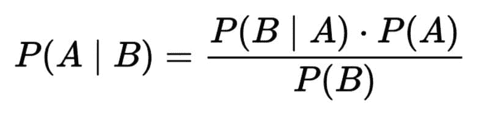
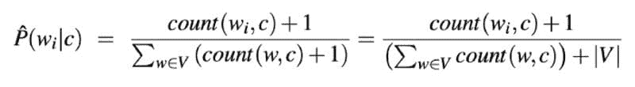

# 了解贝叶斯定理的 3 种方式将提升你的数据科学水平

> 原文：[`www.kdnuggets.com/2022/06/3-ways-understanding-bayes-theorem-improve-data-science.html`](https://www.kdnuggets.com/2022/06/3-ways-understanding-bayes-theorem-improve-data-science.html)

图片由 [Ella Olsson](https://www.pexels.com/@ella-olsson-572949?utm_content=attributionCopyText&utm_medium=referral&utm_source=pexels) 提供，来自 [Pexels](https://www.pexels.com/photo/vegetable-salad-3026808/?utm_content=attributionCopyText&utm_medium=referral&utm_source=pexels)

贝叶斯定理为我们提供了一种在考虑先前信念的强度的情况下，根据新证据更新信念的方法。应用贝叶斯定理时，你会寻求回答这样一个问题：**在新证据面前，我的假设的可能性有多大？**

* * *

## 我们的前三个课程推荐

 1\. [谷歌网络安全证书](https://www.kdnuggets.com/google-cybersecurity) - 快速进入网络安全领域。

 2\. [谷歌数据分析专业证书](https://www.kdnuggets.com/google-data-analytics) - 提升你的数据分析水平

 3\. [谷歌 IT 支持专业证书](https://www.kdnuggets.com/google-itsupport) - 支持你的组织的 IT 工作

* * *

在这篇文章中，我们将探讨贝叶斯定理如何提高你在数据科学中的实践：

1.  **更新**

1.  **沟通**

1.  **分类**

到最后，你将对这一基础概念有深刻的理解。

# #1 — 更新

贝叶斯定理提供了一种测试假设的结构，考虑到先前假设的强度和新证据。这个过程被称为贝叶斯更新。

贝叶斯定理，其中 A 代表假设，B 代表与假设相关的新证据。

用语言表达，这个公式是“在 B 给定的情况下 A 的可能性 ***等于*** （*左括号*） A 给定 B 的可能性 ***乘以***  A 的可能性 (*右括号*) ***除以 *** B 的可能性。”

让我们再次回顾公式，这次附上变量的定义：

“在新证据面前假设的似然 ***等于*** 在假设也为真的情况下新证据为真的似然 ***乘以*** 假设在观察到新证据之前的似然，全部除以 ***新证据的似然。***”

这可以进一步简化：

“后验概率 ***等于*** 似然 ***乘以*** 先验概率 ***除以*** 边际似然。”

无论贝叶斯定理现在是否听起来直观，我保证你一直在使用它。

## 现实世界的例子

比如说，你的朋友打电话告诉你，她非常抱歉，但今晚不能来参加晚餐。她最近领养了一只宠物考拉，这只考拉得了感冒。她真的需要待在家里监控情况。

你的**假设**是你的朋友不会无缘无故地抛弃你。（毕竟，你做的 ph 很棒，你的朋友会疯狂地错过。）考虑到她新宠物的最近证据，你的假设为真的可能性有多大？

照片由[Valeriia Miller](https://www.pexels.com/@valeriiamiller?utm_content=attributionCopyText&utm_medium=referral&utm_source=pexels)提供，来自[Pexels](https://www.pexels.com/photo/wood-people-hand-animal-5403361/?utm_content=attributionCopyText&utm_medium=referral&utm_source=pexels)

为了评估**后验概率**，即我们朋友因为照顾考拉而没有来参加晚餐的情况，我们需要考虑你朋友在假设她是一个不抛弃晚餐计划的正直人物的情况下，照顾考拉的**可能性**。你可能会得出结论，一个通常负责任的好朋友会待在家里照看宠物的可能性很高。

接下来，我们将可能性与**先验****概率**相乘。在你朋友打电话之前，你对她晚餐计划的承诺的信念有多强？如果你相信你的朋友很坚定，通常不愿在最后一刻改变计划，那么你的先验概率就很强，你不太可能改变这一观点，无论新证据如何。另一方面，如果你的朋友很不靠谱，你已经在想她是否会打电话取消，你的先验概率就会很弱，这也可能会质疑她关于与考拉待在家的说法。

最后，我们将上述计算结果除以**考拉拥有的边际可能性**??

贝叶斯推断建立在这种灵活的常识性方法上，根据**先验的强度**和**新证据的可能性**来更新我们对世界的模型。实际上，[贝叶斯定理最初的应用是为了评估上帝的存在](https://qz.com/1315731/the-most-important-formula-in-data-science-was-first-used-to-prove-the-existence-of-god/)。

当涉及到生活和数据科学中的关键问题时，没有什么比贝叶斯定理更直观的方法来评估信念如何随时间变化。

# #2 — 沟通

正如贝叶斯定理可以帮助你理解并阐述在面对新证据时如何更新你的理论，贝叶斯定理也可以使你成为一个更强的数据科学沟通者。

数据科学的核心在于应用数据来改善决策制定。

> 只有两件事决定了你的人生结果：运气和你的决策质量。你只能控制这两件事中的一件。— Annie Duke，扑克冠军和作家

提高决策质量通常意味着说服决策者。像每个人一样，你组织中的决策者也会进入谈话。

## 现实世界示例

我曾经是一个热气球制造商的顾问。我的任务是帮助建立一个数据库，以改善客户对其供应链、制造过程和销售的[end-to-end understanding](https://towardsdatascience.com/data-strategy-716059d5c066)。

当工厂经理在第一天带我们参观车间时，他自豪地描述了一个关于更轻、更便宜的原材料的新供应商合同。

但有一个问题。随着我的团队将来自不同数据源的表格连接起来，我们发现了新供应商的材料与废品增加 2.5%之间的关系。

由[Darren Lee](https://unsplash.com/@darrenleejw?utm_source=medium&utm_medium=referral)拍摄，来自[Unsplash](https://unsplash.com/?utm_source=medium&utm_medium=referral)

工厂经理对新供应商有一个非常强烈的先验知识，认为它对他的业务是一个净正面影响。我们有一些相反的证据。我们也有贝叶斯定理。我们理解这一事实：

> 先验知识越强，改变它所需的证据就越多。

在向工厂经理展示我们的发现之前，我们需要收集额外的证据，以排除其他因素（例如：磨损的机器、新员工、环境条件等）对废品水平差异的影响。

最终，我们向经理提供了更多证据，并帮助他重新谈判了供应商合同。

# #3 — 分类

贝叶斯定理可以应用于文本分析的用例，这是一种称为**朴素贝叶斯**的技术，因为它天真地假设数据集中的每个输入变量（在这种情况下是每个单词）彼此独立。

## 现实世界示例

假设你发现了一堆你祖父母写的信件。它们中包含了足够的戏剧性，以证明动荡的恋情并不仅限于年轻人在现实电视中。

由[RODNAE Productions](https://www.pexels.com/@rodnae-prod?utm_content=attributionCopyText&utm_medium=referral&utm_source=pexels)拍摄，来自[Pexels](https://www.pexels.com/photo/elderly-couple-standing-beside-a-glass-window-5637562/?utm_content=attributionCopyText&utm_medium=referral&utm_source=pexels)

你想构建一个情感分类器来确定内容的大多数是正面还是负面。一种方法是利用朴素贝叶斯。

一个**生成模型**（如朴素贝叶斯）将建立一个模型，描述一个类别（在这种情况下是正面或负面）如何生成一些输入数据。给定一个观测值（我们信件测试语料库中的新句子），它返回最可能生成该观测值的类别。这与学习输入特征预测能力的判别模型（如逻辑回归）相对。

朴素贝叶斯基于**词袋模型**技术——基本上是将文档转换为直方图，统计每个词出现的次数。

你可以使用我们在第 #1 部分学习的贝叶斯推断公式的略微修改版本来计算每个观测值的最可能类别。这种略微的修改就是**朴素**贝叶斯中的*朴素*部分：假设在给定类别的条件下，每个词的概率是独立的，因此你可以将它们相乘以生成句子属于该类别的概率。

通过 [*语音与语言处理*](https://web.stanford.edu/~jurafsky/slp3/4.pdf) 由 *丹尼尔·朱拉夫斯基 和 詹姆斯·H·马丁*

在上述公式中，*w?* 代表文档 *c* 中词的计数。公式的分母是词落入给定类别的条件概率之和。

公式中的 +1 防止在类别内没有观测到词的情况下乘以零。这种加一的技术称为**拉普拉斯平滑**。

最后，|V| 由所有类别中的所有词的并集组成。

## 贝叶斯定理词汇

+   **后验概率**：在新证据出现后，假设成立的可能性

+   **似然**：在假设为真的情况下，证据为真的可能性

+   **先验概率**：在新证据出现之前你对假设成立的信念强度

+   **边际似然**：证据

+   **朴素贝叶斯**：一种假设数据集中特征之间独立的分类器算法

+   **生成模型**：模拟特定类别如何生成输入数据

+   **词袋模型**：一种简化文本的表示方法，将文档转换为直方图

+   **拉普拉斯平滑**：一种简单的加法平滑技术，避免乘以零

## 总结

我对贝叶斯定理对数据科学家有用持有强烈的先验信念，但我会根据你在评论中留下的反馈更新后验概率。我期待了解你如何在生活和工作中使用贝叶斯定理。

[原文](https://towardsdatascience.com/bayes-theorem-abc1795af097)。已获许可转载。

### 更多相关话题

+   [本周提升搜索应用的 8 种方法](https://www.kdnuggets.com/2022/09/corise-8-ways-improve-search-application-week.html)

+   [提升你的机器学习模型的 7 种方法](https://www.kdnuggets.com/7-ways-to-improve-your-machine-learning-models)

+   [KDnuggets 新闻，11 月 30 日：什么是切比雪夫定理及其如何…](https://www.kdnuggets.com/2022/n46.html)

+   [什么是切比雪夫定理及其如何应用于数据科学？](https://www.kdnuggets.com/2022/11/chebychev-theorem-apply-data-science.html)

+   [为什么谦逊会提升你的数据科学技能](https://www.kdnuggets.com/2022/01/humbling-improve-data-science-skills.html)

+   [如何利用 ChatGPT 提升你的数据科学技能](https://www.kdnuggets.com/2023/03/chatgpt-improve-data-science-skills.html)
