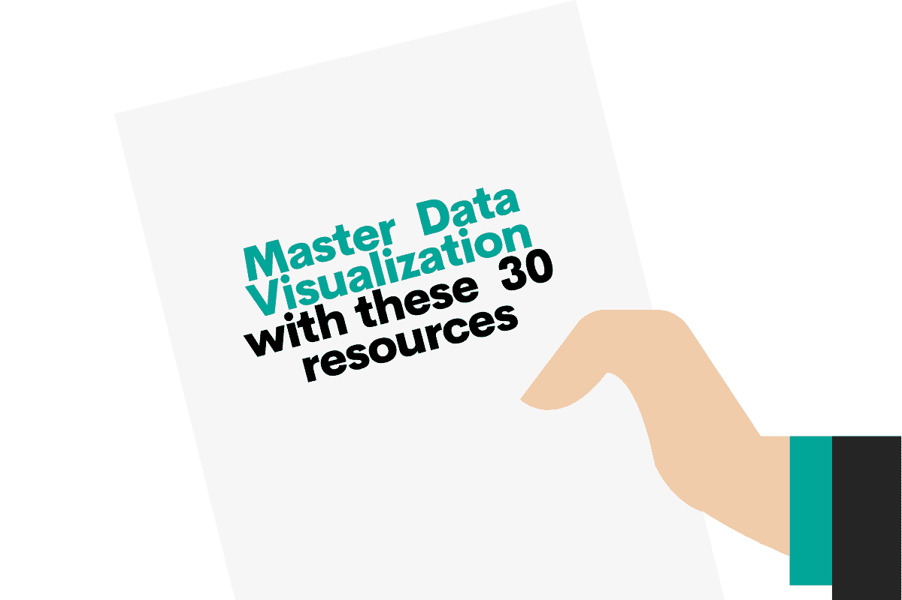
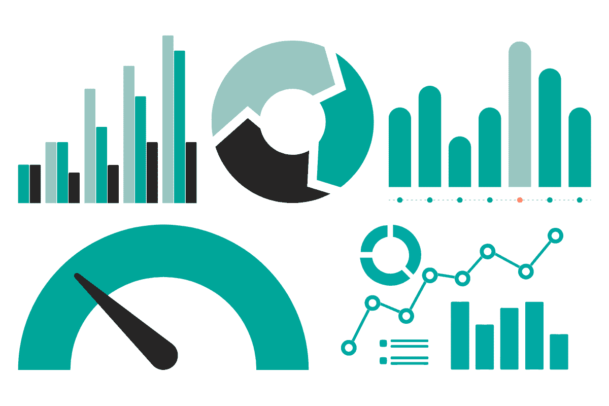

# 30 个掌握数据可视化的资源

> 原文：[`www.kdnuggets.com/2022/11/30-resources-mastering-data-visualization.html`](https://www.kdnuggets.com/2022/11/30-resources-mastering-data-visualization.html)

我们都有过这样的经历。在你看到某些数据中有一个非常酷的模式时，你兴奋地想要分享它。例如，或许你注意到，当你在寒冷天气下跑步时，每英里比在温暖天气下跑步时快一分钟。

* * *

## 我们的前三个课程推荐

 1\. [Google 网络安全证书](https://www.kdnuggets.com/google-cybersecurity) - 快速进入网络安全职业。

 2\. [Google 数据分析专业证书](https://www.kdnuggets.com/google-data-analytics) - 提升你的数据分析能力

 3\. [Google IT 支持专业证书](https://www.kdnuggets.com/google-itsupport) - 支持你的组织 IT 需求

* * *

你想与对你重要的人分享这些令人兴奋的发现。也许是你的老板。也许，在跑步的例子中，是你的伴侣或跑步小组。

你向他们展示了你那令人惊叹的表格和超级有趣的数字——他们却呆呆地看着你。因为你兴奋地展示你的发现，忘记了人类的一个基本真理：没有人喜欢看表格。但*每个人*都喜欢看美观且信息丰富的图表。这就是数据可视化的重要性。

研究 [表明](https://oit.williams.edu/files/2010/02/using-images-effectively.pdf) 我们处理图像的速度比处理文字快 60,000 倍。你可以自己测试一下——看一个充满数字的表格，然后再看一个表示相同内容的图表。哪一个让你获取更多信息更快？哪一个更让你喜欢？

数据可视化既是一门艺术，也是一门科学。它是一门科学，因为数据部分来自数字和事实。但它是一门艺术，因为你需要考虑受众的心理。你需要考虑数字的格式。你需要考虑你试图传达的内容和方式。你还需要知道如何让它变得漂亮。这就是可视化的部分。

在我看来，如果每个人都知道如何有效地使用数据可视化（LinkedIn Business 的 Paul Petrone [也同意](https://www.linkedin.com/business/learning/blog/top-skills-and-courses/data-visualization-a-must-learn-skill-today-here-s-why#:~:text=According%20to%20LinkedIn%20Learning%20research,huge%20edge%20in%20the%20workforce.)），每个人都会更好。我们几乎所有人，都会在生活中的某个时刻被要求分享一些数字。越来越多地，做生意就意味着处理数据。这是无止境的。

想要掌握数据可视化？这份包含 30 个资源和工具的列表将帮助你开始掌握数据可视化的旅程。

# 你需要什么来掌握数据可视化？

学习数据可视化只需三件事。

一个是数据。非常自明。

其次是某种界面，用于进行可视化——它可以是像 Python 或 R 这样的语言，也可以是像 Google Sheets 这样的工具。

第三，你需要有分享知识的愿望。如果你只是为了完成某个清单而学习数据可视化，你会遇到困难。但如果你有强烈的愿望去制作一些酷炫的图表以展示某个有趣的发现，那么这将会容易得多。

例子包括：

+   为了你的工作或学位

+   一个热情的项目，比如我之前提到的跑步例子

+   你面临的问题，比如如何做更便宜的饭菜。

有了这三种要素，你可以掌握数据可视化。

# 从哪里获取数据？

如果你没有来自工作、学校或个人生活的数据，你将需要一些开源数据的来源。以下是一些免费的选项：

+   [Tidy Tuesdays](https://github.com/rfordatascience/tidytuesday)。这个 GitHub 每周更新一次，提供免费、有趣的数据，任何人都可以使用。它旨在帮助新手学习使用 R 和 `tidyverse` 包，但任何人都可以使用这些数据。

+   [The Pudding](https://pudding.cool/)。这是一个非常有趣的网站，供任何人探索数据可视化。他们使用来自 [音乐](https://pudding.cool/projects/music-history/)、[历史](https://pudding.cool/2018/12/brief-history/)、[政治](https://pudding.cool/2018/07/women-in-congress/)、[社会公正](https://pudding.cool/2020/10/police-misconduct/)、和 [填字游戏](https://pudding.cool/2020/11/crossword/)（以及其他大量主题）的数据编写文章。浏览一下，你会发现一些有趣的内容。

+   [Kaggle](https://www.kaggle.com/)。Kaggle 是一个数据科学家社区，提供大量竞赛和比赛。当你参加比赛时，你可以下载该比赛的数据。

+   [FiveThirtyEight](https://fivethirtyeight.com/)。这是一个新闻和体育网站，提供大量非常有趣的数据报道。

+   [NASA](https://www.nasa.gov/)。可能不需要介绍。如果你喜欢空间或地球科学，你会在这里找到一些很棒的数据集。

# 学习数据可视化的免费资源

互联网充满了免费的知识。它存在于博客文章、YouTube 视频、免费课程甚至短视频 TikTok 中。困难的部分是导航找到真正有价值的内容。

这里是其中最好的几个。我根据界面对它们进行了分类，因为在我看来，这是学习数据可视化的决定性方式。

## Python 中的数据可视化

Python 在数据可视化方面非常出色，得益于其用户友好的库，如 matplotlinb 和 Plotly。Python 本身也是开源和免费的。为了掌握使用 Python 的数据科学，以下是一些我推荐的免费资源：

+   [Data Visualization with Python Coursera 课程](https://www.coursera.org/learn/python-for-data-visualization)。Coursera 课程是可审计的，所以你可以免费学习这些技能——只不过你不会得到证书。

+   [EdX](https://www.edx.org/course/visualizing-data-with-python)提供了一个类似的免费课程，不过课程材料的访问权限在你开始后大约一个月后会过期。快速学习吧！

+   [SimpliLearn](https://www.youtube.com/channel/UCsvqVGtbbyHaMoevxPAq9Fg) YouTube 频道充满了免费和绝妙的资源。这里仅提供他们 Python 数据可视化教程的[一个例子](https://www.youtube.com/watch?v=Nt84_TzRkbo)。

+   这篇[Towards Data Science 文章](https://towardsdatascience.com/an-ultimate-data-visualization-course-in-python-for-free-12a5da0a517b)介绍了一些你需要的 Python 库以便开始。

+   (免费)《Python 数据分析》一书的第九章是一颗瑰宝，可以在[这里](https://wesmckinney.com/book/)找到。(如果你对 Python 感兴趣，整本书值得完整阅读。)

## R 中的数据可视化

和 Python 一样，R 是开源的、免费的，并且由热心慷慨的编码社区维护。其`ggplot2`包和`tidyverse`使得数据可视化成为梦想。以下是你需要的免费资源：

+   这是关于 R 数据可视化的[可审计 Coursera 课程](https://www.coursera.org/learn/jhu-data-visualization-r)。

+   EdX 的对应课程[在这里](https://www.edx.org/course/visualizing-data-with-r)。

+   Simplilearn 有一个[R 数据可视化](https://www.youtube.com/watch?v=_WyUme_H2ZQ)视频和播放列表。

+   我喜欢[这篇关于“为不使用 R 的研究人员进行数据可视化的文章](https://journals.sagepub.com/doi/full/10.1177/25152459221074654)” 。正如标题所示，它适合那些想制作漂亮图表但从未使用过 R 的人。我发现它是一个全面且有趣的教程。

+   这是关于数据科学的[R 宝典/教科书](https://r4ds.had.co.nz/)。第三章和第三十八章是关键章节，但整本书都很有趣且富有信息量。

## Google Sheets 中的数据可视化

Google Sheets 不是开源的。然而，我仍然包括它，因为对于那些不熟悉 R 和 Python（或其他[编程语言](https://www.stratascratch.com/blog/top-5-data-science-programming-languages/)）的人来说，它更容易获得。此外，由于该产品由一家非常富有的公司拥有，且希望你采用他们的产品，因此有大量旨在让你迷上 Google Sheets 的免费信息。

这是掌握 Google Sheets 数据可视化的免费资源：

+   从[他们的介绍博客文章](https://cloud.google.com/blog/products/g-suite/tell-compelling-stories-with-your-data-using-google-sheets)开始。这篇文章给你一个很好的概述，了解可能性。

+   接下来，查看 [他们的教程](https://newsinitiative.withgoogle.com/resources/lessons/google-sheets-visualizing-data/)，该教程指导你创建一些关于最高票房电影的可视化。

+   这是一个 [很棒（且简短）的 YouTube 视频](https://www.youtube.com/watch?v=B5_gRGEsD2Q)，由 Pailsware 产品学院制作，讲解如何使用 Google Sheets 可视化预算。

+   这本 [免费教科书](https://handsondataviz.org/chart-google.html) 帮助你全面掌握 Google Sheets 数据可视化的所有细节。内容全面且深入。

+   [Coursera](https://www.coursera.org/lecture/data-analytics-introduction/data-visualization-in-google-sheets-sMlH6) 和 [EdX](https://www.edx.org/course/data-visualization-for-all) 也提供免费的审计课程。

# 数据可视化的灵感来源

回到我最初关于如何掌握数据可视化的观点，其中一个关键要素是热情。你必须真正关心你正在做的事情。数据可视化必须令人兴奋才能掌握。

那种动力可以是内在的，但如果你缺乏灵感，还有很多地方可以获得外部的激励。

## 数据可视化影响者

这是我推荐关注的一些优秀数据可视化影响者。这些数据可视化专家将会：

+   展示顶级技术和风格

+   让你了解最新的工具或语言

+   提供额外的数据来源

+   分享他们对数据可视化的热情和激情

这是我推荐关注的对象：

+   [Nadieh Bremer](https://twitter.com/NadiehBremer)。她是一位数据可视化艺术家和毕业天文学家。这里是我喜欢的 [她的数据可视化之一](https://twitter.com/NadiehBremer/status/1578391135378198529)，关于婴儿出生的时间。

+   [Cole Knaflic](https://twitter.com/storywithdata)。她是《Storytelling With You》的首席执行官和作者，她的网站 [storytellingwithdata.com](https://community.storytellingwithdata.com/challenges/october-2022-tree-mendous-treemaps) 有一个很棒的社区部分，提供挑战和数据可视化。

+   [David McCandless](https://twitter.com/mccandelish) 是一位作家、设计师和作者，运营着 @infobeautiful Twitter 账户。我最喜欢的数据可视化之一 [记录](https://twitter.com/infobeautiful/status/1578413602490515457) 了最无聊的 Wikipedia 编辑战。

+   定期浏览 [#dataviz](https://twitter.com/hashtag/dataviz) 或 [#datavisualization](https://twitter.com/hashtag/datavisualization) 标签，将有机会创建你自己策划的数据可视化影响者列表。

网上有大量的人在享受并创建精彩的数据可视化。选择你喜欢的，然后从那里开始。

## 数据可视化社区

灵感不一定只来自于顶层。另一个获得数据可视化动机和激励的好方法是加入社区。以下是一些值得参与的优秀社区：

+   [TidyTuesday](https://github.com/rfordatascience/tidytuesday)。我知道我已经分享过这个，但我再分享一次！这是一个定期挑战、汇集了了不起的人和免费资源的好地方，帮助你掌握数据可视化。

+   [Kaggle](https://www.kaggle.com/learn/data-visualization)。另一个重复，但值得记住。竞赛方面是一个很好的方式来投入到数据可视化的掌握中。

+   数据可视化协会提供一个[免费会员层级](https://www.datavisualizationsociety.org/membership)（还有几个付费层级）。免费层级让你可以访问一个 Slack 频道，与其他志同道合的数据可视化爱好者聊天。

+   Python 有一个[Discord 服务器](https://discord.com/invite/python)，他们经常聊数据科学和数据可视化。

# 如何掌握数据可视化

数据可视化是任何人都应该练习的好技能，无论你的工作或情况如何。无论你是数据科学家还是咖啡师，了解如何有效地展示数据总是有用的。而且，知道如何以让人关注的方式分享信息，竟然出乎意料地有趣和令人满意。

如果你想知道作为数据科学家还需要具备什么其他技能，可以查看我们的帖子“[*数据科学家技能*](https://www.stratascratch.com/blog/what-skills-do-you-need-as-a-data-scientist/?utm_source=blog&utm_medium=click&utm_campaign=kdn)”。

像其他任何技能一样，掌握数据可视化归结为兴趣和实践。如果你有数据、一个接口工具，以及坚持下去的意愿，你很快就会在路上。这份包含 30 个资源的列表应该能帮助你在掌握数据可视化的旅程中——同时享受过程。

**[Nate Rosidi](https://www.stratascratch.com)** 是一名数据科学家和产品战略专家。他还是一名兼职教授，教授分析课程，并且是[StrataScratch](https://www.stratascratch.com/)的创始人，这个平台帮助数据科学家准备与顶级公司面试的真实问题。可以在[Twitter: StrataScratch](https://twitter.com/StrataScratch)或[LinkedIn](https://www.linkedin.com/in/nathanrosidi/)上与他联系。

### 相关话题

+   [数据可视化最佳实践与有效沟通资源](https://www.kdnuggets.com/2023/04/data-visualization-best-practices-resources-effective-communication.html)

+   [Revamping Data Visualization: Mastering Time-Based Resampling in Pandas](https://www.kdnuggets.com/revamping-data-visualization-mastering-timebased-resampling-in-pandas)

+   [最佳数据科学资源、训练营和课程学习…](https://www.kdnuggets.com/2023/12/springboard-best-data-science-resources-bootcamp-courses-learn-data-science-new-year)

+   [学习数据分析和数据科学的最佳免费资源](https://www.kdnuggets.com/2024/03/365datascience-best-free-resources-learn-data-analysis-data-science)

+   [2022 年数据科学最佳学习资源](https://www.kdnuggets.com/2022/01/best-learning-resources-data-science-2022.html)

+   [学习数据科学统计的顶级资源](https://www.kdnuggets.com/2021/12/springboard-top-resources-learn-data-science-statistics.html)
