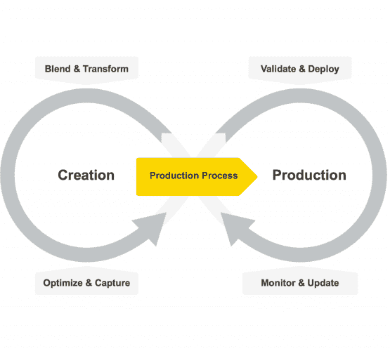

# 30 年数据科学：数据科学从业者的回顾

> 原文：[`www.kdnuggets.com/30-years-of-data-science-a-review-from-a-data-science-practitioner`](https://www.kdnuggets.com/30-years-of-data-science-a-review-from-a-data-science-practitioner)

编辑提供的图片

30 年的 KDnuggets 和 30 年的数据科学。差不多是我职业生涯的 30 年。长期从事同一领域工作所带来的特权之一——即经验——就是有机会作为直接目击者撰写其演变过程。

* * *

## 我们的前三个课程推荐

 1\. [Google 网络安全证书](https://www.kdnuggets.com/google-cybersecurity) - 快速进入网络安全职业生涯。

 2\. [Google 数据分析专业证书](https://www.kdnuggets.com/google-data-analytics) - 提升你的数据分析水平

 3\. [Google IT 支持专业证书](https://www.kdnuggets.com/google-itsupport) - 支持你的组织 IT 需求

* * *

# 算法

我在 90 年代初开始从事当时称为人工智能的工作，指的是一种自我学习的新范式，模仿神经细胞的组织，并且不需要验证任何统计假设：没错，就是神经网络！几年前刚刚发布了有效使用回传算法的研究成果[1]，解决了多层神经网络隐藏层训练的问题，使得一大批热情的学生能够探索多种老用例的新解决方案。没有什么能阻止我们……只有机器性能。

训练一个多层神经网络需要相当大的计算能力，特别是当网络参数数量多且数据集庞大时。计算能力是当时机器所缺乏的。理论框架已经发展出来，如 1988 年的时间序列回传算法（BPTT）[2]或 1997 年的长短期记忆网络（LSTM）[3]用于选择性记忆学习。然而，计算能力仍然是个问题，大多数数据分析从业者将神经网络搁置，等待更好的时机。

与此同时，出现了更精简且通常表现相当的算法。决策树形式的 C4.5 [4] 在 1993 年变得流行，尽管以 CART [5] 形式的决策树早在 1984 年就已存在。决策树训练起来更轻便，更易于理解，并且在当时的数据集上表现良好。很快，我们还学会了将多个决策树组合成一个森林 [6]，在随机森林算法中，或组合成一个级联 [7] [8]，在梯度提升树算法中。尽管这些模型相当庞大，即有大量的参数需要训练，但在合理的时间内仍然可管理。尤其是梯度提升树，利用级联的树按序列训练，将所需的计算能力分散到时间上，使其成为数据科学中非常实惠且成功的算法。

直到 90 年代末，所有数据集都是经典的、合理大小的数据集：客户数据、患者数据、交易数据、化学数据等等。基本上，都是经典的业务操作数据。随着社交媒体、电子商务和流媒体平台的扩展，数据开始以更快的速度增长，带来了全新的挑战。首先是存储和快速访问如此大量结构化和非结构化数据的挑战。其次是对更快算法的需求来进行分析。大数据平台负责存储和快速访问。传统的关系型数据库承载结构化数据，逐渐让位于新的数据湖，这些数据湖承载各种类型的数据。此外，电子商务业务的扩展推动了推荐引擎的普及。无论是用于市场篮子分析还是视频流推荐，这两种算法变得常用：apriori 算法 [9] 和协同过滤算法 [10]。

与此同时，计算机硬件的性能得到了提升，达到了难以想象的速度……我们又回到了神经网络。GPU 开始被用作神经网络训练中特定操作的加速器，使得越来越复杂的神经算法和神经架构得以创建、训练和部署。这一神经网络的第二次青春被称为深度学习 [11] [12]。人工智能（AI）这一术语开始重新浮现。

深度学习的一个分支，生成式 AI [13]，专注于生成新数据：数字、文本、图像，甚至音乐。模型和数据集的规模和复杂性不断增长，以实现更现实的图像、文本和人机互动的生成。

新模型和新数据在一个持续循环中迅速被新的模型和数据所替代。它越来越成为一个工程问题，而不是数据科学问题。最近，由于数据和机器学习工程方面的卓越努力，已经开发出了用于持续数据收集、模型训练、测试、人机交互动作，以及最终部署大型机器学习模型的自动化框架。所有这些工程基础设施是当前大型语言模型（LLMs）的基础，这些模型经过训练，旨在提供各种问题的答案，同时模拟人际互动。

# 生命周期

在我看来，过去几年数据科学最大的变化不在于算法，而在于基础设施的变革：从频繁的数据获取到模型的持续平滑再训练和重新部署。也就是说，数据科学已经从一个研究学科转变为一个工程努力。

机器学习模型的生命周期已经从类似 CRISP-DM [14]的纯创建、训练、测试和部署的单一周期，变成了一个双周期，其中一边是创建，而另一边是生产化——部署、验证、消费和维护 [15]。

图 1 机器学习模型的生命周期

# 工具

因此，数据科学工具不得不适应变化。它们不仅要支持创建阶段，还要支持机器学习模型的生产化阶段。必须有两个产品或一个产品的两个独立部分：一个支持用户创建和训练数据科学模型，另一个则使最终结果的生产化过程顺畅且无误。虽然创建部分仍然是智力的练习，但生产化部分则是结构化的重复任务。

显然，在创建阶段，数据科学家需要一个涵盖广泛机器学习算法的平台，从基本算法到最先进、最复杂的算法应有尽有。你永远不知道你需要哪个算法来解决哪个问题。当然，最强大的模型成功的机会更高，但代价是更高的过拟合风险和较慢的执行速度。数据科学家最终就像工匠一样，需要一个装满各种工具的工具箱，以应对他们工作中的各种挑战。

低代码平台也获得了人气，因为低代码使程序员甚至非程序员能够创建和快速更新各种数据科学应用程序。

作为智力的练习，机器学习模型的创建应该对每个人都可及。这就是为什么，尽管不是绝对必要的，但一个开源的数据科学平台将是理想的。开源允许所有有志于数据科学的人员自由访问数据操作和机器学习算法，同时允许社区调查和贡献源代码。

在生命周期的另一端，生产化需要一个提供可靠 IT 框架的平台，用于部署、执行和监控准备好的数据科学应用程序。

# 结论

在不到 2000 字的篇幅中总结 30 年的数据科学发展当然是不可能的。此外，我引用了当时最受欢迎的出版物，尽管它们可能不是该主题上的绝对首篇。我对那些在这一过程中扮演了重要角色但未在这里提及的许多算法表示歉意。尽管如此，我希望这段简短的总结能让你对数据科学在 30 年后的现状有更深入的理解！

# 参考文献

[1] Rumelhart, D.E.; Hinton, G.E.; Williams, R.J. (1986). “通过误差反向传播学习表示”。*自然*，323，页码 533-536。

[2] Werbos, P.J. (1988). ["反向传播的泛化及其在递归气体市场模型中的应用"](https://zenodo.org/record/1258627)。*神经网络*。1 (4): 339–356。 [doi](https://en.wikipedia.org/wiki/Doi_(identifier)):[10.1016/0893-6080(88)90007](https://doi.org/10.1016%2F0893-6080%2888%2990007-x)

[3] [Hochreiter](https://en.wikipedia.org/wiki/Sepp_Hochreiter), S.; Schmidhuber, J. (1997). "长短期记忆". *神经计算*。**9** (8): 1735–1780。

[4] Quinlan, J. R. (1993). “C4.5：机器学习程序” *摩根·考夫曼出版社*。

[5] Breiman, L.; Friedman, J.; Stone, C.J.; Olshen, R.A. (1984) “分类与回归树”，Routledge。 [`doi.org/10.1201/9781315139470`](https://doi.org/10.1201/9781315139470)

[6] Ho, T.K. (1995). [*随机决策森林*](https://web.archive.org/web/20160417030218/http://ect.bell-labs.com/who/tkh/publications/papers/odt.pdf). *第三届国际文档分析与识别会议论文集*，蒙特利尔，QC，1995 年 8 月 14-16 日，页码 278-282。

[7] Friedman, J. H. (1999). ["贪婪函数近似：一种梯度提升机器](https://statweb.stanford.edu/~jhf/ftp/trebst.pdf)，Reitz 讲座

[8] Mason, L.; Baxter, J.; Bartlett, P. L.; Frean, Marcus (1999). ["将提升算法视为梯度下降"](http://papers.nips.cc/paper/1766-boosting-algorithms-as-gradient-descent.pdf)。见 [S.A. Solla](https://en.wikipedia.org/wiki/Sara_Solla) 和 T.K. Leen 和 K. Müller (编辑)。*神经信息处理系统进展 12*。MIT 出版社。页码 512-518

[9] Agrawal, R.; Srikant, R (1994) [“挖掘关联规则的快速算法”](http://www.vldb.org/conf/1994/P487.PDF)。 *第 20 届国际大型数据库会议论文集*，VLDB，第 487-499 页，智利圣地亚哥，1994 年 9 月。

[10] Breese, J.S.; Heckerman, D.; Kadie C. (1998) “协同过滤预测算法的实证分析”， *第十四届人工智能不确定性会议论文集* (UAI1998)

[11] Ciresan, D.; Meier, U.; Schmidhuber, J. (2012). “用于图像分类的多列深度神经网络”。*2012 IEEE 计算机视觉与模式识别会议*，第 3642–3649 页。 [arXiv](https://en.wikipedia.org/wiki/ArXiv_(identifier)):[1202.2745](https://arxiv.org/abs/1202.2745)。 [doi](https://en.wikipedia.org/wiki/Doi_(identifier)):[10.1109/cvpr.2012.6248110](https://doi.org/10.1109%2Fcvpr.2012.6248110)。 [ISBN](https://en.wikipedia.org/wiki/ISBN_(identifier)) [978-1-4673-1228-8](https://en.wikipedia.org/wiki/Special:BookSources/978-1-4673-1228-8)。 [S2CID](https://en.wikipedia.org/wiki/S2CID_(identifier)) [2161592](https://api.semanticscholar.org/CorpusID:2161592)。

[12] Krizhevsky, A.; Sutskever, I.; Hinton, G. (2012). [“使用深度卷积神经网络进行 ImageNet 分类”](https://www.cs.toronto.edu/~kriz/imagenet_classification_with_deep_convolutional.pdf)。 *NIPS 2012: 神经信息处理系统，内华达州湖塔霍*。[ ](https://web.archive.org/web/20170110123024/http://www.cs.toronto.edu/~kriz/imagenet_classification_with_deep_convolutional.pdf)

[13] Hinton, G.E.; Osindero, S.; Teh, Y.W. (2006) “一种快速的深度信念网络学习算法”。 *Neural Comput* 2006; 18 (7): 1527–1554\. doi: [`doi.org/10.1162/neco.2006.18.7.1527`](https://doi.org/10.1162/neco.2006.18.7.1527)

[14] Wirth, R.; Jochen, H. (2000) “CRISP-DM: 面向数据挖掘的标准过程模型。” *第四届国际知识发现与数据挖掘应用会议论文集* (4)，第 29–39 页。

[15] Berthold, R.M. (2021) [“如何将数据科学转移到生产环境”](https://www.knime.com/blog/how-to-move-data-science-into-production)，KNIME 博客

**[Rosaria Silipo](https://www.linkedin.com/in/rosaria/?originalSubdomain=ch)** 不仅是数据挖掘、机器学习、报告和数据仓库的专家，她还成为了 KNIME 数据挖掘引擎的公认专家，关于这个领域她已经出版了三本书：《KNIME 初学者的好运》、《KNIME 食谱》和《KNIME SAS 用户手册》。此前，Rosaria 曾在欧洲多家公司担任自由数据分析师。她还曾领导 Viseca（苏黎世）的 SAS 开发小组，在 Spoken Translation（加州伯克利）用 C#实现了语音转文本和文本转语音接口，并在 Nuance Communications（加州门洛帕克）开发了多个不同语言的语音识别引擎。Rosaria 于 1996 年在意大利佛罗伦萨大学获得生物医学工程博士学位。

### 更多相关话题

+   [AI 十年回顾](https://www.kdnuggets.com/2023/06/ten-years-ai-review.html)

+   [每个 AI 从业者应当了解的隐藏技术债务](https://www.kdnuggets.com/2022/07/hidden-technical-debts-every-ai-practitioner-aware.html)

+   [如何在 14 年内将我的薪资提高 14 倍作为数据分析/科学专业人士](https://www.kdnuggets.com/2021/12/14x-salary-in-14-years-data-professional.html)

+   [40%的劳动力将在 3 年内受到 AI 的影响](https://www.kdnuggets.com/40-of-labour-force-will-be-affected-by-ai-in-3-years)

+   [2023 年 Google 数据分析认证评论](https://www.kdnuggets.com/2023/01/google-data-analytics-certification-review-2023.html)

+   [机器学习中的 Python：电子书评论](https://www.kdnuggets.com/2022/06/python-machine-learning-ebook-review.html)
