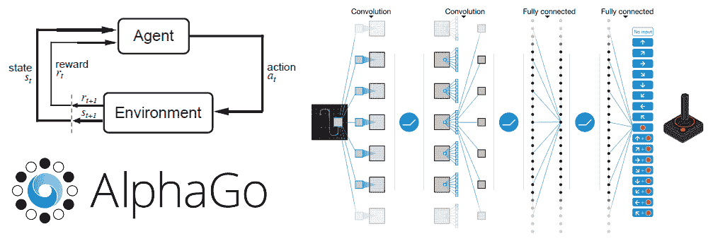
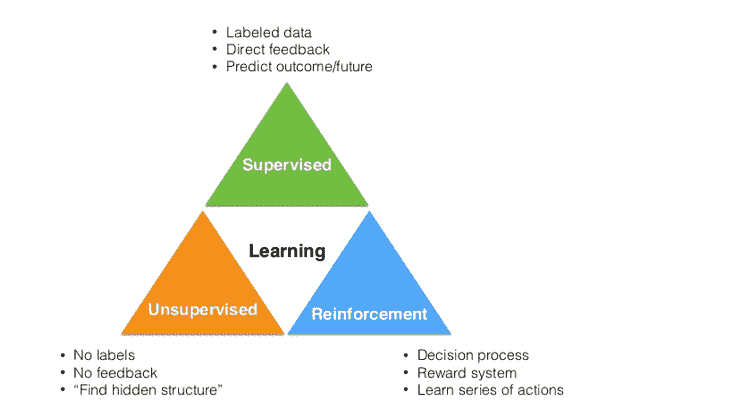
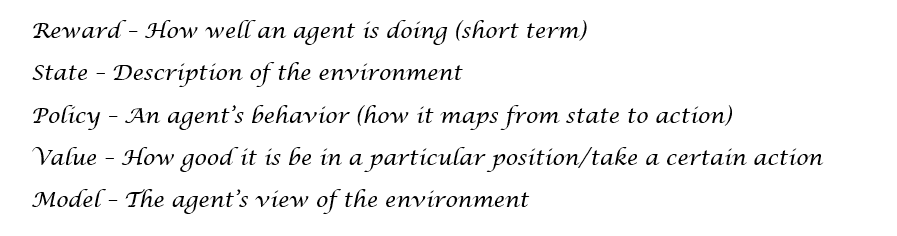
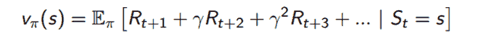
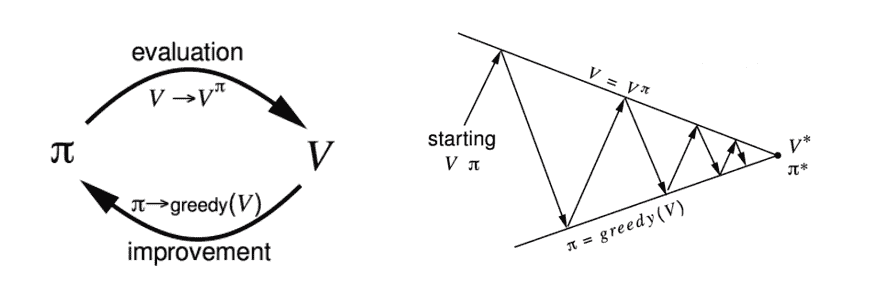
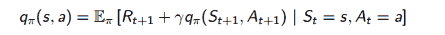
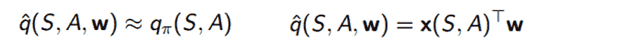
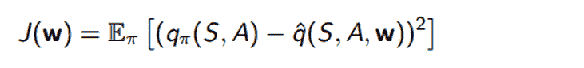

# 深度学习研究回顾：强化学习

> [`www.kdnuggets.com/2016/11/deep-learning-research-review-reinforcement-learning.html`](https://www.kdnuggets.com/2016/11/deep-learning-research-review-reinforcement-learning.html)

*这是一个名为深度学习研究回顾的新系列的第 2 期。每隔几周，我会总结并解释特定深度学习子领域的研究论文。本周关注强化学习。*

[*上次*](https://adeshpande3.github.io/adeshpande3.github.io/Deep-Learning-Research-Review-Week-1-Generative-Adversarial-Nets) *是生成对抗网络 ICYMI*

### **强化学习简介**

**机器学习的 3 个类别**

在进入论文之前，我们先来谈谈什么是**强化学习**。机器学习领域可以分为 3 个主要类别。

1.  监督学习

1.  无监督学习

1.  强化学习

第一个类别，**监督学习**，是你可能最熟悉的。它依赖于基于一组训练数据（包含输入及其对应的标签）来创建一个函数或模型。卷积神经网络就是一个很好的例子，因为图像是输入，而输出是图像的分类（狗、猫等）。

**无监督学习** 通过聚类分析的方法在数据中寻找某种结构。最著名的机器学习聚类算法之一 K-Means 就是无监督学习的一个例子。

**强化学习** 是学习在给定某种情况/环境下应该采取什么行动，以最大化奖励信号的任务。监督学习和强化学习之间有趣的区别在于，奖励信号仅仅告诉你代理采取的行动（或输入）是好是坏，并不会告诉你*最佳*行动是什么。与此相对的是 CNN，其中每个图像输入的对应标签明确指示了每个输入的输出应该是什么。强化学习的另一个独特组成部分是代理的行动将影响其后续接收到的数据。例如，代理向左移动而不是向右移动意味着代理在下一时间步骤将接收到来自环境的不同输入。让我们从一个例子开始。

**强化学习问题**

所以，让我们首先考虑在强化学习问题中有什么。假设在一个小房间里有一个小机器人。我们还没有编程这个机器人去移动或走动或采取任何行动。它只是站在那里。这个机器人就是我们的**代理**。

如前所述，强化学习完全是关于理解做决策/行动的最佳方式，以便我们最大化某个**奖励** **R**。这个奖励是一个反馈信号，仅仅表示代理在给定时间步的表现如何。代理在每个时间步采取的**动作 A**是奖励（告知代理当前表现如何）的信号和**状态 S**（描述代理所处环境的情况）的函数。环境状态到动作的映射称为我们的**策略 P**。策略基本上定义了在特定情况下，代理在特定时间的行为方式。现在，我们还有一个**价值函数 V**，这是衡量每个位置好坏的标准。这与奖励不同，因为奖励信号指示即时的好处，而价值函数更多地表示在长期来看处于这个状态/位置的好处。最后，我们还有一个**模型 M**，它是代理对环境的表示。这是代理对环境如何表现的模型。

**马尔可夫决策过程**

因此，让我们回到我们的小房间中的机器人（代理）。我们的**奖励函数**取决于我们希望代理完成的任务。假设我们希望它移动到房间的一个角落，在那里它将获得奖励。机器人到达这个点时将获得 +25，并且每经过一个时间步就会得到 -1。我们基本上希望机器人尽快到达角落。代理可以采取的**动作**是向北、向南、向东或向西移动。代理的**策略**可以是简单的，即代理将始终移动到具有更高价值函数的位置。对吧？一个高价值函数的位置 = 在这个位置（就长期奖励而言）很好。

现在，这整个 RL 环境可以用**马尔可夫决策过程**来描述。对于那些以前没听过这个术语的人来说，MDP 是一个建模代理决策的框架。它包含一个有限的状态集（及这些状态的价值函数），一个有限的动作集，一个策略和一个奖励函数。我们的价值函数可以分为两个部分。

1.  **状态价值函数 V**：在状态 S 中，遵循策略 π 的预期回报。这个回报是通过查看每个未来时间步的奖励总和来计算的（gamma 指的是一个常数折扣因子，这意味着时间步 10 的奖励的权重比时间步 1 的奖励略低）。

1.  **动作价值函数 Q**：在状态 S 中，遵循策略 π 并采取动作 a 的预期回报（方程与上面相同，只是我们增加了一个额外条件 At = a）。

现在我们有了所有的组成部分，我们该如何处理这个 MDP 呢？当然，我们想要解决它。通过解决 MDP，你将能够找到最大化代理可以从环境中任何状态获得的奖励的最优行为（策略）。

**解决 MDP**

我们可以通过使用动态规划和特别是**策略迭代**来解决一个 MDP（还有一种叫做价值迭代的技术，但现在不讨论）。其想法是我们从一些初始策略 π1 开始，并评估该策略的状态价值函数。我们通过**贝尔曼期望方程**来完成这个过程。

这个方程基本上说，给定我们遵循策略 π，我们的价值函数可以被分解为即时奖励 Rt+1 和后继状态 St+1 的价值函数的期望回报和。如果仔细想想，这等同于我们在上一节中使用的价值函数定义。使用这个方程是我们的**策略评估**组成部分。为了得到更好的策略，我们使用**策略**改进步骤，在这个步骤中我们简单地相对于价值函数采取贪婪行动。换句话说，代理采取最大化价值的行动。

现在，为了获得*最优*策略，我们重复这两个步骤，一个接一个，直到我们收敛到最优策略 π*。

**当没有给定 MDP 时**

策略迭代非常棒，但它只在我们有一个给定的 MDP 时才有效。MDP 本质上告诉你环境是如何工作的，而在现实世界中这通常不会被直接给出。当没有给定 MDP 时，我们使用无模型的方法，这些方法直接从代理与环境的经验/交互中得出价值函数和策略。我们将进行相同的策略评估和策略改进步骤，只是没有 MDP 提供的信息。

我们的做法是，不是通过优化状态价值函数来改进我们的策略，而是优化行动价值函数 Q。还记得我们是如何将状态价值函数分解为即时奖励和后继状态的价值函数之和的吗？我们可以用同样的方法处理我们的 Q 函数。

现在，我们将按照相同的过程进行策略评估和策略改进，不过我们将状态值函数 V 替换为动作值函数 Q。现在，我将略过评估/改进步骤中的详细变化。要理解 MDP 无关的评估和改进方法，如蒙特卡罗学习、时间差分学习和 SARSA 等话题需要专门的博客（如果你感兴趣的话，可以听听 David Silver 的[Lecture 4](https://www.youtube.com/watch?v=PnHCvfgC_ZA)和[Lecture 5](https://www.youtube.com/watch?v=0g4j2k_Ggc4)）。然而，现在我将跳到值函数近似以及 AlphaGo 和 Atari 论文中讨论的方法，希望这能让你了解现代强化学习技术。**主要的收获是我们想要找到能够最大化我们的动作值函数 Q 的最优策略π***。

**值函数近似**

所以，如果你考虑到迄今为止我们学到的一切，我们以一种相对简单的方式处理了我们的问题。看看上面的 Q 方程。我们接受一个特定的状态 S 和动作 A，然后计算一个基本上告诉我们预期回报的数字。现在假设我们的代理向右移动了 1 毫米。这意味着我们有了一个全新的状态 S’，现在我们需要为此计算一个 Q 值。在现实世界的强化学习问题中，有成千上万的状态，因此我们的值函数必须理解泛化，以便我们不需要为每个可能的状态存储一个完全独立的值函数。解决方案是使用**Q 值函数近似**，它能够对未知状态进行泛化。

所以，我们想要的是一个函数，我们称之为 Qhat，它可以在给定某个状态 S 和某个动作 A 的情况下，提供 Q 值的粗略近似。

这个函数将接受 S、A 和一个老旧的权重向量 W（一旦你看到 W，你就知道我们引入了一些梯度下降*）。它将计算 x（即表示 S 和 A 的特征向量）和 W 之间的点积。我们改进这个函数的方法是计算真实 Q 值（暂时假设它是已知的）和近似函数输出之间的损失*。

**

在我们计算损失之后，我们使用梯度下降来找到最小值，到那时我们将获得最优的 W 向量。函数近似的这一概念将在稍后查看的论文中非常关键。

**还有一件事**

在进入论文之前，想要提及最后一件事。有关强化学习的一个有趣讨论是探索与利用的主题。**利用**是代理利用其已知的知识，并采取它知道会产生最大奖励的行动。听起来不错，对吧？代理将始终根据其当前知识做出最佳行动。然而，这句话中有一个关键短语。*当前知识*。如果代理没有足够探索状态空间，它无法知道自己是否真的采取了最佳可能的行动。这种以探索状态空间为主要目的的行动被称为**探索**。

这个想法可以很容易地联系到现实世界的例子。假设你今晚要选择去哪个餐厅用餐。你（作为代理）知道你喜欢墨西哥菜，因此从 RL 的角度来看，去墨西哥餐厅将是最大化你奖励的行动，即在这种情况下是幸福感/满足感。然而，还有一个意大利餐的选择，你以前从未尝试过。有可能它比墨西哥菜更好，或者可能更差。这种在利用代理过去知识与尝试新事物以期发现更大奖励之间的权衡是强化学习（以及我们日常生活中的一个主要挑战）。

**其他学习 RL 的资源**

哎呀，那真是很多信息。然而，这绝不是对该领域的全面概述。如果你想要更深入的 RL 概述，我强烈推荐这些资源。

+   David Silver（来自 Deepmind）强化学习[视频讲座](https://www.youtube.com/watch?v=2pWv7GOvuf0&list=PL7-jPKtc4r78-wCZcQn5IqyuWhBZ8fOxT)

    +   我在 RL 课程中的[个人笔记](https://docs.google.com/document/d/1TjmYDOxQzOQ0jd0lUiFOVQ1hNAmtwKfSAACck9dR7a8/edit?usp=sharing)

+   Sutton 和 Barto 的[强化学习教材](https://webdocs.cs.ualberta.ca/~sutton/book/bookdraft2016sep.pdf)（如果你决心学习这一子领域的所有细节，这真的是终极宝典）

+   Andrej Karpathy 的[博客文章](http://karpathy.github.io/2016/05/31/rl/)关于 RL（如果你想轻松入门 RL，并查看一个做得非常好的实际示例，可以从这个开始）

+   [UC Berkeley CS 188](http://ai.berkeley.edu/lecture_videos.html) 讲座 8-11

+   [Open AI Gym](https://gym.openai.com/): 当你对 RL 感到舒适时，尝试使用 Open AI 创建的这个强化学习工具包创建自己的代理

* * *

## 我们的前三个课程推荐

 1. [Google 网络安全证书](https://www.kdnuggets.com/google-cybersecurity) - 快速进入网络安全职业的快车道。

 2\. [谷歌数据分析专业证书](https://www.kdnuggets.com/google-data-analytics) - 提升你的数据分析技能

 3\. [谷歌 IT 支持专业证书](https://www.kdnuggets.com/google-itsupport) - 支持你组织的 IT

* * *

### 相关话题

+   [HuggingFace 推出了免费深度强化学习课程](https://www.kdnuggets.com/2022/05/huggingface-launched-free-deep-reinforcement-learning-course.html)

+   [人工智能、分析、机器学习、数据科学、深度学习……](https://www.kdnuggets.com/2021/12/developments-predictions-ai-machine-learning-data-science-research.html)

+   [实践强化学习课程第三部分：SARSA](https://www.kdnuggets.com/2022/01/handson-reinforcement-learning-course-part-3-sarsa.html)

+   [实践强化学习课程第一部分](https://www.kdnuggets.com/2021/12/hands-on-reinforcement-learning-course-part-1.html)

+   [实践强化学习课程第二部分](https://www.kdnuggets.com/2021/12/hands-on-reinforcement-learning-part-2.html)

+   [强化学习入门](https://www.kdnuggets.com/2022/05/reinforcement-learning-newbies.html)*
