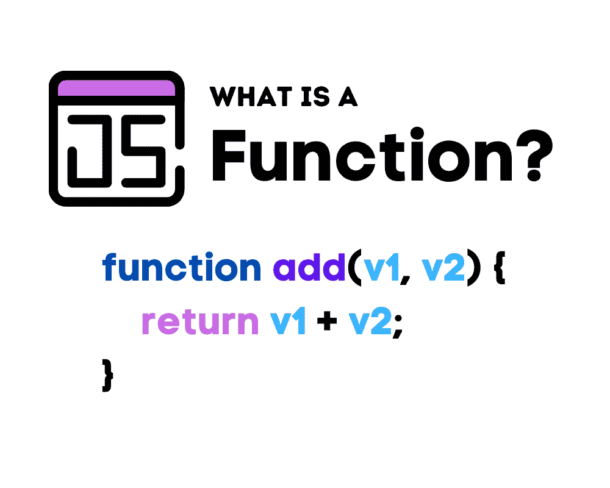

# 什么是函数？

> 原文：[`www.kdnuggets.com/2022/11/function.html`](https://www.kdnuggets.com/2022/11/function.html)



编辑者提供的图片

最早的高级函数式编程语言 LISP 于 1950 年代开发。它引入了我们今天编程中仍在使用的概念，例如 Lambda 函数和表达式。即使是像 JAVA 和 C# 这样的面向对象语言，也借鉴了函数式编程语言的符号和特性。

* * *

## 我们的前 3 名课程推荐

 1\. [Google 网络安全证书](https://www.kdnuggets.com/google-cybersecurity) - 快速进入网络安全职业的快车道。

 2\. [Google 数据分析专业证书](https://www.kdnuggets.com/google-data-analytics) - 提升你的数据分析技能

 3\. [Google IT 支持专业证书](https://www.kdnuggets.com/google-itsupport) - 支持你组织的 IT

* * *

尽管 LISP 作为一种编程语言家族至今仍在存在，但没有一种像 JavaScript 或 Python 那样流行——这些语言通常被用作函数式编程语言（除了其他范式之外）。正如名称所示，函数式编程语言围绕函数展开。

那么函数是什么，它与方法有什么不同？由于 JavaScript 是全球最受欢迎的 [编程语言](https://www.statista.com/statistics/793628/worldwide-developer-survey-most-used-languages/)（至少在本指南创建时如此），我们将以它作为示例。最终，你将在这里学到的概念可以转移到其他遵循函数式范式的编程语言中。

# JavaScript 的本质及函数的重要性

尽管在 ECMAScript 2015 规范（ES6）中引入了类，JavaScript 仍然不被视为基于类的面向对象语言。这主要是因为你不必定义类或类文件就能构建 JavaScript 项目。你可以在类的上下文之外定义和调用函数。

实际上，在 ECMAScript 2015 规范发布之前，JavaScript 函数遵循简单但松散的规则。因此，它们使用起来比 C# 和 JAVA 等面向对象编程语言中的函数（或方法）要直接得多。随着近年来 ECMAScript 规范的增加，JavaScript 的功能也不断增强，使得语言变得更加复杂。

尽管如此，JavaScript 仍然是全球使用最广泛的编程语言，这要归功于它的可扩展性和可移植性。你可以在客户端网页开发以及服务器端和桌面应用中使用它，只要配合合适的运行时和框架。

未来我们只会看到 JavaScript 的应用增加，因为越来越多的云数据库平台（DBaaS）已开始提供原生的 JavaScript SDK。因此，程序员不再被限制于使用[SQL 驱动程序（MSSQL 和 MySQL）](https://www.atlantic.net/hipaa-compliant-hosting/mysql-and-ms-sql-and-hipaa-compliance/)或其相关的库和函数。

JavaScript 值得学习和掌握——现在比以往任何时候都更加重要。函数使得 JavaScript 运转，你对它们的使用将决定你代码和项目的**最终**质量。但函数的行为和结构（尤其是 Lambda/Arrow 函数）对于初学者来说可能很难理解。

当 JavaScript 代码嵌入 HTML 中时，其语法可能特别令人困惑。然而，如果你希望从初学者成长为专家，你必须能够有效地构建和利用函数。而第一步就是回答这个问题：“什么是函数？”

## 什么是函数？

JavaScript 函数是一组包含在标记代码块中的[指令](https://www.w3schools.com/js/js_functions.asp)。它们很重要，因为它们允许你使用标签来引用这些指令，而不是每次都重复编写它们。调用或调用描述了在代码中使用或引用函数的过程。

作为一种函数式编程语言，JavaScript 拥有所谓的**一等函数**。这意味着函数可以被视为对象或一等公民。它们可以通过其他函数的参数传递，包含在数据结构中，并赋值给变量/对象。虽然这增加了 JavaScript 的扩展性，但也可能使代码更难阅读和跟随。不过，它的函数式特征是[使其适合数据科学](https://2022/02/data-science-programming-languages.html)的原因之一。函数声明的基本结构如下：

```py
function nameOfFunction(Parameter1, Paramater2, …) {
    //Body of function
} 
```

这是一个简单的函数，返回两个变量的和：

```py
function add(v1, v2) {
    return v1 + v2;
} 
```

函数是通过“*function*”关键字定义的，后面跟着函数名称（签名）、由逗号分隔并放置在圆括号之间的参数列表，以及一个代码块。与（旧版本的）C#和 Java 不同，你在定义函数时不需要指定返回类型。这也体现了 JavaScript 的松散类型特性。

函数的名称/标签可以是字母数字字符、下划线（_）和美元符号（$）的组合。你可以通过如下方式调用上述函数来给变量/属性赋值：

```py
let out_put = add(5, 5);
```

调用中的圆括号之间的值称为参数。并非所有 JavaScript 函数都是由程序员定义或声明的。

JavaScript 有一组内置函数，用于处理基本任务，如操作字符串和数组、处理 HTML 包装器、处理日期等。JavaScript 的[标准库](https://devdocs.io/javascript/)没有大多数通用编程语言（GPL）那么丰富或功能齐全。这可能是一个优势，因为它降低了学习曲线，并简化了编码，因为你不必担心使用正确的对象或数据类型。

再次提醒，如果你熟悉面向对象编程语言，你可能会感到有些困惑。你可能已经注意到，JavaScript 函数的结构和行为类似于方法。但方法和函数之间是否存在区别，JavaScript 是否有方法？

## 函数与方法

在许多编程语言中，方法和函数是同义的。然而，JavaScript 对这些术语的定义不同，因此函数和方法是两个略有不同的概念。这些差异很小，因为它们有相同的结构和类似的用法，但在不同的上下文中定义和调用。

方法是对象的函数，因为它们作为对象属性列表的一部分被构造。函数和方法的主要区别在于方法绑定到特定对象，而函数则不是。从本质上讲，属性列表（包括方法）赋予对象类似类的功能。JavaScript 方法的语法如下：

```py
ObjectDefinition = {
    methodLabel: function [KEYWORD]() {
        //The method’s body
    }
}; 
```

这是一个简单的返回两个数字和的方法示例：

```py
var addition = {
    firstNumber: 1,
    secondNumber: 5,

    summate: function() {
        return this.firstNumber + this.secondNumber;
    }
}; 
```

“*this*”关键字用于防止[变量遮蔽/隐藏](https://www.wikiwand.com/en/Variable_shadowing)，最终帮助你控制和维护作用域。你可以用它来引用对象声明范围内的其他属性。

你可以通过如下方式使用对象调用方法：

```py
addition.summate();
```

# 函数表达式（匿名函数）

如前所述，你可以将函数存储在变量或属性中。函数表达式允许你声明匿名函数，将它们的返回值分配给变量。正如你将看到的，它们与对象方法非常相似。函数表达式的基本语法如下：

```py
[VARIABLE DECLARATION KEYWORDS: var |
    const |
    let
] variableName = function([PARAMETER LIST]) {
    //Body of function
} 
```

函数表达式的一个简单示例如下：

```py
var summate = function(firstNumber, secondNumber) {
	return firstNumber + secondNumber;
} 
```

然后你可以使用变量标签来调用该函数：

```py
summate(1,5); 
```

# 箭头函数

箭头函数首次在 ECMAScript 2015 标准（ES6）中引入。它们类似于 Lambda 表达式 在 Python 和 C# 中，因为它们允许你创建更简洁的声明和函数调用（并且它们都使用箭头）。然而，起初使用它们可能有些棘手。箭头函数的基本语法是：

```py
[let |
    const |
    var
] functionName = ([PARAMETER LIST…]) => expression[The Body of The Function]
```

实际应用时，它看起来是这样的：

```py
[let |
    const |
    var
] functionName = ([PARAMETER LIST…]) => {
    //The Body of The Function]
} 
```

或者这样：

```py
var summate = (firstNumber, secondNumber) => firstNumber + secondNumber;
```

你还可以通过否定函数签名来匿名化箭头表达式，如下所示：

```py
 (firstNumber, secondNumber) => firstNumber + secondNumber;
```

箭头函数的另一个优点是它们处理“*this*”关键字和作用域的方式。如果正常函数在对象的作用域之外定义，它指向调用它的对象。在网页浏览器环境中，这可能是一个按钮、窗口、文档等。相比之下，当“*this*”与箭头函数一起使用时，它始终引用定义/声明它的对象。

# 总结

JavaScript 受欢迎的一个重要原因是其灵活性，尽管有些人认为更严格的约束和规则可能会简化编码体验。

由于其多范式特性，它接受 各种编码风格，这从它允许你声明和使用函数的方式中可以看出。这种宽松性使得开发者可以更自然地混淆代码，因此他们不必局限于某种特定的函数风格。

作为初学者，如果你还不习惯使用箭头函数，可以坚持使用简单的声明和调用。你掌握一项技能或语言的速度很大程度上取决于你对基础知识的理解。

**[Nahla Davies](http://nahlawrites.com/)** 是一名软件开发者和技术作家。在全职从事技术写作之前，她曾担任一家公司（在《Inc. 5000》中排名前 5,000）的首席程序员，该公司服务于包括三星、时代华纳、Netflix 和索尼在内的客户。

### 更多相关话题

+   [你需要了解的 5 个梯度下降和成本函数概念](https://www.kdnuggets.com/2020/05/5-concepts-gradient-descent-cost-function.html)

+   [数据科学中的 3 个 SQL 聚合函数面试问题](https://www.kdnuggets.com/2023/01/3-sql-aggregate-function-interview-questions-data-science.html)

+   [Python 函数参数：权威指南](https://www.kdnuggets.com/2023/02/python-function-arguments-definitive-guide.html)

+   [多标签 NLP：类别不平衡和损失函数的分析…](https://www.kdnuggets.com/2023/03/multilabel-nlp-analysis-class-imbalance-loss-function-approaches.html)

+   [如何使用 pivot_table 函数进行高级数据汇总…](https://www.kdnuggets.com/how-to-use-the-pivot_table-function-for-advanced-data-summarization-in-pandas)

+   [初学者指南：Pandas Melt 函数](https://www.kdnuggets.com/2023/03/beginner-guide-pandas-melt-function.html)
