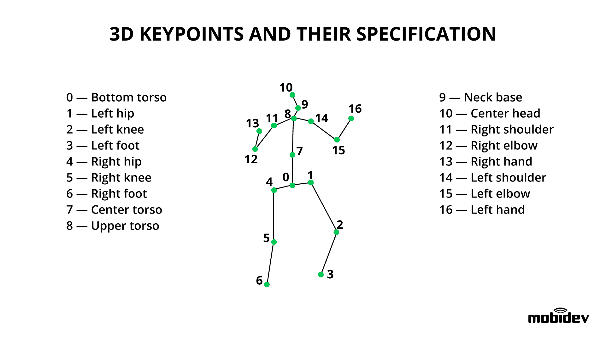
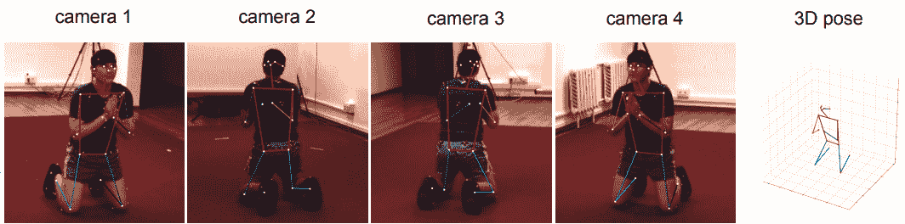
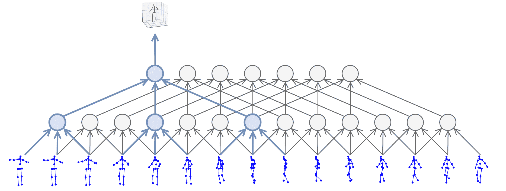
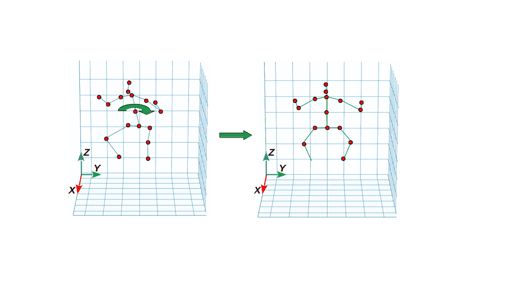
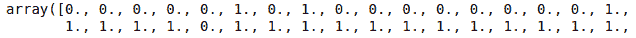
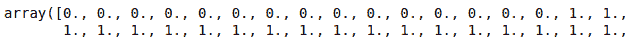
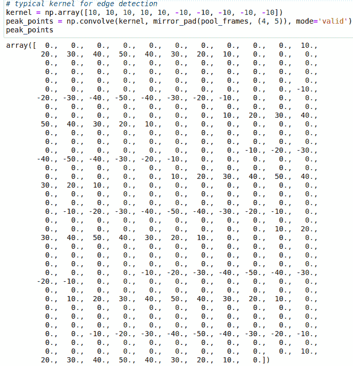

# 3D 人体姿态估计实验与分析

> 原文：[`www.kdnuggets.com/2020/08/3d-human-pose-estimation-experiments-analysis.html`](https://www.kdnuggets.com/2020/08/3d-human-pose-estimation-experiments-analysis.html)

comments

**由 [Maksym Tatariants](https://www.linkedin.com/in/maksym-tatariants/)，[MobiDev](https://mobidev.biz/services/data-science)的数据科学工程师**

人体姿态估计的基本思想是理解视频和图像中的人的运动。通过在图像或视频中定义人体上的关键点（关节），如手腕、肘部、膝盖和踝关节，基于深度学习的系统可以识别空间中的特定姿势。基本上，姿态估计分为两种类型：2D 和 3D。2D 估计涉及从 RGB 图像中提取每个关节的 X、Y 坐标，而 3D 估计则涉及从 RGB 图像中提取 XYZ 坐标。

* * *

## 我们的前三个课程推荐

 1\. [Google 网络安全证书](https://www.kdnuggets.com/google-cybersecurity) - 快速进入网络安全职业道路。

 2\. [Google 数据分析专业证书](https://www.kdnuggets.com/google-data-analytics) - 提升你的数据分析技能

 3\. [Google IT 支持专业证书](https://www.kdnuggets.com/google-itsupport) - 支持你的组织的 IT 事务

* * *

在本文中，我们探讨了基于我们的研究和实验，3D 人体姿态估计是如何工作的，这些研究和实验是分析[AI 健身教练应用中的人体姿态估计](https://mobidev.biz/blog/human-pose-estimation-ai-personal-fitness-coach)的一部分。

### 3D 人体姿态估计的工作原理

3D 人体姿态估计的目标是通过使用包含人的图像来检测人体上特定数量的关节（关键点）的 XYZ 坐标。视觉上，3D 关键点（关节）跟踪如下：

3D 关键点及其规格 (https://mobidev.biz/wp-content/uploads/2020/07/3d-keypoints-human-pose-estimation.png)

一旦提取了关节的位置，运动分析系统会检查一个人的姿势。当关键点从视频流的连续帧中提取出来时，系统可以分析该人的实际运动。

3D 人体姿态估计有多种方法：

1.  **训练一个能够直接从提供的图像中推断 3D 关键点的模型。**

    例如，一个多视角模型[EpipolarPose](https://arxiv.org/abs/1903.02330)被训练以联合估计 2D 和 3D 关键点的位置。有趣的是，它在训练时不需要真实的 3D 数据 - 只需要 2D 关键点。相反，它通过对 2D 预测应用极几何以自监督的方式构建 3D 真实值。这很有帮助，因为训练 3D 人体姿态估计模型时常见的问题是缺乏高质量的 3D 姿态注释。

1.  **检测 2D 关键点并将其转换为 3D。**

    这种方法最为常见，因为 2D 关键点预测已被充分探索，并且使用预训练的 2D 预测骨干网可以提高系统的整体准确性。此外，许多现有模型提供了不错的准确度和实时推理速度（例如，[PoseNet](https://github.com/tensorflow/tfjs-models/tree/master/posenet)，[HRNet](https://github.com/HRNet/HigherHRNet-Human-Pose-Estimation)，[Mask R-CNN](https://research.fb.com/publications/mask-r-cnn/)，[Cascaded Pyramid Network](https://arxiv.org/abs/1711.07319)）。

无论是使用图像 →2D →3D 还是图像 → 3D 的方法，3D 关键点通常通过单视角图像推断得出。另一方面，也可以利用多视角图像数据，其中每一帧都由多个摄像头从不同角度聚焦于目标场景进行拍摄。

多摄像头模型姿态估计 – 多个 2D 检测结果被合并以预测最终的 3D 姿态（来源 – 可学习的三角测量，[`arxiv.org/abs/1905.05754`](https://arxiv.org/abs/1905.05754)）

多视角技术可以提高深度感知，并帮助解决图像中一些身体部位被遮挡的情况。因此，模型的预测变得更加准确。

通常这种方法需要同步的摄像头。然而，一些作者展示了即使来自多个不同步和未校准的摄像头的视频流也可以用来估计 3D 关节位置。例如，在[《人体姿态作为校准模式》](http://openaccess.thecvf.com/content_cvpr_2018_workshops/papers/w34/Takahashi_Human_Pose_As_CVPR_2018_paper.pdf)论文中描述了可以利用对人体自然比例的外部知识和放宽的重投影误差来优化未校准摄像头的初始检测，从而获得最终的 3D 预测。

### 人体姿态估计模型如何检测和分析动作

我们考虑了一个现实的应用开发场景，针对 AI 健身教练。在这个场景中，用户应在进行运动时录制自己，通过应用分析运动的正确性，并回顾在运动过程中所犯的错误。

当复杂的多摄像机设置和深度传感器不可用时，这种情况就会发生。因此，我们选择了 [VideoPose3D](https://github.com/facebookresearch/VideoPose3D) 模型，因为它适用于简单的单视角检测。VideoPose3D 属于卷积神经网络（CNNs）家族，并采用扩张时间卷积（见下方插图）。

使用 VideoPose3D 进行 2D 到 3D 关键点转换。请注意，在此插图中，使用了过去和未来的帧来进行预测。（致谢 [Pavllo et al](https://arxiv.org/abs/1811.11742)。）

作为输入，该模型需要一组 2D 关键点检测，其中 2D 检测器是预先训练在 COCO 2017 数据集上的。通过利用不同时间段拍摄的多帧信息，VideoPose3D 实质上基于关于关节的过去和未来位置的数据进行预测，从而允许更准确地预测当前关节的状态，并部分解决不确定性问题（例如，当关节在某一帧中被遮挡时，模型可以“查看”相邻帧以解决问题）。

为了探索 VideoPose3D 的能力和局限性，我们将其应用于力量举和武术练习的分析。

### 脊柱角度检测

脊柱角度是蹲下时最重要的分析内容之一。保持背部挺直在这个练习中很重要，因为你向前倾斜得越多，质心（身体 + 杠铃）就越向前移动（这可能是非常糟糕的，因为质心的偏移会导致脊柱额外负荷）。

为了测量角度，我们将脊柱（起始关键点 0，结束关键点 8）视为一个向量，并通过取余弦相似度方程的*反余弦*来测量该向量与 XY 平面的角度。在下方视频中，你可以看到模型如何在示例视频中检测脊柱角度。如你所见，当以不正确的姿势蹲下时，角度可能小至 28-27°。

脊柱角度检测——人员过度前倾（点击查看动画）

[`youtu.be/yZv-qoKfmqk`](https://youtu.be/yZv-qoKfmqk)

从正确执行动作的视频中（见下方视频），我们可以看到角度不会低于 ~47°。这意味着所选方法可以正确检测蹲下时的脊柱角度。

脊柱角度检测——保持背部挺直（点击查看动画）

[`youtu.be/ikQhw9pNMy4`](https://youtu.be/ikQhw9pNMy4)

### 运动开始和结束的检测

为了能够自动分析仅在运动的活跃阶段或检测其持续时间，我们调查了自动检测运动开始和结束的过程。

由于深蹲时需要特定的手臂定位，我们决定使用手臂的位置作为检测的参考。在深蹲时，两只手臂通常会弯曲成小于 90°的角度，手的位置接近肩膀（按高度）。通过使用一些任意阈值（在我们的案例中，我们选择了小于 78°的角度和小于最大 z 轴值的 10%的距离），我们可以检测到这种情况，如下所示。

深蹲开始检测（点击查看动画）

https://youtu.be/KjtXIoX-KSo

为了检查运动过程中是否保持了条件和阈值，我们从不同的角度分析了另一段视频，并审查了系统在检测开始后如何在运动中运作。结果发现，观察到的参数远低于所选的阈值。

运动过程中深蹲条件的稳定性（点击查看动画）

我们还检查了在人员完成运动后条件的表现，并看到一旦杠铃被放下，错误条件会立即触发。最后，我们得出结论，这种方法效果很好，尽管它有一些细节（在“人体姿态估计技术中的错误及可能解决方案”部分中描述）。

深蹲条件 – 深蹲结束检查（点击查看动画）

### 膝盖凹陷检测

膝盖内翻或膝盖凹陷是深蹲中的常见错误。这种问题通常发生在运动员到达深蹲的底部并开始起身时。错误的技术可能导致膝关节的严重磨损，并导致韧带撕裂或膝盖杯的更换。

为了查看模型如何检测膝盖凹陷错误，我们捕捉了关节的 3D 位置。由于结果骨架（见下图）可以随机定位，我们沿 Z 轴旋转它以使其与某个平面对齐。

关键点旋转以匹配选定的平面（在此情况下为 ZY 平面）

然后，我们将 3D 关键点投影到平面上，并开始跟踪膝盖相对于脚的位置。目标是检测双腿弯曲的情况，以及膝盖比脚更靠近躯干中心的情况。

从下面的图像中，你可以看到膝盖位置不正确的情况被很好地检测出来了，这意味着这种方法效果很好。

膝盖内陷检测：原始视频、3D 检测和 ZY 平面的正投影（点击查看动画）

### 比较两位运动员在力量举和抓举中的表现

3D 人体姿态估计技术的另一个有趣应用是比较两个人的运动。为了改进运动技术，运动员可以使用基于人体姿态估计的应用程序将自己与经验更丰富的运动员进行比较。为此，需要有一个包含特定动作的“黄金标准”视频，并利用它来评估身体部位定位的相似性和差异。

对于这种比较，我们拍摄了运动员进行抓举的视频，并标记了开始和结束点。目标是加速或减速以与目标（“黄金标准”）视频的开始和结束同步。过程如下：

1.  两个视频中 3D 关键点位置的检测

1.  对齐关键点，使“骨架”具有相同的中心点并且旋转类似

1.  分析不同关节之间的距离逐帧

比较两位运动员在抓举中的运动：在姿态重建视图的左上角框中显示了相应关节之间的距离（点击查看动画）

https://youtu.be/34z5FI5ldyE

结果是，我们发现准确检测人体在快速且突然的运动中的姿态超出了单视角检测方法的极限。当有更多帧可用时，网络对运动的预测更准确，而在 ~2 秒的运动中则不然（至少如果你有 30 fps 的视频）。

### 硬拉 - 重复计数器

如果你曾考虑过 3D 人体姿态估计是否可以用来计数运动中的重复次数，我们准备了一个基于硬拉练习的示例，展示了如何以自动化方式确定重复次数和运动阶段（向上或向下）。在下面的图像中，你可以看到我们能够检测到人正在向上运动，并且可以相当可靠地计数重复次数。

硬拉中的重复次数和运动阶段检测（点击查看动画）

https://youtu.be/zX51qbBCiLM

我们首先考虑了如何定义一个重复动作。基本上，硬拉中的一次重复是当最初弯腰的人开始上升，达到垂直位置，然后再次开始下降。因此，我们需要寻找一个时间点，在这个时间点，一个连续的“向上”帧组后面跟着一个连续的“向下”帧组。两个组之间的边缘帧将是我们可以向计数器中添加一次重复的地方。

在实际应用中，找到上升和下降帧的关键是脊柱角度，我们已经知道如何检测。利用这一点，我们可以遍历所有检测到的帧，并比较邻近帧中的脊柱角度。结果，我们将得到一个由 1 和 0 组成的向量，其中连续的 1 可以代表上升，0 代表下降。

基于脊柱角度比较序列中的两个姿势，以确定个人是上升还是下降。比较滤镜遍历序列中的所有帧。

显然，这些检测结果需要进行一些小的清理，以去除偶然的检测和振荡。这可以通过使用相对小尺寸（4-5）帧的滑动窗口遍历数据，并用窗口内的多数值替换所有值来完成。

运动阶段检测示例，在值清理前（上方）和后（下方）的前 17 帧（1- 上升，0 – 下降）

清理完成后，我们可以开始检测实际的边缘帧，即个人完成一个重复的地方。这出奇简单，因为我们可以应用用于边缘检测的卷积滤镜（核）。

使用边缘检测核的卷积结果

结果是，当接近边缘帧时，值开始增长，变为正值或负值（取决于边缘类型）。由于我们正在寻找上升|下降的边缘，我们需要找到所有滤镜值为-50（最大）的帧的索引，然后我们就会知道何时添加重复。

### **人体姿势估计中的错误和可能的解决方案**

### 蹲下起始检测错误

**问题：** 乍一看，蹲下起始检测似乎工作正常，但任意阈值在一个手臂角度短暂超过时会产生错误。

蹲下起始检测 – 阈值错误（点击查看动画）

**解决方案：** 我们可以提高阈值以避免特定视频中的错误，但不能保证处理其他视频时不会出现相同的错误。这意味着需要通过使用多个不同的示例来测试模型，以建立适当的规则集。

### 正面视角错误

**问题：** 在处理不寻常的运动和严格的正面视角时，模型往往会产生低质量的结果，特别是腿部关键点。造成这一问题的可能原因是，尽管 Human3.6M 数据集的规模很大，但其在姿势、运动和视角方面仍然有限。因此，模型无法准确地对呈现的数据（这些数据远远超出了已学习的分布）进行泛化。相比之下，当视角为非正面时，相同的运动预测会更好。

正面位置的运动员在抓举动作中的 3D 检测效果差（点击查看动画）

https://youtu.be/Za1GPq6sHUk

**解决方案：** 可以通过在特定领域数据上微调模型来解决这个问题。或者，您可以利用合成数据进行训练（例如用逼真的渲染生成的动画 3D 模型），或者将有关骨骼系统的外部知识编码到损失函数中。

### 不寻常的运动误差

**问题：** 在进行 3D 人体姿势估计时，我们发现 2D 检测部分可能导致预测精度低。

在不寻常动作中，腿部位置未被正确检测（点击查看动画）

https://youtu.be/Gu_H3s7eel0

Keypoint R-CNN 模型错误地检测了快速移动的腿部位置，这在一定程度上归因于快速过渡造成的腿部特征模糊。

此外，这种四肢位置与用于模型预训练的 COCO 2D 关键点数据集中的数据并不十分相似。因此，3D 模型对下半身的预测与实际运动不符，而上半身看起来正确，因为上肢的自由度比腿部在模型训练中使用的图像上更多。

**解决方案：**

1.  **收集和标注包含目标领域图像的自有数据集。** 尽管这种方法可以提高模型在目标领域的表现，但实施成本可能过于昂贵。

1.  **使用训练时的数据增强，使模型对人体旋转不那么敏感。** 这种方法需要对训练图像及其中的所有关键点进行随机旋转。这确实有助于预测不寻常的姿势，但对于那些不能通过简单旋转获得的姿势（如弯腰或高踢腿），效果可能不佳。

1.  **采用旋转不变模型，能够推断关键点的位置，无论身体的旋转角度如何。** 可以通过训练一个额外的旋转网络来实现，旨在找到将给定图像转换为标准视图所需的旋转角度。一旦网络训练完成，它可以集成到推理流程中，使得关键点检测模型只接收经过角度标准化的图像。

### 遮挡关节错误

**问题：** 当身体部位被其他身体部位或物体遮挡时，2D 预测器可能会返回较差的结果。在举重时，如果杠铃上的重量遮挡了手的位置，检测器可能会“失误”，将关键点放置在离真实位置较远的地方。这会导致 3D 关键点模型输出的不稳定和“抖动的手”效果。

2D 关键点模型未能检测左手的位置，导致 3D 重建不准确（点击查看动画）

https://youtu.be/1rg1lj-eAaw

**解决方案：** 可以使用多视角系统来获得更好的准确性，因为它们可以显著减少遮挡问题。也有一些专门 [设计](https://arxiv.org/abs/1907.06922) 来处理遮挡的 2D 关键点定位模型。

总之，根据我们的实际发现，大多数 3D 人体姿态估计技术的弱点是可以避免的。主要任务是选择合适的模型架构和训练数据。此外，3D 人体姿态估计的快速发展表明，当前的障碍在未来可能会变得不那么严重。

**简介：[Maksym Tatariants](https://www.linkedin.com/in/maksym-tatariants/)** 是 [MobiDev](https://mobidev.biz/services/data-science) 的数据科学工程师。他拥有环境和机械工程、材料科学和化学方面的背景，并热衷于在数据科学和机器学习领域获得新的见解和经验。他特别对基于深度学习的技术及其在商业应用中的应用感兴趣。

**相关：**

+   2019 年人体姿态估计指南

+   用于评估深度学习目标检测器的指标

+   计算机视觉模型是否容易受到权重中毒攻击？

### 更多相关话题

+   [机器学习实验的版本控制与追踪](https://www.kdnuggets.com/2021/12/versioning-machine-learning-experiments-tracking.html)

+   [如何设计数据收集实验](https://www.kdnuggets.com/2022/04/design-experiments-data-collection.html)

+   [用于深度学习实验的 Hydra 配置](https://www.kdnuggets.com/2023/03/hydra-configs-deep-learning-experiments.html)

+   [深度学习与人类认知能力之间的差距](https://www.kdnuggets.com/2022/10/gap-deep-learning-human-cognitive-abilities.html)

+   [缩小人类理解与机器学习之间的差距：…](https://www.kdnuggets.com/2023/06/closing-gap-human-understanding-machine-learning-explainable-ai-solution.html)

+   [将人类与人工智能代理结合以提升客户体验](https://www.kdnuggets.com/2024/06/softweb/bringing-human-and-ai-agents-together-for-enhanced-customer-experience)
