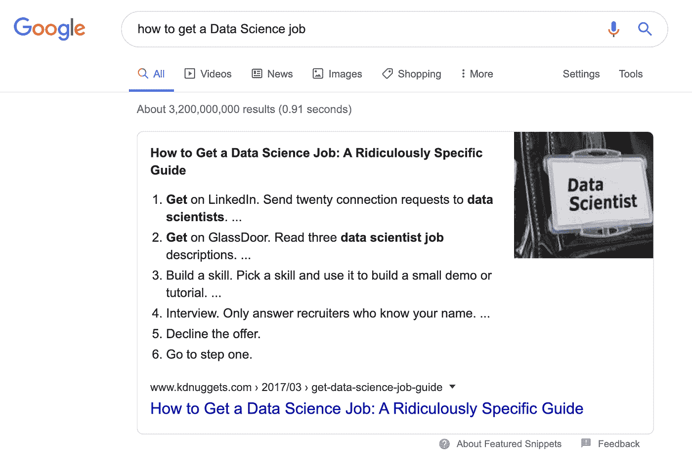
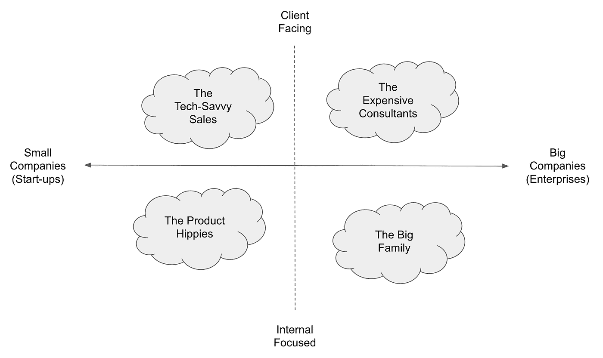
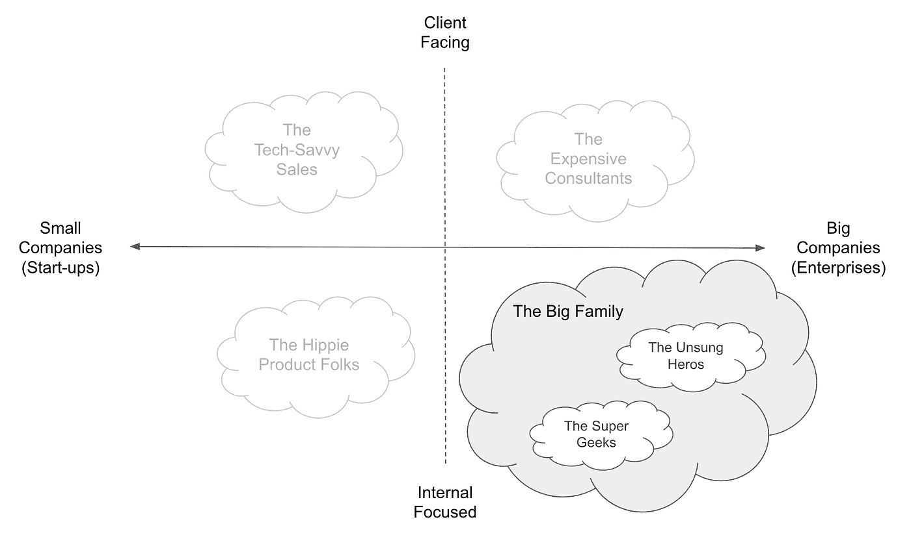

# 数据科学家的 4 种现实职业选择

> 原文：[`www.kdnuggets.com/2020/04/4-career-options-data-scientists.html`](https://www.kdnuggets.com/2020/04/4-career-options-data-scientists.html)

评论

**由 [Ian Xiao](https://twitter.com/ian_xxiao)，德勤的市场营销与人工智能实践**。

*照片来源于 [Caleb Jones](https://unsplash.com/@gcalebjones?utm_source=unsplash&utm_medium=referral&utm_content=creditCopyText) 在 [Unsplash](https://unsplash.com/s/photos/path?utm_source=unsplash&utm_medium=referral&utm_content=creditCopyText)。*

### 2020 年 2 月 27 日

大约在城市因 COVID-19 封锁前的三周，我和一个朋友坐在我们最喜欢的多伦多市中心的泰国餐厅里。

**“我应该留在数据科学领域吗？如果不应该，我接下来该做什么？”** 我的朋友问道。

像聚会的声音和新鲜餐厅食物的香味一样，如何进入数据科学现在似乎有些遥远。事实上，你可以在谷歌上找到约 30 亿个结果，其中有*极其具体的逐步指南*（而“如何赚钱”仅有约 20 亿个结果）。

*截至 2020 年 3 月 25 日的谷歌搜索结果。*

然而，我朋友的问题依然萦绕在心。深层次的紧张感源于两个因素：1) 数据科学的期望与现实——[它可能比我们预期的更无聊](https://towardsdatascience.com/data-science-is-boring-1d43473e353e)，2) 角色与我们的抱负。

那么，选项是什么呢？

1.  保持相同角色并内化挫败感（你可以跳过这篇文章，但**请**在离开前**分享**????）

1.  离开当前角色，但在其他地方继续从事与数据科学相关的工作（这篇文章是为你准备的）

1.  我完全厌倦了（你确定吗？在做出决定之前考虑一下选项 2）

### 但是，去哪里呢？

要知道我们想去哪里，你必须了解我们现在的位置。要获取更大的选择视角，我们中的许多人可能会转向“什么是数据科学？”的问题。如果你谷歌这个短语，你很可能会遇到类似这样的内容：

*什么是数据科学，[图片来源](https://medium.com/@iphs_tech/believing-these-8-myths-about-what-is-data-science-keeps-you-from-growing-528f1bd240dc)。*

这种分类是有意义的，但它并没有真正捕捉到***日常工作的实际情况***和**公司性质。** 这两个因素无疑是在我们做出职业决策时最重要的。

有一种更好的思考方式。因此，让我向你展示**数据科学家的原型**。

### 等一下...

在我们开始之前，了解我的 [背景和经历](https://www.linkedin.com/in/ianxiao/) 是很重要的，这样你可以根据自己的现实和限制来解读我的见解。

简而言之**，** 我通过为大型企业提供咨询、结识各种数据科学家，以及在一家最终被收购的 AI 初创公司构建机器学习产品，见证了数据科学的演变。

我的观点只是一个数据点（希望它是有用和独特的），所以要注意其他人的看法。

### 选项：数据科学家的原型

那么，什么是数据科学？这取决于**公司规模**（企业还是初创公司）和**主要责任**（客户面对还是内部聚焦）。

当你面试数据科学角色时，尽管有职位名称和工作描述，*但很可能*会落入以下四个过于简化且主观标记的组别中。

*数据科学家的四种原型。作者分析。*

**你如何使用这个？**原型展示了可能性。它允许你查看你目前的位置以及即时的选项。对于有志于成为数据科学家的你，可以利用这个工具来找出最好的起点。

接下来，你可能会问：**我怎么知道新角色是否对我更好？**

为了帮助你做决定，下面是每个角色的一些优缺点。此外，我将讨论可能最适合的才俊类型。当然，这些都是有些主观的：对我来说好的可能对你不好。总会有例外。请自行判断。

*注意：*

1.  *你还可以根据公司的其他方面进行分类，例如行业和产品类型（例如，与数据科学相关的服务或工具，非数据科学产品）。我认为公司规模对日常工作有更大的影响。*

1.  *公司规模不是二元的，还有许多中型公司；为了简单起见，我将其二元化。*

1.  *在初创公司中，客户面对和内部事务之间的墙并不存在；人们往往会同时处理两者。这只是时间分配的问题。*

### 1 — 昂贵的顾问

全球咨询公司或大型科技公司（例如，德勤、麦肯锡、埃森哲、谷歌、IBM 等）的数据科学服务

[通过 GIPHY](https://giphy.com/gifs/showtime-kristen-bell-don-cheadle-house-of-lies-l3V0B6ICVWbg8Xi5q)

***优秀的***：在解决问题和高效工作方面有非常好的培训。处理非常“重要的事务”，因为客户为结果支付高昂费用。如果你感到无聊或沮丧，每个项目都可能不同。晋升路径和要求非常明确（例如，分析师、经理、合伙人）。接触到高层管理人员，早期职业生涯涉及广泛话题，并且有很多雄心勃勃的人。

***不佳的***：商业价值凌驾于一切之上（例如，科学创新和酷炫的算法）。所有职位级别的工作时间都很紧张。一些公司可能不会将数据科学家纳入传统的合伙人轨道（你可能会感到被边缘化，但别担心，大多数人都非常尊重）。很多主导型个性。

***最佳匹配***：具备一定技术培训并有志于在大公司内经营“自己的小生意”的商业导向人士。刚起步的学生，寻找导师，想要学习最佳术语并不介意被严格工作。

### 2 — 技术精通的销售

在以 AI 为重点的初创公司或中型公司中担任技术销售或项目领导角色（例如，[Dessa](https://www.dessa.com/)，[Element AI](https://www.elementai.com/)，[H2O](https://www.h2o.ai/)，[Cloudera](https://www.cloudera.com/about/services-and-support/professional-services.html)，[Palantir](https://www.palantir.com/)）。

[通过 GIPHY](https://giphy.com/gifs/tom-cruise-risky-business-movie-3jzoNumaV4o80)

***好处***：你可以处理一些前沿的应用案例，因为客户通常期望你提供创新，而不是提供（无聊的）长期、大规模的转型项目。对重要的战略和产品决策有更大的发言权。灵活而创新。

***坏处***：一些客户可能不信任你处理大型项目（例如，获得更多预算），这是“灵活与创新”的另一面。可能需要做很多“免费”工作来赢得客户信任。与大公司相比，后台支持较少。产品愿景可能会受到投资者（如果你有错误的风险投资）或[沉没成本心理](https://time.com/5347133/sunk-cost-fallacy-decisions/)的影响，而不是基于真正的市场需求。

***最佳匹配***：那些希望在初创阶段与公司共同成长，过上创业梦想生活，并且已经拥有坚实的业务网络、领域专长和/或声誉的人。不适合新人，因为你需要迅速上手。

### 3 — 产品嬉皮士

具有软件和/或机器学习背景的人，与工程团队合作，构建知识产权、演示并支持销售电话，在 AI 产品公司工作。

[通过 GIPHY](https://giphy.com/gifs/reaction-hoodie-6Y39ycr8vG9qM)

***好处***：处理有趣且实际的问题，而不必应对过多的客户政治。项目周期较短。作为“内部用户”能够影响或定义产品的设计。为客户或内部团队打造酷炫的东西。

***坏处***：可能会被拉入客户或用户面对的角色，这会在优先级和时间管理上产生紧张。很难找到“前沿”与“立即实用”之间的正确平衡。可能会陷入无休止的客户支持工作。

***最佳匹配***：那些以产品为导向、以工程为重点但有时有些黑客气息的人。拥有特定技术栈或工作流领域专业知识的资深专业人士。具有开放和好奇心的学生，享受技术挑战，并能完成任务。

### 4 — 大型家庭

好吧，家庭可能很复杂，因此这个组需要分成两个部分：**无名英雄**和**超级极客**。

*家庭结构。作者的分析。*

**4.1 — 默默无闻的英雄**

来自企业传统 BI、分析和建模团队的人。他们大多与业务线或职能（例如市场营销、风险、财务等）合作。他们在“数据科学家”这一术语出现之前就是数据科学家。

[通过 GIPHY](https://giphy.com/gifs/starwars-star-wars-episode-2-3ohuAxV0DfcLTxVh6w)

***优点***：工作非常专注。接近真实的业务操作。接触独特的数据集。拥有运营化和大规模的基础设施。极佳的工作与生活平衡。具有影响力或权力来做出投资决策。

***缺点***：在（大多数）时候可能进展缓慢且无聊。通常得不到被称为[21 世纪最性感工作](https://hbr.org/2012/10/data-scientist-the-sexiest-job-of-the-21st-century)的认可。内部政治。较慢的职业发展轨迹。可能会被锁定在特定的角色或项目中。

***最佳匹配***：那些在生活中找到了激情或喜欢在特定领域投入时间的人。不在乎炒作的人。有大量耐心和韧性的人。

**4.2 — 超级极客**

数据科学中的“金童”刻板印象。那些在主要公司（如 Google Brain / DeepMind、Facebook 的 FAIR、Uber 和 Walmart Research 等）从事研发的人。

[通过 GIPHY](https://giphy.com/gifs/ontheoutside-nerdy-oto-on-the-outside-KZkleQKfRrwiQJrLYp)

***优点***：从事非常智力化的主题。有机会接触独特的数据集和问题。能够利用大公司的资源推动创新。获得大量的认可和赞扬。

***缺点***：由于必须展示“商业价值”而产生的强烈紧张感。商业优先级可能会限制或影响研究课题。如果研究展示了价值，可能会陷入“无聊”的实施阶段。

***最佳匹配***：学者。对学术研究和教育背景有非常强烈兴趣的工程师。希望发表论文并获得一些行业曝光的研究生。

### 下一步

现在你对可能性有了很好的了解，问问自己这些问题：

+   我现在在哪里？为什么我感到沮丧？

+   我在数据科学职业（或生活）中真正想要什么？

+   这个目的地是否提供了预期的缓解和好处？（希望这篇文章提供了一些见解）

+   我可以实现的选项有哪些？

+   我怎么才能以最少的努力和最好的结果达到目的？

[原文](https://towardsdatascience.com/the-most-realistic-data-science-career-guide-d12c4af87cc8)。经许可转载。

**个人简介：** [Ian Xiao](https://www.linkedin.com/in/ianxiao/) 帮助客户通过数字技术和实践（例如 AI、大数据、敏捷、设计思维）转型核心业务或推出新能力，并为 B2B 数据和 AI 初创企业提供建议。Ian 是 Medium 上商业与科技领域的顶尖作家，还被 MIT Review、Fast Company 和 Google 认可。

**相关：**

+   [成功的数据科学职业建议](https://www.kdnuggets.com/2020/03/advice-successful-data-science-career.html)

+   [数据科学家原型](https://www.kdnuggets.com/2020/01/data-scientist-archetypes.html)

+   [数据科学家最受欢迎的技术技能](https://www.kdnuggets.com/2019/12/most-demand-tech-skills-data-scientists.html)

### 更多相关内容

+   [最佳文本分类任务架构：基准测试…](https://www.kdnuggets.com/2023/04/best-architecture-text-classification-task-benchmarking-options.html)

+   [做假直到成功：生成逼真的合成客户数据集](https://www.kdnuggets.com/2022/01/fake-realistic-synthetic-customer-datasets-projects.html)

+   [利用稳定扩散生成超现实面孔的 3 种方法](https://www.kdnuggets.com/3-ways-to-generate-hyper-realistic-faces-using-stable-diffusion)

+   [从数据分析师到数据策略师：创造影响力的职业路径](https://www.kdnuggets.com/2023/05/data-analyst-data-strategist-career-path-making-impact.html)

+   [掌握数据宇宙：成功数据科学职业的关键步骤](https://www.kdnuggets.com/mastering-the-data-universe-key-steps-to-a-thriving-data-science-career)

+   [将你的数据科学职业提升到新的水平](https://www.kdnuggets.com/2021/12/sas-advance-data-science-career-next-level.html)
