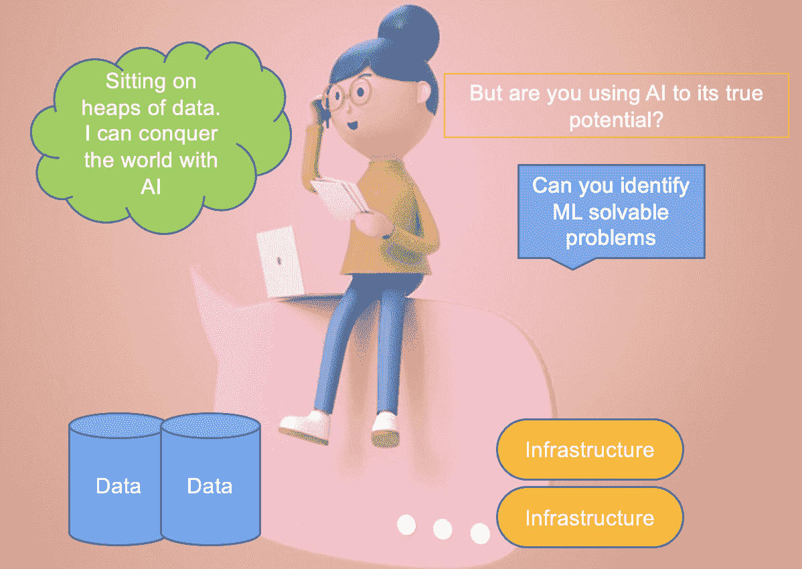

# 识别机器学习可解决问题的 4 个因素

> 原文：[`www.kdnuggets.com/2022/04/4-factors-identify-machine-learning-solvable-problems.html`](https://www.kdnuggets.com/2022/04/4-factors-identify-machine-learning-solvable-problems.html)

根据最新的 [研究](https://haas.berkeley.edu/wp-content/uploads/UCB_Playbook_R10_V2_spreads2.pdf)，AI 到 2030 年有望为全球经济贡献 15.7 万亿美元。自从疫情引发的数字加速以来，世界已经看到 AI 在商业中的广泛应用。IBM 领导者预测，在接下来的 18-24 个月内，采用率将增加 90%。这完全与无处不在的 AI 形成了共鸣。

+   AI 将决定候选人是否适合某个职位

+   AI 在信用评分模型中找到好的风险贷款候选人

+   我们依赖 AI 在金融交易中发现欺诈行为

+   我们对视频和新闻的偏好由 AI 筛选

+   列表还在继续。

# **我们是否充分发挥了 AI 的真正潜力？**

* * *

## 我们的前三课程推荐

 1\. [Google 网络安全证书](https://www.kdnuggets.com/google-cybersecurity) - 快速进入网络安全职业

 2\. [Google 数据分析专业证书](https://www.kdnuggets.com/google-data-analytics) - 提升您的数据分析技能

 3\. [Google IT 支持专业证书](https://www.kdnuggets.com/google-itsupport) - 支持您的组织的 IT

* * *

数据以惊人的速度生成，无疑是新的货币。许多公司积累了大量数据，并发现自己在争分夺秒地获取竞争优势。每个人都在快速构建原型，但却忽视了一个基础问题——他们是否真的需要 AI 来解决这个问题，而不是所有问题。将产品作为 AI 驱动的解决方案进行销售看起来和听起来都很花哨，但现实却不同。

[来源](https://www.freepik.com/psd/technology-cartoon)：科技漫画 PSD，由 jcomp 创建 - freepik，加作者编辑

因此，我们需要提升自身技能，了解 AI/ML 能够解决哪些问题。

[Google](https://developers.google.com/machine-learning/problem-framing/good) 已简洁地总结了什么问题适合机器学习的特点。

不应跳过解决方案，即架构算法，假设数据及其属性、数据量和评估指标来解决问题。

在项目的初期阶段，你花在理解问题上的时间越多，出现问题的可能性就会大大减少。专注于问题陈述，明确需求。在提出可能的解决方案之前，确保你已经理解了业务需求。

一旦你评估了业务的核心问题，检查一下使用传统技术解决这些问题的挑战。企业使用启发式规则已经有很长时间了，那么提供的问题有什么独特之处需要人工智能解决？

总的来说，它归结为四个主要因素：**模式、环境、验证和维度**。

# 模式

我们首先从“模式”开始。

需要检查数据并寻找模式的问题，将在其解决方案中找到人工智能。既然你已经全面理解了问题，就开始着手一些最佳解决方案，这些方案能够很好地解决你的问题。请注意，前几次迭代通常不会取得重大突破——一般来说，这些初步的迭代涉及到表面问题的探查，暴露出基线模型的薄弱点，并设定方向。

你不仅要迭代模型，还要迭代数据探索周期。

当你在寻找最佳模型的过程中不断迭代不同版本的模型时，文档将揭示你在不同实验中的“实际努力”及其对问题的适用性。然而，文档上没有显示的是你的知识库，它随着所有最终导致最佳模型的失败而不断丰富。这个知识库将区别你作为数据科学家在识别机器学习可解性方面的直觉。

接下来是赢得这场人工智能战争的最强武器——数据。首先，它是否可用？如果不可用，你将发现自己陷入困境。你将不得不寻找最接近的公开数据，或为你的业务案例模拟数据。在任何情况下，模型解决问题的能力只是建立在实际数据基础上的模型的一个代理（不幸的是，这些实际数据对你来说还不可用）。

如果数据可用，那么模型的预测能力依赖于获取正确的属性，这些属性需要携带良好的信号。而问题还没有结束——下一个关注点是评估需要多少数据才能得到第一个模型版本？这取决于机器学习需要解决的任务的复杂性。如果特征能够轻松地将目标变量的不同类别分开（假设是分类机器学习），那么较少的数据也能完成工作，比如在‘[Iris toy data](https://scikit-learn.org/stable/auto_examples/datasets/plot_iris_dataset.html)’中。

永远记住，机器学习的效果取决于提供的数据和从统计关联中学习。你不仅需要输入好的信号属性，还需要去除那些增加噪声的特征，这将有助于模型更快、更好地学习。

你已经建立了许多假设并进行了很多实验，但你如何选择最佳模型。实际上，什么是最佳模型？一个在以前未见数据上具有良好泛化能力的模型是大家所青睐的。这定义了模型的鲁棒性。进行实验很容易，但找到一个鲁棒的模型却不容易。创建一个能够最佳代表你的模型在生产环境中会遇到并执行的数据集。将你的最佳模型在这个未见的评估数据集上运行，以确认它是否真的最好。

# **环境**

在高度动态的环境中构建机器学习模型将非常困难。让我举个例子。假设你正在构建一个股票价格预测模型，其中股票价格因各种原因而变化——情绪驱动、季度和年度发布、宏观经济因素、新闻、外国投资、临近衍生品到期波动、美联储公告等。

[来源](https://www.freepik.com/vectors/business): 商业矢量图由 pch.vector 创建 - freepik 以及作者编辑

对模型的现实期望是检查一个合理的人是否能够实现该结果，以及实现的程度。我所说的“合理”是指一个普通人能够识别股票模式并进行交易获利，而不是一个季节性的股市专家，该专家通过多次失败和学习掌握了细微差别和直觉。外部环境通常难以建模，需要大量领域知识来构建机器学习模型。

# **验证**

在开始建模之前，了解模型性能如何转化为业务指标。

科学指标如精确度、召回率、均方根误差（RMSE）、ROC-AUC 可以评估模型在未见数据上的表现，以判断一个机器学习模型的优劣，但这是否能很好地与业务产生共鸣。

例如：80% 的精确度对转换率和业务收入有什么影响？

同时，必须有一种方法来验证模型预测的准确性。了解一组专家对模型输出评估的一致意见。

# **维度**

想象一下你想买一栋房子，并估计房子的市场价值以评估它是否被高估或低估。估算价格的一种方法是与面积相关——面积越大，价格越高。这可以给出一个大概的估计，但可能不够准确。

接下来，你会关注其他因素，比如房子的房间数量或它的年龄，即建造年份，以获取更接近的估计。同样，你也会考虑其他因素，比如——这栋房子附近是否有学校，周围是否有医疗设施，以便更好地预测价格。

[来源](https://www.freepik.com/vectors/finance)：财经矢量图由 pch.vector 创建，[来源](https://unsplash.com/s/photos/house?utm_source=unsplash&utm_medium=referral&utm_content=creditCopyText)：Unsplash- 作者进行的额外编辑

现在随着维度的增加，即你考虑的影响房价的相关因素越多，你的估算就越准确。但随着因素的增加，人力计算变得越来越困难。在这种情况下，相较于人类专家，ML 在处理大数据集上的数据关联挖掘方面具有优势。

在这篇文章中，我们了解了识别良好 ML 可解决问题的重要性。我们还讨论了问题优先而不是解决方案优先的特质如何帮助理解 ML 是否能对给定问题提供良好帮助。随后，文章解释了模式为何对使用 ML 至关重要，为什么 ML 并非专门适用于不断变化的环境，ML 如何适用于维度增加，以及如何建立验证模型输出的机制。

**[Vidhi Chugh](https://vidhi-chugh.medium.com/)** 是一位屡获殊荣的 AI/ML 创新领袖和 AI 伦理学家。她在数据科学、产品和研究的交汇点上工作，以提供业务价值和洞察力。她是数据中心科学的倡导者，也是数据治理领域的领先专家，致力于构建可信赖的 AI 解决方案。

### 更多相关话题

+   [影响洞察时间的关键因素](https://www.kdnuggets.com/2023/03/key-factors-affecting-time-insights.html)

+   [如何识别时间序列数据集中的缺失数据](https://www.kdnuggets.com/how-to-identify-missing-data-in-timeseries-datasets)

+   [使用基本和现代…算法解决计算机科学问题](https://www.kdnuggets.com/2023/11/packt-tackle-computer-science-problems-fundamental-modern-algorithms-machine-learning)

+   [更多分类问题的性能评估指标…](https://www.kdnuggets.com/2020/04/performance-evaluation-metrics-classification.html)

+   [常见数据问题（及解决方案）](https://www.kdnuggets.com/2022/02/common-data-problems-solutions.html)

+   [解决 5 个复杂 SQL 问题：棘手查询解释](https://www.kdnuggets.com/2022/07/5-hardest-things-sql.html)
