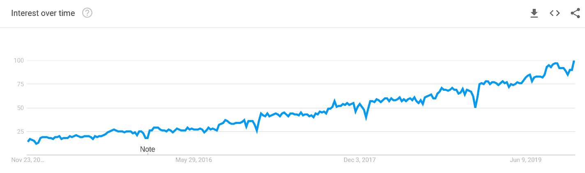
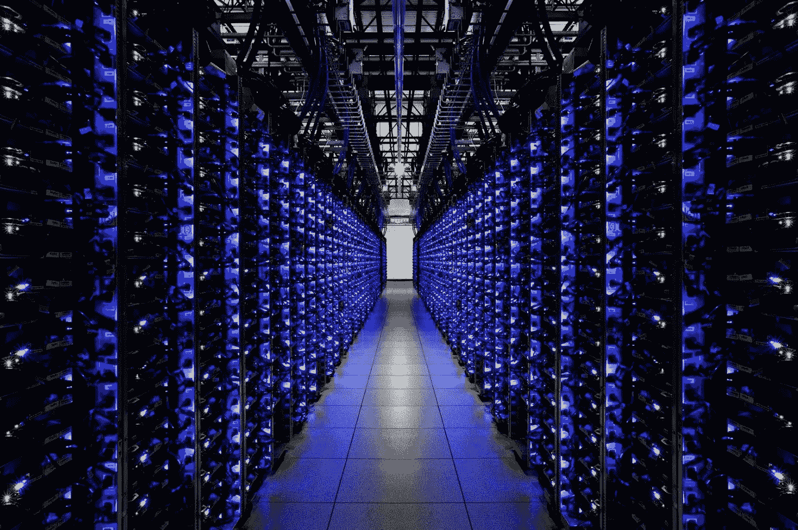

# 2020 年数据科学的四大热门趋势

> 原文：[`www.kdnuggets.com/2019/12/4-hottest-trends-data-science-2020.html`](https://www.kdnuggets.com/2019/12/4-hottest-trends-data-science-2020.html)

评论

2019 年是[数据科学](https://en.wikipedia.org/wiki/Data_science)的重要一年。

全球各行各业的公司正在经历人们所称的[*数字化转型*](https://www.salesforce.com/products/platform/what-is-digital-transformation/)。也就是说，企业正在利用数字技术将传统的业务流程，如招聘、营销、定价和战略，使其效果提高 10 倍。

* * *

## 我们的前三大课程推荐

 1\. [Google 网络安全证书](https://www.kdnuggets.com/google-cybersecurity) - 快速进入网络安全职业道路。

 2\. [Google 数据分析专业证书](https://www.kdnuggets.com/google-data-analytics) - 提升您的数据分析技能

 3\. [Google IT 支持专业证书](https://www.kdnuggets.com/google-itsupport) - 支持您的组织的 IT 需求

* * *

数据科学已成为这些转型的核心部分。凭借数据科学，组织不再需要基于直觉、最佳猜测或小规模调查来做出重要决策。相反，他们分析大量真实数据，以基于真实的数据驱动事实做出决策。这就是数据科学的真正意义——通过数据创造价值。

根据[Google 搜索趋势](https://trends.google.com/trends/explore?date=today%205-y&q=Data%20Science)，将数据整合到核心业务流程中的趋势显著增长，过去 5 年间兴趣增加了超过四倍。数据正为公司提供相对于竞争对手的巨大优势。凭借更多的数据和更优秀的数据科学家，企业能够获取市场信息，这些信息可能是竞争对手甚至未曾意识到的。这已成为一场“数据或灭亡”的游戏。

过去 5 年“数据科学”在 Google 搜索中的流行程度。由[Google Trends](https://trends.google.com/trends/explore?date=today%205-y&q=Data%20Science)生成。

在当今不断发展的数字世界中，保持竞争优势需要不断创新。专利已不再流行，而[敏捷方法](https://linchpinseo.com/the-agile-method/)和快速跟上新趋势则非常重要。

组织不再能依赖旧有的稳固方法。如果出现新的趋势，如数据科学，[人工智能](https://www.britannica.com/technology/artificial-intelligence)或[区块链](https://en.wikipedia.org/wiki/Blockchain)，需要提前预见并迅速适应。

以下是 2020 年四大最热门的数据科学趋势。这些趋势在今年引起了越来越多的关注，并将在 2020 年继续增长。

### (1) 自动化数据科学

即便在今天的数字时代，数据科学仍然需要大量的人工工作。存储数据、清理数据、可视化和探索数据，最后，对数据建模以获得实际结果。这些人工工作迫切需要自动化，因此自动化数据科学和[机器学习](https://en.wikipedia.org/wiki/Machine_learning)应运而生。

数据科学流程的几乎每一个步骤都已经或者正在变得自动化。

自动数据清理在过去几年中已经[广泛研究](https://cudbg.github.io/lab/cleaning)。[清理大数据](https://rapidminer.com/blog/data-prep-time-consuming-tedious/)往往占用了数据科学家宝贵的时间。初创公司和像 IBM 这样的大公司都提供[自动化和工具](https://www.softwareadvice.com/ca/bi/data-cleaning-comparison/)来进行数据清理。

数据科学的另一个重要部分，即[特征工程](https://en.wikipedia.org/wiki/Feature_engineering)，已经经历了重大变革。[Featuretools](https://www.featuretools.com/)提供了自动特征工程的解决方案。除此之外，现代[深度学习](https://en.wikipedia.org/wiki/Deep_learning)技术，如[卷积神经网络和递归神经网络](https://towardsdatascience.com/understanding-neural-networks-from-neuron-to-rnn-cnn-and-deep-learning-cd88e90e0a90)，能够自行学习特征，无需手动设计特征。

也许最显著的自动化发生在机器学习领域。[Data Robot](https://www.datarobot.com/)和[H2O](https://www.h2o.ai/solutions/)通过提供端到端的机器学习平台在行业中确立了自己的地位，使数据科学家在数据管理和模型构建方面变得非常轻松。[AutoML](https://en.wikipedia.org/wiki/Automated_machine_learning)作为一种自动模型设计和训练的方法，也在 2019 年蓬勃发展，因为这些自动化模型超越了最先进的技术。特别是谷歌正在大量投资[Cloud AutoML](https://cloud.google.com/automl/)。

总的来说，公司正在大量投资于构建和购买自动化数据科学的工具和服务。任何能让过程更便宜、更容易的东西。同时，这种自动化也满足了较小和技术能力较弱的组织的需求，这些组织可以利用这些工具和服务，而无需组建自己的团队即可进行数据科学。

### (2) 数据隐私和安全

隐私和安全始终是技术中的敏感话题。所有公司都希望快速发展和创新，但因隐私或安全问题失去客户的信任可能是致命的。因此，他们被迫将其作为优先事项，至少要做到不泄露私人数据。

数据隐私和安全在过去一年中成为了一个极为热门的话题，因为问题被巨大的公众黑客攻击所放大。就在最近，2019 年 11 月 22 日，[一个没有安全措施的暴露服务器在 Google Cloud 上被发现](https://siliconangle.com/2019/11/22/1-2b-account-records-stolen-latest-serious-data-hack/)。该服务器包含了**12 亿**名**独特个体**的个人信息，包括姓名、电子邮件地址、电话号码以及 LinkedIn 和 Facebook 个人资料信息。连 FBI 都参与了调查。这是有史以来最大的数据显示泄露事件之一。

数据是怎么到那里的？它属于谁？谁负责数据的安全？它曾在一个 Google Cloud 服务器上，实际上任何人都可以创建这个服务器。

现在我们可以放心，全世界的人在阅读新闻后不会纷纷关闭他们的 LinkedIn 和 Facebook 账户，但这确实引起了一些关注。消费者变得越来越小心他们将电子邮件地址和电话号码提供给谁。

一家能够保证其客户数据隐私和安全的公司将发现，他们更容易说服客户提供更多的数据（通过继续使用他们的产品和服务）。这也确保了，如果政府出台任何*要求*客户数据安全协议的法律，他们已经做好了充分的准备。许多公司选择了 [SOC 2 合规性](https://www.imperva.com/learn/data-security/soc-2-compliance/) 来证明他们的安全性。

整个数据科学过程依赖于数据，但大多数数据并不是匿名的。如果数据落入不法之手，可能会引发全球性灾难，破坏日常人的隐私和生活。数据不仅仅是原始数字，它代表和描述了真实的人和事物。

随着数据科学的不断发展，我们也会看到围绕数据的隐私和安全协议的转变。这包括过程、法律以及建立和维护数据的安全、保护和完整性的方法。如果网络安全成为今年的新潮词也不会令人感到惊讶。

### (3) 云中的超级数据科学

随着数据科学从一个小众领域成长为一个完整的领域，分析所用的数据量也激增。组织正在收集和存储比以往更多的数据。

一家典型的财富 500 强公司可能需要分析的数据量远远超过了个人电脑能够处理的范围。一台不错的 PC 可能具有大约 64GB 的 RAM、8 核 CPU 和 4TB 的存储空间。这对于个人项目来说完全够用，但对于像银行或零售商这样拥有覆盖数百万客户的数据的全球公司而言就不够用了。

这就是云计算进入该领域的原因。[云计算](https://www.pcmag.com/article/256563/what-is-cloud-computing) 提供了让任何人几乎可以无限制访问处理能力的能力。云服务供应商如 [Amazon Web Services](https://aws.amazon.com/)（AWS）提供具有高达 96 个虚拟 CPU 核心和高达 768 GB RAM 的服务器。这些服务器可以设置在自动扩展组中，数百台服务器可以快速启动或停止——按需计算能力。

Google Cloud 数据中心

除了计算能力，云计算公司还提供了全面的数据分析平台。Google Cloud 提供了一个名为 [BigQuery](https://cloud.google.com/bigquery/) 的平台，这是一个无服务器且可扩展的数据仓库，使数据科学家能够在单个平台上存储和分析 PB 级的数据。BigQuery 还可以连接到其他 GCP 服务进行数据科学。通过使用 [Cloud Dataflow](https://cloud.google.com/bigquery/) 创建数据流管道，使用 [Cloud DataProc](https://cloud.google.com/dataproc/) 在数据上运行 Hadoop 或 Apache Spark，或者使用 BigQuery ML 在庞大的数据集上构建机器学习模型。

从数据到处理能力，一切都在增长。随着数据科学的发展，我们最终可能会看到数据科学完全在云端进行，因为数据的体量实在是太大了。

### (4) 自然语言处理

[自然语言处理](https://en.wikipedia.org/wiki/Natural_language_processing)（NLP）在深度学习研究取得重大突破后，已经牢牢地进入了数据科学领域。

数据科学最初是作为对纯粹原始数字的分析开始的，因为这是处理和收集数据到电子表格中最简单的方式。如果需要处理任何形式的文本，通常需要将其分类或以某种方式转换成数字。

然而，将一段文字压缩成一个单一的数字确实相当具有挑战性。自然语言和文本包含了丰富的数据和信息——由于我们缺乏将这些信息表示为数字的能力，我们以前往往忽视了这些信息。

深度学习在自然语言处理（NLP）方面取得了巨大的进展，推动了 NLP 在我们常规数据分析中的全面整合。神经网络现在能够从大量文本中迅速提取信息。它们可以将文本分类到不同的类别，确定文本的情感，并对文本数据的相似性进行分析。最终，这些信息可以存储在一个单一的数字特征向量中。

结果是，NLP 成为了数据科学中的一个强大工具。庞大的文本数据存储，不仅仅是一两个词的答案，而是完整的段落，可以转化为标准分析的数值数据。我们现在能够探索更加复杂的数据集。

例如，想象一个新闻网站希望查看哪些主题获得了更多的浏览量。如果没有先进的 NLP，能做的只有依靠关键词，或者只是对某个标题为何比另一个标题表现更好的一种直觉。借助于今天的 NLP，我们将能够*量化*网站上的文本，将整个段落甚至网页进行比较，以获得更全面的见解。

想要了解过去几年在 NLP 领域最重要的进展的技术概述，你可以查看由[Victor Sanh](https://medium.com/u/ac59742e5349?source=post_page-----3956cd9fc182----------------------)提供的[指南](https://medium.com/huggingface/the-best-and-most-current-of-modern-natural-language-processing-5055f409a1d1)。

数据科学整体上在不断发展。随着其能力的增强，它正在渗透到每一个行业，无论是技术性还是非技术性，以及每一个企业，无论大小。

随着这一领域的长期发展，看到其在大规模上实现民主化并成为我们软件工具箱中的一种工具，也并不令人意外。

[原始文章](https://medium.com/@george.seif94/3956cd9fc182)。经许可转载。

**相关：**

+   [分析与数据科学的未来](https://www.kdnuggets.com/2019/09/future-analytics-data-science.html)

+   [2018 年人工智能和数据科学的进展以及 2019 年的趋势](https://www.kdnuggets.com/2019/02/ai-data-science-advances-trends.html)

+   [2019 年十大技术趋势](https://www.kdnuggets.com/2019/02/top-10-technology-trends-2019.html)

### 更多相关主题

+   [停止学习数据科学以寻找目的，寻找目的以…](https://www.kdnuggets.com/2021/12/stop-learning-data-science-find-purpose.html)

+   [学习数据科学统计的顶级资源](https://www.kdnuggets.com/2021/12/springboard-top-resources-learn-data-science-statistics.html)

+   [成功数据科学家的五个特征](https://www.kdnuggets.com/2021/12/5-characteristics-successful-data-scientist.html)

+   [每个数据科学家都应该知道的三个 R 库（即使你使用 Python）](https://www.kdnuggets.com/2021/12/three-r-libraries-every-data-scientist-know-even-python.html)

+   [一个 90 亿美元的人工智能失败案例分析](https://www.kdnuggets.com/2021/12/9b-ai-failure-examined.html)

+   [为什么 Python 是初创公司理想的编程语言](https://www.kdnuggets.com/2021/12/makes-python-ideal-programming-language-startups.html)
