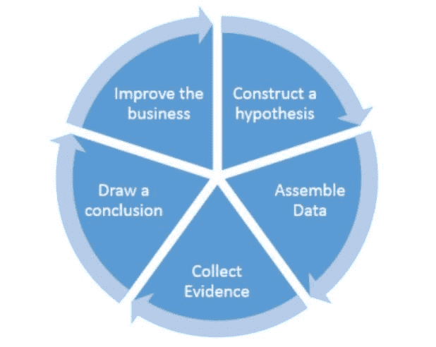

# 数据科学中的 4 个数据使用层级

> 原文：[`www.kdnuggets.com/2018/07/4-levels-data-usage-data-science.html`](https://www.kdnuggets.com/2018/07/4-levels-data-usage-data-science.html)

 评论

在 O'Reilly Data Show 播客的[最新一期](https://www.oreilly.com/ideas/teaching-and-implementing-data-science-and-ai-in-the-enterprise)中，Ben Lorica 采访了来自[DXC Technology](http://www.dxc.technology/)的嘉宾 Jerry Overton，讨论了数据从业者必须处理的一些非技术性问题，如隐私、安全和伦理，以及当前数据科学在商业中的状态。

**图 1：** 利用数据科学积累竞争优势的过程（来源：[数据科学职业进阶](https://www.oreilly.com/data/free/going-pro-in-data-science.csp?intcmp=il-data-free-lp-awareness_new_site_jerry_overton_data_show_related_link)）

* * *

## 我们的前三大课程推荐

 1\. [谷歌网络安全证书](https://www.kdnuggets.com/google-cybersecurity) - 快速进入网络安全职业生涯。

 2\. [谷歌数据分析专业证书](https://www.kdnuggets.com/google-data-analytics) - 提升你的数据分析技能

 3\. [谷歌 IT 支持专业证书](https://www.kdnuggets.com/google-itsupport) - 支持组织的 IT 工作

* * *

Overton 指出，五年前，从数据中提取价值的理念对企业来说还是新的，企业必须被说服认为收集数据并分析其中有意义的模式是值得的。与今天的观点相比，企业现在理解到不使用数据就是失去了潜在的竞争优势。数据科学在某种程度上是必要的，但企业现在面临一系列不同的问题。我们的数据科学家应该做什么？我们应该关注业务的哪些领域？我们的数据到底如何增值？

Ben 和 Jerry 讨论的一个话题是商业中数据使用的层级，或称“桶”，Jerry 定义并概述了这 4 个类别。讨论很有趣，尽管层级描述直观，但在我看来还是很有用的。以下是这些类别的基本总结，我鼓励大家收听整个节目以获取更深入的讨论。

**1 - 监控与预测**

这个层级包括实施端到端的能力，以查看发生了什么，并观察是否会出现问题。

+   监控业务并预测问题

+   收集有关发生情况的信息

+   收集的信息就是 Overton 称之为“数字数据排放”

+   我们能够回答“是否存在问题？”这个问题

**2 - 提高效率**

既然你知道问题的存在，那该如何减少与该问题相关的风险呢？

**3 - 增强决策制定**

在这个层级，我们应该已经知道出了什么问题，并且在预测问题发生的时间上（希望）会有更好的定位。

+   将这些信息传达给决策者

+   我们可以利用洞察力制定业务战略，而不是仅仅依赖数据，或以交易方式使用数据

+   这距离自动化一步之遥，不过人类仍然作为主角需要参与

**4 - 自动化**

在这个层级，我们将特定过程的控制权交给机器，让机器不间断地运行这些过程，并且不需要持续的人类监督。

+   当机器遇到无法应对的现象时，会提醒人类

+   重要的是要注意，这种自动化是逐步发生的，而不是一次性完成

+   这不是“完全业务自动化”，*类似于* SkyNet

+   使人类能够做更有意义的工作，专注于业务**需要**人类做的事情

**图 2：** 企业数据科学（来源：[DXC Technology](http://www.dxc.technology/)，如[这里所见](https://www.oreilly.com/ideas/teaching-and-implementing-data-science-and-ai-in-the-enterprise)）

**相关信息**：

+   数据科学的什么、哪里和如何

+   数据科学：大多数人失败的 4 个原因

+   人工智能如何改变你的业务

### 更多相关主题

+   [免费的数据科学学习路线图：适合所有水平，IBM 提供](https://www.kdnuggets.com/a-free-data-science-learning-roadmap-for-all-levels-with-ibm)

+   [以 3 个难度等级解释的大型语言模型](https://www.kdnuggets.com/large-language-models-explained-in-3-levels-of-difficulty)

+   [311 呼叫中心表现：服务水平评分](https://www.kdnuggets.com/2023/03/boxplot-outlier-311-call-center-performance.html)

+   [学习生成 AI 的免费亚马逊课程：适合所有水平](https://www.kdnuggets.com/free-amazon-courses-to-learn-generative-ai-for-all-levels)

+   [NVIDIA 的免费 AI 课程：适合所有水平](https://www.kdnuggets.com/free-ai-courses-from-nvidia-for-all-levels)

+   [停止学习数据科学来寻找目标，并找到目标去…](https://www.kdnuggets.com/2021/12/stop-learning-data-science-find-purpose.html)
