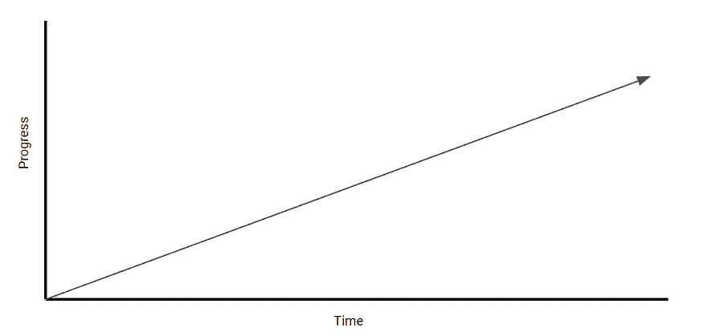
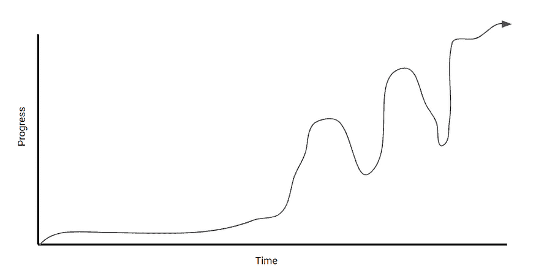
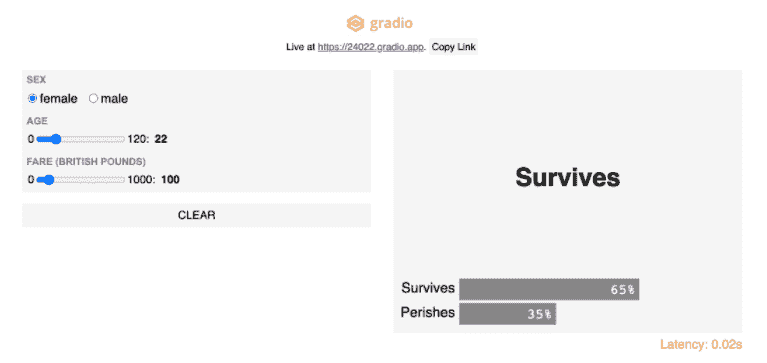
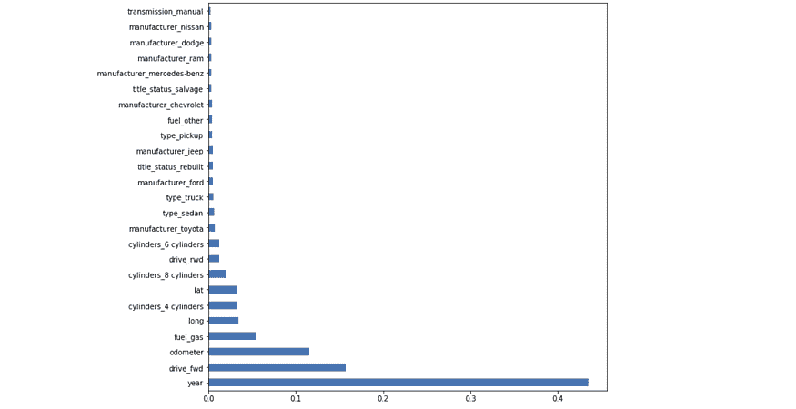

# 我在构建第一个模型时希望知道的 4 个机器学习概念

> 原文：[`www.kdnuggets.com/2021/03/4-machine-learning-concepts.html`](https://www.kdnuggets.com/2021/03/4-machine-learning-concepts.html)

comments

*照片由 [Anthony Tori](https://unsplash.com/@anthonytori?utm_source=unsplash&utm_medium=referral&utm_content=creditCopyText) 提供，来源于 [Unsplash](https://unsplash.com/s/photos/thinking?utm_source=unsplash&utm_medium=referral&utm_content=creditCopyText)。*

我喜欢写作的原因之一是它给了我一个机会回顾、反思我的经历，并思考什么做得好，什么做得不好。

在过去的三个月里，我负责构建一个机器学习模型来预测一个产品是否应该被 [RMA'ed](https://en.wikipedia.org/wiki/Return_merchandise_authorization)。我会说这是我开发的第一个“认真”的机器学习模型——我说“认真”是因为这是第一个创造实际商业价值的模型。

鉴于这是我**第一次**“认真”对待的模型，我曾对我构建模型的过程有一个天真的误解：

*图片由作者创作。*

实际上，我的过程更像这样：

*图片由作者创作。*

总体而言，我会说这是一次成功，但在构建模型的过程中确实经历了很多起伏——为什么？因为我花了很多时间学习我之前不知道的新概念。在这篇文章中，我想反思并记录下在构建这个模型之前我希望知道的事情。

话虽如此，这里有 4 个概念是我希望在构建这个模型之前就知道的！

### 1. 使用简单 Web UI 进行模型部署

*[图片由 Gradio 提供（已获许可）](https://www.gradio.app/hub/aliabid94/hub-titanic)*

最近我遇到了一些东西，叫做 [Gradio](https://www.gradio.app/)，这是一个 Python 包，允许你用少至三行代码构建和部署一个机器学习模型的网络应用。它和 Streamlit 或 Flask 具有相同的目的，但我发现它在部署模型时要快得多，更容易。

为什么这如此有用？有几个原因：

1.  **这允许进一步的模型验证**。具体来说，它允许你交互式地测试模型中的不同输入。这还允许你从其他利益相关者和领域专家那里获得反馈，尤其是来自非编码人员的反馈。

1.  **这是进行演示的好方法**。就个人而言，我发现向某些利益相关者展示 Jupyter Notebook 并没有体现我的模型的实际表现，尽管它的表现非常好。使用这样的库可以更容易地传达你的结果，并更好地推销自己。

1.  **实现和分发很简单**。重申一下，学习曲线很小，因为只需 3 行代码即可实现此功能。此外，它非常容易分发，因为网络应用程序可以通过公共链接访问。

> **总结：利用像****Gradio****这样的 ML 模型 GUI 来进行更好的测试和沟通。**

### 2\. 特征重要性

特征重要性是指将分数分配给输入变量的一组技术，基于它们在预测目标变量方面的表现。分数越高，该特征在模型中越*重要*。

*由作者创建的图像。*

例如，如果我想使用图中的特征来预测汽车价格，通过进行特征重要性分析，我可以确定模型的**年份**、是否为**前驱动**以及汽车的**里程**（里程表）是预测汽车价格时最重要的因素。

相当棒，对吧？我敢打赌你现在开始看到这有多么有用。

特征重要性在特征选择中非常有用。通过在初步模型上进行特征重要性分析，你可以轻松确定哪些特征对模型有影响，哪些没有。

更重要的是，特征重要性使得解释模型和解释发现变得更容易，因为它直接告诉你哪些特征对目标变量最具指示性。

> **总结：利用特征重要性来改善特征选择、模型可解释性和沟通。**

*如果你想看看特征重要性如何实现，可以查看我第一个机器学习模型的[演练](https://towardsdatascience.com/a-machine-learning-project-predicting-used-car-prices-efbc4d2a4998#eced)*。*

### 3\. 超参数调整

机器学习的本质是找到最适合数据集的模型*参数*。这通过训练模型来完成。

另一方面，**超参数**是不能直接通过模型训练过程学习到的参数。这些是关于模型的更高层次的概念，通常在训练模型之前就固定下来。

超参数的示例包括：

+   学习率

+   决策树可以具有的叶子数或最大深度

+   神经网络中的隐藏层数量

关于超参数的事情是，虽然它们不是由数据本身决定的，但设置正确的超参数可以将你的机器学习模型的准确率从 80%提高到 95%以上。这就是我所经历的情况。

现在回到我的主要观点，有一些技术可以自动优化你的模型超参数，这样你就不需要测试一堆不同的数值了。

两种最常见的技术是**网格搜索**和**随机搜索**，你可以在[这里](https://machinelearningmastery.com/hyperparameter-optimization-with-random-search-and-grid-search/)阅读更多内容。

> **TLDR: 像网格搜索和随机搜索这样的技术可以优化你的模型超参数，从而显著提高模型的性能。**

### 4\. 模型评估指标

这可能是在线课程、训练营和在线资源中最被忽视的领域之一。然而，它无疑是数据科学中最重要的概念之一。

> *了解评价机器学习模型的指标最终需要你对你试图解决的业务问题有深入理解。*

如上图所示，由于我没有清楚地理解业务问题，因此在最初几周没有取得太大进展，也不知道我试图优化模型的指标是什么。

因此，我们可以将这一点分解为两个子点：

1.  **理解问题的业务需求**。这意味着理解业务要解决的问题、问题的参数、可用的数据、相关方以及模型如何融入业务流程/产品。

1.  **选择正确的指标来评估你的模型**。在我们的案例中，我们需要比较分类假阳性与假阴性的后果。我们最终的决定取决于模型如何融入业务流程。

> **TLDR: 理解业务问题。充分理解所有相关指标，并理解选择每个指标的后果。**

[原文](https://towardsdatascience.com/4-machine-learning-concepts-i-wish-i-knew-when-i-built-my-first-model-3b8ca9506451)。经许可转载。

**相关：**

+   [如何将我的机器学习模型从 80%准确率持续提升到 90%以上](https://www.kdnuggets.com/2020/09/improve-machine-learning-models-accuracy.html)

+   [机器学习中的模型评估指标](https://www.kdnuggets.com/2020/05/model-evaluation-metrics-machine-learning.html)

+   [机器学习模型的超参数优化](https://www.kdnuggets.com/2020/05/hyperparameter-optimization-machine-learning-models.html)

* * *

## 我们的三大课程推荐

 1\. [Google 网络安全证书](https://www.kdnuggets.com/google-cybersecurity) - 快速进入网络安全职业生涯。

 2\. [Google 数据分析专业证书](https://www.kdnuggets.com/google-data-analytics) - 提升你的数据分析技能

 3\. [Google IT 支持专业证书](https://www.kdnuggets.com/google-itsupport) - 支持你组织的 IT 工作

* * *

### 更多相关内容

+   [我希望在开始数据科学时知道的三件事](https://www.kdnuggets.com/2023/01/3-things-wish-knew-started-data-science.html)

+   [停止学习数据科学以寻找目的，转而寻找目的……](https://www.kdnuggets.com/2021/12/stop-learning-data-science-find-purpose.html)

+   [学习数据科学统计的顶级资源](https://www.kdnuggets.com/2021/12/springboard-top-resources-learn-data-science-statistics.html)

+   [一个 90 亿美元的 AI 失败案例分析](https://www.kdnuggets.com/2021/12/9b-ai-failure-examined.html)

+   [成功数据科学家的五个特征](https://www.kdnuggets.com/2021/12/5-characteristics-successful-data-scientist.html)

+   [为什么 Python 是初创企业的理想编程语言](https://www.kdnuggets.com/2021/12/makes-python-ideal-programming-language-startups.html)
