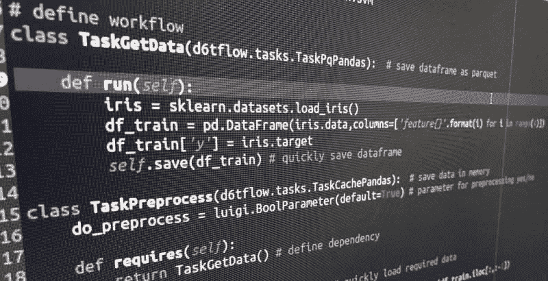

# 你的机器学习代码可能很糟糕的 4 个原因

> 原文：[`www.kdnuggets.com/2019/02/4-reasons-machine-learning-code-probably-bad.html`](https://www.kdnuggets.com/2019/02/4-reasons-machine-learning-code-probably-bad.html)

 评论

**作者：[诺曼·尼默尔](https://www.linkedin.com/in/normanniemer/)，首席数据科学家**



* * *

## 我们的前三大课程推荐

 1\. [Google 网络安全证书](https://www.kdnuggets.com/google-cybersecurity) - 快速进入网络安全职业生涯。

 2\. [Google 数据分析专业证书](https://www.kdnuggets.com/google-data-analytics) - 提升你的数据分析能力

 3\. [Google IT 支持专业证书](https://www.kdnuggets.com/google-itsupport) - 支持你的组织 IT 工作

* * *

你的当前工作流可能会像下面的示例一样将多个函数链在一起。虽然速度很快，但它可能存在许多问题：

+   随着复杂度的增加，它的扩展性不好

+   你必须手动跟踪哪些函数与哪些参数一起运行

+   你必须手动跟踪数据保存的位置

+   其他人很难阅读

```py
import pandas as pd
import sklearn.svm, sklearn.metrics

def get_data():
    data = download_data()
    data = clean_data(data)
    data.to_pickle('data.pkl')

def preprocess(data):
    data = apply_function(data)
    return data

# flow parameters
reload_source = True
do_preprocess = True

# run workflow
if reload_source:
    get_data()

df_train = pd.read_pickle('data.pkl')
if do_preprocess:
    df_train = preprocess(df_train)
model = sklearn.svm.SVC()
model.fit(df_train.iloc[:,:-1], df_train['y'])
print(sklearn.metrics.accuracy_score(df_train['y'],model.predict(df_train.iloc[:,:-1])))
```

### 应该怎么做？

与线性链式函数相比，数据科学代码更好地编写为具有依赖关系的任务集合。即你的数据科学工作流应该是 DAG。

所以，不是编写一个执行以下操作的函数：

```py
def process_data(data, parameter):

    if parameter:
        data = do_stuff(data)
    else:
        data = do_other_stuff(data)

    data.to_pickle('data.pkl')
    return data
```

你最好编写可以作为 DAG 链在一起的任务：

```py
class TaskProcess(d6tflow.tasks.TaskPqPandas): # define output format

    def requires(self):
        return TaskGetData() # define dependency

    def run(self):
        data = self.input().load() # load input data
        data = do_stuff(data) # process data
        self.save(data) # save output data
```

这样做的好处包括：

+   所有任务都遵循相同的模式，无论你的工作流有多复杂

+   你有一个可扩展的输入`requires()`和处理函数`run()`

+   你可以快速加载和保存数据，而无需硬编码文件名

+   如果输入任务未完成，它将自动运行

+   如果输入数据或参数发生变化，函数将自动重新运行

### 一个示例机器学习 DAG

以下是以 DAG 形式表达的机器学习流程的风格化示例。最后，你只需运行 TaskTrain()，它将自动知道要运行哪些依赖项。有关完整示例，请参见[`github.com/d6t/d6tflow/blob/master/docs/example-ml.md`](https://github.com/d6t/d6tflow/blob/master/docs/example-ml.md)

```py
import pandas as pd
import sklearn, sklearn.svm
import d6tflow
import luigi

# define workflow
class TaskGetData(d6tflow.tasks.TaskPqPandas):  # save dataframe as parquet

    def run(self):
        data = download_data()
        data = clean_data(data)
        self.save(data) # quickly save dataframe

class TaskPreprocess(d6tflow.tasks.TaskCachePandas):  # save data in memory
    do_preprocess = luigi.BoolParameter(default=True) # parameter for preprocessing yes/no

    def requires(self):
        return TaskGetData() # define dependency

    def run(self):
        df_train = self.input().load() # quickly load required data
        if self.do_preprocess:
            df_train = preprocess(df_train)
        self.save(df_train)

class TaskTrain(d6tflow.tasks.TaskPickle): # save output as pickle
    do_preprocess = luigi.BoolParameter(default=True)

    def requires(self):
        return TaskPreprocess(do_preprocess=self.do_preprocess)

    def run(self):
        df_train = self.input().load()
        model = sklearn.svm.SVC()
        model.fit(df_train.iloc[:,:-1], df_train['y'])
        self.save(model)

# Check task dependencies and their execution status
d6tflow.preview(TaskTrain())

'''
└─--[TaskTrain-{'do_preprocess': 'True'} (PENDING)]
   └─--[TaskPreprocess-{'do_preprocess': 'True'} (PENDING)]
      └─--[TaskGetData-{} (PENDING)]
'''

# Execute the model training task including dependencies
d6tflow.run(TaskTrain())

'''
===== Luigi Execution Summary =====

Scheduled 3 tasks of which:
* 3 ran successfully:
    - 1 TaskGetData()
    - 1 TaskPreprocess(do_preprocess=True)
    - 1 TaskTrain(do_preprocess=True)
'''

# Load task output to pandas dataframe and model object for model evaluation
model = TaskTrain().output().load()
df_train = TaskPreprocess().output().load()
print(sklearn.metrics.accuracy_score(df_train['y'],model.predict(df_train.iloc[:,:-1])))
# 0.9733333333333334
```

### 结论

将机器学习代码写成线性函数序列往往会产生许多工作流问题。由于不同机器学习任务之间的复杂依赖关系，最好将它们写成 DAG。[`github.com/d6t/d6tflow`](https://github.com/d6t/d6tflow) 使这一过程非常简单。或者，你可以使用[luigi](https://github.com/spotify/luigi)和[airflow](https://airflow.apache.org/)，但它们更适用于 ETL 而不是数据科学。

**简介: [诺曼·尼默](https://www.linkedin.com/in/normanniemer/)** 是一家大型资产管理公司的首席数据科学家，他提供基于数据的投资洞察。他拥有哥伦比亚大学的金融工程硕士学位和伦敦 Cass 商学院的银行与金融学士学位。

[原文](https://gist.github.com/d6tdev/44083e201104006b05be7f2ed5eeb5f9)。经授权转载。

**相关:**

+   机器学习项目检查清单

+   初创企业的数据科学项目流程

+   机器学习项目的端到端指南

### 更多相关话题

+   [成为优秀数据科学家所需的 5 项关键技能](https://www.kdnuggets.com/2021/12/5-key-skills-needed-become-great-data-scientist.html)

+   [每个初学者数据科学家应该掌握的 6 种预测模型](https://www.kdnuggets.com/2021/12/6-predictive-models-every-beginner-data-scientist-master.html)

+   [2021 年最佳 ETL 工具](https://www.kdnuggets.com/2021/12/mozart-best-etl-tools-2021.html)

+   [使用管道编写干净的 Python 代码](https://www.kdnuggets.com/2021/12/write-clean-python-code-pipes.html)

+   [停止学习数据科学以寻找目标，找到目标再…](https://www.kdnuggets.com/2021/12/stop-learning-data-science-find-purpose.html)

+   [学习数据科学统计的顶级资源](https://www.kdnuggets.com/2021/12/springboard-top-resources-learn-data-science-statistics.html)
