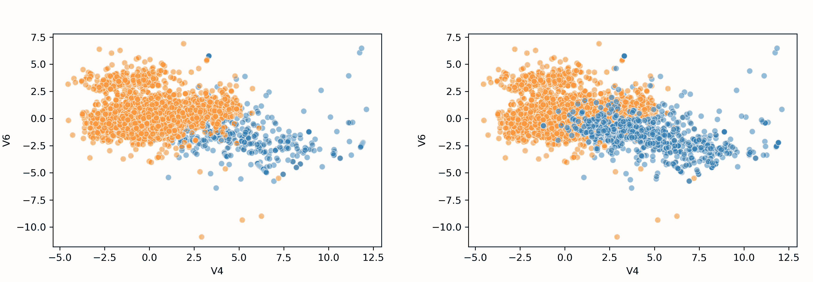
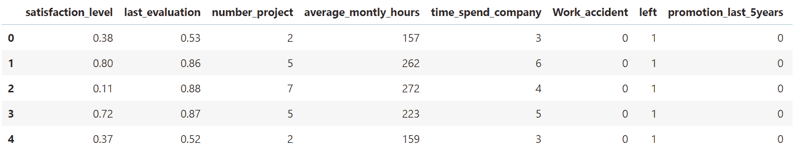
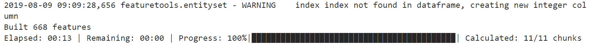
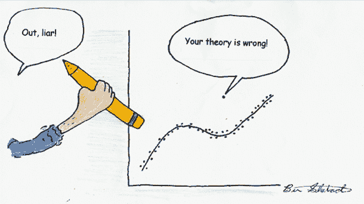
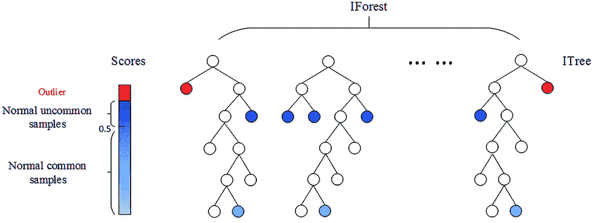
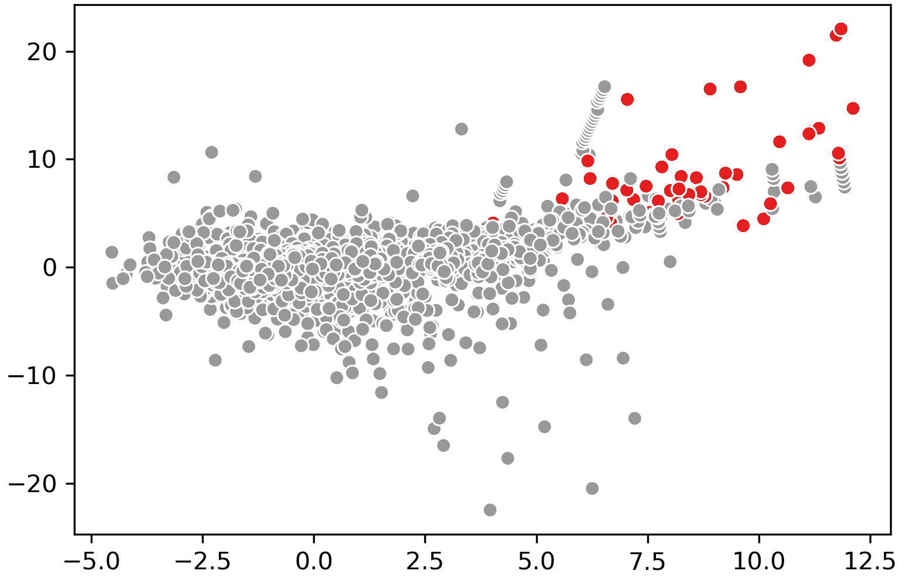

# 高级特征工程和预处理的 4 个技巧

> 原文：[`www.kdnuggets.com/2019/08/4-tips-advanced-feature-engineering-preprocessing.html`](https://www.kdnuggets.com/2019/08/4-tips-advanced-feature-engineering-preprocessing.html)

 评论

**由 [Maarten Grootendorst](https://www.linkedin.com/in/mgrootendorst/)，数据科学家，I/O 心理学家 & 临床心理学家**

[`www.analyticsvidhya.com/blog/2018/11/data-engineer-comprehensive-list-resources-get-started/data-engineer/`](https://www.analyticsvidhya.com/blog/2018/11/data-engineer-comprehensive-list-resources-get-started/data-engineer/)

* * *

## 我们的前三名课程推荐

 1\. [谷歌网络安全证书](https://www.kdnuggets.com/google-cybersecurity) - 快速进入网络安全职业生涯。

 2\. [谷歌数据分析专业证书](https://www.kdnuggets.com/google-data-analytics) - 提升你的数据分析技能

 3\. [谷歌 IT 支持专业证书](https://www.kdnuggets.com/google-itsupport) - 支持你组织的 IT

* * *

可以说，开发机器学习模型的两个最重要的步骤是[**特征工程**](https://www.kdnuggets.com/2018/12/feature-engineering-explained.html)和**数据预处理**。特征工程包括特征的创建，而数据预处理涉及数据的清理。

> “折磨数据，它会承认任何事情*。” — **罗纳德·科斯**

我们通常会花费大量时间将数据提炼成对建模有用的形式。为了使这项工作更高效，我想分享 4 个技巧和窍门，帮助你在特征工程和数据预处理中。

我应该指出，尽管这可能听起来很陈词滥调，**领域知识**可能是特征工程中最重要的东西之一。它可以帮助你通过更好地理解你使用的特征来防止欠拟合和过拟合。

你可以在[这里](https://github.com/MaartenGr/feature-engineering)找到包含分析的笔记本。

### 1\. 重新采样不平衡数据

在实践中，你会经常遇到不平衡的数据。如果你的目标变量只有轻微的不平衡，这不一定会成为问题。你可以通过使用适当的验证措施来解决这个问题，比如*平衡准确度*、*精准度-召回曲线*或*F1 分数*。

不幸的是，这并不总是如此，你的目标变量可能高度不平衡（例如，10:1）。相反，你可以使用一种叫做**SMOTE**的技术来对少数类目标进行过采样，从而引入平衡。

### SMOTE

[SMOTE](https://jair.org/index.php/jair/article/view/10302)代表*Synthetic Minority Oversampling Technique*，是一种用于增加少数类样本的过采样技术。

它通过查看目标的*特征空间*并检测最近邻来生成新样本。然后，它简单地选择类似样本，并在邻近样本的*特征空间*内随机改变一列。

实现 SMOTE 的模块可以在[imbalanced-learn](https://imbalanced-learn.readthedocs.io/en/stable/index.html)包中找到。你可以简单地导入该包并应用 fit_transform：

原始数据（左）与过采样数据（右）。

如你所见，模型成功地对目标变量进行了过采样。使用 SMOTE 进行过采样时，你可以采取几种策略：

+   `**'minority'**`：仅对少数类进行重新采样；

+   `**'not minority'**`：对除少数类外的所有类进行重新采样；

+   `**'not majority'**`：对除多数类外的所有类进行重新采样；

+   `**'all'**`：对所有类进行重新采样；

+   当`**dict**`时，键对应于目标类。值对应于每个目标类所需的样本数量。

我选择使用字典来指定我希望过采样数据的程度。

**附加提示 1**：如果你的数据集中有分类变量，SMOTE 可能会为这些变量创建无法发生的值。例如，如果你有一个名为 isMale 的变量，只能取 0 或 1，SMOTE 可能会创建 0.365 作为值。

另外，你可以使用 SMOTENC，它考虑了分类变量的性质。这个版本也可以在[imbalanced-learn](https://imbalanced-learn.readthedocs.io/en/stable/index.html)包中找到。

**附加提示 2**：确保在创建训练/测试拆分后再进行过采样，这样你只会过采样训练数据。你通常不希望在合成数据上测试你的模型。

### 2. 创建新特征

为了提高模型的质量和预测能力，通常会从现有变量中创建新特征。我们可以在每对变量之间创建一些交互（例如，乘法或除法），希望找到一个有趣的新特征。然而，这个过程很繁琐，需要大量编码。幸运的是，这可以通过**Deep Feature Synthesis**自动化。

### 深度特征合成

深度特征合成（DFS）是一种算法，可以快速创建具有不同深度的新变量。例如，你可以先乘以列 A 和列 B，然后再加上列 C。

首先，让我介绍一下我将用于示例的数据。我选择使用[HR 分析数据](https://www.kaggle.com/lnvardanyan/hr-analytics)，因为特征易于解释：

基于我们的直觉，我们可以将`**average_monthly_hours**`除以`**number_project**`识别为一个有趣的新变量。然而，如果我们仅依靠直觉，可能会错过更多的关系。

[包](https://github.com/Featuretools/featuretools)确实需要理解它们对 Entities 的使用。然而，如果你只使用一个表，可以简单地遵循下面的代码：

第一步是从中创建一个`**entity**`，如果需要，可以与其他表创建关系。接下来，我们可以简单地运行`**ft.dfs**`来创建新变量。我们通过参数`**trans_primitives**`指定如何创建变量。我们选择将数字变量相加或相乘。

如果 verbose = True，DFS 的输出

正如你在上面的图片中看到的，我们仅用几行代码就创建了额外的 668 个特征。以下是创建的一些特征示例：

+   `**last_evaluation**`乘以`**satisfaction_level**`

+   `**left**`乘以`**promotion_last_5years**`

+   `**average_monthly_hours**`乘以`**satisfaction_level**`再加上`**time_spend_company**`

**额外提示 1：** 请注意，这里的实现相对基础。DFS 的优点在于它可以通过表之间的聚合创建新变量（例如，事实和维度）。有关示例，请参见这个[链接](https://docs.featuretools.com/loading_data/using_entitysets.html)。

**额外提示 2：** 运行`**ft.list_primitives()**`以查看所有可以进行的聚合列表。它甚至处理时间戳、空值和经纬度信息。

### 3. 处理缺失值

像往常一样，没有一种最佳的方法来处理缺失值。根据你的数据，可能仅用某些组的均值或众数来填补缺失值就足够了。然而，还有一些先进的技术使用已知的数据部分来**填补**缺失值。

一种方法叫做**IterativeImputer**，这是 Scikit-Learn 中的一个新包，基于流行的 R 算法 MICE 用于填补缺失变量。

### Iterative Imputer

虽然 Python 是开发机器学习模型的出色语言，但仍然有一些方法在 R 中效果更好。例如，R 中的成熟插补包：missForest、mi、mice 等。

**Iterative Imputer**由 Scikit-Learn 开发，将每个具有缺失值的特征建模为其他特征的函数。它将此作为填补的估计。在每一步，选择一个特征作为输出`y`，所有其他特征作为输入`X`。然后在`X`和`y`上拟合回归器，并用于预测`y`的缺失值。这对每个特征都这样做，并重复进行几轮填补。

让我们来看一个例子。我使用的数据是著名的泰坦尼克号数据集。在这个数据集中，`Age` 列有缺失值，我们希望填补这些值。代码一如既往地简单：

这个方法的一个好处是它允许你使用你选择的估算器。我使用了 RandomForestRegressor 来模拟 R 中常用的 missForest 的行为。

**附加提示 1:** 如果你拥有足够的数据，简单地删除缺失数据的样本可能是一个有吸引力的选项。然而，请记住，这可能会在数据中产生偏差。也许缺失的数据遵循某种模式，你会错过这些模式。

**附加提示 2:** 迭代插补器允许使用不同的估算器。经过一些测试，我发现你甚至可以使用**Catboost**作为估算器！不幸的是，由于其随机状态名称不同，LightGBM 和 XGBoost 不适用。

### 4\. 异常检测

如果没有对数据的良好理解，异常值很难被检测到。如果你对数据很熟悉，就可以更容易地指定数据仍然有意义的阈值。

有时这并不可能，因为对数据的完美理解难以实现。相反，你可以利用一些异常检测算法，例如流行的**孤立森林**。

### 孤立森林

在孤立森林算法中，关键词是*孤立*。从本质上讲，该算法检查一个样本被孤立的难易程度。这会产生一个孤立数，该数值通过在随机决策树中分割所需的次数来计算。然后，将所有树上的孤立数取平均。

孤立森林过程。来源于: [`donghwa-kim.github.io/iforest.html`](https://donghwa-kim.github.io/iforest.html)

如果算法只需进行少量分割就能找到一个样本，那么它更可能是一个异常值。分割本身也是随机分割的，因此会产生更短的异常路径。因此，当所有树上的孤立数值较低时，该样本很可能是异常值。

为了举例说明，我再次使用了之前使用过的信用卡数据集：

**附加提示 1:** 有一个[扩展](https://github.com/sahandha/eif)版的孤立森林，它改进了一些不足之处。然而，也有[褒贬不一](https://towardsdatascience.com/outlier-detection-with-extended-isolation-forest-1e248a3fe97b)的评论。

### 结论

希望本文中的技巧和窍门能帮助你进行特征工程和预处理。包含代码的笔记本可以在[这里](https://github.com/MaartenGr/feature-engineering/blob/master/Engineering%20Tips.ipynb)找到。

任何反馈和评论一如既往地受到高度赞赏！

这是[Emset](https://www.emset.net/?source=post_page---------------------------)发布的一个（至少）每月系列中的第四篇文章，我们展示了应用和开发机器学习技术的新方法和令人兴奋的技术。

**个人简介：[Maarten Grootendorst](https://www.linkedin.com/in/mgrootendorst/)** 是一名数据科学家、工业与组织心理学家以及临床心理学家。他对任何与 AI 相关的事物充满热情！请联系：[`www.linkedin.com/in/mgrootendorst/'`](https://www.linkedin.com/in/mgrootendorst/)

[原文](https://towardsdatascience.com/4-tips-for-advanced-feature-engineering-and-preprocessing-ec11575c09ea)。经许可转载。

**相关内容：**

+   在 Pytorch 中训练快速神经网络的 9 个技巧

+   处理小数据的 7 个技巧

+   掌握 Python 机器学习数据准备的 7 个步骤 — 2019 年版

### 更多主题

+   [Feature Store Summit 2022：关于特征工程的免费会议](https://www.kdnuggets.com/2022/10/hopsworks-feature-store-summit-2022-free-conference-feature-engineering.html)

+   [机器学习模型的高级特征选择技术](https://www.kdnuggets.com/2023/06/advanced-feature-selection-techniques-machine-learning-models.html)

+   [构建一个可处理的、多变量时间序列特征工程管道](https://www.kdnuggets.com/2022/03/building-tractable-feature-engineering-pipeline-multivariate-time-series.html)

+   [使用 RAPIDS cuDF 利用 GPU 进行特征工程](https://www.kdnuggets.com/2023/06/rapids-cudf-leverage-gpu-feature-engineering.html)

+   [机器学习中特征工程的实用方法](https://www.kdnuggets.com/2023/07/practical-approach-feature-engineering-machine-learning.html)

+   [特征工程入门](https://www.kdnuggets.com/feature-engineering-for-beginners)
