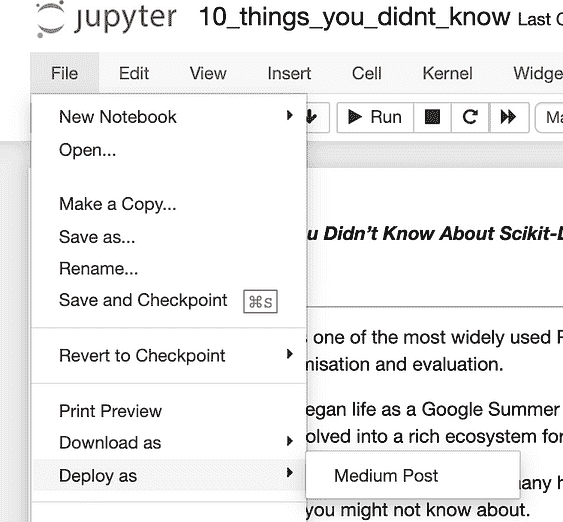
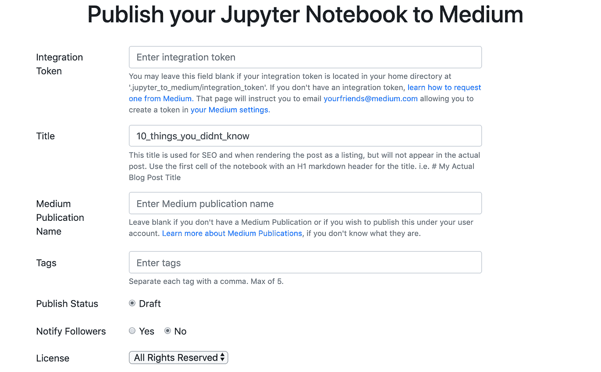
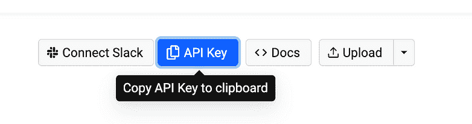
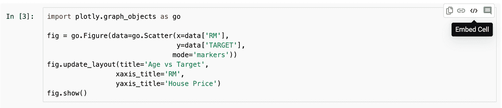
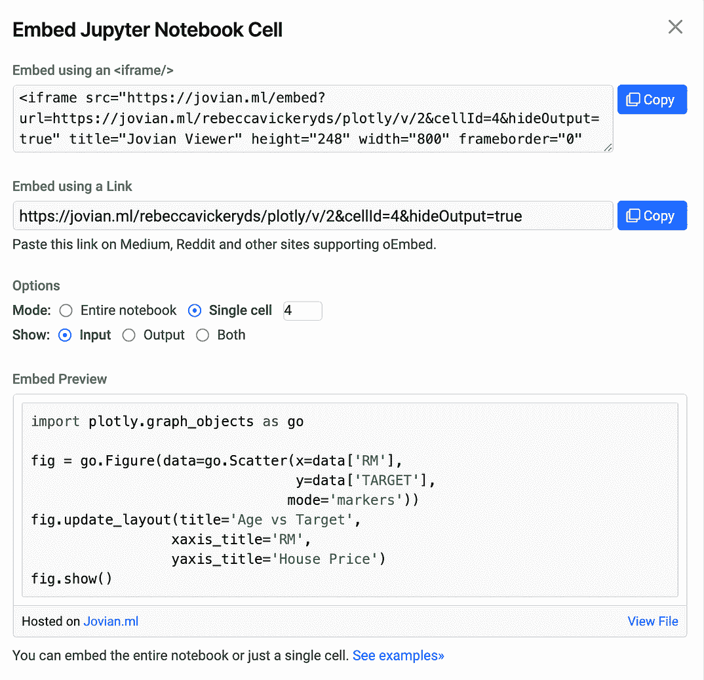

# 加速数据科学写作的 4 个工具

> 原文：[`www.kdnuggets.com/2020/09/4-tools-speed-up-data-science-writing.html`](https://www.kdnuggets.com/2020/09/4-tools-speed-up-data-science-writing.html)

评论

**由 [Rebecca Vickery](https://www.linkedin.com/in/rebecca-vickery-20b94133/)，数据科学家**


图片由[Kat Stokes](https://unsplash.com/@katstokes_?utm_source=unsplash&utm_medium=referral&utm_content=creditCopyText)拍摄，发布于[Unsplash](https://unsplash.com/s/photos/writing?utm_source=unsplash&utm_medium=referral&utm_content=creditCopyText)

* * *

## 我们的 3 大课程推荐

 1\. [Google 网络安全证书](https://www.kdnuggets.com/google-cybersecurity) - 快速进入网络安全职业轨道。

 2\. [Google 数据分析专业证书](https://www.kdnuggets.com/google-data-analytics) - 提升你的数据分析水平

 3\. [Google IT 支持专业证书](https://www.kdnuggets.com/google-itsupport) - 支持你所在的组织进行 IT 支持

* * *

我在 Medium 上写数据科学的文章已经有两年多了。写作，尤其是技术写作，可能会非常耗时。你不仅需要构思一个想法，写得好，编辑你的文章以确保准确性和流畅性，还需要校对它们。对于技术文章，你还经常需要编写代码来说明你的解释，确保代码的准确性，并将代码从你使用的工具转移到你的 Medium 文章中。

我尽量每周发布一到两篇文章。当我刚开始写作时，我发现这个过程可能非常耗时，很难在全职工作之余保持这个进度。

随着时间的推移，我找到了一些工具，大大加快了我创建和发布文章的时间。特别是那些包含代码示例的文章。以下工具帮助我在其他生活承诺之间实现每周发布一到两篇文章的目标。

### 1\. [Jupyter 到 Medium](https://pypi.org/project/jupyter-to-medium/)

这个工具由 Ted Petrou 于今年 5 月刚刚发布，但如果你在 Jupyter Notebooks 中编写代码，它将彻底改变游戏规则。通过这个 Python 包，你可以将整个笔记本的内容直接发布为 Medium 文章。

要使用这个工具，首先需要将其通过 pip 安装到你的项目环境中。

```py
pip install jupyter_to_medium
```

你可能还需要在你启动笔记本的环境中安装这个扩展。

```py
jupyter bundlerextension enable --py jupyter_to_medium._bundler --sys-prefix
```

一旦安装完成，当你打开 Jupyter Notebook 并导航到** 文件 >> 部署为**，你现在会发现一个选项可以将其部署为**Medium 文章**。



当你选择此选项时，你会看到一个表单。在顶部，它要求你输入一个集成令牌。如果你是 Medium 的常规作者，你可能会在 Medium 账户的设置中找到这个令牌。如果你的设置中没有令牌，你需要通过电子邮件联系 Medium 请求一个，地址是 yourfriends@medium.com。

根据我的经验，你会很快得到回应，通常在 1 到 2 天内。

你可以每次将集成令牌粘贴到此表单中，或者为了节省重复访问的时间，你可以将令牌保存为文件，并在以下方式标记目录 `.jupyter_to_medium/integration_token`。



Jupyter 到 Medium 会将你的 Markdown 发布为文本，将代码作为代码块发布，图像则直接以草稿形式发布到 Medium。我发现通常只需进行最小的编辑，即可将其转变为可发布的博客文章。

### 2\. [Github Gists](https://gist.github.com/)

Github 有一个名为 Github Gists 的工具，可以让你轻松地将代码片段直接嵌入到博客文章中。使用 Gists 而不是代码块的好处在于，它们更好地保留了代码格式，推广了你的 Github 账户，并且读者可以更容易地访问你的代码以自己尝试示例。

你需要一个 Github 账户来创建 Gist。创建一个后，只需导航到 Gists 页面 [gist.github.com](https://gist.github.com/)。创建 Gist 非常简单，只需给它起个名字，粘贴你的代码，然后点击发布。发布后，你将看到此页面。要在 Medium 帖子中嵌入 Gist，只需在‘Embed’下编码 URL，并粘贴到你的文章中。


代码在你的 Medium 帖子中的显示如下。

### 3\. [Jovian.ml](https://jovian.ml/docs/index.html)

Jovian.ml 是一个用于在线托管 Jupyter Notebooks 的工具，非常适合从本地环境外部分享分析结果。Jovian 最近发布了一项功能，使得可以将整个笔记本、代码片段、单元输出和 Markdown 直接嵌入到你的 Medium 帖子中。

要开始使用 Jovian，你需要在 [jovian.ml](https://www.jovian.ml/) 上创建一个账户。免费版允许你创建无限的公共项目，这对于通过 Medium 博客分享内容非常理想。接着，你需要在本地环境中使用 pip 安装。

```py
[p](https://www.jovian.ml/)ip install jovian
```

要将本地 Jupyter Notebook 上传到你的在线 Jovian 账户，只需在笔记本中运行以下命令。

```py
import jovian
jovian.commit()
```

这将提示你输入一个 API 密钥，你可以在你的账户中找到它。



要在单元格中嵌入特定的代码片段，请导航到你上传到在线账户的笔记本，以及包含你要分享的代码的单元格。点击 **Embed Cell**。



这将给你一个可以粘贴到你的 Medium 帖子的链接。



这将显示如下所示。

### 4\. [Grammarly](https://app.grammarly.com/)

Grammarly 是一个非常知名的应用程序，它检查你的内容中的拼写错误、语法错误甚至文本的情感。虽然它是一个显而易见的写作工具，但我花了一段时间才开始使用它，并且它对我文章的编辑时间产生了巨大的影响，所以我觉得值得在这里分享。

Grammarly 可以作为浏览器扩展、桌面应用程序或移动应用程序进行安装。为了最大限度地利用我的时间，我在许多不同的环境中写作，因此在离线写作时本地安装 Grammarly 非常有用，当我在浏览器中直接写作时也很方便，如果我在移动中写作，Grammarly 的移动版也很有帮助。

如果你对 Medium 上的数据科学写作感兴趣，你可能会发现我之前写的相关文章也很有用。

[**我如何写数据科学博客**](https://towardsdatascience.com/how-i-write-a-data-science-blog-62e4108fe478)

关于数据科学（或任何其他主题）的写作技巧

[**为什么我写数据科学博客**](https://towardsdatascience.com/why-i-write-a-data-science-blog-7726c3c7d3d9)

博客写作加速了我在数据科学领域的学习，原因如下

感谢阅读！

[**我每月发送一次新闻通讯，如果你想加入，请通过这个链接注册。期待成为你学习旅程的一部分！**](https://mailchi.mp/ce8ccd91d6d5/datacademy-signup)

**简历：[Rebecca Vickery](https://www.linkedin.com/in/rebecca-vickery-20b94133/)** 通过自学学习数据科学。Holiday Extras 的数据科学家。alGo 的联合创始人。

[原文](https://towardsdatascience.com/4-tools-to-speed-up-your-data-science-writing-11d3823cd01b)。经许可转载。

**相关：**

+   如果我必须重新开始学习数据科学，我会怎么做？

+   成功的数据科学家需要具备什么？

+   最重要的数据科学项目

### 更多相关话题

+   [RAPIDS cuDF 加速你的下一步数据科学工作流程](https://www.kdnuggets.com/2023/04/rapids-cudf-speed-next-data-science-workflow.html)

+   [加速你的 Python 代码的 3 种简单方法](https://www.kdnuggets.com/2022/10/3-simple-ways-speed-python-code.html)

+   [宣布博客写作比赛，获胜者将获得 NVIDIA GPU！](https://www.kdnuggets.com/2022/11/blog-writing-contest-nvidia-gpu.html)

+   [掌握 Python：7 种策略以编写清晰、有组织的代码](https://www.kdnuggets.com/mastering-python-7-strategies-for-writing-clear-organized-and-efficient-code)

+   [提升 Python 函数写作的 5 个技巧](https://www.kdnuggets.com/5-tips-for-writing-better-python-functions)

+   [提高数据效率和速度的 5 个 Python 小技巧](https://www.kdnuggets.com/5-python-tips-for-data-efficiency-and-speed)
