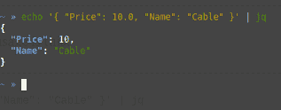

# 使用 JSON 在 Python 中的 4 个技巧

> 原文：[`www.kdnuggets.com/2020/09/4-tricks-effectively-use-json-python.html`](https://www.kdnuggets.com/2020/09/4-tricks-effectively-use-json-python.html)

评论

**作者 [Erik van Baaren](https://medium.com/@eriky)，[Python 3 指南](https://python3.guide/)**


作者插图

Python 有两种数据类型，它们结合在一起形成了处理 JSON 的完美工具：**字典** 和 **列表**。让我们探索如何：

+   加载和写入 JSON

+   在命令行上格式化输出并验证 JSON

+   通过使用 JMESPath 对 JSON 文档进行高级查询

### 1\. 解码 JSON

Python 配备了一个强大且优雅的 [JSON 库](https://docs.python.org/3.8/library/json.html)。它可以用以下方式导入：

```py
import json
```

解码 JSON 字符串像 `json.loads(…)`（意为“加载字符串”）一样简单。

它会转换：

+   对象转换为字典

+   数组转换为列表，

+   布尔值、整数、浮点数和字符串会被识别并转换成 Python 中的正确类型

+   任何 `null` 都会被转换为 Python 的 `None` 类型

这是 `json.loads` 在实际操作中的一个示例：

```py
>>> import json
>>> jsonstring = '{"name": "erik", "age": 38, "married": true}'
>>> **json.loads(jsonstring)**
{'name': 'erik', 'age': 38, 'married': True}
```

### 2\. 编码 JSON

另一种方式同样简单。使用 `json.dumps(…)`（意为“转储到字符串”）将一个由字典、列表和其他原生类型组成的 Python 对象转换为字符串：

```py
>>> myjson = {'name': 'erik', 'age': 38, 'married': True}
>>> **json.dumps(myjson)**
'{"name": "erik", "age": 38, "married": true}'
```

这是完全相同的文档，转换回字符串！如果你想让你的 JSON 文档对人类更可读，请使用缩进选项：

```py
>>> print(json.dumps(myjson, indent=2))
{
  "name": "erik",
  "age": 38,
  "married": true
}
```

### 3\. 命令行使用

JSON 库也可以从命令行使用，以 **验证** 和 **格式化输出** JSON：

```py
$ echo "{ \"name\": \"Monty\", \"age\": 45 }" | \
python3 -m json.tool
{
    "name": "Monty",
    "age": 45
}
```

旁注：如果你使用的是 Mac 或 Linux 并且有机会安装它，请查看一下 `jq` 命令行工具。它容易记住，能够为你的输出着色，并且具有大量额外功能，正如我在 [关于成为命令行高手的文章](https://towardsdatascience.com/this-will-make-you-a-command-line-ninja-93a51cdb16b1) 中所解释的那样。



jq 默认会对你的 JSON 进行格式化输出

### 4\. 使用 JMESPath 搜索 JSON


[截图](http://jmespath.org/) 作者

JMESPath 是一种查询语言，用于 JSON。它允许你轻松从 JSON 文档中获取所需的数据。如果你之前使用过 JSON，你可能知道获取嵌套值是很简单的。

例如：`doc["person"]["age"]` 将为你获取一个文档中年龄的嵌套值，如下所示：

```py
{
  "persons": {
    "name": "erik",
    "age": "38"
  }
}
```

但如果你想从一个类似于这样的文档中的人员数组中提取所有的年龄字段呢：

```py
{
  "persons": [
    { "name": "erik", "age": 38 },
    { "name": "john", "age": 45 },
    { "name": "rob", "age": 14 }
  ]
}
```

我们可以写一个简单的循环遍历所有人员。非常简单。但循环很慢并且会增加代码的复杂性。这就是 JMESPath 发挥作用的地方！

这个 JMESPath 表达式将完成这项工作：

```py
persons[*].age
```

它会返回一个包含所有年龄的数组：`[38, 45, 14]`。

假设你想过滤列表，仅获取名为“erik”的人的年龄。你可以使用过滤器来实现：

```py
persons[?name=='erik'].age
```

看到这有多自然和快捷了吗？

JMESPath 不是 Python 标准库的一部分，这意味着你需要通过 `pip` 或 `[pipenv](https://medium.com/better-programming/improve-your-python-package-management-with-pipenv-28093c007955)` 来安装它。例如，当 [使用](https://medium.com/better-programming/stop-installing-python-packages-globally-use-virtual-environments-a31dee9fb2de)`[pip](https://medium.com/better-programming/stop-installing-python-packages-globally-use-virtual-environments-a31dee9fb2de)`[ 在虚拟环境中](https://medium.com/better-programming/stop-installing-python-packages-globally-use-virtual-environments-a31dee9fb2de)：

```py
$ pip3 install jmespath
$ python3
Python 3.8.2 (default, Jul 16 2020, 14:00:26)
>>> import jmespath
>>> j = { "people": [{ "name": "erik", "age": 38 }] }
>>> jmespath.search(**"people[*].age"**, j)
[38]
>>>
```

你现在可以开始实验了！确保尝试一下 [互动教程](https://jmespath.org/tutorial.html) ，并查看 JMESPath 网站上的 [示例](https://jmespath.org/examples.html)！

如果你有更多 JSON 的技巧或窍门，请在评论中分享！

**关注我** 在 [Twitter](https://twitter.com/erikyan) 以获取我最新的文章，并确保 **访问我的**[**Python 3 Guide**](https://python3.guide/)。这篇文章最初也发布于 [那里](https://python3.guide/data-processing/working-with-json)。

[**你需要理解的最重要 Python 概念**](https://towardsdatascience.com/the-most-important-python-concept-that-you-need-to-understand-985b98bbb84)

了解 Python 语言的所有基本构建块

**简介： [Erik van Baaren](https://medium.com/@eriky)** 是一名软件工程师及 [Python 3 Guide](https://python3.guide/) 的网站管理员，在那里你可以学习初级和高级 Python 话题。他还是 [Medium.com](https://medium.com/@eriky) 上的技术文章作者。

[原文](https://towardsdatascience.com/4-tricks-to-effectively-use-json-in-python-4ca18c3f91d0)。经许可转载。

**相关：**

+   你应该知道的 3 个高级 Python 特性

+   为什么学习 Python？这里有 8 个数据驱动的理由

+   你不知道的 10 个 Scikit-Learn 事实

* * *

## 我们的前三个课程推荐

 1\. [Google 网络安全证书](https://www.kdnuggets.com/google-cybersecurity) - 快速进入网络安全职业生涯。

 2\. [Google 数据分析专业证书](https://www.kdnuggets.com/google-data-analytics) - 提升你的数据分析技能

 3\. [Google IT 支持专业证书](https://www.kdnuggets.com/google-itsupport) - 支持你的组织进行 IT

* * *

### 更多相关主题

+   [如何有效使用 Pandas GroupBy](https://www.kdnuggets.com/2023/01/effectively-pandas-groupby.html)

+   [数据分析：四种数据分析方法及其应用](https://www.kdnuggets.com/2023/04/data-analytics-four-approaches-analyzing-data-effectively.html)

+   [如何有效管理 Docker 镜像版本的标签](https://www.kdnuggets.com/how-to-use-docker-tags-to-manage-image-versions-effectively)

+   [免费电子书：10 个实用的 Python 编程技巧](https://www.kdnuggets.com/2023/04/free-ebook-10-practical-python-programming-tricks.html)

+   [12 个 VSCode Python 开发技巧](https://www.kdnuggets.com/2023/05/12-vscode-tips-tricks-python-development.html)

+   [Python f-Strings 魔法：每位编码者都需要了解的 5 个颠覆性技巧](https://www.kdnuggets.com/python-fstrings-magic-5-gamechanging-tricks-every-coder-needs-to-know)
