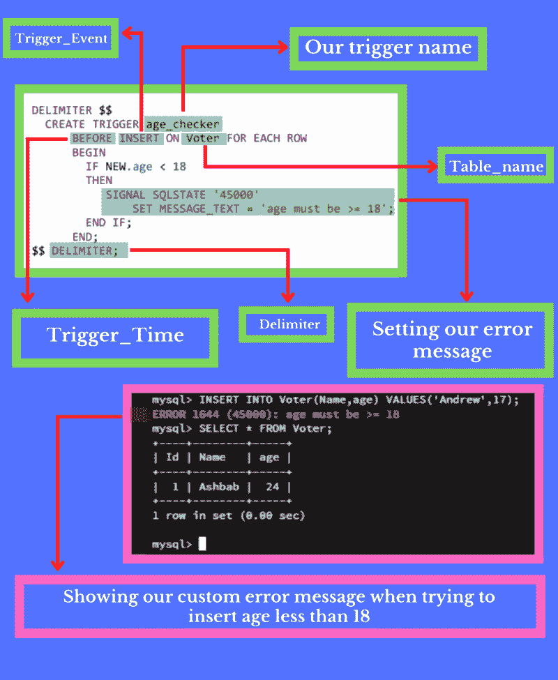
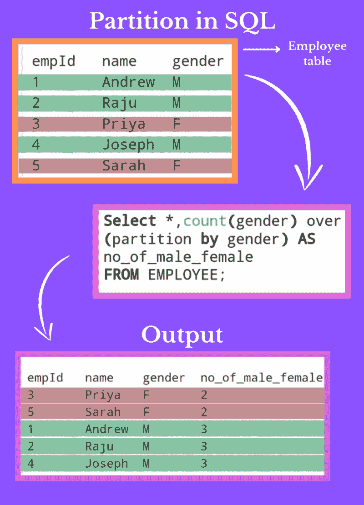
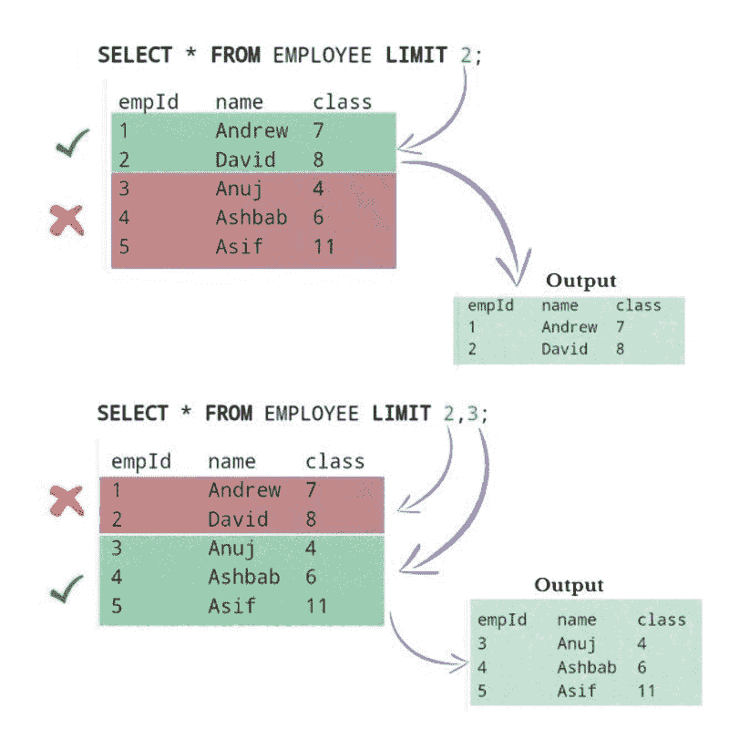
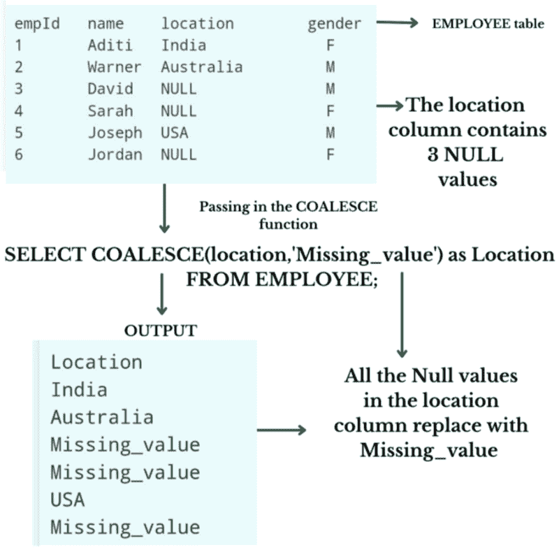

# 数据科学的 4 个有用的中级 SQL 查询

> 原文：[`www.kdnuggets.com/2022/12/4-useful-intermediate-sql-queries-data-science.html`](https://www.kdnuggets.com/2022/12/4-useful-intermediate-sql-queries-data-science.html)


图片由 [Shubham Dhage](https://unsplash.com/@theshubhamdhage?utm_source=unsplash&utm_medium=referral&utm_content=creditCopyText) 提供，来源于 [Unsplash](https://unsplash.com/s/photos/data-science?utm_source=unsplash&utm_medium=referral&utm_content=creditCopyText)

所以在这篇文章中，我们将讨论一些数据专业人员必备的中级 SQL 查询。我们将讨论 4 个 SQL 查询，问题是，为什么要学习这 4 个 SQL 查询？

我们都熟悉在 **SQL 中创建数据库**，但更重要的是知道如何根据我们的需要有效地清理和筛选数据。这些查询就是帮助我们的方法，让我们来看看这些查询是什么。

1.  **SQL 中的触发器**，以及如何在查询中使用它？

1.  **SQL 中的 Partition By**

1.  **SQL 中的 LIMIT**，以及我们如何使用 **LIMIT** 语法限制 SQL 表中的查询？

1.  **SQL 中的 COALESCE 函数**，以及它如何帮助我们去除 **NULL** 值？

# 1\. SQL 中的触发器



SQL 中的触发器 | 来源：作者提供的图片

在这篇文章中，我们将讨论 **SQL 中触发器的强大功能**。

**什么是 SQL 中的触发器？**

触发器是当事件发生时自动运行的 SQL 代码。例如：在下面的查询中，当用户尝试向表中插入值时，我们的触发器会运行。

触发器主要分为三个部分。

**1\. 触发器时间**

2\. 触发器事件

3\. 表名

**1\. 触发器时间：** 触发器时间指的是你希望这个触发器运行的时间，例如，事件之前或之后。

在下面的查询中，我们使用了 before，为什么？因为我们希望我们的代码在插入到表中之前运行。

**2\. 触发器事件：** 触发器事件是指我们希望触发器运行的时机，例如 **INSERT**、**UPDATE** 和 **DELETE**

在上述示例中，我们使用 INSERT，因为我们希望在执行 INSERT 事件时运行我们的触发器。

**3\. 表名：** 表名就是我们表的名称。

**所以让我们详细讨论触发器的语法，并进行适当的实际解释**

在 **BEGIN** 和 **END** 之间的代码是每当我们在选民表中插入值时，触发器检查年龄，是否小于 18 或大于 18。如果年龄大于或等于 18，则不会发生任何事情，但如果小于 18，则触发器会显示错误，并设置消息。

例如，参见上面的图片，**我们设置 message_text = ' age must be >=18'，** 以便每当我们尝试 **插入小于 18 的值时，都会显示此错误消息**。在输出部分，当我们尝试插入 Andrew, 17 时，查询显示了包含我们 **自定义消息** 的错误。这就是 SQL 中的触发器以及如何在查询中使用它们。

**查看下面的代码以获得更实际的理解**

```py
DELIMITER $$
/* creating a trigger whose name is age_checker */
  CREATE TRIGGER age_checker
     /* defining when our trigger run before inserting or after inserting
        in our case we choose before inserting that's why we use BEFORE */
      BEFORE INSERT ON Voter FOR EACH ROW
      BEGIN 
     /* Now we are checking the inserted value in our age column if it is 
        less then 18 then show our error message */ 
        IF NEW.age < 18
        THEN 
           SIGNAL SQLSTATE '45000'
              /* setting our error message in the MESSAGE_TEXT */
              SET MESSAGE_TEXT = 'AGE MUST BE >= 18';
        END IF;
     END;
DELIMETER;
```

# 2\. SQL 中的分区



PARTITION BY in SQL | 来源: 作者插图

本文将讨论 **分区** 及其在 SQL 中的使用方法。

所以第一个问题是，**SQL 中的分区是什么**？

**分区的作用是将具有相似值的行分组，但不限制行数。**

让我们举个例子以便更清楚。

**请参见上面的第二张图片。**

表中有五行，其中有一列名为性别，包含三名男性候选人和两名女性候选人，那么如果我们想要一个新列来显示男性和女性的数量呢？

分区语法根据相似的值对行进行分组，这意味着在我们的查询中，我们使用 `partition by` 按性别进行分组。这意味着我们希望按性别对行进行分组，因此性别列中只有两个唯一值，第一个是 M，第二个是 F，因此将行分为两个组。

1 性别列中包含 M 的行

2 性别列中包含 F 的行，这就是 SQL 中分区的作用，我们使用计数函数来统计组中的行数。

在输出中，你可以看到新建了一个名为 no_of_male_female 的列，这列包含了组中的行数。例如，F 组中有两行，所以显示为 2，M 组中有三行，所以显示为 3。

**有些人可能会想知道**

SQL 中的 `group by` 和 `partition by` 有什么区别，因为这两者的作用相似。那么答案是，如果你使用 `group by`，你的五行数据仅会转换为两行。为什么？

因为 `group by` 显示的是组的数量，在我们上述的查询中，表被分为两个组，M 和 F，所以 `group by` 只显示每组的第一行，这意味着即使组包含十行数据，它只会显示每组的 1 行。

但如果使用 `partition by`，则行数保持不变，你会发现输出中的行数和表中的行数保持一致。

**SQL 中的分区显示所有行。**

两者都有优点和缺点，你可以根据需求选择使用。

**如果你需要，请查看下面的代码**

```py
/* count function used to count number of gender after partition and then 
   show output in no_of_male_female column */

SELECT * , COUNT(gender) OVER (PARTITION BY gender) 
AS no_of_male_female FROM EMPLOYEE;
```

# 3\. 限制查询



LIMIT in SQL | 来源: 作者插图

**SQL 中的 LIMIT 及其工作原理，尽管 LIMIT 在某些 SQL 数据库中不受支持，例如 SQL 服务器和 MS access。**

LIMIT 子句在 SQL 数据库中广泛使用，主要用于限制行数。

例如：如果我们想从数据库中找到前 10 或最差的 10 张专辑，那么 LIMIT 就很有用。我们在查询末尾使用 LIMIT 10，工作就完成了。

但这里有一个问题，LIMIT 是如何工作的，我们如何有效地使用它？

**我们可以用两种方式使用 LIMIT**

**1. LIMIT（任何常量值）**

例如，下面的代码选择了表中的前八行

**SELECT * FROM table_name LIMIT 8;**

**2. LIMIT(x, y)**

这是一种更精确地限制表格的方法。

x 参数用于从顶部消除几行。

y 参数显示你在消除后想要的行数。

例如：

**选择 * FROM table_name LIMIT 3,2;**

这个查询从顶部消除三行，然后在消除三行后显示两行。

**查看下面的代码。**

```py
/* This command is used to select first two rows */

SELECT * FROM EMPLOYEE LIMIT 2;

/* This command is used to select 3 rows after eliminating first two rows */

SELECT * FROM EMPLOYEE LIMIT 2,3;
```

# 4. COALESCE 函数



COALESCE 函数在 SQL 中 | 来源: 作者提供的图片

你知道 SQL 中有一些很棒的函数可以节省你的时间吗？

这里我谈论的是**COALESCE 函数**，这个函数会让你感到惊讶，所以请阅读完整的帖子。

**COALESCE 函数接受 n 个值。**

```py
COALESCE(value_1,value_2,......, value_n)
```

所以让我们了解一下；请参见上面的第 4 张图片。你会看到有一个 EMPLOYEE 表，其中包含一个名为 location 的列，在该列中有 3 个 NULL 值。那么如果我们想用有意义的词替换这些 NULL 值呢？所以如上图所示，我们想用词 Missing_value 替换所有 NULL 值。

我们可以通过查看上面图片中的代码来实现这一点。COALESCE 函数将所有 NULL 值替换为 Missing_value。

让我们逐步了解 COALESCE 函数。

**步骤 1:** 我们在 COALESCE 函数中传递的第一个参数是我们想要查找 NULL 值的列名。这就是为什么我们使用 location。

**步骤 2:** 如果找到了某些值，则不会发生任何变化；正如你在图像中的代码输出所看到的，值保持不变，但如果找到 NULL 值，它会用我们在 COALESCE 函数中作为第二个参数提供的词来替换这些 NULL 值，我们给出的第二个参数是 Missing_value，这就是为什么它用 Missing_value 替换了 location 列中所有的 NULL 值。

这就是 COALESCE 函数在 SQL 中的工作原理。我们给出了一个使用单列的示例。如果我们想在多个列中替换 NULL 值，我们也可以通过遵循上述语法来实现。

**查看下面的代码。**

```py
/* So we are targeting the location column from our EMPLOYEE table and 
   then replacing the NULL values with Missing_value text */
SELECT COALESCE(location,"Missing_value") as Location
FROM EMPLOYEE;
```

我希望这篇文章能简要说明如何使用这些 SQL 中的重要查询及其好处。如果你有任何问题，请随时在评论区提问。

**[Ashbab Khan](https://www.linkedin.com/in/ashbabkhan/)** 是一位数据科学家、SQL 专家和富有创意的技术写作者。

[原文](https://medium.com/@ashbabkhan12/useful-intermediate-sql-queries-for-data-science-408c724b67d0)。经许可转载。

### 更多相关主题

+   [KDnuggets 新闻，12 月 7 日：破解数据科学十大误区 • 4…](https://www.kdnuggets.com/2022/n47.html)

+   [免费中级 Python 编程速成课程](https://www.kdnuggets.com/2022/12/free-intermediate-python-programming-crash-course.html)

+   [如何优化 SQL 查询以加快数据检索速度](https://www.kdnuggets.com/2023/06/optimize-sql-queries-faster-data-retrieval.html)

+   [数据科学家必备的 SQL 查询](https://www.kdnuggets.com/top-sql-queries-for-data-scientists)

+   [解决 5 个棘手 SQL 查询](https://www.kdnuggets.com/2020/11/5-tricky-sql-queries-solved.html)

+   [解决 5 个复杂 SQL 问题：棘手查询解析](https://www.kdnuggets.com/2022/07/5-hardest-things-sql.html)
