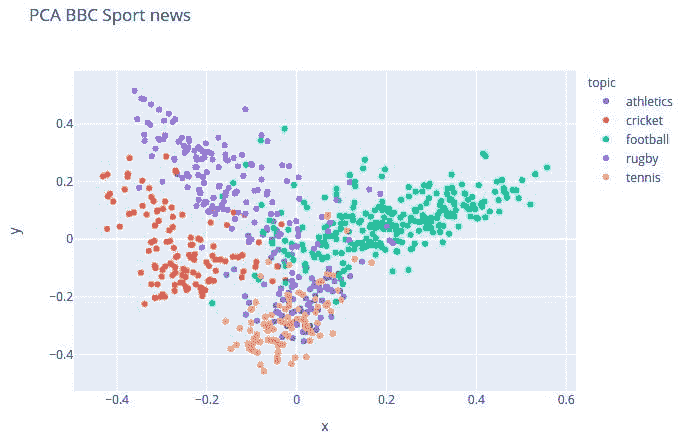
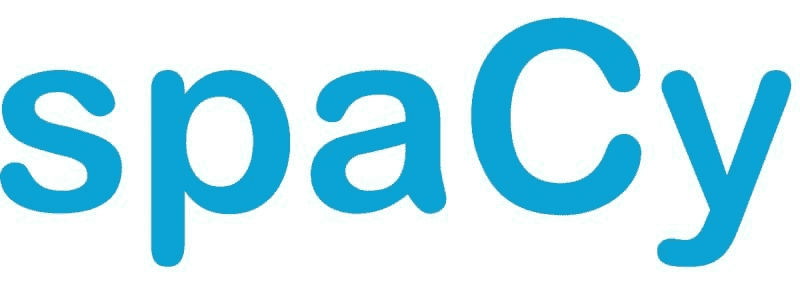
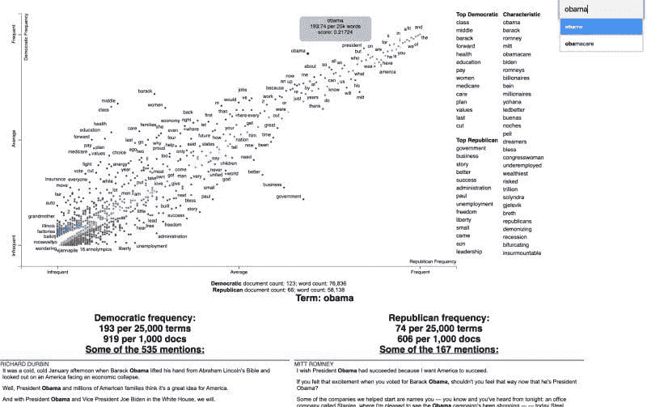

# 开始使用 5 个必备的自然语言处理库

> [`www.kdnuggets.com/2021/02/getting-started-5-essential-nlp-libraries.html`](https://www.kdnuggets.com/2021/02/getting-started-5-essential-nlp-libraries.html)

comments

假设你已经理解了如何处理自然语言处理任务。假设你还决定了更具体的方法来尝试解决你的任务。你仍然需要在计算上付诸实践，很可能你会希望利用现有的 NLP 库来帮助你完成这项工作。

假设你正在用 Python 编程（如果不是，我无法帮助你），有很多选项可以选择。尽管本文并不支持任何特定的解决方案集合，但它提供了一个概述，列出了 5 个你可能会考虑使用的流行库，以便解决你的问题。


### 1\. [Hugging Face Datasets](https://github.com/huggingface/datasets)

Hugging Face 的 Datasets 库本质上是一个包含公共 NLP 数据集的打包集合，提供了一组通用的 API 和数据格式，以及一些辅助功能。

> 最大的即用型 NLP 数据集中心，具有快速、易用和高效的数据操作工具。

可以轻松通过以下方式安装 Datasets：

`pip install datasets`

Datasets 进一步描述了两个主要功能：对许多公共数据集的一行数据加载器，以及高效的数据预处理。然而，这种描述忽略了库的另一个主要部分：多个与 NLP 任务相关的内置评估指标。该库还具有其他功能，例如数据集的后端内存管理以及与流行 Python 工具（如 NumPy、Pandas）及主要机器学习平台 TensorFlow 和 PyTorch 的互操作性。

首先来看一下加载数据集：

```py
from datasets import load_dataset, list_datasets

print(f"The Hugging Face datasets library contains {len(list_datasets())} datasets")

squad_dataset = load_dataset('squad')

print(squad_dataset['train'][0])
print(squad_dataset)
```

```py
The Hugging Face datasets library contains 635 datasets

Reusing dataset squad (/home/matt/.cache/huggingface/datasets/squad/plain_text/1.0.0/4c81550d83a2ac7c7ce23783bd8ff36642800e6633c1f18417fb58c3ff50cdd7)

{'answers': {'answer_start': [515], 'text': ['Saint Bernadette Soubirous']}, 'context': 'Architecturally, the school has a Catholic character. Atop the Main Building\'s gold dome is a golden statue of the Virgin Mary. Immediately in front of the Main Building and facing it, is a copper statue of Christ with arms upraised with the legend "Venite Ad Me Omnes". Next to the Main Building is the Basilica of the Sacred Heart. Immediately behind the basilica is the Grotto, a Marian place of prayer and reflection. It is a replica of the grotto at Lourdes, France where the Virgin Mary reputedly appeared to Saint Bernadette Soubirous in 1858\. At the end of the main drive (and in a direct line that connects through 3 statues and the Gold Dome), is a simple, modern stone statue of Mary.', 'id': '5733be284776f41900661182', 'question': 'To whom did the Virgin Mary allegedly appear in 1858 in Lourdes France?', 'title': 'University_of_Notre_Dame'}

DatasetDict({
    train: Dataset({
        features: ['id', 'title', 'context', 'question', 'answers'],
        num_rows: 87599
    })
    validation: Dataset({
        features: ['id', 'title', 'context', 'question', 'answers'],
        num_rows: 10570
    })
})
```

加载一个评估指标同样简单：

```py
from datasets import load_metric, list_metrics

print(f"The Hugging Face datasets library contains {len(list_metrics())} metrics")
print(f"Available metrics are: {list_metrics()}")

# Load a metric
squad_metric = load_metric('squad')
```

```py
The Hugging Face datasets library contains 19 metrics

Available metrics are: ['accuracy', 'bertscore', 'bleu', 'bleurt', 'comet', 'coval', 'f1', 'gleu', 'glue', 'indic_glue', 'meteor', 'precision', 'recall', 'rouge', 'sacrebleu', 'seqeval', 'squad', 'squad_v2', 'xnli']

```

你如何使用它们取决于你，但加载一个公开可用的数据集和一个经过验证的评估指标从未如此简单。


### 2\. [TextHero](https://github.com/jbesomi/texthero)

TextHero 在其 Github 仓库中简洁地描述为：

> 从零到英雄的文本预处理、表示和可视化。

尽管这简要解释了你可能如何使用这个库，但以下对“为什么选择 TextHero？”的回答则进一步阐明了库背后的理由：

> 以一种非常务实的方式，texthero 只有一个目标：让开发者节省时间。处理文本数据可能很麻烦，而且在大多数情况下，默认管道足以作为起点。总是有时间回过头来改进之前的工作。

现在你知道了为什么可能会使用 TextHero，下面是如何安装它：

`pip install texthero`

查看 [入门指南](https://texthero.org/docs/getting-started) 可以看到你在几行代码中可以完成的工作。通过下面的 TextHero Github repo 示例，我们将加载一个数据集，清理它，创建一个 TF-IDF 表示，执行主成分分析，并绘制 PCA 的结果。

```py
def text_texthero():
	import texthero as hero
	import pandas as pd

	df = pd.read_csv("https://github.com/jbesomi/texthero/raw/master/dataset/bbcsport.csv")

	df['pca'] = (
		df['text']
			.pipe(hero.clean)
			.pipe(hero.tfidf)
			.pipe(hero.pca)
		)

	hero.scatterplot(df, 'pca', color='topic', title="PCA BBC Sport news")
```



你可以用 TextHero 完成更多的工作，所以请查看其余的 [文档](https://texthero.org/docs/api-preprocessing)，以获取有关数据清理和预处理、可视化、表示、基本 NLP 任务等的更多信息。

### 3\. [spaCy](https://spacy.io/)

spaCy 专门设计为一个有用的库，旨在实现生产就绪的系统。

> spaCy 旨在帮助你进行实际工作——构建真正的产品或获取实际的见解。这个库尊重你的时间，并尽量避免浪费它。它容易安装，API 简单而高效。我们喜欢把 spaCy 视为自然语言处理领域的 Ruby on Rails。



所以当你准备好进行实际工作时，你首先需要安装 spaCy 和至少一个语言模型。在这个示例中，我们将使用它的英文语言模型。库和语言模型的安装可以通过以下命令完成：

`pip install spacy python -m spacy download en`

要开始使用 spaCy，我们将使用这个示例文本句子：

```py
sample = u"I can't imagine spending $3000 for a single bedroom apartment in N.Y.C."
```

现在让我们导入 spaCy 和一份英文停用词列表。我们还会加载英文语言模型作为一个 `Language` 对象（按照 spaCy 的惯例，我们将其称为 'nlp'），然后在我们的示例文本上调用 `nlp` 对象，它返回一个处理后的 `Doc` 对象（我们巧妙地称之为 'doc'）。

```py
import spacy
from spacy.lang.en.stop_words import STOP_WORDS

nlp = spacy.load('en')
doc = nlp(sample)
```

所以……就这样？从 [spaCy 文档](https://spacy.io/usage/spacy-101)：

> 即使一个 Doc 已经被处理——例如，分割成单独的词汇并进行注释——它仍然保留**原始文本的所有信息**，如空白字符。你总是可以获取一个 token 在原始字符串中的偏移量，或者通过连接 tokens 和它们的尾随空白字符来重建原始文本。这样，你在使用 spaCy 处理文本时不会丢失任何信息。

现在，让我们看看这个处理后的示例：

```py
# Print out tokens
print("Tokens:\n=======)
for token in doc:
    print(token)

# Identify stop words
print("Stop words:\n===========")
for word in doc:
    if word.is_stop == True:
        print(word)

# POS tagging
print("POS tagging:\n============")
for token in doc:
    print(token.text, token.lemma_, token.pos_, token.tag_, token.dep_,
          token.shape_, token.is_alpha, token.is_stop)

# Print out named entities
print("Named entities:\n===============")
for ent in doc.ents:
    print(ent.text, ent.start_char, ent.end_char, ent.label_)
```

```py
Tokens:
=======
I
ca
n't
imagine
spending
$
3000
for
a
single
bedroom
apartment
in
N.Y.C.

Stop words:
===========
ca
for
a
in

POS tagging:
============
I -PRON- PRON PRP nsubj X True False
ca can VERB MD aux xx True True
n't not ADV RB neg x'x False False
imagine imagine VERB VB ROOT xxxx True False
spending spend VERB VBG xcomp xxxx True False
$ $ SYM $ nmod $ False False
3000 3000 NUM CD dobj dddd False False
for for ADP IN prep xxx True True
a a DET DT det x True True
single single ADJ JJ amod xxxx True False
bedroom bedroom NOUN NN compound xxxx True False
apartment apartment NOUN NN pobj xxxx True False
in in ADP IN prep xx True True
N.Y.C. n.y.c. PROPN NNP pobj X.X.X. False False

Named entities:
===============
3000 26 30 MONEY
N.Y.C. 65 71 GPE
```

spaCy 强大且有明确的观点，可以用于各种 NLP 任务，从预处理到表示再到建模。查看 [spaCy 文档](https://spacy.io/usage/spacy-101)，了解你可以从这里开始做什么。


### 4\. [Hugging Face Transformers](https://github.com/huggingface/transformers)

难以过分强调 Hugging Face Transformers 库在 NLP 实践中的重要性。通过提供访问

从 Github 仓库直接获得的大图景：

> **最先进的自然语言处理（NLP）用于 PyTorch 和 TensorFlow 2.0**
> 
> Transformers 提供了数千个预训练模型，用于执行文本分类、信息提取、问答、摘要、翻译、文本生成等任务，支持 100 多种语言。其目标是使尖端 NLP 技术对所有人更易使用。
> 
> Transformers 提供 API，快速下载和使用这些预训练模型，针对给定文本进行微调，然后在我们的模型中心与社区分享。同时，每个定义架构的 python 模块可以作为独立模块使用并进行修改，以便进行快速研究实验。
> 
> Transformers 由两个最流行的深度学习库 PyTorch 和 TensorFlow 支持，它们之间的集成无缝，允许你使用一个库训练模型，然后用另一个库加载进行推理。

你可以使用[Write With Transformer](https://transformer.huggingface.co/)在线测试 Transformer 库，这是该库功能的官方演示。

这个复杂库的安装很简单：

`pip install transformers`

Transformers 库内容繁多，你可能需要花费很多时间了解它的方方面面。然而，管道 API 的加入允许立即使用模型，几乎无需配置。下面是如何使用 Transformers 管道进行分类的示例（注意，需要安装 TensorFlow 或 PyTorch 才能继续）：

```py
from transformers import pipeline

# Allocate a pipeline for sentiment-analysis
classifier = pipeline('sentiment-analysis')

# Classify text
print(classifier('I am a fan of KDnuggets, its useful content, and its helpful editors!'))
```

```py
[{'label': 'POSITIVE', 'score': 0.9954679012298584}]
```

荒谬的是，仅此而已。该管道使用预训练模型以及该模型所用的预处理，即使不进行微调，结果也可以非常引人注目。

这是一个第二个管道示例，这次用于问答：

```py
from transformers import pipeline

# Allocate a pipeline for question-answering
question_answerer = pipeline('question-answering')

# Ask a question
answer = question_answerer({
	'question': 'Where is KDnuggets headquartered?',
	'context': 'KDnuggets was founded in February of 1997 by Gregory Piatetsky in Brookline, Massachusetts.'
})

# Print the answer
print(answer)
```

```py
{'score': 0.9153624176979065, 'start': 66, 'end': 90, 'answer': 'Brookline, Massachusetts'}
```

这些是简单的例子，但这些管道比仅仅能够解决琐碎的 KDnuggets 相关任务要强大得多！你可以[在这里](https://huggingface.co/transformers/main_classes/pipelines.html)阅读更多关于管道的内容。

Transformers 使最先进的模型易于使用，并对所有人开放。访问库的[Github 仓库](https://github.com/huggingface/transformers)开始探索更多。

### 5\. [Scattertext](https://github.com/JasonKessler/scattertext)

Scattertext 用于创建引人注目的可视化，展示语言在不同文档类型中的差异。来自其 Github 仓库：

> 一个用于在语料库中查找区分性术语并以交互式 HTML 散点图呈现的工具。对应术语的点被选择性标记，以避免与其他标签或点重叠。

如果你现在还没猜到，安装方法如下：

`pip install scattertext`

以下示例来自 GitHub 仓库，展示了 2012 年美国政治大会上使用的术语。

> 2,000 个与政党相关的单词被显示为散点图中的点。它们的 x 轴和 y 轴分别是由共和党和民主党发言者使用的密集排名。

注意，运行示例代码会生成一个 HTML 文件，之后可以在浏览器中查看和交互。

```py
import scattertext as st

df = st.SampleCorpora.ConventionData2012.get_data().assign(
    parse=lambda df: df.text.apply(st.whitespace_nlp_with_sentences)
)

corpus = st.CorpusFromParsedDocuments(
    df, category_col='party', parsed_col='parse'
).build().get_unigram_corpus().compact(st.AssociationCompactor(2000))

html = st.produce_scattertext_explorer(
    corpus,
    category='democrat', category_name='Democratic', not_category_name='Republican',
    minimum_term_frequency=0, pmi_threshold_coefficient=0,
    width_in_pixels=1000, metadata=corpus.get_df()['speaker'],
    transform=st.Scalers.dense_rank
)
open('./demo_compact.html', 'w').write(html)
```

保存的 HTML 文件的结果在查看时（注意这只是下面显示的静态图像，因此不可交互）：



Scattertext 具有明确而狭窄的目的，但它做得非常好。其可视化效果绝对美丽，而且同样重要的是，具有深刻的洞察力。访问他们的 GitHub 仓库以获取更多信息和该库的其他用途。

**相关**：

+   用于深度学习、自然语言处理和计算机视觉的顶级 Python 库

+   5 本极好的自然语言处理书籍

+   最佳 NLP 深度学习课程免费提供

### 更多相关主题

+   [每个数据科学家都应该了解的三个 R 库（即使你使用 Python）](https://www.kdnuggets.com/2021/12/three-r-libraries-every-data-scientist-know-even-python.html)

+   [是什么让 Python 成为初创企业理想的编程语言](https://www.kdnuggets.com/2021/12/makes-python-ideal-programming-language-startups.html)

+   [停止学习数据科学以寻找目标，找到目标以…](https://www.kdnuggets.com/2021/12/stop-learning-data-science-find-purpose.html)

+   [一个 90 亿美元的人工智能失败案例分析](https://www.kdnuggets.com/2021/12/9b-ai-failure-examined.html)

+   [学习数据科学统计的顶级资源](https://www.kdnuggets.com/2021/12/springboard-top-resources-learn-data-science-statistics.html)

+   [成功数据科学家的 5 个特征](https://www.kdnuggets.com/2021/12/5-characteristics-successful-data-scientist.html)
