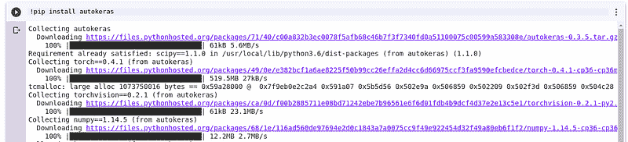
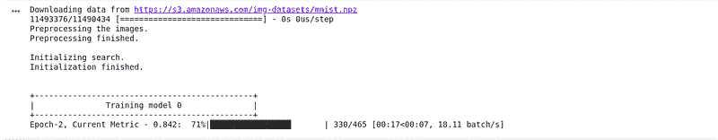

# Python 中的自动化机器学习

> 译文：[`www.kdnuggets.com/2019/01/automated-machine-learning-python.html`](https://www.kdnuggets.com/2019/01/automated-machine-learning-python.html)

 评论


正如我们已经知道的，机器学习是一种自动化复杂问题解决的方法。但机器学习本身可以被自动化吗？这就是我们将在本文中探索的问题。在文章结束时，我们将回答这个问题，并展示实现这一目标的实际方法。

### 自动化机器学习（AutoML）

在应用机器学习模型时，我们通常会进行[data pre-processing](https://heartbeat.fritz.ai/data-preprocessing-and-visualization-implications-for-your-machine-learning-model-8dfbaaa51423)、[feature engineering](https://heartbeat.fritz.ai/introduction-to-automated-feature-engineering-using-deep-feature-synthesis-dfs-3feb69a7c00b)、[feature extraction](https://en.wikipedia.org/wiki/Feature_extraction)和[feature selection](https://en.wikipedia.org/wiki/Feature_selection)。之后，我们会选择最佳算法并[tune our parameters](https://en.wikipedia.org/wiki/Hyperparameter_optimization)以获得最佳结果。AutoML 是一系列用于自动化这些过程的概念和技术。

**AutoML 的好处**

应用机器学习模型解决我们的问题通常需要计算机科学技能、领域专业知识和数学专业知识。找到具备所有这些技能的专家并不总是那么容易。

AutoML 还减少了在设计机器学习模型时出现的人为偏差和错误。组织还可以通过在其数据管道中应用 AutoML 来减少雇佣众多专家的成本。AutoML 还减少了开发和测试机器学习模型所需的时间。

**AutoML 的缺点**

AutoML 在机器学习领域是一个相当新的概念。因此，在应用当前一些 AutoML 解决方案时，重要的是要谨慎。这是因为其中一些技术仍在开发中。

另一个主要挑战是运行 AutoML 模型所需的时间。这将真正依赖于我们运行模型的机器的计算能力。正如我们很快会看到的，有些 AutoML 解决方案在我们的本地机器上运行良好，但有些则需要如[Google Colab](https://www.inc.com/jeff-haden/the-worlds-most-successful-people-dont-actually-start-work-at-4-am-they-wake-work-whenever-heck-they-decide.html)这样的加速解决方案。

### AutoML 概念

关于 AutoML，有两个主要概念需要掌握：神经架构搜索和迁移学习。

**神经架构搜索**

神经网络架构搜索是自动化设计神经网络的过程。通常，[强化学习](https://en.wikipedia.org/wiki/Reinforcement_learning)或[进化算法](https://en.wikipedia.org/wiki/Evolutionary_algorithm)被用于这些网络的设计。在[强化学习](https://en.wikipedia.org/wiki/Reinforcement_learning)中，模型会因为低准确率而受到惩罚，并因高准确率而获得奖励。使用这种技术，模型将始终努力获得更高的准确率。

已经发布了几篇神经网络架构搜索的论文，例如 [学习可迁移的可扩展图像识别架构](https://arxiv.org/abs/1707.07012)、[高效神经网络架构搜索 (ENAS)](https://arxiv.org/pdf/1802.03268.pdf)**、**以及 [用于图像分类器架构搜索的正则化进化](https://arxiv.org/abs/1802.01548) ，仅举几个例子。

**迁移学习**

迁移学习，如其名称所示，是一种技术，其中使用预训练模型来转移其在将模型应用于新的但相似的数据集时所学到的内容。这使我们能够在使用更少计算时间和资源的情况下获得高准确率。神经网络架构搜索适用于需要发现新架构的问题，而迁移学习则最适合数据集与预训练模型使用的数据集相似的问题。

**AutoML 解决方案**

现在让我们看看一些可用的自动化机器学习解决方案。

***Auto-Keras***

根据 [官方网站](https://autokeras.com/)：

> Auto-Keras 是一个开源的自动化机器学习 (AutoML) 软件库。它由德克萨斯 A&M 大学的 [DATA Lab](http://faculty.cs.tamu.edu/xiahu/index.html) 和社区贡献者开发。AutoML 的最终目标是向具有有限数据科学或机器学习背景的领域专家提供易于访问的深度学习工具。Auto-Keras 提供了自动搜索深度学习模型的架构和超参数的功能。

可以使用简单的 pip 命令进行安装：

```py
pip install auto-keras
```

Auto-Keras 仍在进行最终测试，以备最终发布。官方网站警告说，他们对因使用网站上的库而产生的任何损失不承担责任。该包基于深度学习包 [Keras](https://heartbeat.fritz.ai/introduction-to-deep-learning-with-keras-c7c3d14e1527)。

***Auto-Sklearn***

[Auto-Sklearn](https://automl.github.io/auto-sklearn/stable/) 是一个基于 [scikit-learn](https://scikit-learn.org/) 的自动化机器学习包。它是 Scikit-learn 估计器的替代品。它的安装也通过简单的 pip 命令完成：

```py
pip install auto-sklearn
```

在 Ubuntu 中，需要 C++11 构建环境和 SWIG：

```py
sudo apt-get install build-essential swig
```

通过 Anaconda 的安装步骤如下：

```py
conda install gxx_linux-64 gcc_linux-64 swig
```

不能在 Windows 上运行 Auto-Sklearn。然而，可以尝试一些变通方法，如使用 Docker 镜像或通过虚拟机运行。

***基于树的管道优化工具 (TPOT)***

根据其官方 [网站](https://automl.info/tpot/)：

> TPOT 的目标是通过将灵活的 [表达树](https://en.wikipedia.org/wiki/Binary_expression_tree) 管道表示与遗传编程等随机搜索算法相结合，自动化构建 ML 管道。TPOT 利用基于 Python 的 [scikit-learn](http://scikit-learn.org/) 库作为其 ML 菜单。

该软件是开源的，并且可以在 [GitHub](https://github.com/EpistasisLab/tpot)上获取。

***Google 的 AutoML***

官方网站声明：

> Cloud AutoML 是一套机器学习产品，允许具备有限机器学习专业知识的开发人员，通过利用 Google 的先进迁移学习和神经架构搜索技术，训练出符合其业务需求的高质量模型。

Google 的 AutoML 解决方案不是开源的，其定价可以查看 [这里](https://cloud.google.com/pricing/)。

***H20***

[H2O](https://www.h2o.ai/products/h2o/) 是一个开源的分布式内存机器学习平台，支持 R 和 Python。此软件包支持统计和机器学习算法。

### 将 AutoML 应用于现实世界问题

现在我们来看看如何使用 Auto-Keras 和 Auto-Sklearn 解决实际问题。

**Auto-Keras 实现**

我强烈推荐在 [Google Colab](https://colab.research.google.com/)上运行以下示例，除非我们使用的是具有高计算能力的机器。还需要确保我们在 Google Colab 上使用 GPU 运行时。这里的第一步是安装 Auto-Keras 到我们的 Colab 运行时。

```py
!pip install autokeras
```



我们将对 MNIST 数据集进行图像分类。第一步是导入该数据集和图像分类器。数据集从 Keras 导入，而图像分类器从 Auto-Keras 导入。由于我们正在构建一个基于预训练模型识别手写数字的模型，因此我们将其归类为监督学习问题。然后我们测试模型在未遇见的数字图像上的准确性。

在这个例子中，图像和标签已经格式化为 numpy 数组，这是机器学习所需的。下一步是将我们刚刚加载的数据分成训练集和测试集，如下所示。

一旦数据被分成训练集和测试集，下一步是拟合图像分类器。

1.  将 `Verbose` 指定为 True 意味着搜索过程将被打印在屏幕上供我们查看。

1.  在 fit 方法中，`time_limit` 指的是搜索的时间限制（以秒为单位）。

1.  `final_fit` 是模型找到最佳架构后进行的最后一次训练。将`retrain`指定为 true 意味着模型的权重将被重新初始化。

1.  打印 `y` 将显示我们在测试集上评估模型后的准确性。



这就是我们使用 Auto-Keras 分类图像所需的全部内容。极少的代码行，Auto-Keras 将为我们完成所有繁重的工作。

**Auto-Sklearn 实现**

Auto-Sklearn 的实现与上述 Auto-Keras 实现非常相似。我们将使用数字数据集运行类似的分类。首先，我们需要完成一些导入操作：

1.  `autosklearn.classification` 我们稍后将使用它来加载分类器

1.  `sklearn.model_selection` 用于模型选择

1.  `sklearn.datasets` 用于加载数据集

1.  `import sklearn.metrics` 用于测量模型性能

和往常一样，我们加载数据集并将其拆分为训练集和测试集。然后我们从 `autosklearn.classification` 导入 `AutoSklearnClassifier`。完成后，我们将分类器拟合到数据集上，进行预测并检查准确性。就是这么简单。

### 接下来是什么？

自动化机器学习包仍在积极开发中。我们预计在 2019 年将看到更多进展。可以通过关注官方文档网站来跟踪这些包的进展。还可以通过在 GitHub 上提交拉取请求来为这些包做出贡献。更多关于 [Auto-Keras](https://autokeras.com/) 和 [Auto-Sklearn](https://automl.github.io/auto-sklearn/stable/) 的信息和示例可以在它们的官方网站上找到。

**在 [Hacker News](https://news.ycombinator.com/item?id=18903668) 和 [Reddit](https://www.reddit.com/r/learnmachinelearning/comments/afww4m/automated_machine_learning_in_python/) 讨论这篇文章。**

**简历: [德里克·姆维提](https://derrickmwiti.com/)** 是数据分析师、作家和导师。他致力于在每项任务中取得出色的结果，并且是 Lapid Leaders Africa 的导师。

[原文](https://heartbeat.fritz.ai/automated-machine-learning-in-python-5d7ddcf6bb9e)。经允许转载。

**相关内容:**

+   使用开源工具实施自动化机器学习系统

+   使用 Keras 的深度学习简介

+   在 Google Colab 使用 Hyperas 进行 Keras 超参数调整

* * *

## 我们的前三大课程推荐

 1\. [谷歌网络安全证书](https://www.kdnuggets.com/google-cybersecurity) - 快速入门网络安全职业生涯。

 2\. [谷歌数据分析专业证书](https://www.kdnuggets.com/google-data-analytics) - 提升你的数据分析技能

 3\. [谷歌 IT 支持专业证书](https://www.kdnuggets.com/google-itsupport) - 支持你所在组织的 IT

* * *

### 更多相关主题

+   [使用 Python 的自动化机器学习：不同方法的比较](https://www.kdnuggets.com/2023/03/automated-machine-learning-python-comparison-different-approaches.html)

+   [使用 Python 的自动化机器学习：案例研究](https://www.kdnuggets.com/2023/04/automated-machine-learning-python-case-study.html)

+   [使用 Streamlit 的 DIY 自动化机器学习](https://www.kdnuggets.com/2021/11/diy-automated-machine-learning-app.html)

+   [自动化文本摘要入门](https://www.kdnuggets.com/2019/11/getting-started-automated-text-summarization.html)

+   [利用 ChatGPT 进行自动化数据清理和预处理](https://www.kdnuggets.com/2023/08/harnessing-chatgpt-automated-data-cleaning-preprocessing.html)

+   [AI 自动化网络安全：应该自动化什么？](https://www.kdnuggets.com/ai-automated-cybersecurity-what-to-automate)
