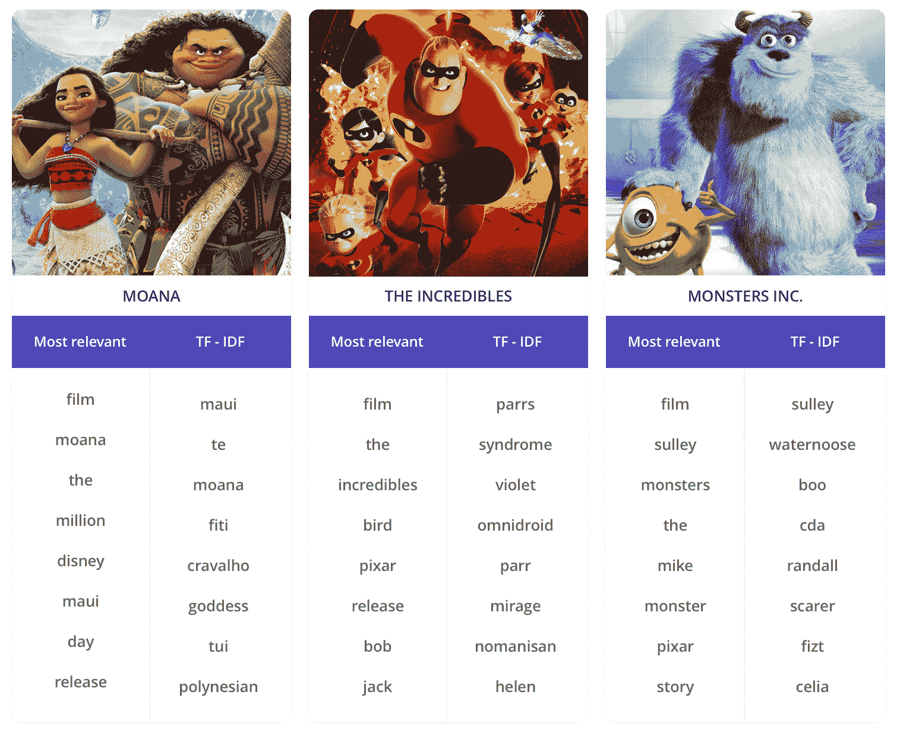

# WTF 是什么 TF-IDF？

> 原文：[`www.kdnuggets.com/2018/08/wtf-tf-idf.html`](https://www.kdnuggets.com/2018/08/wtf-tf-idf.html)

评论

**由 [Enrique Fueyo](https://building.lang.ai/), Lang.ai 的首席技术官兼联合创始人**

来自“超人总动员”（2004）电影的画面

* * *

## 我们的三大课程推荐

 1\. [Google 网络安全证书](https://www.kdnuggets.com/google-cybersecurity) - 快速入门网络安全职业生涯。

 2\. [Google 数据分析专业证书](https://www.kdnuggets.com/google-data-analytics) - 提升你的数据分析技能

 3\. [Google IT 支持专业证书](https://www.kdnuggets.com/google-itsupport) - 支持你的组织的 IT

* * *

TF-IDF，即**词频-逆文档频率**，是一种广泛用于信息检索（IR）或总结的评分度量。TF-IDF 旨在反映**一个术语在给定文档中的相关性**。

其直觉是，如果一个词在*一个文档中出现多次*，我们应该提高其相关性，因为它应比那些出现次数较少的词更有意义（TF）。同时，如果一个词在一个文档中出现多次但也*在许多其他文档中出现*，这可能是因为这个词只是一个常见词；而不是因为它有相关性或意义（IDF）。

**定义“相关词”是什么意思**

我们可以基于直觉提出一个或多或少主观的定义：一个词的相关性与它提供的关于其上下文（一个句子、一个文档或整个数据集）的信息量成正比。也就是说，最相关的词是那些能帮助我们作为人类在不阅读全部文档的情况下更好地理解整个文档的词。

正如所指出的，**相关词不一定是最频繁的词**，因为像“the”、“of”或“a”这样的停用词在许多文档中经常出现。

还有一个警告：如果我们要将一个文档与关于特定主题的整个数据集（比如电影评论）进行总结，将会有一些词（除了停用词，如*角色*或*情节*），这些词可能在文档中以及在许多其他文档中都出现很多次。这些词对于总结文档并不有用，因为它们传达的区分力很小；与其他文档相比，它们对文档内容的描述很少。

让我们通过一些例子更好地说明 TF-IDF 是如何工作的。

### 搜索引擎示例

假设我们有一个包含数千个猫咪描述的数据库，并且**用户想搜索毛茸茸的猫**，于是她/他发出了查询*“毛茸茸的猫”*。作为一个搜索引擎，我们必须决定从我们的数据库中返回哪些文档。

如果我们有与确切查询匹配的文档，那是毫无疑问的……但如果我们必须在部分匹配之间做出决定呢？为了简单起见，假设我们必须在这两个描述之间选择：

1.  “可爱的猫”

1.  “一只毛茸茸的小猫”

如果第一个描述包含**查询中的 3 个词中的 2 个**，而第二个描述仅匹配**1 个中的 1 个**，那么我们将选择第一个描述。TF-IDF 如何帮助我们选择第二个描述而不是第一个描述？

每个词的 TF 相同，这里没有区别。然而，我们可以预期**“猫”和“小猫”这两个词会出现在许多文档中**（较大的文档频率意味着低 IDF），而**“毛茸茸的”这个词会出现在较少的文档中**（较大的 IDF）。因此，“猫”和“小猫”的 TF-IDF 值较低，而“毛茸茸的”的 TF-IDF 值较大，即在我们的数据库中**“毛茸茸的”比“猫”或“小猫”具有更多的区分能力**。

**结论**

如果我们使用 TF-IDF 来加权匹配查询的不同词汇，“毛茸茸的”将比“猫”更相关，因此我们最终可以选择“毛茸茸的小猫”作为最佳匹配。

### 总结示例

现在，假设我们想要**自动总结一些电影的维基百科页面**。我们计划创建一个标签云，帮助我们理解每部电影的内容，因此我们的任务是决定放入哪些词汇（及其大小）。

鉴于一个月前我的家人收养了一只叫*Mawi*的狗（以《莫阿娜》的角色毛伊命名），我们将使用[莫阿娜的维基百科页面](https://en.wikipedia.org/wiki/Moana_%282016_film%29)作为这个示例。

我的狗：Cala 和 Mawi

第一个想法是列出最常见的词汇：

> **莫阿娜**
> 
> **最常见的：** [‘电影’，‘莫阿娜’，‘的’，‘百万’，‘迪士尼’，‘毛伊’，‘日’，‘发行’，‘te’，‘动画’，‘周末’，‘心’，‘海洋’，‘它’，‘故事’，‘岛’，‘fiti’，‘版本’，‘在’，‘动画’]

我们可以看到一些词汇可能对把握电影情节有用：莫阿娜，毛伊，海洋，岛屿……**但** **它们仍然提供的信息很少。** 此外，它们与其他无关的词混杂在一起，只是增加了噪声（如电影，百万，日，发行或周末）。

如果我们用其他电影进行相同的实验，我们可以看到结果在无关和噪声词方面有些相似。维基百科页面包含的信息是共享的或在所有页面中具有相似结构的：它们是*动画* *电影*，自从*首映* *第一天*就赚了*百万*美元……但这是我们已经知道的，或者至少对理解情节不重要。

**克服问题**

为了消除所有电影之间共享的内容并提取**每部电影独特的特征**，TF-IDF 应是一个非常实用的工具。使用最频繁的词（TF）我们得到了初步的估计，但 IDF 应该帮助我们细化之前的列表并获得更好的结果。考虑到文档频率，我们可以尝试通过减少通用词（那些出现在许多维基百科页面上的词）的相关性来进行惩罚。

> **海洋奇缘**
> 
> **TF-IDF:** [‘毛伊’, ‘他’, ‘海洋奇缘’, ‘菲提’, ‘克拉瓦洛’, ‘女神’, ‘图伊’, ‘波利尼西亚’, ‘塔拉’, ‘卡’, ‘毛利’, ‘奥利’, ‘克莱门特’, ‘鱼钩’, ‘塔毛塔’, ‘杰梅因’, ‘纹身’, ‘配音’, ‘穆斯克’, ‘克莱门茨’]

由于 TF-IDF，像*电影*、*百万*或*上映*这样的词已经从列表顶部消失，我们得到了像*波利尼西亚*或*纹身*这样更有意义的新词。

我们还可以对其他评论进行相同的分析，得到如下结果，其中，通用词再次消失，取而代之的是更具体的电影词汇：

最相关的词汇与 TF-IDF 的比较

作为参考，这些是排序后的更多词汇列表：

> **海洋奇缘**
> 
> **最频繁**: *[‘电影’, ‘海洋奇缘’, ‘的’, ‘百万’, ‘迪士尼’, ‘毛伊’, ‘天’, ‘上映’, ‘他’, ‘动画’, ‘周末’, ‘心’, ‘海洋’, ‘它’, ‘故事’, ‘岛屿’, ‘菲提’, ‘版本’, ‘在’, ‘动画’]
> 
> **TF-IDF:** [‘毛伊’, ‘他’, ‘海洋奇缘’, ‘菲提’, ‘克拉瓦洛’, ‘女神’, ‘图伊’, ‘波利尼西亚’, ‘塔拉’, ‘卡’, ‘毛利’, ‘奥利’, ‘克莱门特’, ‘鱼钩’, ‘塔毛塔’, ‘杰梅因’, ‘纹身’, ‘配音’, ‘穆斯克’, ‘克莱门茨’]

—

> **超人总动员**
> 
> **最频繁:** [‘电影’, ‘超人’, ‘鸟’, ‘皮克斯’, ‘上映’, ‘鲍勃’, ‘杰克’, ‘我’, ‘奖’, ‘好’, ‘动画’, ‘特色’, ‘它’, ‘综合症’, ‘角色’, ‘家庭’, ‘工作’, ‘超级英雄’, ‘动画’]
> 
> **TF-IDF:** [‘帕尔斯’, ‘综合症’, ‘紫罗兰’, ‘全能机器人’, ‘帕尔’, ‘幻影’, ‘无人可胜’, ‘海伦’, ‘鸟’, ‘埃德娜’, ‘超级英雄’, ‘冰冻’, ‘地下矿工’, ‘铁’, ‘沃林’, ‘郊区’, ‘大都市’, ‘冲击’, ‘超人’, ‘不可思议’]

—

> **怪兽公司**
> 
> **最频繁:** [‘电影’, ‘苏利’, ‘怪兽’, ‘的’, ‘迈克’, ‘怪物’, ‘皮克斯’, ‘故事’, ‘孩子’, ‘兰道尔’, ‘布’, ‘迪士尼’, ‘角色’, ‘工作’, ‘好’, ‘在’, ‘上映’, ‘他’, ‘医生’, ‘毛发’]
> 
> **TF-IDF:** [‘苏利’, ‘沃特努斯’, ‘布’, ‘CDA’, ‘兰道尔’, ‘吓人者’, ‘菲兹’, ‘塞莉亚’, ‘卡赫斯’, ‘沙利文’, ‘毛发’, ‘工厂’, ‘吓唬’, ‘怪物’, ‘瓦佐斯基’, ‘迈克’, ‘触手’, ‘马德里’, ‘鸽子’, ‘笑声’]

### 我们是如何做到的

这里是我们用来获得本文中相关词汇列表的代码：

### 接下来的步骤

对于基础文档集，我们使用了一组精心挑选的 65 部电影。这仅用于演示目的，但为了获得更好的 TF-IDF 结果，我们应该使用更大的文档库。

我们可以在使用这段代码作为起点时轻松尝试的一些其他实验包括：

a) 尝试不同的词频或文档频率的加权分数。它们如何影响列表？

b) 使用不同的文档基础。如果我们选择了任何电影，而不是专注于单一类型，会发生什么？

c) 如果我们尝试不同的领域，比如音乐乐队，结果会如何？

*查看我们*[*Building Lang.ai*](http://building.lang.ai/)*出版物中的其他文章。我们撰写关于*[*机器学习*](https://building.lang.ai/tagged/machine-learning)*、*[*软件开发*](https://building.lang.ai/tagged/development)*和我们的*[*公司文化*](https://building.lang.ai/tagged/company-culture)*的内容。*

**简历： [Enrique Fueyo](https://building.lang.ai/)** 是 Lang.ai 的首席技术官和联合创始人，致力于无监督 AI 语言理解，打造有助于公司和开发者处理非结构化文本数据的产品和服务。

[原文](https://building.lang.ai/wtf-is-tf-idf-5c5b86ee7331)。经授权转载。

**相关：**

+   理解情感分析背后的内容 – 第一部分

+   理解情感分析背后的内容 – 第二部分

+   文本数据预处理的一般方法

### 更多相关话题

+   [张量是什么？](https://www.kdnuggets.com/2018/05/wtf-tensor.html)

+   [GBM 和 XGBoost 的区别是什么？](https://www.kdnuggets.com/wtf-is-the-difference-between-gbm-and-xgboost)

+   [正则化是什么，它有什么用？](https://www.kdnuggets.com/wtf-is-regularization-and-what-is-it-for)
