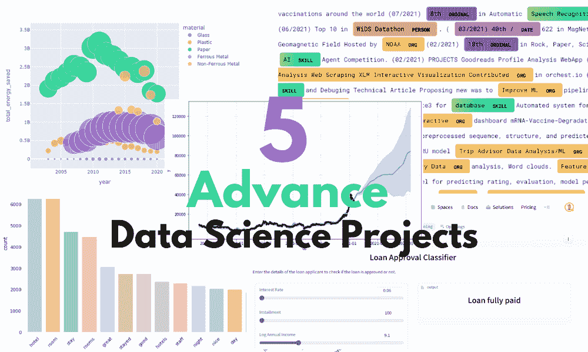
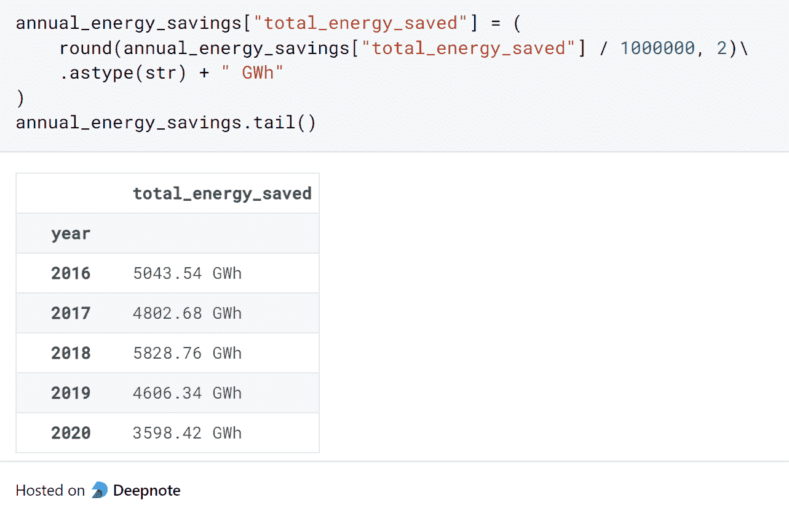
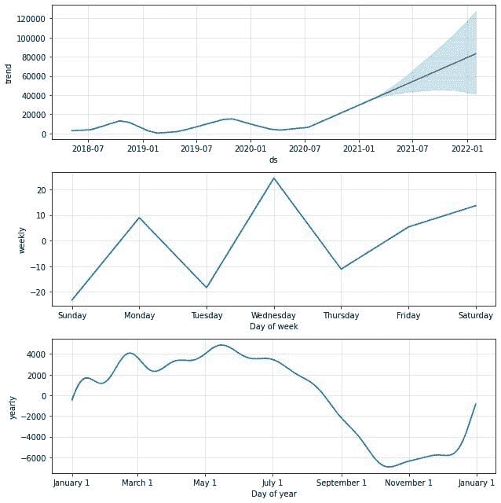
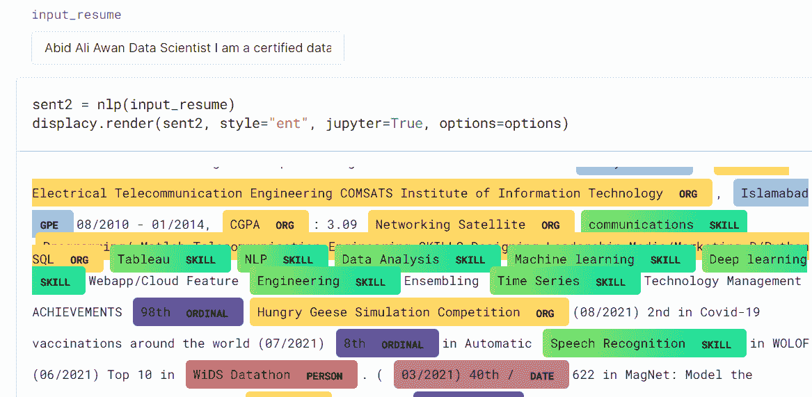
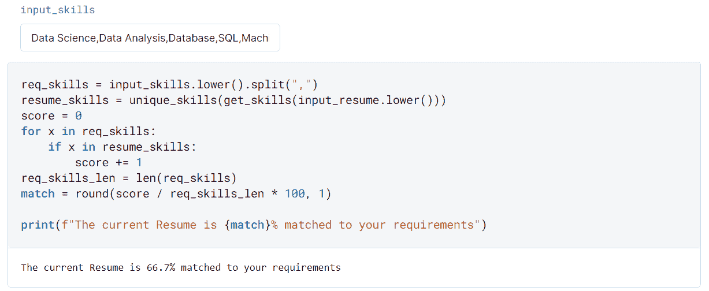
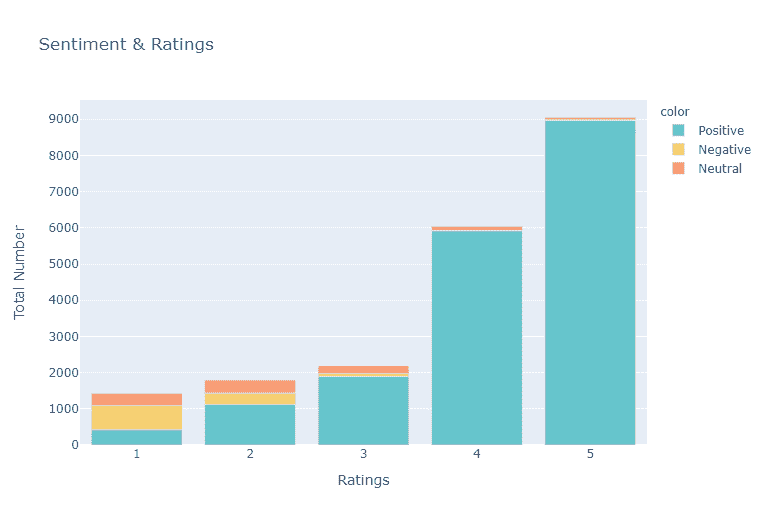
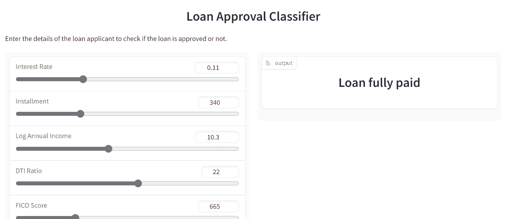

# 数据科学投资组合的 5 个高级项目

> 原文：[`www.kdnuggets.com/2023/03/5-advance-projects-data-science-portfolio.html`](https://www.kdnuggets.com/2023/03/5-advance-projects-data-science-portfolio.html)

图片来源：作者

在这篇博客中，我们将探讨五个重要的数据科学项目，这些项目可以提升最后一年学生和专业人员的职业档案。通过这些项目，你将深入了解数据科学工作流，并掌握数据清洗、处理、可视化和建模的关键工具。此外，你还将学习如何撰写项目报告，并在云端部署机器学习模型，以达到最佳效果。

* * *

## 我们的前三个课程推荐

 1. [谷歌网络安全证书](https://www.kdnuggets.com/google-cybersecurity) - 快速进入网络安全职业生涯。

 2. [谷歌数据分析专业证书](https://www.kdnuggets.com/google-data-analytics) - 提升你的数据分析能力

 3. [谷歌 IT 支持专业证书](https://www.kdnuggets.com/google-itsupport) - 支持你在 IT 领域的组织

* * *

# 1. 新加坡节省的回收能源

在 [新加坡节省的回收能源](https://towardsdatascience.com/annual-recycled-energy-saved-in-singapore-2d6bad49bfb2) 项目中，你将分析新加坡通过回收塑料、纸张、玻璃以及铁质和非铁质金属每年节省了多少能源。该项目涉及数据联接、数据清洗和数据整理。之后，你将使用统计和可视化工具进行深度数据分析。

图片来源于项目

最后，你将使用数据处理技术来回答原始问题：基于五种废物类型，从 2003 年到 2020 年新加坡总共节省了多少能源。

# 2. 使用 statsmodels 和 Prophet 进行时间序列预测

使用 statsmodels 和 Prophet 进行时间序列预测 项目将教会你处理时间序列数据、进行数据分析和预测的核心技能。

图片来源于项目

你将从训练 **ARIMA** 预测模型开始，并进行模型评估。之后，你将使用 Python 包 **Prophet** 进行时间序列预测。

# 3. spaCy 简历分析

在 [spaCy 简历分析](https://deepnote.com/@abid/spaCy-Resume-Analysis-81ba1e4b-7fa8-45fe-ac7a-0b7bf3da7826) 项目中，你将使用 spaCy 对 200 份简历进行实体识别，并使用各种 NLP 工具进行文本分析。该项目的目标是帮助招聘人员快速准确地决定成千上万的求职申请。

图片来自项目

你将首先加载爬取的数据集和 spaCy 的英语基础模型。接着，你将创建一个实体规则器并清理数据集。之后，你将进行数据可视化、实体识别和依赖解析。最后，你将创建一个简历匹配评分函数并执行主题建模。

# 4\. Tripadvisor 数据分析

[Tripadvisor 数据分析](https://deepnote.com/@abid/Trip-Advisor-Data-AnalysisML-f6060b39-d76c-4579-9648-a54bc8b5ffb5) 组合项目涵盖了数据科学的各个方面，从数据加载到数据建模。你将根据客户体验分析评论和评分。

图片来自项目

**在这个项目中你将进行：**

1.  数据探索

1.  使用 Vader 进行情感分析

1.  数据可视化

1.  添加关键词（Gensim）

1.  文本处理（NLTK）

1.  使用 Keras 构建深度学习模型（BiLSTM）

1.  训练和验证

1.  模型评估

1.  预测

1.  保存模型

这是一个使用深度学习模型进行文本分类的介绍。在开始训练之前，你将预处理数据（文本词形还原）、进行数据分析，并准备数据（分词）以用于深度学习模型。

# 5\. 使用 ChatGPT 的端到端贷款审批项目

[使用 ChatGPT 的端到端贷款审批项目](https://www.datacamp.com/tutorial/chatgpt-data-science-projects)是我最喜欢的项目。你将学习掌握 GPT 提示以完成真实数据科学项目中的所有步骤。在该项目中，你将要求 ChatGPT 帮助你创建一个端到端的贷款审批项目，使用从 LendingClub.com 提取的数据。

图片来自 [贷款分类器](https://huggingface.co/spaces/kingabzpro/Loan_Classifier)

你将学习编写提示以生成创意、数据分析、特征工程、数据预处理和平衡、模型选择、模型调整和评估、构建应用程序并将其部署到服务器上。

我们正处于一个阶段，公司将开始要求员工学习推广技能并更好地使用新 AI 工具。提示工程将成为数据科学家的必备技能，招聘人员将要求具有使用 GPT 进行数据科学任务的经验。

那还等什么？开始使用 GPT-4 和其他人工智能工具，提高生产力，确保未来。

# 结论

即使你缺乏经验，这些项目也会帮助你获得梦想中的工作。在完成项目后，我强烈建议你将它们分享在 GitHub、DagsHub、Deepnote 或 Kaggle 上。这些平台被开发者和数据科学家用来展示他们的项目和技能。

在这篇文章中，我们回顾了 5 个涵盖数据分析、时间序列、自然语言处理、机器学习和使用 ChatGPT 的提示工程的高级项目。如果你对涉及数据科学特定领域的项目感兴趣，请查看完整的数据科学项目合集——第一部分 和 第二部分。

我希望这些高级项目列表对你有帮助，如果你有更好的建议，请告诉我。

**[Abid Ali Awan](https://www.polywork.com/kingabzpro)** ([@1abidaliawan](https://twitter.com/1abidaliawan)) 是一位认证的数据科学专家，他热衷于构建机器学习模型。目前，他专注于内容创作，并撰写关于机器学习和数据科学技术的技术博客。Abid 拥有技术管理硕士学位和电信工程学士学位。他的愿景是利用图神经网络构建一个人工智能产品，帮助那些与心理疾病作斗争的学生。

### 更多相关主题

+   [数据科学作品集的 5 个 Python 项目](https://www.kdnuggets.com/2022/12/5-python-projects-data-science-portfolio.html)

+   [5 个数据科学专业学生的作品集项目](https://www.kdnuggets.com/5-portfolio-projects-for-final-year-data-science-students)

+   [提升简历的 7 个机器学习作品集项目](https://www.kdnuggets.com/2022/09/7-machine-learning-portfolio-projects-boost-resume.html)

+   [令人惊叹的 LLM 作品集项目创意](https://www.kdnuggets.com/llm-portfolio-projects-ideas-to-wow-employers)

+   [提升简历的 7 个 AI 作品集项目](https://www.kdnuggets.com/7-ai-portfolio-projects-to-boost-the-resume)

+   [KDnuggets 新闻，9 月 21 日：7 个机器学习作品集项目……](https://www.kdnuggets.com/2022/n37.html)
