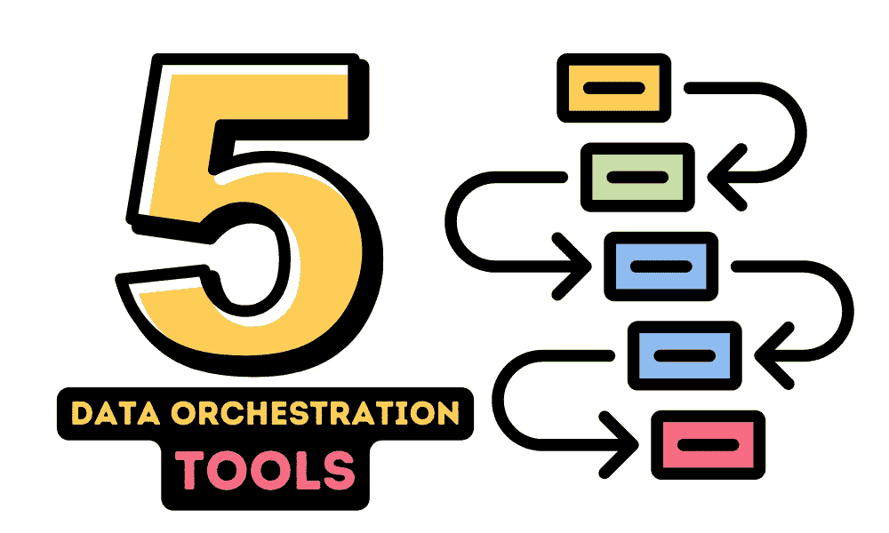
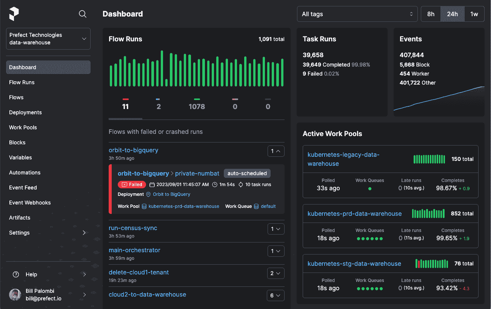
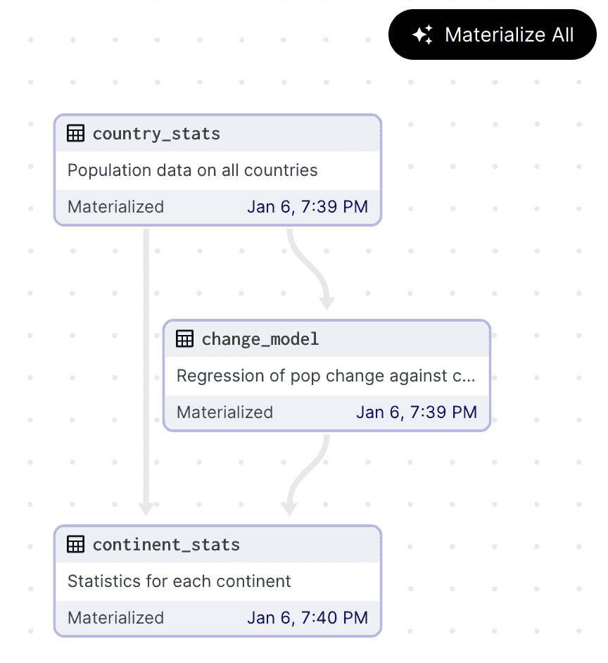
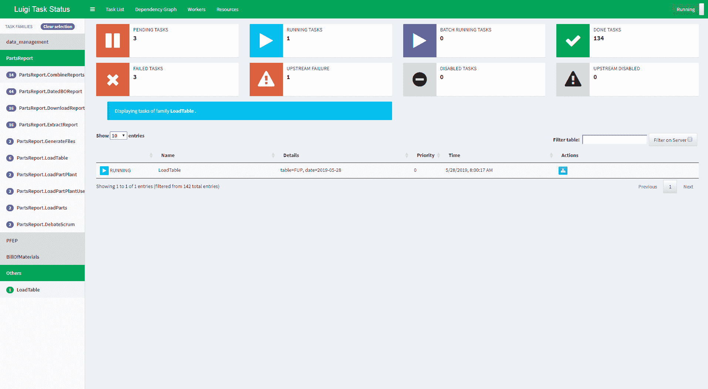
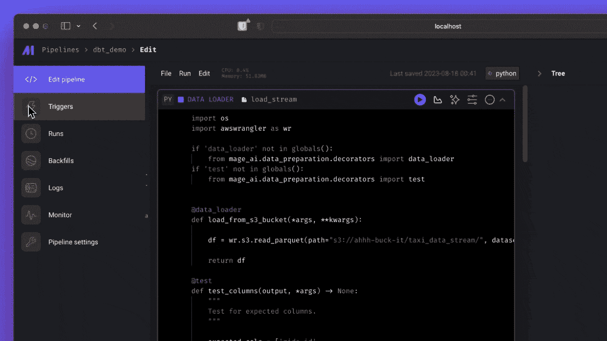
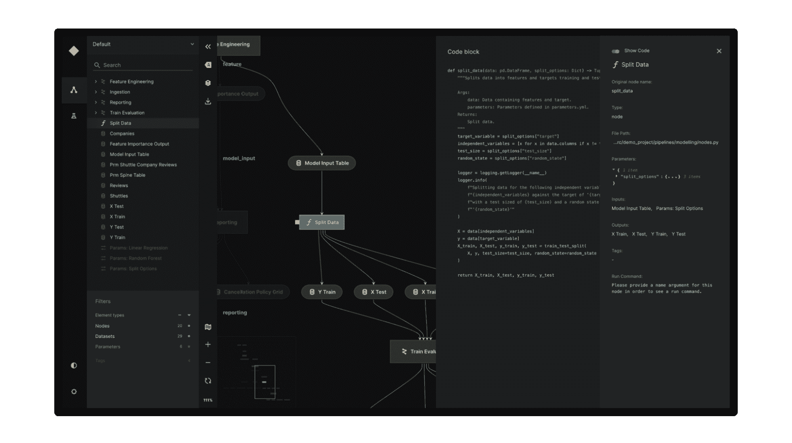

# 5 个 Airflow 替代方案

> 原文：[`www.kdnuggets.com/5-airflow-alternatives-for-data-orchestration`](https://www.kdnuggets.com/5-airflow-alternatives-for-data-orchestration)

作者提供的图片

数据编排已成为现代数据工程的关键组成部分，允许团队简化和自动化他们的数据工作流程。虽然 Apache Airflow 是一个以其灵活性和强大社区支持而广泛使用的工具，但还有其他几个提供独特功能和优势的替代方案。

* * *

## 我们的前 3 个课程推荐

 1\. [Google 网络安全证书](https://www.kdnuggets.com/google-cybersecurity) - 快速进入网络安全职业生涯。

 2\. [Google 数据分析专业证书](https://www.kdnuggets.com/google-data-analytics) - 提升您的数据分析技能

 3\. [Google IT 支持专业证书](https://www.kdnuggets.com/google-itsupport) - 支持您的组织 IT 需求

* * *

在这篇博客文章中，我们将讨论五种管理工作流程的替代方案：Prefect、Dagster、Luigi、Mage AI 和 Kedro。这些工具不仅限于数据工程，可用于任何领域。通过了解这些工具，您将能够选择最适合您的数据和机器学习工作流程需求的工具。

# 1\. Prefect

[Prefect](https://github.com/PrefectHQ/prefect) 是一个开源工具，用于构建和管理工作流程，提供可观察性和分类功能。您可以使用几行 Python 代码构建交互式工作流应用程序。

Prefect 提供了一种混合执行模型，允许工作流程在云端或本地运行，给用户提供了对数据操作的更大控制。其直观的用户界面和丰富的 API 使得数据工作流程的监控和故障排除变得容易。

# 2\. Dagster

[Dagster](https://github.com/dagster-io/dagster) 是一个强大的开源数据管道编排工具，简化了数据资产在其整个生命周期中的开发、维护和监控。Dagster 专为云原生环境构建，提供集成的数据血统、可观察性和用户友好的开发环境，成为数据工程师、数据科学家和机器学习工程师的热门选择。

Dagster 是一个开源的数据编排系统，允许用户将其数据资产定义为 Python 函数。一旦定义，Dagster 根据用户定义的计划或响应特定事件来管理和执行这些函数。Dagster 可用于数据开发生命周期的每个阶段，从本地开发和单元测试到集成测试、暂存环境和生产环境。

# 3\. Luigi

[Luigi](https://github.com/spotify/luigi) 是由 Spotify 开发的基于 Python 的框架，用于构建复杂的批处理作业管道。它处理依赖关系解析、工作流管理、可视化等，注重可靠性和可扩展性。

Luigi 是一个强大的工具，擅长管理任务依赖关系，确保任务按照正确的顺序执行，并且仅在满足其依赖关系时才执行。它特别适合涉及 Hadoop 作业、Python 脚本和其他批处理流程的工作流。

Luigi 提供了支持各种操作的基础设施，包括推荐系统、排行榜、A/B 测试分析、外部报告、内部仪表盘等。

# 4\. Mage AI

[Mage AI](https://github.com/mage-ai/mage-ai) 是数据编排领域的新进者，提供了一种混合框架，用于数据转换和集成，将笔记本的灵活性与模块化代码的严格性结合在一起。它旨在简化数据的提取、转换和加载过程，使用户能够以更高效和用户友好的方式处理数据。

Mage AI 提供了简单的开发者体验，支持多种编程语言，并支持协作开发。其内置的监控、警报和可观察性功能使其非常适合大规模、复杂的数据管道。Mage AI 还支持 dbt，用于构建、运行和管理 dbt 模型。

# 5\. Kedro

[Kedro](https://github.com/kedro-org/kedro) 是一个 Python 框架，提供了一种标准化的方式来构建数据和机器学习管道。它利用软件工程最佳实践来帮助你创建可重复、可维护和模块化的数据工程和数据科学管道。

Kedro 提供了标准化的项目模板、数据连接器、管道抽象、编码标准和灵活的部署选项，这些都简化了数据科学项目的构建、测试和部署过程。通过使用 Kedro，数据科学家可以确保一致和有序的项目结构，轻松管理数据和模型版本，自动化管道依赖关系，并在各种平台上部署项目。

# 结论

尽管 Apache Airflow 继续成为数据编排的热门工具，但这里介绍的替代方案提供了一系列功能和好处，可能更适合某些项目或团队的偏好。无论你是优先考虑简洁性、以代码为中心的设计，还是机器学习工作流的集成，都很可能有一种替代方案符合你的需求。通过探索这些选项，团队可以找到合适的工具来提升数据操作，最大化数据项目的价值。

如果你对数据工程领域还不熟悉，可以考虑参加 数据工程专业课程 来为工作做好准备，开始赚取 $300K/年。

[Abid Ali Awan](https://www.polywork.com/kingabzpro)（[@1abidaliawan](https://www.linkedin.com/in/1abidaliawan)）是一位认证的数据科学专业人士，热衷于构建机器学习模型。目前，他专注于内容创作和撰写关于机器学习和数据科学技术的技术博客。Abid 拥有技术管理硕士学位和电信工程学士学位。他的愿景是利用图神经网络为患有心理疾病的学生开发一个 AI 产品。

### 更多相关话题

+   [数据编排：生成式 AI 成功与失败的分界线…](https://www.kdnuggets.com/2024/07/astronomer/data-orchestration-the-dividing-line-between-generative-ai-success-and-failure)

+   [数据科学项目的 GitHub 顶级 5 个替代方案](https://www.kdnuggets.com/the-top-5-alternatives-to-github-for-data-science-projects)

+   [数据科学的 VSCode 顶级 7 个替代方案](https://www.kdnuggets.com/top-7-alternatives-to-vscode-for-data-science)

+   [GitHub Copilot 开源替代方案](https://www.kdnuggets.com/2021/07/github-copilot-open-source-alternatives-code-generation.html)

+   [Top 5 免费的 GPT-4 替代方案](https://www.kdnuggets.com/top-5-free-alternatives-to-gpt4)

+   [导航数据科学职位名称：数据分析师与数据科学家…](https://www.kdnuggets.com/navigating-data-science-job-titles-data-analyst-vs-data-scientist-vs-data-engineer)
