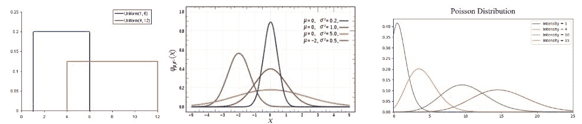
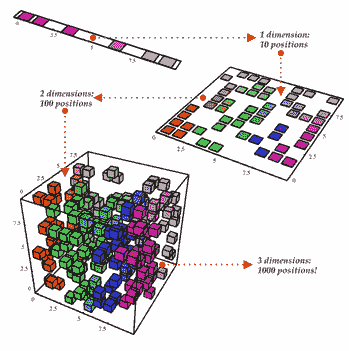
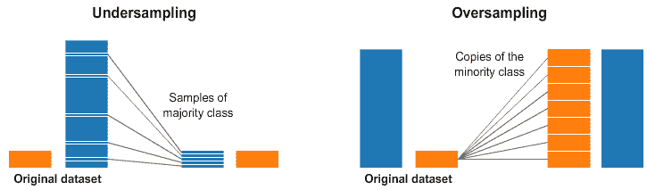
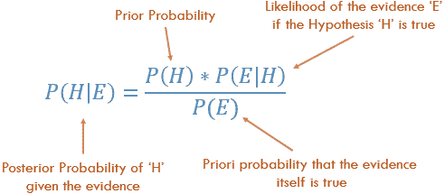

# 数据科学家需要了解的 5 个基本统计概念

> 原文：[`www.kdnuggets.com/2018/11/5-basic-statistics-concepts-data-scientists-need-know.html`](https://www.kdnuggets.com/2018/11/5-basic-statistics-concepts-data-scientists-need-know.html)

 评论

统计学在数据科学（DS）的艺术中可以是一个强大的工具。从高层次来看，统计学是使用数学对数据进行技术分析。像条形图这样的基本可视化可能会给你一些高层次的信息，但通过统计学，我们可以以更加信息驱动和有针对性的方式操作数据。涉及的数学帮助我们对数据形成具体结论，而不仅仅是猜测。

使用统计学，我们可以更深入和更细致地了解数据的结构，并根据这种结构，如何最终优化地应用其他数据科学技术以获取更多信息。今天，我们将探讨数据科学家需要了解的 5 个基本统计概念以及它们如何最有效地应用！

* * *

## 我们的前三个课程推荐

 1\. [谷歌网络安全证书](https://www.kdnuggets.com/google-cybersecurity) - 快速进入网络安全职业生涯。

 2\. [谷歌数据分析专业证书](https://www.kdnuggets.com/google-data-analytics) - 提升你的数据分析技能

 3\. [谷歌 IT 支持专业证书](https://www.kdnuggets.com/google-itsupport) - 支持你所在组织的 IT

* * *

### 统计特征

统计特征可能是数据科学中最常用的统计概念。这通常是你在探索数据集时会应用的第一个统计技术，包括偏差、方差、均值、中位数、百分位数等很多内容。所有这些都相当容易理解并在代码中实现！请查看下面的图示。

基本的箱形图

中间的线是数据的*中位数*值。中位数比均值更能抵御异常值的影响。*第一个四分位数*实际上是第 25 百分位数；即数据中 25%的点低于该值。*第三个四分位数*是第 75 百分位数；即数据中 75%的点低于该值。最小值和最大值代表数据范围的上下端。

箱形图完美地展示了我们可以用基本统计特征做什么：

+   当箱形图**短**时，这意味着你的数据点大部分都相似，因为在一个小范围内有很多值

+   当箱形图**高**时，这意味着你的数据点大多相差较大，因为值分布在一个较宽的范围内

+   如果中位数值接近**底部**，那么我们知道大多数数据具有较低的值。如果中位数值接近**顶部**，那么我们知道大多数数据具有较高的值。基本上，如果中位数线不在盒子的中间，则表示数据**偏斜**。

+   胡须是否**非常长**？这意味着您的数据具有高**标准差**和**方差**，即值分布广泛且变化较大。如果一个方向上的胡须很长而另一个方向上的胡须不长，那么您的数据可能只在一个方向上变化很大。

所有这些信息都来自几个简单的统计特征，这些特征容易计算！在需要快速而信息丰富的数据视图时，可以尝试这些。

### 概率分布

我们可以将概率定义为某事件发生的百分比机会。在数据科学中，这通常在 0 到 1 的范围内量化，其中 0 表示我们确定**不会发生**，而 1 表示我们确定**会发生**。概率分布是一个表示实验中所有可能值概率的函数。请查看下面的图示。

常见概率分布。均匀分布（左），正态分布（中），泊松分布（右）

+   **均匀分布**是我们这里展示的三种分布中最基本的一种。它有一个单一的值，仅在特定范围内出现，而在该范围之外的值为 0。它非常像是一个“开或关”的分布。我们也可以将其视为具有两个类别的分类变量的指示：0 或该值。您的分类变量可能有多个除了 0 之外的值，但我们仍然可以将其视为多个均匀分布的分段函数。

+   **正态分布**，通常称为**高斯分布**，由其均值和标准差具体定义。均值值在空间上移动分布，而标准差控制分布的扩展。与其他分布（例如泊松分布）不同的重要区别在于标准差在所有方向上都是相同的。因此，通过高斯分布，我们知道数据集的平均值以及数据的分布，即它是分布在广泛的范围内还是集中在几个值周围。

+   **泊松分布**类似于正态分布，但具有额外的*偏度*因素。当偏度值较低时，泊松分布在所有方向上都会有相对均匀的分布，就像正态分布一样。但当偏度值的绝对值较高时，数据的分布在不同方向上会有所不同；在一个方向上会非常分散，而在另一个方向上则高度集中。

还有许多其他分布可以深入研究，但这三种分布已经给了我们很多价值。我们可以通过均匀分布快速查看和解释我们的分类变量。如果我们看到高斯分布，我们知道许多算法默认情况下会在高斯数据上表现良好，所以我们应该选择这些算法。对于泊松分布，我们需要特别注意，选择一个对空间分布变化具有鲁棒性的算法。

### 降维

术语*降维*非常直观易懂。我们有一个数据集，希望减少其维度。在数据科学中，这就是特征变量的数量。查看下面的图示了解详细说明。

降维

这个立方体代表我们的数据集，它有 3 个维度，总共有 1000 个点。现在以今天的计算能力，处理 1000 个点很容易，但在更大规模上我们会遇到问题。然而，只需从*二维*视角来看我们的数据，例如从立方体的一侧，我们可以看到从那个角度划分所有颜色非常简单。通过降维，我们将 3D 数据*投影*到 2D 平面上。这有效地将我们需要计算的点数减少到 100，节省了大量计算资源！

另一种降维的方法是通过*特征剪枝*。通过特征剪枝，我们基本上是希望移除我们认为对分析不重要的特征。例如，在探索数据集后，我们可能会发现 10 个特征中，有 7 个与输出的相关性很高，而另外 3 个相关性很低。那么，那 3 个低相关性的特征可能不值得计算，我们可以从分析中移除它们而不影响输出。

最常用的降维技术是 PCA，它本质上创建了特征的向量表示，显示了它们对输出的重要性，即它们的相关性。PCA 可以用于执行上述两种降维风格。阅读更多关于它的内容在[this tutorial](https://arxiv.org/pdf/1404.1100.pdf?utm_content=bufferb37df&utm_medium=social&utm_source=facebook.com&utm_campaign=buffer)。

### 过采样和欠采样

过采样和欠采样是用于分类问题的技术。有时，我们的分类数据集可能会偏向某一侧。例如，我们有 2000 个类别 1 的样本，但类别 2 只有 200 个。这会干扰我们尝试使用的许多机器学习技术来建模数据和做出预测！我们的过采样和欠采样可以解决这个问题。查看下面的图示了解详细说明。

欠采样和过采样

在上面图片的左右两侧，我们的蓝色类别样本远多于橙色类别。在这种情况下，我们有两个预处理选项，可以帮助训练我们的机器学习模型。

欠采样意味着我们只选择多数类中的*部分*数据，仅使用与少数类相同数量的样本。这种选择应保持类别的概率分布。很简单！我们只需通过减少样本来平衡数据集！

过采样意味着我们将*创建副本*以使少数类的样本数量与多数类相同。副本将按原样分布，以保持少数类的分布。我们只是通过不获取更多数据而平衡了数据集！

### 贝叶斯统计

完全理解为什么我们使用贝叶斯统计需要我们首先了解*频率统计*的不足。*频率统计是大多数人在听到“概率”一词时想到的统计类型。它涉及应用数学来分析某个事件发生的概率，具体来说，我们计算的唯一数据是*先验数据*。

让我们看一个例子。假设我给了你一个骰子，问你掷出 6 的机会是多少。大多数人会说这是 1/6。如果我们进行频率分析，我们会查看某人掷骰子 10,000 次的数据，并计算每个数字的频率；结果大约是 1/6！

但如果有人告诉你，*特定的骰子*是*你*得到的，并且它*被加重*以总是落在 6 上呢？由于频率分析只考虑*先验数据*，所以关于骰子被加重的*证据*是**未被**考虑的。

贝叶斯统计**确实**考虑了这些证据。我们可以通过查看贝叶斯定理来说明这一点：

贝叶斯定理

我们方程中的概率*P(H)*基本上是我们的频率分析；根据我们的*先验数据*，事件发生的概率是多少。方程中的*P(E|H)*称为*似然性*，本质上是给定我们频率分析的信息，我们证据正确的概率。例如，如果你想掷骰子 10,000 次，而前 1000 次都掷出 6，你可能会开始相当相信那个骰子是被加重的！*P(E)*是实际证据为真的概率。如果我告诉你骰子是加重的，你能相信我并说它实际上是加重的，还是认为这是一个把戏？！

如果我们的频率分析非常好，那么它将对我们的 6 的猜测有一定的权重。同时，我们会考虑有偏骰子的证据，根据其先验和频率分析来判断其真实性。正如方程布局所示，贝叶斯统计考虑了一切。当你觉得先前的数据不能很好地代表你未来的数据和结果时，使用它。

**喜欢学习？**

在[twitter](https://twitter.com/GeorgeSeif94)上关注我，我会发布关于最新最棒的 AI、技术和科学的内容！

**简介: [乔治·赛夫](https://towardsdatascience.com/@george.seif94)** 是一名认证极客和 AI / 机器学习工程师。

[原文](https://towardsdatascience.com/the-5-basic-statistics-concepts-data-scientists-need-to-know-2c96740377ae)。经许可转载。

**相关:**

+   数据科学家需要了解的 5 种聚类算法

+   选择适合你回归问题的最佳机器学习算法

+   Python 中 5 个快速简单的数据可视化代码

### 更多相关主题

+   [学习数据科学的顶级资源](https://www.kdnuggets.com/2021/12/springboard-top-resources-learn-data-science-statistics.html)

+   [每个数据科学家都应该知道的三大 R 库（即使你使用 Python）](https://www.kdnuggets.com/2021/12/three-r-libraries-every-data-scientist-know-even-python.html)

+   [停止学习数据科学以寻找目的，然后去寻找目的……](https://www.kdnuggets.com/2021/12/stop-learning-data-science-find-purpose.html)

+   [成功数据科学家的 5 个特征](https://www.kdnuggets.com/2021/12/5-characteristics-successful-data-scientist.html)

+   [一个 90 亿美元的 AI 失败，探讨](https://www.kdnuggets.com/2021/12/9b-ai-failure-examined.html)

+   [是什么让 Python 成为初创公司的理想编程语言](https://www.kdnuggets.com/2021/12/makes-python-ideal-programming-language-startups.html)
